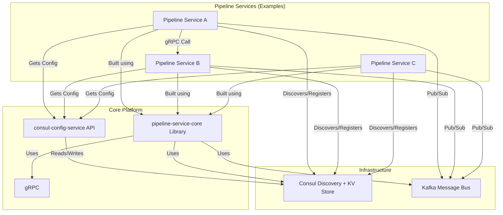
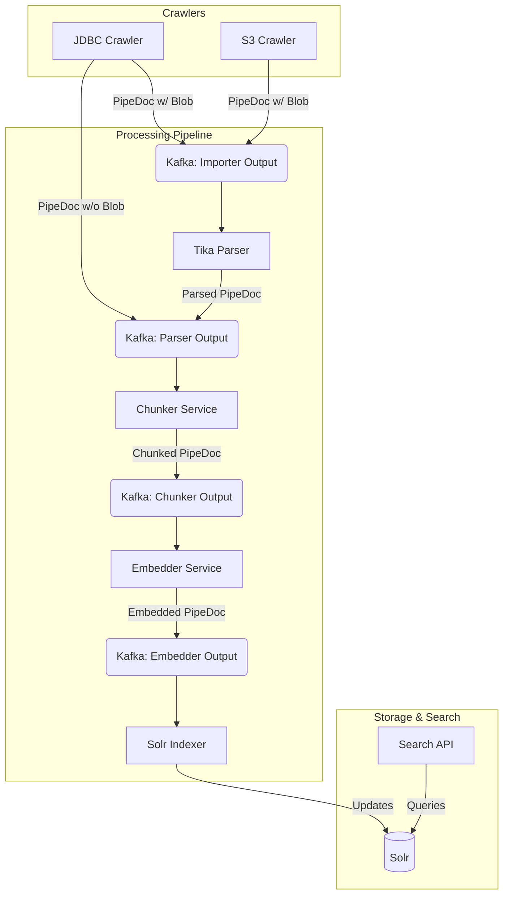

# Yet Another Pipeline Processor: YAPPY

## Overview

NOTE: This needs to be updated.  But the core concepts remain the same

YAPPY is a decentralized, self-discoverable pipeline platform designed for flexible text mining and search indexing workflows. Built using the Micronaut framework, it leverages Kafka for asynchronous message passing, gRPC for synchronous inter-service communication (enabling potential polyglot services), and HashiCorp Consul for dynamic configuration management and service discovery.

The core purpose of YAPPY is to act as a robust, scalable, and adaptable streaming platform, particularly suited for A/B testing different text processing strategies and building indexing pipelines for various search engines like Solr, OpenSearch, Pinecone, and PostgreSQL datasources. Unlike traditional centralized processing engines, YAPPY services operate as a decentralized cluster, discovering each other and fetching configuration dynamically, allowing for near real-time updates and flexible pipeline modifications.

An Out-of-the-Box (OOTB) Search API is included, enabling hybrid search capabilities (BM25 keyword and vector/semantic search) against configured search backends (initially Solr). Future plans include adding a comprehensive analytics package.

## Core Concepts

* **Decentralized Architecture:** Services register themselves with Consul and discover other services through it. There is no central pipeline server; services operate independently based on shared configuration.
* **Dynamic Configuration:** Pipeline definitions and service parameters are managed centrally via the `consul-config-service` backed by Consul's Key/Value store. Services built with `pipeline-service-core` can automatically listen for and react to configuration changes.
* **Communication:**
    * **Asynchronous (Kafka):** The primary data flow between pipeline steps uses Kafka topics. Services consume messages (typically `PipeStream` protobuf messages containing `PipeDoc`), process them, and publish results to output topics. Kafka's features enable pausing and rewinding pipelines for reprocessing.
    * **Synchronous (gRPC):** Services can communicate directly using gRPC for specific tasks or control plane operations. This also opens the door for creating pipeline services in languages other than Java (like Python) via gRPC proxies.
* **Extensibility (SDK):** The `pipeline-service-core` module acts as an SDK, providing base classes and handling boilerplate for Kafka, gRPC, Consul configuration, and service registration. Developers can create custom pipeline steps by implementing the `PipelineServiceProcessor` interface and defining their configuration schema.
* **`PipeDoc`:** The central data structure, defined using Protocol Buffers (`protobuf-models`), which carries document content, metadata (like IDs, timestamps, keywords), extracted text, chunks, embeddings (`SemanticDoc`), and custom data (`Struct`) through the various pipeline stages.

## Architecture

### High-Level Component Interaction

This diagram shows the main components and how they interact:



### Pipeline Configuration

Pipeline structures are defined in the `consul-config-service` (typically seeded from a YAML file like `test-seed-data.yaml`) and stored in Consul KV under `config/pipeline/pipeline.configs`. Each pipeline defines a series of services and how they connect via Kafka topics or gRPC calls.

**Example Configuration Snippet (`test-seed-data.yaml` structure):**

```yaml
# Example structure found in consul-config-service/src/test/resources/test-seed-data.yaml
pipeline:
  configs:
    # Pipeline Definition: pipeline1
    pipeline1:
      service:
        # Service: importer (Entry point)
        importer:
          kafka-publish-topics: input-documents # Publishes PipeDocs to this topic
          serviceImplementation: com.krickert.pipeline.importer.ImporterService # Java class implementing the service logic
          # configParams: # Optional service-specific parameters
          #   source-type: jdbc
          #   db-url: ...
        # Service: tika-parser
        tika-parser:
          kafka-listen-topics: input-documents # Listens to importer's output
          kafka-publish-topics: tika-documents # Publishes parsed docs
          serviceImplementation: com.krickert.pipeline.parser.TikaParserService
        # Service: chunker
        chunker:
          kafka-listen-topics: tika-documents  # Listens to tika's output
          kafka-publish-topics: chunked-documents # Publishes chunked docs
          # grpc-forward-to: embedder-service # Alternative: Forward via gRPC instead of Kafka
          serviceImplementation: com.krickert.pipeline.chunker.ChunkerService
          configParams:
            chunkSize: 512
            overlapSize: 50
            chunk-field: body # Field within PipeDoc to chunk (defaults to 'body')
        # Service: embedder
        embedder:
          kafka-listen-topics: chunked-documents # Listens to chunker's output
          kafka-publish-topics: embedded-documents # Publishes docs with embeddings
          serviceImplementation: com.krickert.pipeline.embedder.EmbedderService
          configParams:
            model: "text-embedding-ada-002"
            dimension: 1536
        # Service: solr-indexer (Sink)
        solr-indexer:
          kafka-listen-topics: embedded-documents # Listens to embedder's output
          serviceImplementation: com.krickert.pipeline.indexer.SolrIndexerService
          configParams:
            solr-url: "http://localhost:8983/solr"
            collection: "yappy_index"
# ... other pipelines (pipeline2, test-pipeline) ...
```

**Explanation of Fields:**

* `pipeline.configs.<pipeline-name>`: Defines a pipeline block.
* `service.<service-name>`: Defines a service within the pipeline.
* `kafka-listen-topics`: Comma-separated list of Kafka topics the service consumes `PipeStream` messages from.
* `kafka-publish-topics`: Comma-separated list of Kafka topics the service publishes resulting `PipeStream` messages to.
* `grpc-forward-to`: (Optional) A service ID (registered in Consul) to forward the `PipeStream` to via gRPC instead of Kafka. A service typically uses either Kafka publish topics *or* gRPC forwarding.
* `serviceImplementation`: The name of a gRPC endpoint registered in Consul. This identifies the service that will implement the processing logic for this pipeline step. When a new pipeline is created, this field is validated to ensure it refers to an existing service in Consul.
* `configParams`: An optional map of key-value pairs providing specific configuration to the service implementation (e.g., chunk size, model name, connection URLs).

## Project Structure

* `bom/`: Bill of Materials - Manages shared dependency versions across the project using Gradle platforms.
* `consul-config-service/`: Micronaut service providing a REST API to manage pipeline configurations stored in Consul KV. Includes data seeding and dynamic update capabilities.
* `docker-dev/`: Contains Docker Compose files for setting up a local development environment (Kafka, Consul, Solr, etc.).
* `pipeline-examples/`: Example pipeline service implementations (e.g., `pipeline-echo-service`). Useful as templates.
* `pipeline-service-core/`: The core SDK library. Provides base classes, gRPC/Kafka integration, configuration management (`PipelineConfigManager`, `PipelineConfigService`), and the `PipelineServiceProcessor` interface that custom services implement.
* `pipeline-service-test-utils/`: Shared testing utilities.
    * `pipeline-test-platform/`: A framework using Testcontainers to simplify integration testing of pipeline services with Kafka, Consul, and Schema Registries (Apicurio, Moto for AWS Glue).
* `pipeline-services/`: Implementations of common, reusable pipeline services (Connectors, Parsers, Chunkers, Embedders, Indexers).
    * `chunker/`: Example implementation of a text chunking service.
* `protobuf-models/`: Defines the core data structures (`PipeDoc`, `SemanticDoc`, `Embedding`, etc.) using Protocol Buffers and includes mapping utilities (`ProtoMapper`).
* `util/`: Simple shared utility code.

## Core Services (Included & Planned)

*(Note: Services marked with \* are typically embedded within `pipeline-service-core` or other services)*

| Name                 | Purpose                                                                  | Status        |
| :------------------- | :----------------------------------------------------------------------- | :------------ |
| Mapper\* | Maps fields within/between PipeDocs based on rules (`protobuf-models`)     | Included      |
| Chunker\* | Splits document text into chunks (`pipeline-services/chunker`)           | Included      |
| Administration\* | Core service lifecycle management (`pipeline-service-core`)              | Included      |
| **Connectors** |                                                                          |               |
| S3 Crawler           | Reads documents and metadata from AWS S3 buckets.                          | Planned       |
| JDBC Crawler         | Reads documents from database tables via JDBC.                           | Planned       |
| Solr Crawler         | Reads documents from a Solr index.                                       | Planned       |
| **Parsers** |                                                                          |               |
| Tika Parser          | Extracts text and metadata from various file formats using Apache Tika.  | Planned       |
| JDBC Parser          | Parses JDBC result sets into PipeDocs, potentially handling BLOBs.       | Planned       |
| **Processing Steps** |                                                                          |               |
| Semantic Chunker     | Chunks text based on semantic meaning (advanced chunking).               | Planned       |
| Embedder             | Generates vector embeddings for text using a configured LLM/model.       | Planned       |
| NLP NER              | Performs Named Entity Recognition on text.                               | Planned       |
| Summarizer           | Generates summaries of document text.                                    | Planned       |
| **Sinks** |                                                                          |               |
| Solr Indexer         | Indexes PipeDocs into Apache Solr.                                       | Planned       |
| S3 Indexer           | (Purpose TBD - perhaps stores processed PipeDocs back to S3?)            | Planned       |
| JDBC Indexer         | Writes data from PipeDocs back to a database via JDBC.                   | Planned       |
| **Other** |                                                                          |               |
| Search API           | Provides BM25 & Vector search endpoints (requires an indexer like Solr). | Planned (OOTB) |

*(Many more services are planned)*

## Pipeline Service SDK

Creating a custom pipeline service primarily involves:

1.  Implementing the `com.krickert.search.pipeline.service.PipelineServiceProcessor` interface in your chosen language (Java is directly supported).
2.  Defining the service's configuration needs (if any) which can be accessed via the `PipeStream` request's config map.
3.  Packaging the service as a Micronaut application.
4.  Configuring the service within a pipeline definition managed by the `consul-config-service`.

The `pipeline-service-core` library handles much of the boilerplate:

* Setting up Kafka consumers (`DynamicKafkaConsumerManager`) based on `kafka-listen-topics`.
* Providing a Kafka producer (`KafkaForwarder`) for `kafka-publish-topics`.
* Setting up a gRPC server (`PipelineServiceImpl`) to receive `PipeStream` messages.
* Providing a gRPC client (`GrpcForwarder`) for `grpc-forward-to` destinations.
* Loading service-specific configuration from Consul via `PipelineConfigService`.
* Registering the service with Consul for discovery.

For languages other than Java, a gRPC proxy can be created to interface with the core platform.

## Use Case Example: Knowledge Repository

This use case processes documents from a database (JDBC) and an S3 bucket into a searchable Solr index.

**Flow:**

1.  **JDBC Crawler:** Reads rows from a database. Each row becomes a `PipeDoc`. If a row contains a BLOB in a specific field, it sends the `PipeStream` to the `Tika Parser` service via Kafka. Otherwise, it sends the `PipeStream` directly to the `Chunker` service's input topic.
2.  **S3 Crawler:** Reads files from an S3 bucket. It extracts metadata and content. It sends the `PipeStream` containing the file content (as a blob) and metadata to the `Tika Parser` service via Kafka. *(Assumed flow based on context)*.
3.  **Tika Parser:** Consumes messages from its input topic. Parses text content and metadata from blobs using Apache Tika. Publishes the updated `PipeDoc` (with extracted text in the `body` field or other mapped fields) to the `Chunker` service's input topic.
4.  **Chunker Service:** Consumes messages from its input topic. Reads configuration (`chunkSize`, `overlapSize`, `chunk-field`) managed by `consul-config-service`. Chunks the specified text field(s) from the `PipeDoc`. Stores the chunks within the `PipeDoc`'s `chunk_embeddings` field (as `SemanticChunk` messages). Publishes the modified `PipeDoc` to the `Embedder` service's input topic.
5.  **Embedder Service:** Consumes messages from the chunker. Reads configuration (e.g., model name, dimension). Calculates vector embeddings for the text chunks using the configured LLM. Stores the embeddings within the corresponding `ChunkEmbedding` messages inside the `PipeDoc`. Publishes the updated `PipeDoc` to the `Solr Indexer`'s input topic.
6.  **Solr Indexer:** Consumes messages from the embedder. Reads configuration (Solr URL, collection name). Indexes the `PipeDoc` content, metadata, and vector embeddings into the configured Solr collection.
7.  **Search API:** Connects to the Solr collection. Provides REST endpoints for users to perform keyword (BM25), semantic (vector), or hybrid searches.

**Mermaid Diagram:**



## Getting Started

### Prerequisites

* JDK 21
* Gradle 8+
* Docker & Docker Compose (for running dependencies locally using `docker-dev`)

### Building

Build the entire project and run tests:

```bash
./gradlew build
```

Build a specific module (e.g., consul-config-service):

```bash
./gradlew :consul-config-service:build
```

### Running Services Locally

1.  **Start Dependencies:** Navigate to the `docker-dev` directory and start the required infrastructure (Kafka, Consul, Solr):
    ```bash
    cd docker-dev
    docker-compose up -d
    ./test-docker-setup.sh # Optional: Verify services are running
    ```
2.  **Run the Configuration Service:**
    ```bash
    ./gradlew :consul-config-service:run
    ```
3.  **Run a Pipeline Service** (e.g., the Chunker service, assuming dev properties are set):
    ```bash
    ./gradlew :pipeline-services:chunker:run
    ```
    *(Repeat for other services needed for your pipeline)*

### Creating Custom Services

Refer to the `pipeline-service-core` README and the examples in `pipeline-examples` for guidance on implementing the `PipelineServiceProcessor` and configuring your service.

## Future Work

* Implement the planned core services (Tika, Embedder, Indexers, Crawlers, Search API).
* Develop the Analytics package.
* Create a visual front-end for pipeline design and monitoring.
* Add support for other search backends (OpenSearch, Pinecone, PostgreSQL).
* Expand language support via gRPC proxies.
