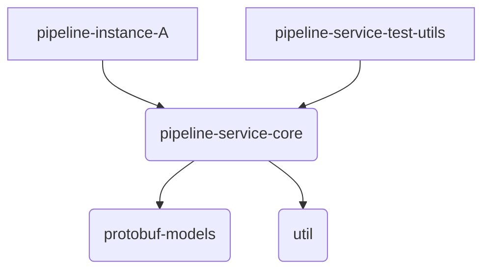
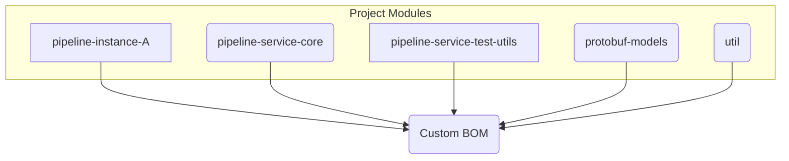

# Taming Dependencies: A Step-by-Step Guide to Building a Custom Micronaut BOM with Gradle Kotlin DSL

This repository contains the output of the end of this tutorial. It's open and used to demonstrate how one can build a multi-module build for containers in a single repository using the Micronaut framework.

Managing dependencies and ensuring build consistency across multiple projects can be a significant challenge, especially as systems grow in complexity. This tutorial provides a step-by-step guide to establishing a robust multi-project build structure using **Gradle with the Kotlin DSL** (even if your projects use **Java**), targeting **JDK 21**.

**What We're Building:**

Imagine a system designed for processing data pipelines. This system consists of several parts:

* **Shared Libraries:** A core library containing the main pipeline logic (`pipeline-service-core`), data models defined using Protocol Buffers (`protobuf-models`), and common helper functions (`util`).
* **Testing Utilities:** A dedicated library (`pipeline-service-test-utils`) to assist in testing the pipeline components.
* **Microservices:** Specific implementations of pipelines as runnable Micronaut applications (e.g., `pipeline-instance-A`).

**The Goal:**

Our goal is to manage this system effectively within a single repository (monorepo) using Gradle. We'll focus on:

1.  **Centralized Dependency Management:** Creating a custom Bill of Materials (BOM) and using Gradle's version catalog (`libs.versions.toml`) to ensure all modules use consistent library versions.
2.  **Consistent Build Environment:** Using Gradle Kotlin DSL and configuring for JDK 21.
3.  **Modular Structure:** Defining clear dependencies between the different project modules.
4.  **Efficient CI/CD:** Discussing strategies to build and deploy only the parts of the system that have changed.

**Project Dependency Overview:**

The following diagrams illustrate the relationships between the different project modules we'll be configuring.

*High-Level Module Dependencies:*



*Dependency on the Custom BOM:*



This tutorial will guide you through setting up this structure step-by-step, providing CLI commands and code examples along the way.

**Prerequisites:**

* Linux or macOS environment with a Bash-compatible shell.
* JDK 21 installed and configured (e.g., `JAVA_HOME` environment variable set).
* Git installed.
* Docker installed (optional, for containerization steps).

Let's begin!

## Step 1: Initial Project Setup (CLI)

First, create the directory structure for your monorepo and initialize the Gradle wrapper. The wrapper ensures a consistent Gradle version is used for the build.

1.  **Create Project Directories:**
    ```bash
    # Create the root directory
    mkdir micronaut-multiproject-example
    cd micronaut-multiproject-example

    # Create subproject directories
    mkdir bom protobuf-models pipeline-service-core pipeline-service-test-utils pipeline-instance-A util

    # Create the gradle directory for the version catalog
    mkdir gradle
    ```
2.  **Create Empty Settings File:** Gradle needs a settings file to recognize the project structure before generating the wrapper.
    ```bash
    touch settings.gradle.kts
    ```
3.  **Initialize Gradle Wrapper:** Run this command in the root (`your-monorepo`) directory. We'll use Gradle 8.7 (or your preferred compatible version like 8.13). Check the [Gradle Compatibility Matrix](https://docs.gradle.org/current/userguide/compatibility.html) for the latest recommendations.
    ```bash
    # Ensure you have a system Gradle installed to run this, OR download manually
    gradle wrapper --gradle-version 8.13
    ```
    This creates `gradlew`, `gradlew.bat`, and the `gradle/wrapper` directory. From now on, use `./gradlew` to run Gradle tasks.

4.  **Initialize Git (Recommended):**
    ```bash
    git init
    # Create a .gitignore file
    echo ".gradle/" >> .gitignore
    echo "build/" >> .gitignore
    echo ".idea/" >> .gitignore
    echo "*.iml" >> .gitignore
    echo "out/" >> .gitignore
    git add .
    git commit -m "Initial project structure and Gradle wrapper"
    ```

## Step 2: Configure Project Settings (`settings.gradle.kts`)

This file defines which subprojects are included in the build and configures plugin/dependency resolution.

1.  **Edit `settings.gradle.kts`:** Open the `settings.gradle.kts` file and add the following content:

    ```kotlin
    // settings.gradle.kts
    pluginManagement {
        repositories {
            gradlePluginPortal()
            mavenCentral()
        }
        // Apply Micronaut Platform Catalog plugin here for centralized Micronaut dependency management
        // This plugin makes Micronaut's managed dependencies available via the 'mn' accessor
        plugins {
            id("io.micronaut.platform.catalog") version "4.8.2" // Use latest compatible version
        }
    }

    dependencyResolutionManagement {
        repositories {
            mavenCentral() // Repositories for project dependencies
        }
        // Enable the version catalog feature
        versionCatalogs {
            // Gradle automatically looks for libs.versions.toml in gradle/
            // The Micronaut catalog plugin provides the 'mn' catalog
        }
    }

    rootProject.name = "my-pipeline-system"

    // Include all the subprojects
    include(
        "bom",
        "protobuf-models",
        "pipeline-service-core",
        "pipeline-service-test-utils",
        "pipeline-instance-A",
        "util"
    )
    ```

## Step 3: Configure Root Build File (`build.gradle.kts`)

Configure global settings and apply common test configurations.

1.  **Create/Edit `build.gradle.kts`:** In the root directory, create/edit `build.gradle.kts`:
    ```kotlin
    // build.gradle.kts (Root project)
    plugins {
        // Apply base plugin for common tasks like 'clean' available in all projects
        base
    }

    group = "com.yourcompany.pipeline" // Set your root group ID
    version = "1.0.0-SNAPSHOT" // Set your initial version

    // Apply common configurations to all subprojects
    subprojects {
        // Apply repositories to all subprojects
        repositories {
            mavenCentral()
        }

        // Apply Java toolchain configuration to all subprojects with Java plugin
        plugins.withId("java-base") { // "java-base" covers both "java" and "java-library"
            configure<JavaPluginExtension> {
                toolchain {
                    languageVersion.set(JavaLanguageVersion.of(21))
                }
            }

            // Configure JUnit 5 for all subprojects with Java capabilities
            tasks.test {
                useJUnitPlatform()
                testLogging {
                    events("passed", "skipped", "failed")
                }
            }
        }

        // Apply publishing configuration defaults (optional)
        plugins.withId("maven-publish") {
            configure<PublishingExtension> {
                repositories {
                    mavenLocal() // Default to local publishing
                    // Add remote repo config here if desired globally
                }
            }
        }
    }
    ```
    *Note: The `subprojects {}` block configures `useJUnitPlatform()` globally, so you won't need it in individual subproject files.*

## Step 4: Configure Version Catalog (`gradle/libs.versions.toml`)

Centralize dependency versions and aliases.

1.  **Create `gradle/libs.versions.toml`:**
    ```toml
    # gradle/libs.versions.toml

    [versions]
    micronautPlatform = "4.8.2" # Drives Micronaut plugin versions & 'mn' catalog
    kotlin = "1.9.25" # Check Micronaut compatibility
    gradleProtobufPlugin = "0.9.5"
    gradleReleasePlugin = "3.1.0"
    protobuf = "3.25.3" # Protobuf Java Runtime (Check gRPC compatibility)
    grpc = "1.72.0" # gRPC Java
    # junit = "5.12.2" # Managed by Micronaut Platform BOM
    slf4j = "2.0.13"
    jackson = "2.18.3" # Non-Micronaut Jackson
    guava = "33.4.8-jre"
    commonsLang3 = "3.14.0" # Corrected artifact name, updated version

    [libraries]
    # Protobuf / gRPC
    protobuf-java = { module = "com.google.protobuf:protobuf-java", version.ref = "protobuf" }
    grpc-stub = { module = "io.grpc:grpc-stub", version.ref = "grpc" }
    grpc-protobuf = { module = "io.grpc:grpc-protobuf", version.ref = "grpc" }
    grpc-protocGen = { module = "io.grpc:protoc-gen-grpc-java", version.ref = "grpc" }

    # Testing (API only, engine/platform managed by BOM)
    junit-jupiter-api = { module = "org.junit.jupiter:junit-jupiter-api" } # Version managed by BOM
    # junit-jupiter-engine = { module = "org.junit.jupiter:junit-jupiter-engine" } # Version managed by BOM

    # Utilities & Logging
    slf4j-api = { module = "org.slf4j:slf4j-api", version.ref = "slf4j" }
    slf4j-simple = { module = "org.slf4j:slf4j-simple", version.ref = "slf4j" }
    jackson-databind = { module = "com.fasterxml.jackson.core:jackson-databind", version.ref = "jackson" }
    guava = { module = "com.google.guava:guava", version.ref = "guava" }
    commons-lang3 = { module = "org.apache.commons:commons-lang3", version.ref = "commonsLang3"} # Corrected module

    # Explicit definition for Micronaut Platform BOM (for use within the bom project itself)
    micronaut-platform = { module = "io.micronaut.platform:micronaut-platform", version.ref = "micronautPlatform" }

    # Bundles are no longer needed for JUnit as it's managed by the BOM
    # [bundles]
    # testing-jvm = ["junit-jupiter-api", "junit-jupiter-engine"]

    [plugins]
    micronaut-application = { id = "io.micronaut.application", version.ref = "micronautPlatform" }
    micronaut-library = { id = "io.micronaut.library", version.ref = "micronautPlatform" }
    protobuf = { id = "com.google.protobuf", version.ref = "gradleProtobufPlugin" }
    release = { id = "net.researchgate.release", version.ref = "gradleReleasePlugin" }
    ```
    *Note: Removed explicit JUnit version and bundle, relying on the Micronaut Platform BOM. Added JUnit API library without version.*

## Step 5: Create the Custom BOM Project (`bom`)

Define and publish your custom Bill of Materials.

1.  **Create `bom/build.gradle.kts`:**
    ```kotlin
    // bom/build.gradle.kts
    plugins {
        `java-platform`
        `maven-publish`
        // alias(libs.plugins.release) // Optional
    }

    group = rootProject.group // Inherit from root
    version = rootProject.version // Inherit from root

    javaPlatform {
        // allowDependencies()
    }

    dependencies {
        constraints {
            // Import Micronaut Platform BOM (provides JUnit constraints etc.)
            api(platform(libs.micronaut.platform)) // Use libs accessor

            // Constrain non-Micronaut dependencies
            api(libs.protobuf.java)
            api(libs.grpc.stub)
            api(libs.grpc.protobuf)
            api(libs.guava)
            api(libs.jackson.databind)
            api(libs.commons.lang3)
            api(libs.slf4j.api)
            // api(libs.junit.jupiter.api) // No longer needed here, comes from Micronaut platform

            // Constrain own modules (unified versioning example)
            api("${rootProject.group}:protobuf-models:${rootProject.version}")
            api("${rootProject.group}:util:${rootProject.version}")
            // Add others: pipeline-service-core, pipeline-service-test-utils
            api("${rootProject.group}:pipeline-service-core:${rootProject.version}")
            api("${rootProject.group}:pipeline-service-test-utils:${rootProject.version}")
        }
    }

    publishing {
        publications {
            create<MavenPublication>("mavenJavaPlatform") {
                from(components["javaPlatform"])
                groupId = project.group.toString()
                artifactId = project.name
                version = project.version.toString()
                pom {
                    name.set("My Pipeline System BOM")
                    description.set("Bill of Materials for My Pipeline System components")
                }
            }
        }
        // Repositories inherited from root project's subprojects block (if configured there)
        // Or configure specific ones here:
        // repositories { mavenLocal() }
    }
    ```
    *Note: Removed `api(libs.bundles.testing.jvm)`.*

2.  **Build & Publish BOM Locally (CLI):**
    ```bash
    ./gradlew :bom:publishToMavenLocal
    ```

## Step 6: Configure Subprojects

Configure subprojects to use the BOM.

### 6a. Protobuf Models (`protobuf-models`)

1.  **Create `.proto` files:** (Ensure files exist in `protobuf-models/src/main/proto/`)
    ```bash
    mkdir -p protobuf-models/src/main/proto
    # Use your editor to create protobuf-models/src/main/proto/pipeline_model.proto
    ```
    Example `pipeline_model.proto`:
    ```protobuf
    syntax = "proto3";
    package com.yourcompany.pipeline.model; // Match your company/project structure
    option java_package = "com.yourcompany.pipeline.model.protobuf"; // Specific Java package
    option java_multiple_files = true;

    import "google/protobuf/timestamp.proto";
    import "google/protobuf/struct.proto";

    message PipeDoc {
        string id = 1;
        string title = 2;
        string body = 3;
        repeated string keywords = 4;
        string document_type = 5;
        string revision_id = 6;
        google.protobuf.Timestamp creation_date = 7;
        google.protobuf.Timestamp last_modified = 8;
        google.protobuf.Struct custom_data = 9;
        SemanticDoc chunk_embeddings = 10;
        map<string, Embedding> embeddings = 11;
    }

    message Embedding {
        repeated float embedding = 1;
    }

    message SemanticDoc {
        string parent_field = 1;
        string chunk_config_id = 2;
        string semantic_config_id = 3;
        repeated SemanticChunk chunks = 4;
    }

    message SemanticChunk {
        string chunk_id = 1;
        int64 chunk_number = 2;
        ChunkEmbedding embedding = 3;
    }

    message ChunkEmbedding {
        string embedding_text = 1;
        repeated float embedding = 2;
    }
    ```` 
3. **Create `protobuf-models/build.gradle.kts`:**

{{ include "sections/section1.md" }}
    ```kotlin
    // protobuf-models/build.gradle.kts
    import com.google.protobuf.gradle.*

    plugins {
        `java-library`
        alias(libs.plugins.protobuf)
    }

    group = rootProject.group // Inherit from root
    version = rootProject.version // Inherit from root

    // Repositories inherited from root project

    // Java toolchain inherited from root project

    dependencies {
        implementation(platform(project(":bom"))) // Import custom BOM
        testImplementation(platform(project(":bom")))

        implementation(libs.protobuf.java)
        // implementation(libs.grpc.stub)
        implementation(libs.guava)
        implementation(libs.commons.lang3)

        // Testing dependencies
        testImplementation(libs.junit.jupiter.api) // Add API dependency (version from BOM)
    }

    protobuf {
        protoc { artifact = "com.google.protobuf:protoc:${libs.versions.protobuf.get()}" }
        generateProtoTasks {
            all().forEach { task ->
                // task.builtins { create("java") } // Default, no need to specify unless options needed
                // task.plugins { create("grpc") { artifact = libs.grpc.protocGen.get().toString() } }
                task.outputs.upToDateWhen { false }
            }
        }
    }

    sourceSets.main {
        java { srcDirs(layout.buildDirectory.dir("generated/source/proto/main/java")) }
        // grpc { srcDirs(layout.buildDirectory.dir("generated/source/proto/main/grpc")) }
    }

    ```

3.  **Add sample code & test:** 

    ```java
    class ProtobufUtilsTest {

        /**
         * Tests the {@link ProtobufUtils#now} method.
         * The method should return a {@link Timestamp} object representing the current time
         * as an Instant object, converted to seconds and nanoseconds.
         */
        @Test
        void testNowReturnsCurrentTimestamp() {
            // Act
            Timestamp timestamp = ProtobufUtils.now();

            // Assert
            Instant currentInstant = Instant.now();
            assertNotNull(timestamp);
            assertTrue(timestamp.getSeconds() <= currentInstant.getEpochSecond());
            assertTrue(timestamp.getNanos() < 1_000_000_000);
            assertTrue(timestamp.getSeconds() >= (currentInstant.getEpochSecond() - 1)); // buffer for slight delays
        }

        @Test
        void nowIsNowNotThen() throws InterruptedException {
            Timestamp now = ProtobufUtils.now();
            Assertions.assertInstanceOf(Timestamp.class, now);
            Thread.sleep(1000);//sleep 1 second so next now() is a second later.
            Assertions.assertTrue(ProtobufUtils.now().getSeconds() > now.getSeconds());
        }

        @Test
        void stamp() {
            long time = System.currentTimeMillis() / 1000;
            Timestamp stamp = ProtobufUtils.stamp(time);
            assertEquals(time, stamp.getSeconds());
            assertEquals(0, stamp.getNanos());
        }

    }
   ```
   Now test that the build runs
   ```bash
   ./gradlew :protobuf-models:test
   ``` 
5. **Test & Build (CLI):**
    ```bash
    ./gradlew :protobuf-models:test
    ./gradlew :protobuf-models:build
    ```

### 6b. Utility Library (`util`)

1.  **Add Java code:** (Ensure files exist in `util/src/main/java/`)
2.  **Create `util/build.gradle.kts`:**
    ```kotlin
    // util/build.gradle.kts
    plugins {
        `java-library`
    }

    group = rootProject.group
    version = rootProject.version

    // Repositories inherited from root project
    // Java toolchain inherited from root project

    dependencies {
        implementation(platform(project(":bom")))
        testImplementation(platform(project(":bom")))

        api(libs.guava) // Expose Guava via API

        // Testing dependencies
        testImplementation(libs.junit.jupiter.api) // Add API dependency
        // testImplementation(libs.bundles.testing.jvm) // Removed bundle
    }

    // Test task configuration inherited from root project
    ```
    *Note: Removed `testImplementation(libs.bundles.testing.jvm)`, added `testImplementation(libs.junit.jupiter.api)`.*
3.  **Build (CLI):**
    ```bash
    ./gradlew :util:build
    ```

### 6c. Core Library (`pipeline-service-core`)

1.  **Add Java code:** (Ensure files exist in `pipeline-service-core/src/main/java/`)
2.  **Create `pipeline-service-core/build.gradle.kts`:**
    ```kotlin
    // pipeline-service-core/build.gradle.kts
    plugins {
        `java-library`
        alias(libs.plugins.micronaut.library)
    }

    group = rootProject.group
    version = rootProject.version

    // Repositories inherited from root project
    // Java toolchain inherited from root project

    micronaut {
        processing {
            incremental(true)
            annotations("com.yourcompany.pipeline.core.*")
        }
    }

    dependencies {
        implementation(platform(project(":bom")))
        annotationProcessor(platform(project(":bom")))
        testImplementation(platform(project(":bom")))
        testAnnotationProcessor(platform(project(":bom")))

        // Micronaut dependencies
        annotationProcessor(mn.micronaut.inject.java)
        implementation(mn.micronaut.inject)
        implementation(mn.micronaut.runtime)

        // Project dependencies
        api(project(":protobuf-models"))
        api(project(":util"))

        // Other dependencies
        implementation(libs.slf4j.api)

        // Testing dependencies
        testImplementation(mn.micronaut.test.junit5) // Micronaut test pulls in JUnit
        // testImplementation(libs.bundles.testing.jvm) // Removed bundle
        testAnnotationProcessor(mn.micronaut.inject.java)
    }

    // Test task configuration inherited from root project
    ```
    *Note: Removed `testImplementation(libs.bundles.testing.jvm)`. Kept `mn.micronaut.test.junit5`.*
3.  **Build (CLI):**
    ```bash
    ./gradlew :pipeline-service-core:build
    ```

### 6d. Test Utilities (`pipeline-service-test-utils`)

1.  **Add Java code:** (Ensure files exist in `pipeline-service-test-utils/src/main/java/`)
2.  **Create `pipeline-service-test-utils/build.gradle.kts`:**
    ```kotlin
    // pipeline-service-test-utils/build.gradle.kts
    plugins {
        `java-library`
    }

    group = rootProject.group
    version = rootProject.version

    // Repositories inherited from root project
    // Java toolchain inherited from root project

    dependencies {
        implementation(platform(project(":bom")))

        // Depend on core library
        api(project(":pipeline-service-core"))

        // Include testing libraries needed by the utilities
        api(mn.micronaut.test.junit5) // Expose Micronaut test support (includes JUnit API)
        // api(libs.bundles.testing.jvm) // Removed bundle

        // May depend on other utils
        api(project(":util"))
    }

    // Test task configuration inherited from root project (if tests were added here)
    ```
    *Note: Removed `api(libs.bundles.testing.jvm)`. Kept `api(mn.micronaut.test.junit5)`.*
3.  **Build (CLI):**
    ```bash
    ./gradlew :pipeline-service-test-utils:build
    ```

### 6e. Micronaut Application (`pipeline-instance-A`)

1.  **Add Java code:** (Ensure `Application.java` and other files exist)
2.  **Create `pipeline-instance-A/build.gradle.kts`:**
    ```kotlin
    // pipeline-instance-A/build.gradle.kts
    plugins {
        id("java")
        alias(libs.plugins.micronaut.application)
        // id("com.google.cloud.tools.jib") version "..."
    }

    group = rootProject.group
    version = rootProject.version

    // Repositories inherited from root project
    // Java toolchain inherited from root project

    micronaut {
        runtime("netty")
        testRuntime("junit5")
        processing {
            incremental(true)
            annotations("com.yourcompany.pipeline.instanceA.*")
        }
        mainClass("com.yourcompany.pipeline.instanceA.Application")
    }

    dependencies {
        implementation(platform(project(":bom")))
        annotationProcessor(platform(project(":bom")))
        testImplementation(platform(project(":bom")))
        testAnnotationProcessor(platform(project(":bom")))

        // Micronaut dependencies
        annotationProcessor(mn.micronaut.inject.java)
        implementation(mn.micronaut.inject)
        implementation(mn.micronaut.runtime)
        implementation(mn.micronaut.http.server.netty)
        implementation(mn.micronaut.http.client)
        implementation(mn.micronaut.jackson.databind)

        // Project dependencies
        implementation(project(":pipeline-service-core"))

        // Logging implementation
        runtimeOnly(libs.slf4j.simple)

        // Testing
        testImplementation(mn.micronaut.test.junit5) // Micronaut test pulls in JUnit
        // testImplementation(libs.bundles.testing.jvm) // Removed bundle
        testImplementation(project(":pipeline-service-test-utils"))
        testAnnotationProcessor(mn.micronaut.inject.java)
    }

    application {
        mainClass.set(micronaut.mainClass.get())
    }

    // Test task configuration inherited from root project
    ```
    *Note: Removed `testImplementation(libs.bundles.testing.jvm)`. Kept `mn.micronaut.test.junit5`.*
3.  **Build (CLI):**
    ```bash
    ./gradlew :pipeline-instance-A:build
    ```
4.  **Run (CLI):**
    ```bash
    ./gradlew :pipeline-instance-A:run
    ```
5.  **Build Docker Image (Optional - CLI):**
    ```bash
    ./gradlew :pipeline-instance-A:dockerBuild
    ```

## Step 7: Common Build Commands (CLI)

Here are commands run from the root directory (`your-monorepo`) that affect the whole project:

* **Clean All Build Outputs:**
    ```bash
    ./gradlew clean
    ```
* **Build Everything (Compile, Test, Assemble):**
    ```bash
    ./gradlew build
    ```
* **Run All Tests:**
    ```bash
    ./gradlew test
    ```
* **Build without Running Tests:**
    ```bash
    ./gradlew assemble
    ```
* **Publish All Publishable Artifacts to Maven Local:**
    ```bash
    ./gradlew publishToMavenLocal
    ```
* **List Project Dependencies:** (Useful for debugging)
    ```bash
    ./gradlew :pipeline-instance-A:dependencies
    ```

## Step 8: Conditional CI/CD (Conceptual)

As discussed previously, the goal for CI/CD is to build/test/deploy only what changed. This typically involves:

1.  **Detecting Changes:** Using `git diff`, Nx, or a Gradle plugin.
2.  **Identifying Affected Projects:** Including downstream dependents.
3.  **Running Tasks Selectively:**
    * Using specific project paths: `./gradlew :pipeline-service-core:build :pipeline-instance-A:build`
    * Using built-in tasks: `./gradlew :pipeline-service-core:buildDependents` (builds core and instance-A)
    * Using tools: `nx affected -t build`

Implementing this requires additional scripting or tooling setup in your CI environment (e.g., GitHub Actions, GitLab CI).

## Step 9: Versioning and Releasing (Conceptual)

Choose a versioning strategy (Unified or Independent). Use a release plugin for automation.

* **If using `gradle-release` (Unified Versioning Example - CLI):**
    ```bash
    # Ensure gradle.properties has the version, e.g., version=1.0.0-SNAPSHOT
    # Run the release task (interactive)
    ./gradlew release
    ```
  This will guide you through setting the release version (e.g., `1.0.0`) and the next snapshot version (e.g., `1.0.1-SNAPSHOT`), commit changes, tag the release, run build tasks (like `publish`), and commit the next snapshot version.

* **Independent Versioning:** Requires more sophisticated tooling or scripting integrated with your change detection mechanism to version and release only affected modules.

## Conclusion: Building for the Future

This step-by-step guide provides a practical path to setting up a well-structured, maintainable multi-project build using Gradle Kotlin DSL, a custom BOM, and modern dependency management techniques. Remember to adapt the specific configurations and commands to your exact project needs.
