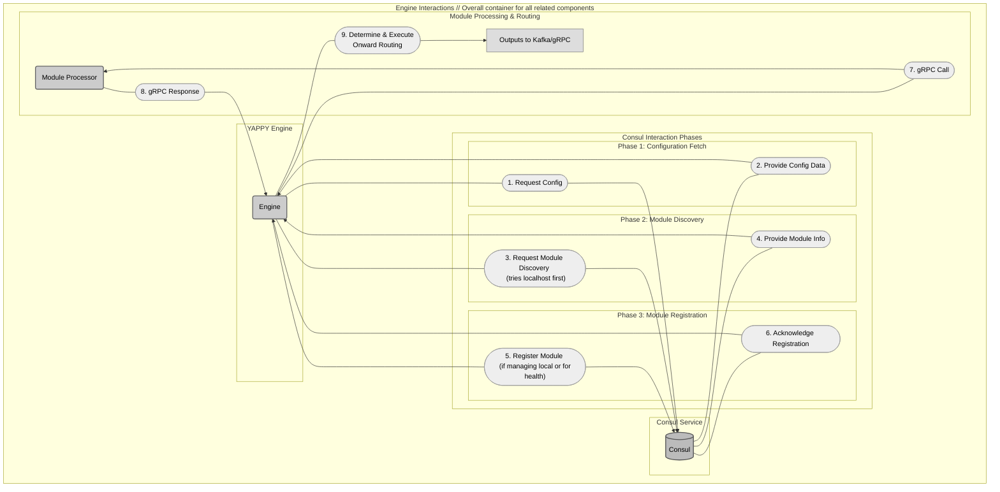
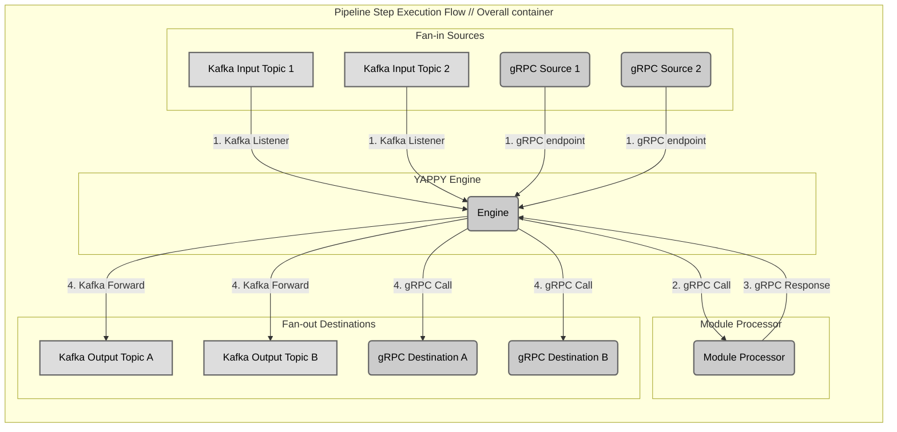
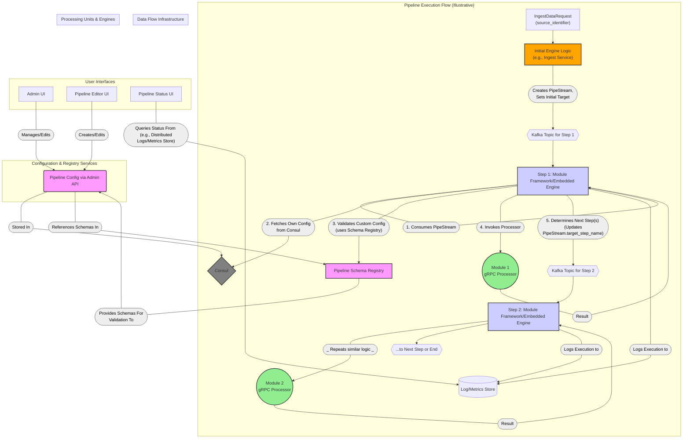

```mermaid
graph LR
    A["Data Ingestion Source <br/> (e.g., S3, DB, API)"] --> IEL["Initial Engine Logic <br/> IngestDataRequest"]
    IEL -->|"PipeStream to Kafka_P1S1_In"| K_P1S1_In{{"Kafka: P1_S1_ValidateData_In"}}

    K_P1S1_In --> S1_FW{"Step 1 FW/Engine <br/> ValidateData"}
    S1_FW -->|"Fetch Config"| ConsulDb[("Consul: PipelineConfig")]
    S1_FW -->|"Invoke"| M1_Val["Validator Module <br/> (gRPC)"]
    M1_Val -->|"Result"| S1_FW
    S1_FW -- "Success" --> K_P1S2_In{{"Kafka: P1_S2_CleanData_In"}}
    S1_FW -- "Failure" --> K_Err{{"Kafka: P1_Error_Topic"}}

    K_P1S2_In --> S2_FW{"Step 2 FW/Engine <br/> Clean & Preprocess"}
    S2_FW -->|"Fetch Config"| ConsulDb
    S2_FW -->|"Invoke"| M2_Clean["DataCleaner Module <br/> (gRPC/Kafka) <br/> Config: rules.json"]
    M2_Clean -->|"Result"| S2_FW
    S2_FW -->|"PipeStream to Kafka_P1S3_In"| K_P1S3_In{{"Kafka: P1_S3_FeatureEng_In"}}

    K_P1S3_In --> S3_FW{"Step 3 FW/Engine <br/> FeatureEngineer"}
    S3_FW -->|"Fetch Config"| ConsulDb
    S3_FW -->|"Invoke"| M3_Feat["FeatureEngineering Module <br/> (gRPC/Kafka) <br/> Config: feature_spec.json"]
    M3_Feat -->|"Result"| S3_FW
    S3_FW -->|"PipeStream to Kafka_P1S4_In"| K_P1S4_In{{"Kafka: P1_S4_TrainModel_In"}}

    K_P1S4_In --> S4_FW{"Step 4 FW/Engine <br/> TrainModel"}
    S4_FW -->|"Fetch Config"| ConsulDb
    S4_FW -->|"Invoke"| M4_Train["ModelTrainer Module <br/> (gRPC) <br/> Config: model_params.json"]
    M4_Train -->|"Result"| S4_FW
    S4_FW -->|"PipeStream to Kafka_P1S5_In"| K_P1S5_In{{"Kafka: P1_S5_StoreModel_In"}}

    K_P1S5_In --> S5_FW{"Step 5 FW/Engine <br/> StoreModel & Metrics"}
    S5_FW -->|"Fetch Config"| ConsulDb
    S5_FW -->|"Invoke"| M5_Store["ArtifactStorage Module <br/> (gRPC) <br/> Config: storage_path"]
    M5_Store -->|"Result"| S5_FW
    S5_FW -->|"End of P1"| EndP1(("Pipeline P1 End"))

    subgraph "Data Science Pipeline (P1)"
        direction LR
        S1_FW; M1_Val;
        S2_FW; M2_Clean;
        S3_FW; M3_Feat;
        S4_FW; M4_Train;
        S5_FW; M5_Store;
    end

    style IEL fill:#orange,stroke:#333,stroke-width:2px
    style S1_FW fill:#ccf,stroke:#333,stroke-width:2px
    style S2_FW fill:#ccf,stroke:#333,stroke-width:2px
    style S3_FW fill:#ccf,stroke:#333,stroke-width:2px
    style S4_FW fill:#ccf,stroke:#333,stroke-width:2px
    style S5_FW fill:#ccf,stroke:#333,stroke-width:2px
```

```mermaid
graph LR
    A["Document Source <br/> (e.g., Web Crawl, S3)"] --> IEL["Initial Engine Logic <br/> IngestDataRequest"]
    IEL -->|"PipeStream to Kafka_P2S1_In"| K_P2S1_In{{"Kafka: P2_S1_FetchContent_In"}}

    K_P2S1_In --> S1_FW{"Step 1 FW/Engine <br/> FetchContent"}
    S1_FW -->|"Fetch Config"| ConsulDb[("Consul: PipelineConfig")]
    S1_FW -->|"Invoke"| M1_Fetch["ContentFetcher Module <br/> (gRPC)"]
    M1_Fetch -->|"Result"| S1_FW
    S1_FW -->|"PipeStream to Kafka_P2S2_In"| K_P2S2_In{{"Kafka: P2_S2_ExtractText_In"}}

    K_P2S2_In --> S2_FW{"Step 2 FW/Engine <br/> ExtractText"}
    S2_FW -->|"Fetch Config"| ConsulDb
    S2_FW -->|"Invoke"| M2_Extract["TextExtractor Module <br/> (gRPC)"]
    M2_Extract -->|"Result"| S2_FW
    S2_FW -->|"PipeStream to Kafka_P2S3_In"| K_P2S3_In{{"Kafka: P2_S3_ChunkText_In"}}

    K_P2S3_In --> S3_FW{"Step 3 FW/Engine <br/> ChunkText"}
    S3_FW -->|"Fetch Config"| ConsulDb
    S3_FW -->|"Invoke"| M3_Chunk["TextChunker Module <br/> (gRPC) <br/> Config: chunk_config_id"]
    M3_Chunk -->|"Result (PipeDoc with SemanticProcessingResult)"| S3_FW
    S3_FW -->|"PipeStream to Kafka_P2S4_In"| K_P2S4_In{{"Kafka: P2_S4_GenEmbed_In"}}

    K_P2S4_In --> S4_FW{"Step 4 FW/Engine <br/> GenerateEmbeddings"}
    S4_FW -->|"Fetch Config"| ConsulDb
    S4_FW -->|"Invoke"| M4_Embed["EmbeddingGenerator Module <br/> (gRPC) <br/> Config: embedding_config_id"]
    M4_Embed -->|"Result (PipeDoc with ChunkEmbeddings)"| S4_FW
    S4_FW -->|"PipeStream to Kafka_P2S5_In"| K_P2S5_In{{"Kafka: P2_S5_IndexDoc_In"}}

    K_P2S5_In --> S5_FW{"Step 5 FW/Engine <br/> IndexDocument"}
    S5_FW -->|"Fetch Config"| ConsulDb
    S5_FW -->|"Invoke"| M5_Index["SearchIndexer Module <br/> (gRPC/Kafka)"]
    M5_Index -->|"Result"| S5_FW
    S5_FW -->|"End of P2"| EndP2(("Pipeline P2 End"))

    subgraph "Search Indexing Pipeline (P2)"
        direction LR
        S1_FW; M1_Fetch;
        S2_FW; M2_Extract;
        S3_FW; M3_Chunk;
        S4_FW; M4_Embed;
        S5_FW; M5_Index;
    end

    style IEL fill:#orange,stroke:#333,stroke-width:2px
    style S1_FW fill:#ccf,stroke:#333,stroke-width:2px
    style S2_FW fill:#ccf,stroke:#333,stroke-width:2px
    style S3_FW fill:#ccf,stroke:#333,stroke-width:2px
    style S4_FW fill:#ccf,stroke:#333,stroke-width:2px
    style S5_FW fill:#ccf,stroke:#333,stroke-width:2px
```

# YAPPY (Yet Another Pipeline Processor)

YAPPY is a multi-project Micronaut application that serves as a configurable pipeline platform for creating multiple indexes through a scalable container-based microservice architecture. The system is designed for processing data pipelines with a decentralized approach where information is shared between components in a control plane and configuration changes happen in near real-time.

## 1. Summary

YAPPY (Yet Another Pipeline Processor) is a highly flexible and scalable platform for building, managing, and executing dynamic data
processing pipelines. Think of this system as a dynamic node pipeline system that is managed through an engine that is dedicated to a module business logic.
This way the module is just a processor and the engine handles all the routing and configuration of the ecosystem. That ecosystem is fast!

Each node is a fan-in / fan-out methodology where the connections between nodes are supported by gRPC or Kafka.  The document structure is type safe and supports binary blob processing.

It leverages a microservices architecture where each pipeline step's processing logic resides in a **Module Processor** (typically a gRPC service) that is managed and orchestrated by an associated embedded **Engine**.

This is supported by the underlying framework within the embedded engine logic.  This is done in two steps: internal processing and engine-to-engine processing.  

Let's first discuss about the internal processing.

### Internal Processing
#### Flow diagram
Here's a flow of the data for module discovery and processing:


#### Flow description
1. **Phase 1**: Dynamically fetches its configuration
2. **Phase 2**: Discovers its associated module processor
   1. It will be a localhost-first approach
   2. This will fallback to service discovery
3. **Phase 3**: Registers this module with the service discovery system
4. **Module Processing and routing**: Determines onward routing

This communcation is all internal and hidden away from the processor component.  The processing component is just a document processor; all other logic - including service calling - is handled by the engine.

### Engine to Engine routing

**The engine can input from multiple connections and output to multiple connections**.  So for each engine instance it acts as one of three types of connections: `Connectors`, `Processors`, and `Sinks`.

The developer would explicitly define these steps, but the engine implementation is the same pipeline step except the sink and connector limitations:

1. **`Connector`** - Fan-out only - Like a pipeline, but only outputs as grpc or kafka
2. **`Processor`** - Fan-in / Fan-out - Take many inputs or many outputs
3. **`Sink`** - Fan-in only - implied that it saves to a host system with specific login in the processor

To the engine, this is still just a `Processor`, but just has logical restrictions on the routing object.

It's important to highlight the flexibility of the inputs and outputs, as they are all dynamic and can change without the need to push code:

Here's how to view the fan-in fan-out strategy:

It leverages a microservices architecture where **each pipeline step, supported by an underlying framework or embedded
engine logic, dynamically fetches its configuration and determines onward routing.** 

Communication primarily utilizes `gRPC` for **synchronous**
processing within a step and `Kafka` for **asynchronous** handoff between steps, ensuring decoupling and resilience.

With Kafka steps, the administrator is empowered to pause, rewind, or drain a topic or dynamically change the inputs and output destinations.  All updates happen within seconds.

**Consul** serves as the dynamic
configuration store and service discovery mechanism, with a Schema Registry guaranteeing data and configuration integrity.  Engine-to-engine communication schemas are manged from either **Apicurio**, **Amazon Glue**, or **Confluent Registry**. 

Each step is capable of defining a JSON schema for configuration which is made to automate configuration input on the administration of the module and engine.


YAPPY empowers
users to define complex workflows for diverse applications like data science and search indexing by allowing custom processing modules to be
easily integrated. The system's design for live configuration updates facilitates agile pipeline evolution and A/B testing without requiring
full service redeployments.

## 2. Project Structure

- **Root Directory**: Contains build configuration, documentation, and subproject definitions
- **bom**: Bill of Materials for centralized dependency management
- **docker-dev**: Docker development environment setup
- **docs**: Project documentation
- **util**: Utility code and shared functionality
- **yappy-admin**: Administration interface for managing YAPPY
- **yappy-consul-config**: Dynamic Configuration Management Service for loading, watching, validating, and providing live updates of pipeline and schema configurations stored in Consul
- **yappy-engine**: Core engine that orchestrates pipeline execution and module management
- **yappy-models**: Contains multiple submodules:
    - **pipeline-config-models**: Defines the structure of pipelines, steps, schema registration, and their configurations
    - **protobuf-models**: Protocol Buffer model definitions for gRPC communication
    - **pipeline-config-models-test-utils**: Test utilities for pipeline configuration models
    - **protobuf-models-test-data-resources**: Test resources for protobuf models
- **yappy-modules**: Collection of pipeline processing modules:
    - **chunker**: Text chunking module
    - **echo**: Simple echo module for testing
    - **embedder**: Text embedding generation module
    - **opensearch-sink**: Module for indexing to OpenSearch
    - **project-generator**: Scaffolding tool for new modules
    - **s3-connector**: AWS S3 connector module
    - **tika-parser**: Document parsing module
    - **web-crawler-connector**: Web crawling module
    - **wikipedia-connector**: Wikipedia content connector
- **yappy-test-resources**: TestContainers configuration and test resources
- **yappy-ui**: User interface for interacting with YAPPY

## 3. Overview of Components

The YAPPY ecosystem comprises several key components that interact to provide a robust and decentralized pipeline processing environment.
Each Pipeline Module operates with an awareness of its role and the next steps, guided by the shared Pipeline Configuration and its own
embedded engine logic or supporting framework.


| Component                                 | Description                                                                                                                                                                                                                                                                                                                                                                                                                                                                                   | Key Interactions                                                                                                                                                                                                                                                                                          |
|:------------------------------------------|:----------------------------------------------------------------------------------------------------------------------------------------------------------------------------------------------------------------------------------------------------------------------------------------------------------------------------------------------------------------------------------------------------------------------------------------------------------------------------------------------|:----------------------------------------------------------------------------------------------------------------------------------------------------------------------------------------------------------------------------------------------------------------------------------------------------------|
| **Pipeline Config**                       | Defines the structure and behavior of all pipelines (`PipelineClusterConfig`, `PipelineConfig`, `PipelineStepConfig`). Stored as JSON/YAML in Consul. Source of truth for all steps.                                                                                                                                                                                                                                                                                                          | Read by each Pipeline Module's Framework/Embedded Engine; Managed via Admin API (by Admin/Editor UIs); References schemas in Pipeline Schema Registry.                                                                                                                                                    |
| **Pipeline Schema Registry**              | Stores and versions JSON Schemas (e.g., using Apicurio Registry or the provided `SchemaRegistryService.proto`). These schemas validate the `custom_json_config` for each `PipelineStepConfig`.                                                                                                                                                                                                                                                                                               | Provides schemas to Admin API/UI for pre-validation and to each Pipeline Module's Framework/Embedded Engine for runtime validation; Schemas are registered/managed. Referenced by Pipeline Config.                                                                                                        |
| **Pipeline Module (Processor)**           | The core business logic for a specific task in a pipeline (e.g., text extraction, data transformation). Implemented as a gRPC service (conforming to `PipeStepProcessor.proto`) or as logic within a Kafka consumer.                                                                                                                                                                                                                                                                          | Invoked by its associated Module Framework/Embedded Engine with `PipeStream` data (specifically `PipeDoc`, `Blob`) and validated `ProcessConfiguration` (custom config + params). Returns processing result.                                                                                              |
| **Module Framework/Embedded Engine**      | Logic co-located or associated with each Pipeline Module instance/deployment. Responsible for consuming a `PipeStream` (e.g., from Kafka), fetching its `PipelineStepConfig` from Consul, validating its custom config, invoking the actual Module Processor, and then routing the `PipeStream` to the next step(s) (e.g., by publishing to a Kafka topic **or making a gRPC call to another engine/module**) based on the current step's configuration (**e.g., `outputs` defined in `PipelineStepConfig`**). This is the "engine-per-step" concept. | Consumes/Receives `PipeStream` (e.g., from Kafka, or via gRPC if called by a previous engine); Fetches its `PipelineStepConfig` from Consul (via `DynamicConfigurationManager`); Uses Schema Registry for `custom_json_config` validation; Calls its local Pipeline Module Processor (typically gRPC); Determines and routes the `PipeStream` to the next step(s) (e.g., by publishing to Kafka **or making a gRPC call to another engine/module**). |
| **Admin UI**                              | A web interface for administrators to manage `PipelineClusterConfig` (pipeline definitions) and JSON schemas, interacting via an Admin API.                                                                                                                                                                                                                                                                                                                                                   | Interacts with Admin API to CRUD pipeline configurations in Consul and schemas in the Pipeline Schema Registry.                                                                                                                                                                                           |
| **Pipeline Editor UI**                    | A (potentially graph-based) web interface for users to design, create, and modify pipeline configurations.                                                                                                                                                                                                                                                                                                                                                                                    | Interacts with Admin API to save/update pipeline configurations in Consul. May visualize pipeline graphs.                                                                                                                                                                                                 |
| **Pipeline Status UI**                    | A web interface to monitor the status, progress, history (`StepExecutionRecord`), and errors (`ErrorData`) of pipeline executions by querying a centralized log/metrics store.                                                                                                                                                                                                                                                                                                                | Queries pipeline execution status and history from a Log/Metrics Store where each Module Framework/Embedded Engine reports its activity.                                                                                                                                                                  |
| **Initial Engine Logic / Ingest Service** | A service (e.g., implementing `PipeStreamEngine.IngestDataAsync` from `engine_service.proto`) that accepts initial data, creates the `PipeStream`, assigns a `stream_id`, sets the `source_identifier`, `initial_context_params`, and `target_step_name` for the first step in the designated pipeline, and publishes it to the appropriate Kafka topic to kick off the flow.                                                                                                                 | Receives external data; Creates initial `PipeStream`; Publishes to the first step's Kafka topic.                                                                                                                                                                                                          |
| **Consul**                                | Service discovery and distributed Key-Value store for `PipelineClusterConfig` and runtime parameters.                                                                                                                                                                                                                                                                                                                                                                                         | Stores `PipelineClusterConfig`; Provides service addresses for gRPC modules; Read by all Module Frameworks/Embedded Engines for configuration.                                                                                                                                                            |
| **Kafka**                                 | Acts as the primary message bus for `PipeStream` objects, decoupling pipeline steps and providing resilience.                                                                                                                                                                                                                                                                                                                                                                                 | `PipeStream` messages are published to topics corresponding to target steps; Consumed by the Module Framework/Embedded Engine of the respective step.                                                                                                                                                         |

## 4. Development Environment

A Docker-based development environment is available in the `docker-dev` directory, which includes:

- **Kafka** (in Kraft mode): Message broker (localhost:9092)
- **Apicurio Registry**: Schema registry (http://localhost:8080)
- **Solr** (in cloud mode): Search platform (http://localhost:8983)
- **Kafka UI**: Web UI for Kafka management (http://localhost:8081)
- **Moto server/Glue Mock**: Mock server for AWS services including Glue Schema Registry (localhost:5001)
- **OpenSearch**: Search and analytics engine (http://localhost:9200)
- **OpenSearch Dashboards**: UI for OpenSearch (http://localhost:5601)
- **Consul**: Service discovery and configuration storage (http://localhost:8500)

To start the development environment:

```bash
cd docker-dev
docker-compose up -d
```

To stop all services:

```bash
cd docker-dev
docker-compose down
```

To verify the setup:

```bash
cd docker-dev
./test-docker-setup.sh
```

### Service Registration

In the YAPPY architecture, modules do NOT register themselves with Consul. Instead, the engine handles registration on behalf of modules. This simplifies the architecture and reduces the burden on module developers.

The engine is responsible for:
1. Discovering modules (trying localhost first, then falling back to service discovery)
2. Registering modules with Consul
3. Monitoring module health

### Consul Paths

YAPPY currently uses paths like `pipeline-configs/clusters` for storing cluster configurations in Consul. Note that this path will be changed to `/yappy-clusters` in future updates.

### Cluster Name Handling

There is no default "yappy-default" cluster name in the system. The cluster name must be explicitly configured through one of these methods:
- The `app.config.cluster-name` property in application.yml
- During the bootstrap process when selecting or creating a cluster
- The `YAPPY_BOOTSTRAP_CLUSTER_SELECTED_NAME` property in the bootstrap file

## 5. Example Usage of Pipeline

YAPPY's decentralized engine logic within each step allows for robust and scalable pipeline execution.

### 5.1. Data Science Model Training & Feature Engineering Pipeline

**Goal:** To ingest raw data, preprocess it, engineer features, train a machine learning model, and manage model artifacts. Each step
operates with its own engine logic to fetch configuration and route data.



**Description:**

1. **Data Ingestion & Kick-off:** An external connector or service sends an `IngestDataRequest` (as per `engine_service.proto`) to an *
   *Initial Engine Logic** (e.g., a dedicated Ingest Service). This logic creates a `PipeStream`, populates it with the initial `PipeDoc`,
   `source_identifier`, `context_params`, `stream_id`, `current_pipeline_name` (e.g., "DataSciencePipeline-P1"), and `target_step_name` (
   e.g., "P1_S1_ValidateData"). It then publishes this `PipeStream` to the Kafka topic designated for "P1_S1_ValidateData_In".
2. **Step 1: ValidateData (S1_FW & M1_Val):**
    * The **Step 1 Framework/Embedded Engine (S1_FW)** consumes the `PipeStream` from `Kafka: P1_S1_ValidateData_In`.
    * It uses `PipeStream.target_step_name` ("P1_S1_ValidateData") and `current_pipeline_name` ("DataSciencePipeline-P1") to fetch its
      specific `PipelineStepConfig` from Consul (via `DynamicConfigurationManager`). This config includes the `pipelineImplementationId` for
      the Validator Module, its `custom_json_config` (e.g., validation rules), and `config_params`, along with `nextSteps` and `errorSteps`.
    * S1_FW validates the `custom_json_config` against its schema from the Pipeline Schema Registry.
    * S1_FW constructs the `ProcessRequest` (as per `pipe_step_processor.proto`) and invokes the **Validator Module (M1_Val)** (a gRPC
      service).
    * Upon receiving the `ProcessResponse` from M1_Val, S1_FW updates the `PipeStream` (e.g., adds to history, updates `PipeDoc` if
      changed).
    * Based on `ProcessResponse.success` and its `PipelineStepConfig`, S1_FW determines the next target (e.g., "P1_S2_CleanData" if
      success). It updates `PipeStream.target_step_name` and publishes the `PipeStream` to `Kafka: P1_S2_CleanData_In`. If failed, it routes
      to `Kafka: P1_Error_Topic`.
3. **Subsequent Steps (S2_FW, S3_FW, etc.):** Each subsequent step (DataCleaner, FeatureEngineer, ModelTrainer, ArtifactStorage) follows a
   similar pattern:
    * Its dedicated **Module Framework/Embedded Engine (Sx_FW)** consumes the `PipeStream` from its input Kafka topic.
    * It fetches its own configuration from Consul.
    * It validates its custom config.
    * It invokes its associated **Module Processor (Mx)**.
    * It updates the `PipeStream` and routes it to the Kafka topic of the next designated step.
4. **Data Structures:** The `PipeDoc` within the `PipeStream` evolves, potentially storing cleaned data in `body`, engineered features in
   `custom_data` or `semantic_results`, and model artifacts as `Blob` or URIs.
5. **UIs:**
    * **Pipeline Editor UI:** Defines "DataSciencePipeline-P1", its steps, the `pipelineImplementationId` for each, their respective
      `custom_json_config` (and its schema reference), and the `nextSteps`/`errorSteps` (which implicitly define the Kafka topics, e.g., by
      a convention like `<pipelineName>_<stepName>_In`).
    * **Pipeline Status UI:** Collects `StepExecutionRecord`s and `ErrorData` logged by each Sx_FW to a central Log/Metrics Store, providing
      a consolidated view of the distributed execution.
    * **Admin UI:** Manages schemas for `custom_json_config` of each module type.

### 5.2. Search Engine Indexing Pipeline

**Goal:** To ingest documents, process them for search (text extraction, chunking, embedding), and load them into a search index, with each
step autonomously managing its execution and handoff.



**Description:**

1. **Document Ingestion & Kick-off:** Similar to the data science use case, an **Initial Engine Logic** receives an `IngestDataRequest`. It
   creates a `PipeStream` for "SearchIndexingPipeline-P2", sets the initial `target_step_name` to "P2_S1_FetchContent", and publishes it to
   `Kafka: P2_S1_FetchContent_In`. The `PipeDoc` might initially contain `source_uri`.
2. **Step Execution (General Pattern for S1-S5):** Each step (`WorkspaceContent`, `ExtractText`, `ChunkText`, `GenerateEmbeddings`,
   `IndexDocument`) operates via its **Module Framework/Embedded Engine (Sx_FW)** and associated **Module Processor (Mx)**:
    * Sx_FW consumes the `PipeStream` from its designated input Kafka topic (e.g., `Kafka: P2_Sx_Action_In`).
    * It fetches its `PipelineStepConfig` from Consul, which defines the `custom_json_config` (e.g., `chunk_config_id` for the Chunker,
      `embedding_config_id` for the Embedding Generator), `pipelineImplementationId`, `nextSteps`, and `errorSteps`.
    * The `custom_json_config` is validated using schemas from the Pipeline Schema Registry.
    * Sx_FW invokes its gRPC Module Processor (Mx) with the `PipeStream` data and derived `ProcessConfiguration`.
    * **Data Transformation (`yappy_core_types.proto` in action):**
        * `WorkspaceContent (M1_Fetch)`: Populates `PipeDoc.blob` and `PipeDoc.source_mime_type`.
        * `ExtractText (M2_Extract)`: Populates `PipeDoc.body` from `PipeDoc.blob`.
        * `ChunkText (M3_Chunk)`: Populates `PipeDoc.semantic_results` with a `SemanticProcessingResult` containing `SemanticChunk`s based
          on `chunk_config_id`.
        * `GenerateEmbeddings (M4_Embed)`: Adds `Embedding` vectors to each `ChunkEmbedding` within the `SemanticChunk`s, using
          `embedding_config_id`. It also updates `SemanticProcessingResult.result_set_name`.
        * `IndexDocument (M5_Index)`: Sends the enriched `PipeDoc` to a search engine.
    * Sx_FW updates the `PipeStream`'s history and `target_step_name` according to its config and the processor's success/failure, then
      publishes to the next Kafka topic (e.g., `Kafka: P2_S(x+1)_Action_In`).
3. **Decentralized Orchestration:** The pipeline progresses as each step's framework autonomously consumes from its input topic, processes,
   and routes to the next, all driven by the centrally managed `PipelineConfig` in Consul.
4. **UIs:**
    * **Pipeline Editor UI:** Configures "SearchIndexingPipeline-P2", defining for each step its module, custom JSON config (like
      `chunk_config_id`, `embedding_config_id`), schema references, and the sequence of Kafka topics that link the steps.
    * **Pipeline Status UI:** Provides an overview of document processing by aggregating logs and metrics from each Module
      Framework/Embedded Engine.
    * **Admin UI:** Manages the JSON Schemas that define valid configurations for modules like the Chunker and Embedding Generator.

This decentralized engine model emphasizes the role of Kafka as the backbone for inter-step communication and relies on each step's
framework to correctly interpret its role and route the `PipeStream` based on the dynamic configuration fetched from Consul.

## 6. Testing Guidelines

1. **Running Tests**:
    - Tests should be run using the standard Gradle test task: `./gradlew test`
    - For specific modules: `./gradlew :module-name:test`
    - For specific tests: `./gradlew :module-name:test --tests "com.krickert.search.TestClass"`

2. **Test Structure**:
    - Unit tests should be placed in the same package as the class being tested
    - Integration tests should be placed in a separate package with "integration" in the name
    - Use Micronaut's testing support for integration tests
    - Use TestContainers for tests that require external services

## 7. Build Guidelines

1. **Building the Project**:
    - Use Gradle with the Kotlin DSL: `./gradlew build`
    - For specific modules: `./gradlew :module-name:build`

2. **Dependency Management**:
    - Use the BOM for centralized dependency management
    - Add new dependencies to the appropriate module's build.gradle.kts file
    - Use the libs.versions.toml file for version management
    - Always favor the Micronaut BOM for Micronaut dependencies

## 8. Code Style Guidelines

1. **Java Version**: The project uses Java 21
2. **Testing Framework**: JUnit 5 with Micronaut's testing support
3. **Logging**: Use SLF4J with Logback
4. **Documentation**: Document public APIs with Javadoc
5. **Naming Conventions**:
    - Classes: PascalCase
    - Methods and variables: camelCase
    - Constants: UPPER_SNAKE_CASE
6. **Error Handling**:
    - Use appropriate exception types
    - Log exceptions with context information
    - Provide meaningful error messages

## 9. Additional Resources

- [Micronaut Documentation](https://docs.micronaut.io/)
- [Gradle Documentation](https://docs.gradle.org/)
- [Protocol Buffers Documentation](https://developers.google.com/protocol-buffers)
- [Kafka Documentation](https://kafka.apache.org/documentation/)
- [gRPC Documentation](https://grpc.io/docs/)
- [Consul Documentation](https://developer.hashicorp.com/consul/docs)
- [Solr Documentation](https://solr.apache.org/guide/)
- [OpenSearch Documentation](https://opensearch.org/docs/latest/)
- [OpenSearch Dashboards Documentation](https://opensearch.org/docs/latest/dashboards/index/)
