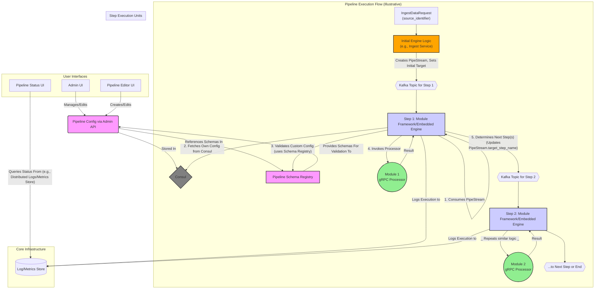

## 1. Summary

YAPPY (Yet Another Pipeline Processor) is a highly flexible and scalable platform for building, managing, and executing dynamic data processing pipelines. It leverages a microservices architecture where **each pipeline step, supported by an underlying framework or embedded engine logic, dynamically fetches its configuration and determines onward routing.** Communication primarily utilizes gRPC for synchronous processing within a step and Kafka for asynchronous handoff between steps, ensuring decoupling and resilience. Consul serves as the dynamic configuration store and service discovery mechanism, with a Schema Registry guaranteeing data and configuration integrity. YAPPY empowers users to define complex workflows for diverse applications like data science and search indexing by allowing custom processing modules to be easily integrated. The system's design for live configuration updates facilitates agile pipeline evolution and A/B testing without requiring full service redeployments.

## 2. Overview of Components

The YAPPY ecosystem comprises several key components that interact to provide a robust and decentralized pipeline processing environment. Each Pipeline Module operates with an awareness of its role and the next steps, guided by the shared Pipeline Configuration and its own embedded engine logic or supporting framework.

| Component                             | Description                                                                                                                                                                                                                            | Key Interactions                                                                                                                                                                                                                                                           |
| :------------------------------------ | :------------------------------------------------------------------------------------------------------------------------------------------------------------------------------------------------------------------------------------- | :------------------------------------------------------------------------------------------------------------------------------------------------------------------------------------------------------------------------------------------------------------------------- |
| **Pipeline Config** | Defines the structure and behavior of all pipelines (`PipelineClusterConfig`, `PipelineConfig`, `PipelineStepConfig`). Stored as JSON/YAML in Consul. Source of truth for all steps.                                                       | Read by each Pipeline Module's Framework/Embedded Engine; Managed via Admin API (by Admin/Editor UIs); References schemas in Pipeline Schema Registry.                                                                                                                          |
| **Pipeline Schema Registry** | Stores and versions JSON Schemas (e.g., using Apicurio Registry or the provided `SchemaRegistryService.proto`). These schemas validate the `custom_json_config` for each `PipelineStepConfig`.                                                | Provides schemas to Admin API/UI for pre-validation and to each Pipeline Module's Framework/Embedded Engine for runtime validation; Schemas are registered/managed. Referenced by Pipeline Config.                                                                      |
| **Pipeline Module (Processor)** | The core business logic for a specific task in a pipeline (e.g., text extraction, data transformation). Implemented as a gRPC service (conforming to `PipeStepProcessor.proto`) or as logic within a Kafka consumer.                     | Invoked by its associated Module Framework/Embedded Engine with `PipeStream` data (specifically `PipeDoc`, `Blob`) and validated `ProcessConfiguration` (custom config + params). Returns processing result.                                                                  |
| **Module Framework/Embedded Engine** | Logic co-located or associated with each Pipeline Module instance/deployment. Responsible for consuming a `PipeStream` (e.g., from Kafka), fetching its `PipelineStepConfig` from Consul, validating its custom config, invoking the actual Module Processor, and then routing the `PipeStream` to the next step(s) (e.g., by publishing to the next Kafka topic) based on the current step's configuration (`nextSteps`, `errorSteps`). This is the "engine-per-step" concept. | Consumes `PipeStream` from Kafka/previous step; Fetches its `PipelineStepConfig` from Consul (via `DynamicConfigurationManager`); Uses Schema Registry for `custom_json_config` validation; Calls its Pipeline Module Processor; Publishes updated `PipeStream` to Kafka for next step. |
| **Admin UI** | A web interface for administrators to manage `PipelineClusterConfig` (pipeline definitions) and JSON schemas, interacting via an Admin API.                                                                                              | Interacts with Admin API to CRUD pipeline configurations in Consul and schemas in the Pipeline Schema Registry.                                                                                                                                                              |
| **Pipeline Editor UI** | A (potentially graph-based) web interface for users to design, create, and modify pipeline configurations.                                                                                                                             | Interacts with Admin API to save/update pipeline configurations in Consul. May visualize pipeline graphs.                                                                                                                                                             |
| **Pipeline Status UI** | A web interface to monitor the status, progress, history (`StepExecutionRecord`), and errors (`ErrorData`) of pipeline executions by querying a centralized log/metrics store.                                                              | Queries pipeline execution status and history from a Log/Metrics Store where each Module Framework/Embedded Engine reports its activity.                                                                                                                                     |
| **Initial Engine Logic / Ingest Service** | A service (e.g., implementing `PipeStreamEngine.IngestDataAsync` from `engine_service.proto`) that accepts initial data, creates the `PipeStream`, assigns a `stream_id`, sets the `source_identifier`, `initial_context_params`, and `target_step_name` for the first step in the designated pipeline, and publishes it to the appropriate Kafka topic to kick off the flow. | Receives external data; Creates initial `PipeStream`; Publishes to the first step's Kafka topic.                                                                                                                                                            |
| **Consul** | Service discovery and distributed Key-Value store for `PipelineClusterConfig` and runtime parameters.                                                                                                                                    | Stores `PipelineClusterConfig`; Provides service addresses for gRPC modules; Read by all Module Frameworks/Embedded Engines for configuration.                                                                                                                                 |
| **Kafka** | Acts as the primary message bus for `PipeStream` objects, decoupling pipeline steps and providing resilience.                                                                                                                              | `PipeStream` messages are published to topics corresponding to target steps; Consumed by the Module Framework/Embedded Engine of the respective step.                                                                                                                     |

## 3. Example Usage of Pipeline

YAPPY's decentralized engine logic within each step allows for robust and scalable pipeline execution.

### 3.1. Data Science Model Training & Feature Engineering Pipeline

**Goal:** To ingest raw data, preprocess it, engineer features, train a machine learning model, and manage model artifacts. Each step operates with its own engine logic to fetch configuration and route data.

```mermaid
graph LR
    A["Data Ingestion Source <br/> (e.g., S3, DB, API)"] --> IEL["Initial Engine Logic <br/> IngestDataRequest"]
    IEL -->|"PipeStream to Kafka_P1S1_In"| K_P1S1_In{{"Kafka: P1_S1_ValidateData_In"}}

    K_P1S1_In --> S1_FW{"Step 1 FW/Engine <br/> ValidateData"}
    S1_FW -->|"Fetch Config"| ConsulDb[("Consul: PipelineConfig")]
    S1_FW -->|"Invoke"| M1_Val["Validator Module <br/> (gRPC)"]
    M1_Val -->|"Result"| S1_FW
    S1_FW -- "Success" --> K_P1S2_In{{"Kafka: P1_S2_CleanData_In"}}
    S1_FW -- "Failure" --> K_Err{{"Kafka: P1_Error_Topic"}}

    K_P1S2_In --> S2_FW{"Step 2 FW/Engine <br/> Clean & Preprocess"}
    S2_FW -->|"Fetch Config"| ConsulDb
    S2_FW -->|"Invoke"| M2_Clean["DataCleaner Module <br/> (gRPC/Kafka) <br/> Config: rules.json"]
    M2_Clean -->|"Result"| S2_FW
    S2_FW -->|"PipeStream to Kafka_P1S3_In"| K_P1S3_In{{"Kafka: P1_S3_FeatureEng_In"}}

    K_P1S3_In --> S3_FW{"Step 3 FW/Engine <br/> FeatureEngineer"}
    S3_FW -->|"Fetch Config"| ConsulDb
    S3_FW -->|"Invoke"| M3_Feat["FeatureEngineering Module <br/> (gRPC/Kafka) <br/> Config: feature_spec.json"]
    M3_Feat -->|"Result"| S3_FW
    S3_FW -->|"PipeStream to Kafka_P1S4_In"| K_P1S4_In{{"Kafka: P1_S4_TrainModel_In"}}

    K_P1S4_In --> S4_FW{"Step 4 FW/Engine <br/> TrainModel"}
    S4_FW -->|"Fetch Config"| ConsulDb
    S4_FW -->|"Invoke"| M4_Train["ModelTrainer Module <br/> (gRPC) <br/> Config: model_params.json"]
    M4_Train -->|"Result"| S4_FW
    S4_FW -->|"PipeStream to Kafka_P1S5_In"| K_P1S5_In{{"Kafka: P1_S5_StoreModel_In"}}

    K_P1S5_In --> S5_FW{"Step 5 FW/Engine <br/> StoreModel & Metrics"}
    S5_FW -->|"Fetch Config"| ConsulDb
    S5_FW -->|"Invoke"| M5_Store["ArtifactStorage Module <br/> (gRPC) <br/> Config: storage_path"]
    M5_Store -->|"Result"| S5_FW
    S5_FW -->|"End of P1"| EndP1(("Pipeline P1 End"))

    subgraph "Data Science Pipeline (P1)"
        direction LR
        S1_FW; M1_Val;
        S2_FW; M2_Clean;
        S3_FW; M3_Feat;
        S4_FW; M4_Train;
        S5_FW; M5_Store;
    end

    style IEL fill:#orange,stroke:#333,stroke-width:2px
    style S1_FW fill:#ccf,stroke:#333,stroke-width:2px
    style S2_FW fill:#ccf,stroke:#333,stroke-width:2px
    style S3_FW fill:#ccf,stroke:#333,stroke-width:2px
    style S4_FW fill:#ccf,stroke:#333,stroke-width:2px
    style S5_FW fill:#ccf,stroke:#333,stroke-width:2px
```

**Description:**

1.  **Data Ingestion & Kick-off:** An external connector or service sends an `IngestDataRequest` (as per `engine_service.proto`) to an **Initial Engine Logic** (e.g., a dedicated Ingest Service). This logic creates a `PipeStream`, populates it with the initial `PipeDoc`, `source_identifier`, `context_params`, `stream_id`, `current_pipeline_name` (e.g., "DataSciencePipeline-P1"), and `target_step_name` (e.g., "P1_S1_ValidateData"). It then publishes this `PipeStream` to the Kafka topic designated for "P1_S1_ValidateData_In".
2.  **Step 1: ValidateData (S1_FW & M1_Val):**
    * The **Step 1 Framework/Embedded Engine (S1_FW)** consumes the `PipeStream` from `Kafka: P1_S1_ValidateData_In`.
    * It uses `PipeStream.target_step_name` ("P1_S1_ValidateData") and `current_pipeline_name` ("DataSciencePipeline-P1") to fetch its specific `PipelineStepConfig` from Consul (via `DynamicConfigurationManager`). This config includes the `pipelineImplementationId` for the Validator Module, its `custom_json_config` (e.g., validation rules), and `config_params`, along with `nextSteps` and `errorSteps`.
    * S1_FW validates the `custom_json_config` against its schema from the Pipeline Schema Registry.
    * S1_FW constructs the `ProcessRequest` (as per `pipe_step_processor.proto`) and invokes the **Validator Module (M1_Val)** (a gRPC service).
    * Upon receiving the `ProcessResponse` from M1_Val, S1_FW updates the `PipeStream` (e.g., adds to history, updates `PipeDoc` if changed).
    * Based on `ProcessResponse.success` and its `PipelineStepConfig`, S1_FW determines the next target (e.g., "P1_S2_CleanData" if success). It updates `PipeStream.target_step_name` and publishes the `PipeStream` to `Kafka: P1_S2_CleanData_In`. If failed, it routes to `Kafka: P1_Error_Topic`.
3.  **Subsequent Steps (S2_FW, S3_FW, etc.):** Each subsequent step (DataCleaner, FeatureEngineer, ModelTrainer, ArtifactStorage) follows a similar pattern:
    * Its dedicated **Module Framework/Embedded Engine (Sx_FW)** consumes the `PipeStream` from its input Kafka topic.
    * It fetches its own configuration from Consul.
    * It validates its custom config.
    * It invokes its associated **Module Processor (Mx)**.
    * It updates the `PipeStream` and routes it to the Kafka topic of the next designated step.
4.  **Data Structures:** The `PipeDoc` within the `PipeStream` evolves, potentially storing cleaned data in `body`, engineered features in `custom_data` or `semantic_results`, and model artifacts as `Blob` or URIs.
5.  **UIs:**
    * **Pipeline Editor UI:** Defines "DataSciencePipeline-P1", its steps, the `pipelineImplementationId` for each, their respective `custom_json_config` (and its schema reference), and the `nextSteps`/`errorSteps` (which implicitly define the Kafka topics, e.g., by a convention like `<pipelineName>_<stepName>_In`).
    * **Pipeline Status UI:** Collects `StepExecutionRecord`s and `ErrorData` logged by each Sx_FW to a central Log/Metrics Store, providing a consolidated view of the distributed execution.
    * **Admin UI:** Manages schemas for `custom_json_config` of each module type.

### 3.2. Search Engine Indexing Pipeline

**Goal:** To ingest documents, process them for search (text extraction, chunking, embedding), and load them into a search index, with each step autonomously managing its execution and handoff.

```mermaid
graph LR
    A["Document Source <br/> (e.g., Web Crawl, S3)"] --> IEL["Initial Engine Logic <br/> IngestDataRequest"]
    IEL -->|"PipeStream to Kafka_P2S1_In"| K_P2S1_In{{"Kafka: P2_S1_FetchContent_In"}}

    K_P2S1_In --> S1_FW{"Step 1 FW/Engine <br/> FetchContent"}
    S1_FW -->|"Fetch Config"| ConsulDb[("Consul: PipelineConfig")]
    S1_FW -->|"Invoke"| M1_Fetch["ContentFetcher Module <br/> (gRPC)"]
    M1_Fetch -->|"Result"| S1_FW
    S1_FW -->|"PipeStream to Kafka_P2S2_In"| K_P2S2_In{{"Kafka: P2_S2_ExtractText_In"}}

    K_P2S2_In --> S2_FW{"Step 2 FW/Engine <br/> ExtractText"}
    S2_FW -->|"Fetch Config"| ConsulDb
    S2_FW -->|"Invoke"| M2_Extract["TextExtractor Module <br/> (gRPC)"]
    M2_Extract -->|"Result"| S2_FW
    S2_FW -->|"PipeStream to Kafka_P2S3_In"| K_P2S3_In{{"Kafka: P2_S3_ChunkText_In"}}

    K_P2S3_In --> S3_FW{"Step 3 FW/Engine <br/> ChunkText"}
    S3_FW -->|"Fetch Config"| ConsulDb
    S3_FW -->|"Invoke"| M3_Chunk["TextChunker Module <br/> (gRPC) <br/> Config: chunk_config_id"]
    M3_Chunk -->|"Result (PipeDoc with SemanticProcessingResult)"| S3_FW
    S3_FW -->|"PipeStream to Kafka_P2S4_In"| K_P2S4_In{{"Kafka: P2_S4_GenEmbed_In"}}

    K_P2S4_In --> S4_FW{"Step 4 FW/Engine <br/> GenerateEmbeddings"}
    S4_FW -->|"Fetch Config"| ConsulDb
    S4_FW -->|"Invoke"| M4_Embed["EmbeddingGenerator Module <br/> (gRPC) <br/> Config: embedding_config_id"]
    M4_Embed -->|"Result (PipeDoc with ChunkEmbeddings)"| S4_FW
    S4_FW -->|"PipeStream to Kafka_P2S5_In"| K_P2S5_In{{"Kafka: P2_S5_IndexDoc_In"}}

    K_P2S5_In --> S5_FW{"Step 5 FW/Engine <br/> IndexDocument"}
    S5_FW -->|"Fetch Config"| ConsulDb
    S5_FW -->|"Invoke"| M5_Index["SearchIndexer Module <br/> (gRPC/Kafka)"]
    M5_Index -->|"Result"| S5_FW
    S5_FW -->|"End of P2"| EndP2(("Pipeline P2 End"))

    subgraph "Search Indexing Pipeline (P2)"
        direction LR
        S1_FW; M1_Fetch;
        S2_FW; M2_Extract;
        S3_FW; M3_Chunk;
        S4_FW; M4_Embed;
        S5_FW; M5_Index;
    end

    style IEL fill:#orange,stroke:#333,stroke-width:2px
    style S1_FW fill:#ccf,stroke:#333,stroke-width:2px
    style S2_FW fill:#ccf,stroke:#333,stroke-width:2px
    style S3_FW fill:#ccf,stroke:#333,stroke-width:2px
    style S4_FW fill:#ccf,stroke:#333,stroke-width:2px
    style S5_FW fill:#ccf,stroke:#333,stroke-width:2px
```

**Description:**

1.  **Document Ingestion & Kick-off:** Similar to the data science use case, an **Initial Engine Logic** receives an `IngestDataRequest`. It creates a `PipeStream` for "SearchIndexingPipeline-P2", sets the initial `target_step_name` to "P2_S1_FetchContent", and publishes it to `Kafka: P2_S1_FetchContent_In`. The `PipeDoc` might initially contain `source_uri`.
2.  **Step Execution (General Pattern for S1-S5):** Each step (`WorkspaceContent`, `ExtractText`, `ChunkText`, `GenerateEmbeddings`, `IndexDocument`) operates via its **Module Framework/Embedded Engine (Sx_FW)** and associated **Module Processor (Mx)**:
    * Sx_FW consumes the `PipeStream` from its designated input Kafka topic (e.g., `Kafka: P2_Sx_Action_In`).
    * It fetches its `PipelineStepConfig` from Consul, which defines the `custom_json_config` (e.g., `chunk_config_id` for the Chunker, `embedding_config_id` for the Embedding Generator), `pipelineImplementationId`, `nextSteps`, and `errorSteps`.
    * The `custom_json_config` is validated using schemas from the Pipeline Schema Registry.
    * Sx_FW invokes its gRPC Module Processor (Mx) with the `PipeStream` data and derived `ProcessConfiguration`.
    * **Data Transformation (`yappy_core_types.proto` in action):**
        * `WorkspaceContent (M1_Fetch)`: Populates `PipeDoc.blob` and `PipeDoc.source_mime_type`.
        * `ExtractText (M2_Extract)`: Populates `PipeDoc.body` from `PipeDoc.blob`.
        * `ChunkText (M3_Chunk)`: Populates `PipeDoc.semantic_results` with a `SemanticProcessingResult` containing `SemanticChunk`s based on `chunk_config_id`.
        * `GenerateEmbeddings (M4_Embed)`: Adds `Embedding` vectors to each `ChunkEmbedding` within the `SemanticChunk`s, using `embedding_config_id`. It also updates `SemanticProcessingResult.result_set_name`.
        * `IndexDocument (M5_Index)`: Sends the enriched `PipeDoc` to a search engine.
    * Sx_FW updates the `PipeStream`'s history and `target_step_name` according to its config and the processor's success/failure, then publishes to the next Kafka topic (e.g., `Kafka: P2_S(x+1)_Action_In`).
3.  **Decentralized Orchestration:** The pipeline progresses as each step's framework autonomously consumes from its input topic, processes, and routes to the next, all driven by the centrally managed `PipelineConfig` in Consul.
4.  **UIs:**
    * **Pipeline Editor UI:** Configures "SearchIndexingPipeline-P2", defining for each step its module, custom JSON config (like `chunk_config_id`, `embedding_config_id`), schema references, and the sequence of Kafka topics that link the steps.
    * **Pipeline Status UI:** Provides an overview of document processing by aggregating logs and metrics from each Module Framework/Embedded Engine.
    * **Admin UI:** Manages the JSON Schemas that define valid configurations for modules like the Chunker and Embedding Generator.

This decentralized engine model emphasizes the role of Kafka as the backbone for inter-step communication and relies on each step's framework to correctly interpret its role and route the `PipeStream` based on the dynamic configuration fetched from Consul.
