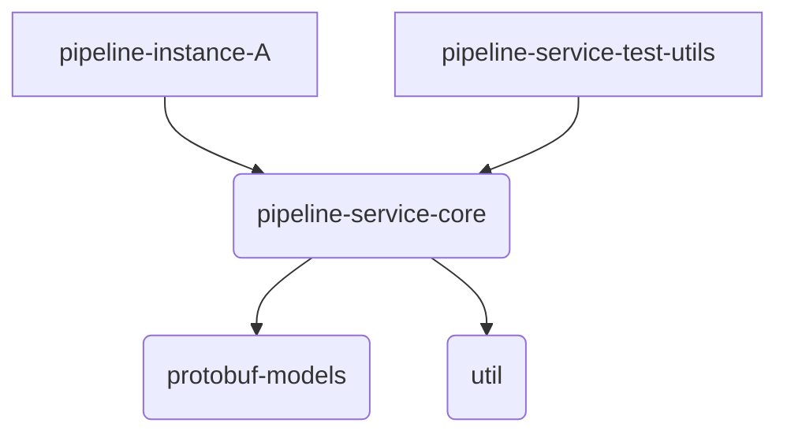
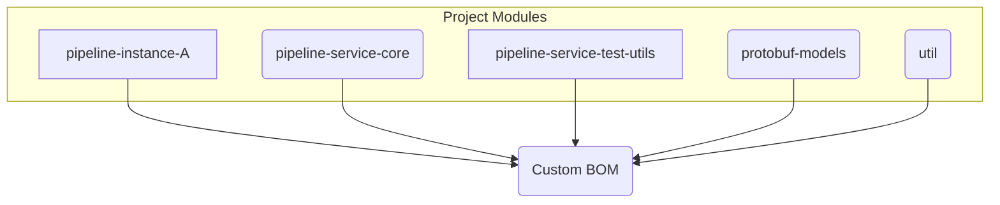

# Taming Dependencies: A Step-by-Step Guide to Building a Custom Micronaut BOM with Gradle Kotlin DSL

This repository contains the output of the end of this tutorial. It's open and used to demonstrate how one can build a multi-module 
build for containers in a single repository using the Micronaut framework.

Managing dependencies and ensuring build consistency across multiple projects can be a significant challenge, especially as systems grow in complexity. This tutorial provides a step-by-step guide to establishing a robust multi-project build structure using **Gradle with the Kotlin DSL** (even if your projects use **Java**), targeting **JDK 21**.

**What We're Building:**

Imagine a system designed for processing data pipelines. This system consists of several parts:

* **Shared Libraries:** A core library containing the main pipeline logic (`pipeline-service-core`), data models defined using Protocol Buffers (`protobuf-models`), and common helper functions (`util`).
* **Testing Utilities:** A dedicated library (`pipeline-service-test-utils`) to assist in testing the pipeline components.
* **Microservices:** Specific implementations of pipelines as runnable Micronaut applications (e.g., `pipeline-instance-A`).

**The Goal:**

Our goal is to manage this system effectively within a single repository (monorepo) using Gradle. We'll focus on:

1.  **Centralized Dependency Management:** Creating a custom Bill of Materials (BOM) and using Gradle's version catalog (`libs.versions.toml`) to ensure all modules use consistent library versions.
2.  **Consistent Build Environment:** Using Gradle Kotlin DSL and configuring for JDK 21.
3.  **Modular Structure:** Defining clear dependencies between the different project modules.
4.  **Efficient CI/CD:** Discussing strategies to build and deploy only the parts of the system that have changed.

**Project Dependency Overview:**

The following diagrams illustrate the relationships between the different project modules we'll be configuring.

*High-Level Module Dependencies:*



*Dependency on the Custom BOM:*



This tutorial will guide you through setting up this structure step-by-step, providing CLI commands and code examples along the way.

**Prerequisites:**

* Linux or macOS environment with a Bash-compatible shell.
* JDK 21 installed and configured (e.g., `JAVA_HOME` environment variable set).
* Git installed.
* Docker installed (optional, for containerization steps).

Let's begin!

## Step 1: Initial Project Setup (CLI)

First, create the directory structure for your monorepo and initialize the Gradle wrapper. The wrapper ensures a consistent Gradle version is used for the build.

1.  **Create Project Directories:**
    ```bash
    # Create the root directory
    mkdir micronaut-multiproject-example
    cd micronaut-multiproject-example

    # Create subproject directories
    mkdir bom protobuf-models pipeline-service-core pipeline-service-test-utils pipeline-instance-A util

    # Create the gradle directory for the version catalog
    mkdir gradle
    # create an empty grade settings fine, this will allow the gradle wrapper to run
    touch settings.gradle.kts
    ```

2.  **Initialize Gradle Wrapper:** Run this command in the root (`your-monorepo`) directory. We'll use Gradle 8.7 (or a later version known to be compatible with JDK 21 and Micronaut 4.8+). Check the [Gradle Compatibility Matrix](https://docs.gradle.org/current/userguide/compatibility.html) for the latest recommendations.
    ```bash
    # Ensure you have a system Gradle installed to run this, OR download manually
    # If you don't have gradle installed, you can manually create the gradlew files
    # See: [https://docs.gradle.org/current/userguide/gradle_wrapper.html#sec:adding_wrapper](https://docs.gradle.org/current/userguide/gradle_wrapper.html#sec:adding_wrapper)
    gradle wrapper --gradle-version 8.13
    ```
    This creates `gradlew`, `gradlew.bat`, and the `gradle/wrapper` directory. From now on, use `./gradlew` to run Gradle tasks.

3.  **Initialize Git (Recommended):**
    ```bash
    git init
    # Create a .gitignore file (add .gradle/, build/, .idea/, *.iml etc.)
    echo ".gradle/" >> .gitignore
    echo "build/" >> .gitignore
    echo ".idea/" >> .gitignore
    echo "*.iml" >> .gitignore
    echo "out/" >> .gitignore
    git add .
    git commit -m "Initial project structure and Gradle wrapper"
    ```

## Step 2: Configure Project Settings (`settings.gradle.kts`)

This file defines which subprojects are included in the build and configures plugin/dependency resolution.

1.  **Create/Edit `settings.gradle.kts`:** In the root directory (`your-monorepo`), create the file `settings.gradle.kts` with the following content:

    ```kotlin
    // settings.gradle.kts
    pluginManagement {
        repositories {
            gradlePluginPortal()
            mavenCentral()
        }
        // Apply Micronaut Platform Catalog plugin here for centralized Micronaut dependency management
        // This plugin makes Micronaut's managed dependencies available via the 'mn' accessor
        plugins {
            id("io.micronaut.platform.catalog") version "4.8.1" // Use latest compatible version [1]
        }
    }

    dependencyResolutionManagement {
        repositories {
            mavenCentral() // Repositories for project dependencies
        }
        // Enable the version catalog feature
        versionCatalogs {
            // Gradle automatically looks for libs.versions.toml in gradle/ [2]
            // The Micronaut catalog plugin provides the 'mn' catalog [3]
        }
    }

    rootProject.name = "my-pipeline-system"

    // Include all the subprojects
    include(
        "bom",
        "protobuf-models",
        "pipeline-service-core",
        "pipeline-service-test-utils",
        "pipeline-instance-A",
        "util"
    )
    // Add more pipeline instances or other modules as needed
    // include("pipeline-instance-B")
    ```

2.  **Explanation:**
    * `pluginManagement`: Configures where to find Gradle plugins and applies the crucial `io.micronaut.platform.catalog` plugin, which provides the `mn` accessor for Micronaut dependencies.[1, 3, 5]
    * `dependencyResolutionManagement`: Configures repositories for dependencies and enables the version catalog feature.[2]
    * `rootProject.name`: Sets the build name.[4]
    * `include(...)`: Specifies the subproject directories.[4]

## Step 3: Configure Root Build File (`build.gradle.kts`)

The root build file is often minimal.

1.  **Create/Edit `build.gradle.kts`:** In the root directory, create `build.gradle.kts`:

    ```kotlin
    // build.gradle.kts (Root project)
    plugins {
        // Apply base plugin for common tasks like 'clean' available in all projects
        base
    }

    // Define project-wide properties if needed, e.g., group or version
    // Often, version is managed in gradle.properties or by a release plugin
    group = "com.yourcompany.pipeline"
    version = "1.0.0-SNAPSHOT"

    // Common configurations can be placed here, but often better handled
    // via convention plugins or within specific subprojects.
    ```

## Step 4: Configure Version Catalog (`gradle/libs.versions.toml`)

This file centralizes dependency versions and aliases.

1.  **Create `gradle/libs.versions.toml`:** Inside the `gradle` directory, create `libs.versions.toml`:

    ```toml
    # gradle/libs.versions.toml

    [versions]
    # Micronaut Platform - Drives Micronaut plugin versions and the 'mn' catalog version
    micronautPlatform = "4.8.1" # Released Apr 15, 2025 [1, 3]

    # Build Plugins
    kotlin = "1.9.25" # Check Micronaut release notes for recommended Kotlin version [9, 16]
    gradleProtobufPlugin = "0.9.5" # Released Mar 31, 2025
    gradleReleasePlugin = "3.1.0" # Released Dec 23, 2024

    # Core Dependencies (Check gRPC/Protobuf compatibility)
    protobuf = "4.30.2" # Released Mar 26, 2025 (Protobuf Java Runtime)
    grpc = "1.72.0" # Released Apr 15, 2025 (gRPC Java)

    # Testing
    junit = "5.12.2" # Released Apr 11, 2025

    # Utilities & Logging
    slf4j = "2.0.13" # Released Apr 1, 2025
    jackson = "2.18.3" # Released Mar 1, 2025 (Non-Micronaut Jackson)
    guava = "33.4.8-jre" # Released Apr 14, 2025

    [libraries]
    # Kotlin (Only needed if using Kotlin in some modules)
    # kotlin-stdlib = { module = "org.jetbrains.kotlin:kotlin-stdlib-jdk8", version.ref = "kotlin" }
    # kotlin-reflect = { module = "org.jetbrains.kotlin:kotlin-reflect", version.ref = "kotlin" }

    # Protobuf / gRPC (Versions managed by [versions] block)
    protobuf-java = { module = "com.google.protobuf:protobuf-java", version.ref = "protobuf" }
    # protobuf-kotlin = { module = "com.google.protobuf:protobuf-kotlin", version.ref = "protobuf" } # If using Kotlin protos
    grpc-stub = { module = "io.grpc:grpc-stub", version.ref = "grpc" }
    grpc-protobuf = { module = "io.grpc:grpc-protobuf", version.ref = "grpc" }
    grpc-protocGen = { module = "io.grpc:protoc-gen-grpc-java", version.ref = "grpc" } # The protoc plugin artifact [Added]

    # Testing
    junit-jupiter-api = { module = "org.junit.jupiter:junit-jupiter-api", version.ref = "junit" }
    junit-jupiter-engine = { module = "org.junit.jupiter:junit-jupiter-engine", version.ref = "junit" }

    # Utilities
    slf4j-api = { module = "org.slf4j:slf4j-api", version.ref = "slf4j" }
    slf4j-simple = { module = "org.slf4j:slf4j-simple", version.ref = "slf4j" } # Example implementation
    jackson-databind = { module = "com.fasterxml.jackson.core:jackson-databind", version.ref = "jackson" } # Non-Micronaut Jackson
    guava = { module = "com.google.guava:guava", version.ref = "guava" }

    [bundles]
    testing-jvm = ["junit-jupiter-api", "junit-jupiter-engine"]

    [plugins]
    # Kotlin Plugins (Only needed if using Kotlin)
    # kotlin-jvm = { id = "org.jetbrains.kotlin.jvm", version.ref = "kotlin" }
    # kotlin-kapt = { id = "org.jetbrains.kotlin.kapt", version.ref = "kotlin" }

    # Micronaut Plugins (Version driven by micronautPlatform)
    micronaut-application = { id = "io.micronaut.application", version.ref = "micronautPlatform" }
    micronaut-library = { id = "io.micronaut.library", version.ref = "micronautPlatform" }

    # Other Plugins
    protobuf = { id = "com.google.protobuf", version.ref = "gradleProtobufPlugin" }
    release = { id = "net.researchgate.release", version.ref = "gradleReleasePlugin" }
    # java-platform defined in bom/build.gradle.kts directly
    ```

2.  **Explanation:** This file defines versions, library aliases (like `protobuf-java`), bundles (`testing-jvm`), and plugin aliases (`micronaut-application`). Micronaut libraries are accessed via the `mn` catalog provided by the plugin in `settings.gradle.kts`.

## Step 5: Create the Custom BOM Project (`bom`)

This project defines and publishes your custom Bill of Materials.

1.  **Create `bom/build.gradle.kts`:**

    ```kotlin
    // bom/build.gradle.kts
    plugins {
        `java-platform` // Core plugin for creating the BOM [21, 22]
        `maven-publish` // Needed to publish the BOM
        // alias(libs.plugins.release) // Optional: If versioning/releasing the BOM itself [24]
    }

    // Inherit group and version from root project (or manage independently)
    group = rootProject.group
    version = rootProject.version

    javaPlatform {
        // allowDependencies() // Enable if direct dependencies needed (rare for BOM) [21, 23]
    }

    dependencies {
        constraints {
            // --- Micronaut Dependencies ---
            // Import the Micronaut Platform BOM using the 'mn' catalog accessor.
            // 'api' scope ensures these constraints apply transitively to consumers of this BOM.
            api(platform(mn.micronaut.platform)) // [3, 18, 25]

            // --- Non-Micronaut Project Dependencies (using aliases from libs.versions.toml) ---
            api(libs.protobuf.java)
            // api(libs.protobuf.kotlin) // If used
            api(libs.grpc.stub)       // If used
            api(libs.grpc.protobuf)   // If used
            api(libs.guava)
            api(libs.jackson.databind) // Non-Micronaut Jackson

            // --- Testing Dependencies ---
            api(libs.bundles.testing.jvm) // Constrain JUnit versions via bundle

            // --- Other Third-Party Dependencies ---
            api(libs.slf4j.api)

            // --- Constraints for your own modules (if published separately) ---
            // Example for unified versioning (constraining to the BOM's version):
            api("${rootProject.group}:protobuf-models:${rootProject.version}")
            api("${rootProject.group}:util:${rootProject.version}")
            // Add constraints for other internal libraries like core, test-utils if they are published
        }
    }

    // Configure Publishing
    publishing {
        publications {
            create<MavenPublication>("mavenJavaPlatform") {
                from(components["javaPlatform"]) // Publish the platform component [23]
                // Use group and version from the project
                groupId = project.group.toString()
                artifactId = project.name // Artifact ID will be 'bom'
                version = project.version.toString()

                pom {
                    name.set("My Pipeline System BOM")
                    description.set("Bill of Materials for My Pipeline System components")
                    // Add license, developer info, etc.
                }
            }
        }
        repositories {
            mavenLocal() // Publish to local Maven repo (~/.m2/repository)
            // maven { url = uri("...") credentials { ... } } // Remote repo config
        }
    }
    ```

2.  **Explanation:**
    * Applies `java-platform` and `maven-publish`.
    * The `dependencies.constraints` block defines the recommended versions, crucially importing `platform(mn.micronaut.platform)` and adding constraints for your other common dependencies using `api(libs...)`.
    * The `publishing` block configures how to publish the BOM (initially to Maven Local).

3.  **Build & Publish BOM Locally (CLI):**
    ```bash
    ./gradlew :bom:publishToMavenLocal
    ```
    This makes the BOM available for other local projects.

## Step 6: Configure Subprojects

Now, configure each subproject to use the BOM.

### 6a. Protobuf Models (`protobuf-models`)

1.  **Create `.proto` files:** Add your `.proto` definition files in `protobuf-models/src/main/proto/`. For example, `pipeline_model.proto`.
2.  **Create `protobuf-models/build.gradle.kts`:**

    ```kotlin
    // protobuf-models/build.gradle.kts
    import com.google.protobuf.gradle.*

    plugins {
        `java-library` // Using Java for helper code
        alias(libs.plugins.protobuf) // Apply protobuf plugin
    }

    group = rootProject.group
    version = rootProject.version

    repositories {
        mavenCentral()
    }

    java {
        toolchain {
            languageVersion.set(JavaLanguageVersion.of(21))
        }
    }

    dependencies {
        implementation(platform(project(":bom"))) // Import custom BOM
        testImplementation(platform(project(":bom")))

        implementation(libs.protobuf.java) // Protobuf runtime
        // implementation(libs.grpc.stub) // If using gRPC
        implementation(libs.guava) // Example utility

        testImplementation(libs.bundles.testing.jvm)
    }

    protobuf {
        protoc { artifact = "com.google.protobuf:protoc:${libs.versions.protobuf.get()}" }
        generateProtoTasks {
            all().forEach { task ->
                task.builtins { create("java") { /* options */ } }
                // Configure gRPC Java generation if needed
                // task.plugins { create("grpc") { artifact = libs.grpc.protocGen.get().toString() } }
                task.outputs.upToDateWhen { false } // Ensure regeneration on proto changes
            }
        }
    }

    sourceSets.main {
        java { srcDirs(layout.buildDirectory.dir("generated/source/proto/main/java")) }
        // Add grpc dir if needed: srcDirs(layout.buildDirectory.dir("generated/source/proto/main/grpc"))
    }

    // Publishing configuration (if this library is published)
    // publishing { ... }
    ```
3.  **Build (CLI):**
    ```bash
    ./gradlew :protobuf-models:build
    ```

### 6b. Utility Library (`util`)

1.  **Add Java code:** Place your utility Java classes in `util/src/main/java/`.
2.  **Create `util/build.gradle.kts`:**

    ```kotlin
    // util/build.gradle.kts
    plugins {
        `java-library` // Standard Java library
    }

    group = rootProject.group
    version = rootProject.version

    repositories {
        mavenCentral()
    }

    java {
        toolchain {
            languageVersion.set(JavaLanguageVersion.of(21))
        }
    }

    dependencies {
        implementation(platform(project(":bom"))) // Import custom BOM
        testImplementation(platform(project(":bom")))

        api(libs.guava) // Expose Guava via API (example)

        testImplementation(libs.bundles.testing.jvm)
    }

    // Publishing configuration (if this library is published)
    // publishing { ... }
    ```
3.  **Build (CLI):**
    ```bash
    ./gradlew :util:build
    ```

### 6c. Core Library (`pipeline-service-core`)

1.  **Add Java code:** Place core service logic in `pipeline-service-core/src/main/java/`.
2.  **Create `pipeline-service-core/build.gradle.kts`:**

    ```kotlin
    // pipeline-service-core/build.gradle.kts
    plugins {
        `java-library` // It's a Java library
        alias(libs.plugins.micronaut.library) // Apply Micronaut library plugin
    }

    group = rootProject.group
    version = rootProject.version

    repositories {
        mavenCentral()
    }

    java {
        toolchain {
            languageVersion.set(JavaLanguageVersion.of(21))
        }
    }

    micronaut { // Configure Micronaut specifics if needed
        processing {
            incremental(true)
            annotations("com.yourcompany.pipeline.core.*") // Adjust package
        }
    }

    dependencies {
        implementation(platform(project(":bom"))) // Import BOM
        annotationProcessor(platform(project(":bom"))) // For annotation processing
        testImplementation(platform(project(":bom")))
        testAnnotationProcessor(platform(project(":bom")))

        // Micronaut dependencies (using 'mn' catalog)
        annotationProcessor(mn.micronaut.inject.java)
        implementation(mn.micronaut.inject)
        implementation(mn.micronaut.runtime)

        // Project dependencies
        api(project(":protobuf-models")) // Expose protos
        api(project(":util")) // Expose utils

        // Other dependencies
        implementation(libs.slf4j.api)

        // Testing
        testImplementation(libs.bundles.testing.jvm)
        testImplementation(mn.micronaut.test.junit5)
        testAnnotationProcessor(mn.micronaut.inject.java)
    }

    // Publishing configuration (if this library is published)
    // publishing { ... }
    ```
3.  **Build (CLI):**
    ```bash
    ./gradlew :pipeline-service-core:build
    ```

### 6d. Test Utilities (`pipeline-service-test-utils`)

1.  **Add Java code:** Place test helper classes in `pipeline-service-test-utils/src/main/java/`.
2.  **Create `pipeline-service-test-utils/build.gradle.kts`:**

    ```kotlin
    // pipeline-service-test-utils/build.gradle.kts
    plugins {
        `java-library`
    }

    group = rootProject.group
    version = rootProject.version

    repositories {
        mavenCentral()
    }

    java {
        toolchain {
            languageVersion.set(JavaLanguageVersion.of(21))
        }
    }

    dependencies {
        implementation(platform(project(":bom")))
        // This module likely won't have tests itself, but depends on testing libs
        // and the core module to provide utilities FOR testing the core module.

        // Depend on core library
        api(project(":pipeline-service-core"))

        // Include testing libraries needed by the utilities
        api(libs.bundles.testing.jvm)
        api(mn.micronaut.test.junit5) // Expose Micronaut test support

        // May depend on other utils
        api(project(":util"))
    }

    // Publishing configuration (if this library is published)
    // publishing { ... }
    ```
3.  **Build (CLI):**
    ```bash
    ./gradlew :pipeline-service-test-utils:build
    ```

### 6e. Micronaut Application (`pipeline-instance-A`)

1.  **Add Java code:** Place the Micronaut application code (controllers, services, `Application.java`) in `pipeline-instance-A/src/main/java/`. Create a simple `Application.java` like:
    ```java
    // pipeline-instance-A/src/main/java/com/yourcompany/pipeline/instanceA/Application.java
    package com.yourcompany.pipeline.instanceA;

    import io.micronaut.runtime.Micronaut;

    public class Application {
        public static void main(String[] args) {
            Micronaut.run(Application.class, args);
        }
    }
    ```
2.  **Create `pipeline-instance-A/build.gradle.kts`:**

    ```kotlin
    // pipeline-instance-A/build.gradle.kts
    plugins {
        id("java") // Standard Java application plugin
        alias(libs.plugins.micronaut.application) // Apply Micronaut application plugin
        // id("com.google.cloud.tools.jib") version "..." // Example: If using Jib
    }

    group = rootProject.group
    version = rootProject.version

    repositories {
        mavenCentral()
    }

    java {
        toolchain {
            languageVersion.set(JavaLanguageVersion.of(21))
        }
    }

    micronaut {
        runtime("netty")
        testRuntime("junit5")
        processing {
            incremental(true)
            annotations("com.yourcompany.pipeline.instanceA.*") // Adjust package
        }
        mainClass("com.yourcompany.pipeline.instanceA.Application") // Set main class
    }

    dependencies {
        implementation(platform(project(":bom"))) // Import BOM
        annotationProcessor(platform(project(":bom")))
        testImplementation(platform(project(":bom")))
        testAnnotationProcessor(platform(project(":bom")))

        // Micronaut dependencies (using 'mn' accessor)
        annotationProcessor(mn.micronaut.inject.java)
        implementation(mn.micronaut.inject)
        implementation(mn.micronaut.runtime)
        implementation(mn.micronaut.http.server.netty)
        implementation(mn.micronaut.http.client) // Example
        implementation(mn.micronaut.jackson.databind) // Example

        // Project dependencies
        implementation(project(":pipeline-service-core")) // Depend on the core library

        // Logging implementation
        runtimeOnly(libs.slf4j.simple)

        // Testing
        testImplementation(libs.bundles.testing.jvm)
        testImplementation(mn.micronaut.test.junit5)
        testImplementation(project(":pipeline-service-test-utils")) // Use test utilities
        testAnnotationProcessor(mn.micronaut.inject.java)
    }

    application {
        mainClass.set(micronaut.mainClass.get()) // Use main class from Micronaut config
    }

    // Optional Docker config (tasks provided by micronaut.application plugin)
    // tasks.named("dockerBuild") { ... }
    ```
3.  **Build (CLI):**
    ```bash
    ./gradlew :pipeline-instance-A:build
    ```
4.  **Run (CLI):**
    ```bash
    ./gradlew :pipeline-instance-A:run
    ```
    *(You should see Micronaut startup logs. Press `Ctrl+C` to stop.)*

5.  **Build Docker Image (Optional - CLI):** (Requires Docker running)
    ```bash
    ./gradlew :pipeline-instance-A:dockerBuild
    ```

## Step 7: Common Build Commands (CLI)

Here are commands run from the root directory (`your-monorepo`) that affect the whole project:

* **Clean All Build Outputs:**
    ```bash
    ./gradlew clean
    ```
* **Build Everything (Compile, Test, Assemble):**
    ```bash
    ./gradlew build
    ```
* **Run All Tests:**
    ```bash
    ./gradlew test
    ```
* **Build without Running Tests:**
    ```bash
    ./gradlew assemble
    ```
* **Publish All Publishable Artifacts to Maven Local:**
    ```bash
    ./gradlew publishToMavenLocal
    ```
* **List Project Dependencies:** (Useful for debugging)
    ```bash
    ./gradlew :pipeline-instance-A:dependencies
    ```

## Step 8: Conditional CI/CD (Conceptual)

As discussed previously, the goal for CI/CD is to build/test/deploy only what changed. This typically involves:

1.  **Detecting Changes:** Using `git diff`, Nx, or a Gradle plugin.
2.  **Identifying Affected Projects:** Including downstream dependents.
3.  **Running Tasks Selectively:**
    * Using specific project paths: `./gradlew :pipeline-service-core:build :pipeline-instance-A:build`
    * Using built-in tasks: `./gradlew :pipeline-service-core:buildDependents` (builds core and instance-A)
    * Using tools: `nx affected -t build`

Implementing this requires additional scripting or tooling setup in your CI environment (e.g., GitHub Actions, GitLab CI).

## Step 9: Versioning and Releasing (Conceptual)

Choose a versioning strategy (Unified or Independent). Use a release plugin for automation.

* **If using `gradle-release` (Unified Versioning Example - CLI):**
    ```bash
    # Ensure gradle.properties has the version, e.g., version=1.0.0-SNAPSHOT
    # Run the release task (interactive)
   ./gradlew release
    ```
  This will guide you through setting the release version (e.g., `1.0.0`) and the next snapshot version (e.g., `1.0.1-SNAPSHOT`), commit changes, tag the release, run build tasks (like `publish`), and commit the next snapshot version.

* **Independent Versioning:** Requires more sophisticated tooling or scripting integrated with your change detection mechanism to version and release only affected modules.

## Conclusion: Building for the Future

This step-by-step guide provides a practical path to setting up a well-structured, maintainable multi-project build using Gradle Kotlin DSL, a custom BOM, and modern dependency management techniques. Remember to adapt the specific configurations and commands to your exact project needs.
