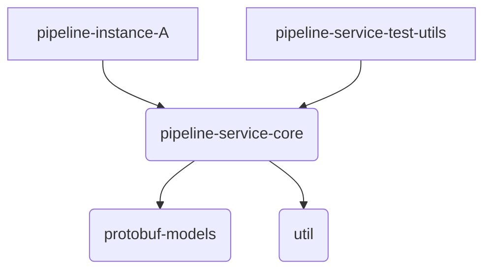
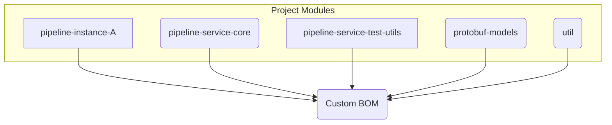

# Taming Dependencies: A Step-by-Step Guide to Building a Custom Micronaut BOM with Gradle Kotlin DSL

This repository contains the output of the end of this tutorial. It's open and used to demonstrate how one can build a multi-module build for containers in a single repository using the Micronaut framework.

Managing dependencies and ensuring build consistency across multiple projects can be a significant challenge, especially as systems grow in complexity. This tutorial provides a step-by-step guide to establishing a robust multi-project build structure using **Gradle with the Kotlin DSL** (even if your projects use **Java**), targeting **JDK 21**.

**What We're Building:**

Imagine a system designed for processing data pipelines. This system consists of several parts:

* **Shared Libraries:** A core library containing the main pipeline logic (`pipeline-service-core`), data models defined using Protocol Buffers (`protobuf-models`), and common helper functions (`util`).
* **Testing Utilities:** A dedicated library (`pipeline-service-test-utils`) to assist in testing the pipeline components.
* **Microservices:** Specific implementations of pipelines as runnable Micronaut applications (e.g., `pipeline-instance-A`).

**The Goal:**

Our goal is to manage this system effectively within a single repository (monorepo) using Gradle. We'll focus on:

1.  **Centralized Dependency Management:** Creating a custom Bill of Materials (BOM) and using Gradle's version catalog (`libs.versions.toml`) to ensure all modules use consistent library versions.
2.  **Consistent Build Environment:** Using Gradle Kotlin DSL and configuring for JDK 21.
3.  **Modular Structure:** Defining clear dependencies between the different project modules.
4.  **Efficient CI/CD:** Discussing strategies to build and deploy only the parts of the system that have changed.

**Project Dependency Overview:**

The following diagrams illustrate the relationships between the different project modules we'll be configuring.

*High-Level Module Dependencies:*

*Dependency on the Custom BOM:*

This tutorial will guide you through setting up this structure step-by-step, providing CLI commands and code examples along the way.

**Prerequisites:**

* Linux or macOS environment with a Bash-compatible shell.
* JDK 21 installed and configured (e.g., `JAVA_HOME` environment variable set).
* Git installed.
* Docker installed (optional, for containerization steps).

Let's begin!

Please check out the [tutorial](https://www.taming-dependencies.com/) for more details.

The tutorial can me found [here](tutorial.adoc)