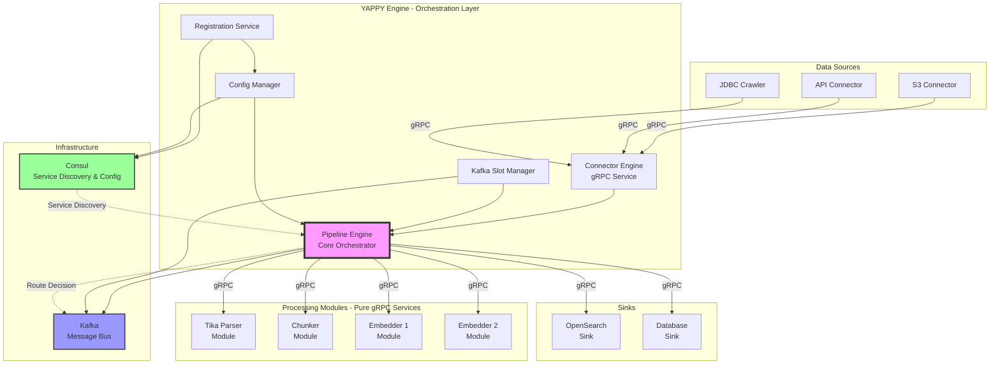
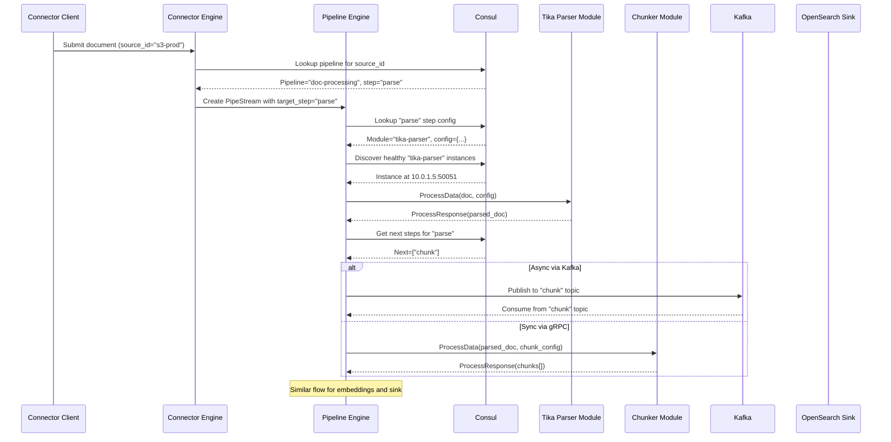

# YAPPY Engine: Overview and Foundational Principles

## Project Overview

YAPPY Engine is a pure orchestration layer for distributed data processing pipelines. It coordinates simple gRPC services (modules) that process data through configurable pipeline graphs. The engine handles all infrastructure complexity - service discovery via Consul, message routing via gRPC or Kafka, and pipeline configuration management - while modules focus solely on their business logic.

## Architecture Diagram

## Foundational Principles

### User-Centric Design & Operational Excellence

The YAPPY Engine prioritizes:

1. **Easy Setup and Configuration** - Simple, out-of-the-box configuration bootstrapping experience
2. **Comprehensive Monitoring** - Detailed status reporting and health checking
3. **Robust Service Lifecycle Management** - Clean registration, health monitoring, and deregistration
4. **Flexible Deployment Models** - Support for both tightly-coupled and distributed deployments
5. **Language Agnostic Module Support** - Modules can be written in any language that supports gRPC

### Core Architecture Principles

1. **Pure Orchestration Layer** - The engine contains no business logic, only routing and coordination
2. **Simple gRPC Modules** - Modules implement only `ProcessData`, `GetServiceRegistration`, and standard gRPC health check
3. **Language Agnostic** - Any language that supports gRPC can implement a module
4. **Configuration-Driven Routing** - All message routing decisions come from pipeline configuration
5. **Explicit Registration** - CI/CD must explicitly register modules using the CLI with engine endpoint
6. **No Infrastructure Awareness** - Modules know nothing about Consul, Kafka, or the orchestration layer

### Operational Principles

1. **No Silent Failures** - All errors are logged and tracked in service status
2. **Graceful Degradation** - The system continues operating even with partial failures
3. **Self-Healing** - Automatic recovery from transient failures
4. **Observable by Default** - Built-in metrics, tracing, and logging
5. **Production-Ready** - Designed for real-world deployment scenarios

## System Components

### Core Components

- **YAPPY Engine** - The orchestration engine that manages pipeline execution
- **Consul** - Service discovery, configuration storage, and health checking
- **Kafka** - Message bus for asynchronous pipeline steps
- **Schema Registry** - Protobuf schema management (Apicurio or AWS Glue)

### Module Types

All modules are simple gRPC services that implement the `PipeStepProcessor` interface. From the module's perspective, there is no difference between types - they all just process data. The engine determines their role based on pipeline configuration:

- **Connectors** - Entry points that feed data into pipelines (S3, web crawlers, JDBC, etc.)
- **Processors** - Transform data (parsing, chunking, embedding, etc.)
- **Sinks** - Terminal steps that output data (OpenSearch, databases, etc.)

The same module can be reused multiple times in a pipeline with different configurations. For example, a chunker module could be used twice with different chunk sizes, or an embedder could be used with different models.

## Key Design Decisions

1. **gRPC for Synchronous Communication** - Type-safe, efficient inter-service communication
2. **Kafka for Asynchronous Processing** - Reliable, scalable message passing
3. **Protobuf for Data Serialization** - Schema evolution and cross-language support
4. **Consul for Service Coordination** - Dynamic configuration and service discovery
5. **Micronaut Framework** - Modern, cloud-native application framework

## Message Flow Example

Here's how a document flows through the system:

## Development Philosophy

1. **Clean Architecture** - Clear separation of concerns and dependencies
2. **100% Real Integration Tests** - No mocks or fake implementations in integration tests
3. **Methodical Development** - Fix one issue at a time, verify no regressions
4. **Comprehensive Documentation** - Every component and decision is documented
5. **Future-Proof Design** - Extensible architecture that can grow with requirements