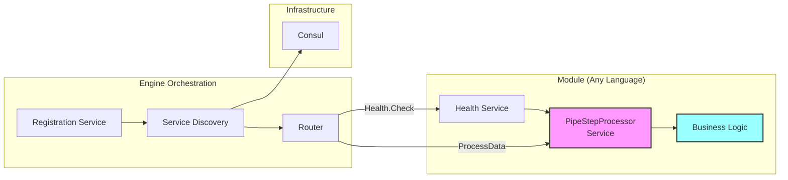

# Module Management

## Overview

Modules in YAPPY are pure gRPC services that implement a simple interface. They have no knowledge of Consul, Kafka, or the orchestration layer. The engine handles all infrastructure concerns, allowing modules to focus solely on their business logic. This design enables modules to be written in any language that supports gRPC.

## Module Architecture



## Module Interface Requirements

Every module must implement exactly three things:

### 1. ProcessData Method
```proto
rpc ProcessData(ProcessRequest) returns (ProcessResponse);
```
- Receives a document with configuration
- Processes according to business logic
- Returns processed document or error

### 2. GetServiceRegistration Method
```proto
rpc GetServiceRegistration(google.protobuf.Empty) returns (ServiceRegistrationData);
```
- Returns module name and optional JSON schema
- Called during registration to identify the module
- Static information that doesn't change

### 3. Standard gRPC Health Check
```proto
service Health {
    rpc Check(HealthCheckRequest) returns (HealthCheckResponse);
}
```
- Standard gRPC health checking protocol
- Returns SERVING, NOT_SERVING, or UNKNOWN
- Used by Consul for health monitoring

## Module Discovery and Invocation

The engine orchestrates all module interactions:

### Discovery Flow

#### 1. Configuration-Driven Discovery
- Engine receives PipeStream for a specific pipeline step
- Example: `stepName` = "P1_S1_ValidateData" within `pipelineName` = "DataSciencePipeline-P1"
- Consults dynamic configuration for routing information

#### 2. Fetch Step Configuration
- Uses `DynamicConfigurationManager` to retrieve `PipelineStepConfig`
- Fetches from Consul based on `pipelineName` and `target_step_name`
- Configuration contains routing and execution details

#### 3. Identify Processor
- `PipelineStepConfig` contains `ProcessorInfo` with:
  - `grpcServiceName` (e.g., "validator-module-v1")
  - Connection details
  - Custom configuration
- `grpcServiceName` is the key for service discovery

#### 4. Service Discovery via Consul
- Engine queries Consul for healthy instances of `grpcServiceName`
- Consul automatically handles health checking
- Engine selects instance based on load balancing strategy
- All discovery happens through Consul (no localhost optimization)

#### 5. gRPC Invocation
- Establishes gRPC connection to discovered instance
- Invokes `processData` method on `PipeStepProcessor` interface
- Handles retries and error scenarios
- Routes response to next step or Kafka

### Module Registration Process

Modules are completely passive - they just respond to gRPC calls:

1. **Module Responsibilities**
   - Start gRPC server on specified port
   - Implement ProcessData method
   - Implement GetServiceRegistration method
   - Implement standard Health service
   - That's it!

2. **CI/CD Responsibilities**
   - Deploy module container/service
   - Wait for module to be ready
   - Call registration CLI with endpoints
   - Handle registration failures

3. **Engine Responsibilities**
   - Validate module health
   - Register in Consul
   - Monitor ongoing health
   - Route messages to module

## Module Lifecycle Management

### Registration Process

1. **Pre-Registration Validation**
   - Engine validates module is reachable
   - Checks gRPC endpoint responds
   - Verifies health endpoint

2. **Registration with Consul**
   ```java
   Registration registration = new Registration();
   registration.setName(serviceName);
   registration.setId(generateUniqueId());
   registration.setAddress(moduleAddress);
   registration.setPort(modulePort);
   registration.setTags(Arrays.asList(
       "yappy-module",
       "version=" + version,
       "config-digest=" + configDigest
   ));
   ```

3. **Post-Registration Verification**
   - Wait for Consul to report healthy
   - Verify service appears in discovery
   - Update service status in KV store

### Health Monitoring

1. **Continuous Health Checks**
   - Engine monitors module health via Consul
   - Tracks health state transitions
   - Updates ServiceAggregatedStatus

2. **Health Check Types**
   - HTTP: GET /health
   - gRPC: Health.Check()
   - TCP: Port connectivity
   - TTL: Periodic updates

3. **Failure Handling**
   - Automatic deregistration after failures
   - Proxying to healthy instances
   - Alert generation

### Deregistration Process

1. **Graceful Shutdown**
   - CI/CD calls CLI during module shutdown
   - CLI requests engine to deregister
   - Engine removes module from Consul
   - Waits for in-flight requests to complete

2. **Module Deletion/Unresponsive**
   - If module is deleted or unresponsive
   - CI/CD must still call deregistration
   - Engine force-removes from Consul
   - Logged as cleanup operation

## Module Configuration Management

### Configuration Structure

```json
{
  "moduleId": "validator-module-v1",
  "implementationClass": "com.example.ValidatorModule",
  "grpcServiceName": "validator-module-v1",
  "customConfigSchema": {
    "$schema": "http://json-schema.org/draft-07/schema#",
    "type": "object",
    "properties": {
      "validationRules": {
        "type": "array",
        "items": {"type": "string"}
      }
    }
  },
  "customConfig": {
    "validationRules": ["rule1", "rule2"]
  }
}
```

### Configuration Storage in Consul

1. **Module Registry Path**
   - Base path: `/yappy/modules/registry/`
   - Per-module: `/yappy/modules/registry/{moduleId}`

2. **Configuration Versioning**
   - Track configuration changes
   - Support rollback
   - Audit trail

3. **Live Updates**
   - Modules watch for configuration changes
   - Apply updates without restart (where possible)
   - Report update status

## Module Validation

### Registration Validation

1. **Interface Compliance**
   - Verify module implements PipeStepProcessor
   - Check gRPC service definition matches
   - Validate method signatures

2. **Schema Validation**
   - Custom configuration schema is valid JSON Schema
   - Default configuration passes schema validation
   - Schema is compatible with registry

3. **Uniqueness Checks**
   - Module ID is unique across cluster
   - Service name doesn't conflict
   - Port assignments don't overlap

### Runtime Validation

1. **Configuration Validation**
   - Custom config matches declared schema
   - Required fields are present
   - Data types are correct

2. **Compatibility Validation**
   - Module version compatible with engine
   - Protocol buffer versions align
   - Dependencies are satisfied

3. **Performance Validation**
   - Response times within thresholds
   - Resource usage acceptable
   - Throughput meets requirements

## Module Types

### 1. Processor Modules
- Transform data (parsing, chunking, embedding)
- Implement PipeStepProcessor interface
- Stateless operation preferred

### 2. Connector Modules
- Ingest data from sources
- Implement ConnectorProcessor interface
- May maintain connection state

### 3. Sink Modules
- Output data to destinations
- Implement SinkProcessor interface
- Handle batching and retries

### 4. Router Modules
- Make routing decisions
- Can split or merge streams
- Implement custom logic

## Module Development Guidelines

### Interface Requirements

```proto
service PipeStepProcessor {
  rpc processData(PipeStream) returns (PipeStream);
  rpc getCapabilities(Empty) returns (Capabilities);
  rpc validateConfig(Config) returns (ValidationResult);
}
```

### Best Practices

1. **Stateless Design**
   - Avoid maintaining state between requests
   - Use external storage for persistence
   - Enable horizontal scaling

2. **Error Handling**
   - Return descriptive error messages
   - Use proper gRPC status codes
   - Include correlation IDs

3. **Performance**
   - Stream large data when possible
   - Implement efficient algorithms
   - Monitor resource usage

4. **Configuration**
   - Provide sensible defaults
   - Validate all inputs
   - Support hot reloading

## Security Considerations

1. **Authentication**
   - Modules authenticate to engine (future)
   - mTLS for gRPC connections (future)
   - API key management (future)

2. **Authorization**
   - Module capabilities enforcement
   - Data access controls
   - Operation permissions

3. **Network Security**
   - Encrypt all communications
   - Network segmentation
   - Firewall rules

## Module Packaging

### Container Requirements

1. **Base Image Selection**
   - Minimal OS image
   - Required runtime only
   - Security updates applied

2. **Health Check Implementation**
   - HTTP endpoint at /health
   - gRPC health service
   - Startup/liveness/readiness probes

3. **Configuration Injection**
   - Environment variables
   - Mounted config files
   - Consul configuration watch

4. **Logging Standards**
   - JSON formatted logs
   - Proper log levels
   - Correlation ID propagation