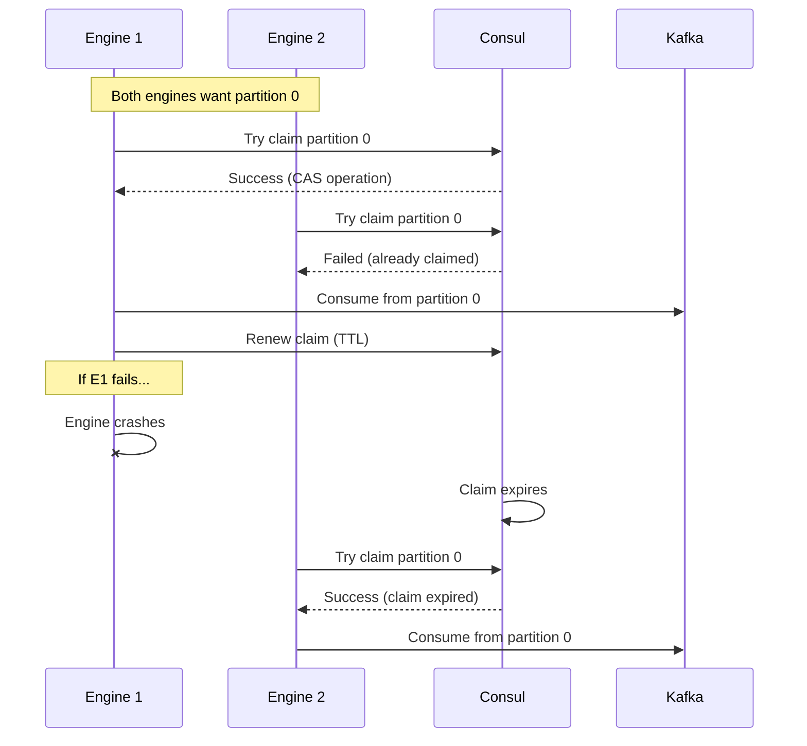

# Kafka Integration

## Overview

Kafka provides asynchronous communication between pipeline steps and enables scalable, fault-tolerant data processing. The integration includes topic management, consumer group coordination, schema validation, and slot management for optimal partition assignment.

## Topic Naming Conventions

### Standard Naming Pattern

Topics follow a hierarchical naming convention:
```
yappy.pipeline.[pipelineName].step.[stepName].(input|output|error|dead-letter)
```

Examples:
- `yappy.pipeline.search-pipeline.step.document-ingest.output`
- `yappy.pipeline.search-pipeline.step.document-ingest.error`
- `yappy.pipeline.analytics-pipeline.step.sentiment-analysis.input`

**Future Change**: The "yappy." prefix will be removed in future implementations:
```
pipeline.[pipelineName].step.[stepName].(input|output|error|dead-letter)
```

### Custom Topics

Non-standard topics are supported for:
- Cross-pipeline communication
- External system integration
- Special processing requirements

Requirements:
- Must not begin with "pipeline." unless following the standard pattern
- Must be included in `allowedKafkaTopics` list in PipelineClusterConfig

## Topic Permission Validation

### Validation Process

The `WhitelistValidator` enforces topic permissions through two mechanisms:

1. **Explicit Whitelist**
   - Topics listed in `allowedKafkaTopics` in PipelineClusterConfig
   - No naming convention requirements
   - Used for cross-pipeline or external topics

2. **Naming Convention Validation**
   - Must follow standard pattern
   - Pipeline and step names must match current context
   - Automatic validation without explicit whitelisting

### Variable Resolution

Dynamic topic naming using variables:

**Supported Variables:**
- `${clusterName}` - Current cluster name
- `${pipelineName}` - Current pipeline name
- `${stepName}` - Current step name

**Example:**
```yaml
kafkaTopic: "yappy.pipeline.${pipelineName}.step.${stepName}.output"
```

Resolves to: `yappy.pipeline.search-pipeline.step.chunker.output`

### Validation Steps

1. **Variable Resolution** - Replace variables with actual values
2. **Explicit Check** - Check if topic is in whitelist
3. **Pattern Check** - Validate naming convention if not whitelisted
4. **Context Check** - Ensure pipeline/step names match current context

## Consumer Groups

### Pipeline-Based Groups

Each pipeline has its own consumer group:
```
[pipeline-name]-consumer-group
```

Examples:
- `search-pipeline-consumer-group`
- `analytics-pipeline-consumer-group`

### Whitelisted Topics

For whitelisted (custom) topics:
- Consumer group management is the responsibility of the topic operator
- Engine respects existing consumer group configurations
- No automatic group creation or management

### Benefits

- Ensures single processing per message within a pipeline
- Enables horizontal scaling of engine instances
- Maintains processing order within partitions
- Isolates pipeline processing from other pipelines

## Kafka Slot Management

The KafkaSlotManager prevents excessive Kafka consumers by using Consul-based claims to limit active listeners across all engine instances.

### Key Features

1. **Listener Limitation**
   - Uses Consul claims to coordinate listeners
   - Ensures no more listeners than partitions
   - Example: 1000 engines, 20 partitions = only 20 active listeners

2. **Consul-Based Claims**
   - Each partition claim stored in Consul
   - Engines compete for partition ownership
   - Claims have TTL and must be renewed

3. **Auto-Scaling Based On:**
   - Memory consumption
   - Consumer lag
   - Processing throughput
   - Available engine instances

### Claim-Based Assignment Process



### Rebalancing

When partition count changes or engines join/leave:

1. **Change Detection**
   - Monitor partition count changes
   - Track engine availability
   - Detect stale claims

2. **Rebalance Trigger**
   - Release excess claims
   - Redistribute partitions
   - Ensure optimal coverage

3. **Graceful Handoff**
   - Finish processing current messages
   - Release claim in Consul
   - Allow other engines to claim

## Cross-Pipeline Communication

### Enabling Cross-Pipeline Data Flow

1. **Identify Communication Requirements**
   - Source pipeline and step
   - Target pipeline and step (or external system)
   - Data format and schema

2. **Create Custom Topic**
   - Choose descriptive topic name
   - Add to `allowedKafkaTopics` in both pipelines
   - Configure retention and partitioning

3. **Update Pipeline Configurations**
   ```yaml
   # Source pipeline step
   outputs:
     - type: KAFKA
       kafkaTopic: "cross-pipeline.search-to-analytics"
   
   # Target pipeline step
   inputs:
     - type: KAFKA
       kafkaTopic: "cross-pipeline.search-to-analytics"
   ```

### Multiple Topic Inputs

Steps can listen to multiple topics:
- Default topic (following naming convention)
- Additional custom topics
- Different data sources or pipelines

## Topic Management

### Automatic Topic Creation

When pipeline steps are created:

1. **Main Topic Creation**
   - Created with default partitions (configurable)
   - Retention based on pipeline requirements
   - Replication factor for reliability

2. **Error Topic Creation**
   - Lower retention for debugging
   - Same partition count as main topic
   - Used for failed message handling

### Topic Configuration Verification

1. Check if required topics exist
2. Verify configuration matches requirements:
   - Partition count
   - Replication factor
   - Retention settings
3. Log warnings for mismatches (no automatic modification)

### Topic Lifecycle

1. **Creation** - Automatic on pipeline deployment
2. **Monitoring** - Health checks and metrics
3. **Cleanup** - Manual deletion when pipeline removed
4. **Archival** - Optional long-term storage

## Producer Configuration

### Schema Registry Integration

```yaml
kafka:
  producers:
    default:
      schema.registry.url: ${SCHEMA_REGISTRY_URL}
      value.serializer: io.confluent.kafka.serializers.protobuf.KafkaProtobufSerializer
      compression.type: snappy
      acks: all
      retries: 3
```

### Error Handling

1. **Retry Configuration**
   - Exponential backoff
   - Maximum retry attempts
   - Dead letter queue for failures

2. **Circuit Breaker**
   - Prevent cascading failures
   - Automatic recovery
   - Health status reporting

## Consumer Configuration

### Offset Management

```yaml
kafka:
  consumers:
    default:
      auto.offset.reset: earliest
      enable.auto.commit: false
      max.poll.records: 100
      session.timeout.ms: 30000
```

### Processing Guarantees

1. **At-Least-Once Delivery**
   - Manual offset commits
   - Idempotent processing
   - Duplicate detection

2. **Ordered Processing**
   - Per-partition ordering
   - Key-based partitioning
   - Sequential processing within partition

## Admin Operations

### Consumer Group Management

**Pause Consumers:**
```bash
POST /api/admin/kafka/consumer-groups/{consumer-group-name}/pause
```

**Resume Consumers:**
```bash
POST /api/admin/kafka/consumer-groups/{consumer-group-name}/resume
```

**Reset Offsets:**
```bash
POST /api/admin/kafka/consumer-groups/{consumer-group-name}/reset-offsets
{
  "strategy": "TO_DATETIME",
  "datetime": "2024-01-15T10:00:00Z"
}
```

### Pipeline-Level Operations

**Pause Pipeline:**
```bash
POST /api/admin/pipelines/{pipeline-name}/pause
```

**Resume Pipeline:**
```bash
POST /api/admin/pipelines/{pipeline-name}/resume
```

### Monitoring Endpoints

**Consumer Lag:**
```bash
GET /api/admin/kafka/consumer-groups/{consumer-group-name}/lag
```

**Topic Statistics:**
```bash
GET /api/admin/kafka/topics/{topic-name}/stats
```

## Performance Optimization

### Batching Configuration

```yaml
kafka:
  producers:
    default:
      batch.size: 16384
      linger.ms: 10
      buffer.memory: 33554432
```

### Partition Strategy

1. **Key-Based Partitioning**
   - Consistent hashing
   - Preserve ordering per key
   - Even distribution

2. **Round-Robin**
   - Maximum throughput
   - No ordering guarantees
   - Best for stateless processing

### Consumer Threading

1. **Single-Threaded Processing**
   - Simple, ordered processing
   - Lower throughput
   - Easier debugging

2. **Multi-Threaded Processing**
   - Higher throughput
   - Complex error handling
   - Requires thread-safe code

## Security Configuration

### Authentication

```yaml
kafka:
  security:
    protocol: SASL_SSL
    sasl:
      mechanism: PLAIN
      username: ${KAFKA_USERNAME}
      password: ${KAFKA_PASSWORD}
```

### Authorization

1. **Topic-Level ACLs**
   - Read/write permissions per topic
   - Consumer group permissions
   - Admin operations control

2. **Pipeline-Based Access**
   - Pipelines can only access their topics
   - Cross-pipeline topics require explicit permission
   - Audit logging for access

## Error Handling and Recovery

### Dead Letter Queues

Failed messages are sent to dead letter topics:
- Preserves original message
- Includes error details
- Enables manual reprocessing

### Retry Topics

Temporary failures use retry topics:
- Exponential backoff delays
- Maximum retry limits
- Final routing to dead letter

### Recovery Procedures

1. **Message Replay**
   - Reset consumer offsets
   - Reprocess from timestamp
   - Selective message filtering

2. **Error Analysis**
   - Dead letter queue inspection
   - Error pattern detection
   - Root cause analysis tools