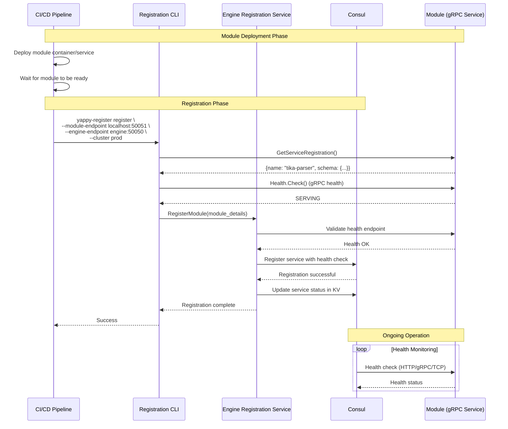

# Module Registration Flow

This document describes how modules are registered with the YAPPY Engine orchestration layer.

## Overview

Modules are pure gRPC services that know nothing about the orchestration infrastructure. Registration is handled externally by CI/CD pipelines using the YAPPY registration CLI.

## Registration Flow Diagram



## CLI Commands

### Register Command

```bash
yappy-register register \
  --module-endpoint <host:port> \
  --engine-endpoint <engine:port> \
  --cluster <cluster-name> \
  --instance-name <optional-name> \
  --health-type GRPC \
  --health-path "grpc.health.v1.Health/Check" \
  --module-version <version>
```

**Required Parameters:**
- `--module-endpoint`: The gRPC endpoint where the module is running (e.g., `localhost:50051`)
- `--engine-endpoint`: The engine's gRPC endpoint (e.g., `engine.prod:50050`)
- `--cluster`: The cluster name this module belongs to

**Optional Parameters:**
- `--instance-name`: Custom instance name for Consul (defaults to generated ID)
- `--health-type`: Type of health check (GRPC, HTTP, TCP, TTL)
- `--health-path`: Health check endpoint path
- `--module-version`: Module software version
- `--validate-health`: Whether to validate health before registration (default: true)

### Query Command

```bash
# List all registered modules
yappy-register query --cluster prod list

# Get module details
yappy-register query --cluster prod get --module tika-parser

# Check module health
yappy-register query --cluster prod health --module tika-parser
```

### Health Check Command

```bash
# Check health of a specific module instance
yappy-register health-check \
  --cluster prod \
  --endpoint localhost:50051 \
  --type GRPC
```

### Validate Command

```bash
# Validate module configuration
yappy-register validate \
  --cluster prod \
  --module tika-parser \
  --config config.json
```

## Module Requirements

Modules must implement these gRPC services:

### 1. PipeStepProcessor Service

```proto
service PipeStepProcessor {
  rpc ProcessData(ProcessRequest) returns (ProcessResponse);
  rpc GetServiceRegistration(google.protobuf.Empty) returns (ServiceRegistrationData);
}

message ServiceRegistrationData {
  string module_name = 1;
  optional string json_config_schema = 2;
}
```

### 2. Standard gRPC Health Service

```proto
service Health {
  rpc Check(HealthCheckRequest) returns (HealthCheckResponse);
  rpc Watch(HealthCheckRequest) returns (stream HealthCheckResponse);
}
```

## CI/CD Integration

### Docker Deployment Example

```dockerfile
# Dockerfile
FROM openjdk:17-slim
COPY mymodule.jar /app/
EXPOSE 50051
CMD ["java", "-jar", "/app/mymodule.jar"]
```

### CI/CD Pipeline Example

```yaml
# .github/workflows/deploy.yml
steps:
  - name: Deploy Module
    run: |
      docker run -d -p 50051:50051 --name mymodule mymodule:latest
      
  - name: Wait for Module
    run: |
      timeout 30 bash -c 'until nc -z localhost 50051; do sleep 1; done'
      
  - name: Register with Engine
    run: |
      yappy-register register \
        --module-endpoint localhost:50051 \
        --engine-endpoint ${{ secrets.ENGINE_ENDPOINT }} \
        --cluster ${{ env.CLUSTER_NAME }} \
        --module-version ${{ github.sha }}
```

### Kubernetes Deployment Example

```yaml
apiVersion: batch/v1
kind: Job
metadata:
  name: register-mymodule
spec:
  template:
    spec:
      containers:
      - name: register
        image: yappy/registration-cli:latest
        command:
        - yappy-register
        - register
        - --module-endpoint=mymodule-service:50051
        - --engine-endpoint=yappy-engine:50050
        - --cluster=prod
```

## Error Scenarios

### Registration Failures

1. **Module Unreachable**
   - CLI cannot connect to module endpoint
   - Solution: Verify module is running and endpoint is correct

2. **Health Check Failed**
   - Module is reachable but health check fails
   - Solution: Check module logs, ensure health service is implemented

3. **Engine Unreachable**
   - CLI cannot connect to engine endpoint
   - Solution: Verify engine endpoint and network connectivity

4. **Invalid Configuration**
   - Module's configuration doesn't match its schema
   - Solution: Validate configuration against schema before deployment

### Deregistration

When a module is being removed:

```bash
# CI/CD should call this during module shutdown
yappy-register deregister \
  --cluster prod \
  --module mymodule \
  --instance-id <instance-id>
```

## Best Practices

1. **Always Register After Deployment**
   - Don't assume the engine will discover modules automatically
   - Registration must be explicit via CLI

2. **Health Check Before Registration**
   - Ensure module is fully initialized before registering
   - Use `--validate-health=true` (default)

3. **Include Version Information**
   - Always provide `--module-version` for tracking
   - Use git commit SHA or semantic version

4. **Handle Registration Failures**
   - Implement retry logic in CI/CD
   - Alert on repeated failures

5. **Clean Deregistration**
   - Always deregister before removing modules
   - Prevents stale entries in Consul

## Configuration Storage

Once registered, module information is stored in Consul:

```
/yappy-clusters/<cluster>/modules/
  ├── registry/
  │   └── tika-parser/
  │       ├── config.json
  │       └── schema.json
  └── instances/
      └── tika-parser-abc123/
          ├── endpoint
          ├── version
          └── health
```

## Future Enhancements

1. **Module Authentication**
   - mTLS between engine and modules
   - API key/token authentication

2. **Automatic Discovery**
   - Kubernetes operator for automatic registration
   - Service mesh integration

3. **Module Marketplace**
   - Central registry of available modules
   - One-click deployment and registration