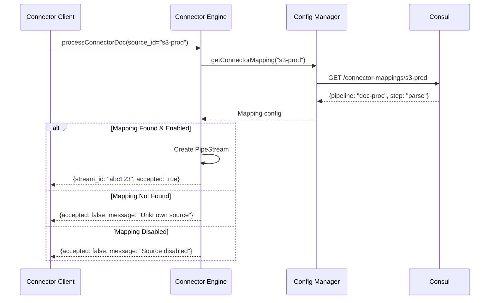

# Connector Configuration and Mapping

This document describes how external data sources connect to YAPPY pipelines through the connector engine.

## Overview

The Connector Engine is a gRPC service within the YAPPY Engine that accepts documents from external sources and routes them into appropriate pipelines. Connectors use a `source_identifier` to determine which pipeline and initial step should process the document.

## Connector Flow

```mermaid
graph TD
    subgraph "External Data Sources"
        S3[S3 Bucket Loader]
        API[REST API Client]
        JDBC[JDBC Crawler]
        WEB[Web Crawler]
    end
    
    subgraph "YAPPY Engine"
        CE[Connector Engine<br/>gRPC Service]
        CM[Config Manager]
        PE[Pipeline Engine]
        
        CE --> CM
        CM --> PE
    end
    
    subgraph "Consul Configuration"
        CMAP[Connector Mappings]
        PCONF[Pipeline Configs]
    end
    
    S3 -->|source_id="s3-prod"| CE
    API -->|source_id="api-v1"| CE
    JDBC -->|source_id="customer-db"| CE
    WEB -->|source_id="news-crawler"| CE
    
    CM -->|Lookup Mapping| CMAP
    CM -->|Get Pipeline| PCONF
    
    style CE fill:#f9f,stroke:#333,stroke-width:2px
```

## Connector Mapping Configuration

Connector mappings are stored in Consul and managed by the pipeline designer UI:

### Configuration Structure

```json
{
  "connectorMappings": {
    "s3-prod-documents": {
      "description": "Production S3 document bucket",
      "targetPipeline": "document-processing",
      "initialStep": "tika-parse",
      "enabled": true,
      "metadata": {
        "owner": "data-team",
        "created": "2024-01-15",
        "sla": "5-minutes"
      }
    },
    "customer-api-v1": {
      "description": "Customer data API ingestion",
      "targetPipeline": "customer-enrichment",
      "initialStep": "validate-customer",
      "enabled": true,
      "contextParams": {
        "source": "api",
        "version": "v1"
      }
    },
    "web-news-crawler": {
      "description": "News website crawler",
      "targetPipeline": "news-analysis",
      "initialStep": "extract-article",
      "enabled": false,
      "rateLimit": {
        "requestsPerMinute": 60
      }
    }
  }
}
```

### Consul Storage Path

```
/yappy-clusters/<cluster-name>/connector-mappings/
├── s3-prod-documents.json
├── customer-api-v1.json
└── web-news-crawler.json
```

## Connector Request Flow

### 1. Submit Document

```proto
message ConnectorRequest {
  string source_identifier = 1;  // Required: Maps to pipeline
  PipeDoc document = 2;          // Required: Document to process
  map<string, string> initial_context_params = 3;  // Optional context
  optional string suggested_stream_id = 4;  // Optional stream ID
}
```

### 2. Lookup Pipeline Mapping



### 3. Create Pipeline Stream

The engine creates a PipeStream with:
- Generated `stream_id` (or uses suggested if unique)
- `target_step_name` from mapping config
- `current_pipeline_name` from mapping config
- Merged context parameters (request + mapping defaults)
- Initial hop number = 0

## Connector Types

### Push Connectors
Submit documents directly to the engine:
- REST API clients
- Webhook receivers
- Message queue consumers
- File watchers

### Pull Connectors (Future)
Engine pulls from sources on schedule:
- S3 bucket scanners
- Database pollers
- RSS feed readers
- API scrapers

## Configuration Management

### Pipeline Designer UI

The pipeline designer will provide visual tools to:

1. **Create Connector Mappings**
   ```
   [S3 Bucket] --> [Document Processing Pipeline]
                          |
                          v
                    [Tika Parser Step]
   ```

2. **Configure Routing Rules**
   - Simple: All documents from source go to one pipeline
   - Conditional: Route based on document attributes (future)
   - Load balanced: Distribute across multiple pipelines (future)

3. **Set Operational Parameters**
   - Enable/disable mappings
   - Set rate limits
   - Configure retry policies
   - Define SLAs

### CLI Management

```bash
# List all connector mappings
yappy-register query --cluster prod connectors list

# Get specific mapping
yappy-register query --cluster prod connectors get --source s3-prod

# Create new mapping
yappy-register connectors create \
  --cluster prod \
  --source "new-api-v2" \
  --pipeline "api-processing" \
  --initial-step "validate"

# Update mapping
yappy-register connectors update \
  --cluster prod \
  --source "s3-prod" \
  --enabled false

# Delete mapping
yappy-register connectors delete \
  --cluster prod \
  --source "old-api-v1"
```

## Error Handling

### Invalid Source Identifier
- Returns `accepted: false`
- Logs attempt with unknown source
- No document processing occurs

### Disabled Mapping
- Returns `accepted: false` 
- Message indicates source is disabled
- Useful for maintenance windows

### Pipeline Not Found
- Mapping exists but pipeline deleted
- Returns error after accepting
- Document sent to dead letter queue

### Rate Limiting
- Connector engine enforces limits
- Returns 429-style response when exceeded
- Client should implement backoff

## Best Practices

1. **Naming Conventions**
   - Use descriptive source identifiers
   - Include environment: `s3-prod`, `s3-dev`
   - Version APIs: `customer-api-v1`, `customer-api-v2`

2. **Documentation**
   - Document each source identifier
   - Include expected document format
   - Note any special context parameters

3. **Monitoring**
   - Track documents per source
   - Monitor rejection rates
   - Alert on mapping failures

4. **Security**
   - Validate source identifiers
   - Authenticate connector clients (future)
   - Audit document submissions

## Future Enhancements

1. **Conditional Routing**
   ```json
   "routing": {
     "rules": [
       {
         "condition": "doc.mimeType == 'application/pdf'",
         "targetPipeline": "pdf-processing"
       },
       {
         "condition": "doc.size > 10MB",
         "targetPipeline": "large-file-processing"
       }
     ]
   }
   ```

2. **Source Authentication**
   - API keys per source
   - OAuth integration
   - mTLS for connectors

3. **Transformation Rules**
   - Pre-processing before pipeline
   - Field mapping/normalization
   - Default value injection