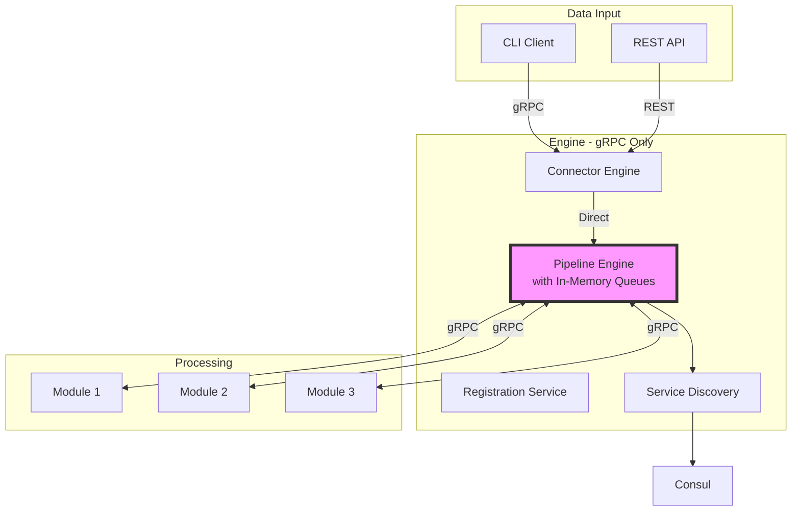
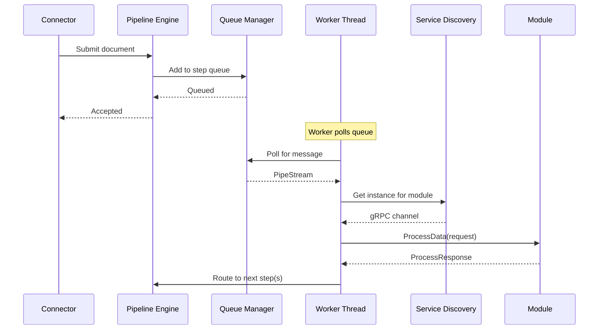

# gRPC-First Implementation Approach

This document outlines the initial implementation strategy focusing on gRPC-only message routing, deferring Kafka integration to a later phase.

## Overview

The gRPC-first approach simplifies initial development by:
- Eliminating Kafka complexity in the first iteration
- Providing immediate end-to-end functionality
- Allowing rapid prototyping and testing
- Establishing core orchestration patterns

## Architecture for gRPC-Only



## Implementation Phases

### Phase 1: Core Engine Components

1. **Pipeline Engine**
   ```java
   @Singleton
   public class PipelineEngineImpl implements PipelineEngine {
       private final ServiceDiscovery serviceDiscovery;
       private final ConfigManager configManager;
       private final Map<String, BlockingQueue<PipeStream>> stepQueues;
       
       public void routeMessage(PipeStream stream) {
           // Look up next steps from config
           // Add to appropriate queue(s)
           // Workers pull from queues and make gRPC calls
       }
   }
   ```

2. **Service Discovery**
   ```java
   @Singleton
   public class ConsulServiceDiscovery implements ServiceDiscovery {
       public GrpcChannel getHealthyInstance(String serviceName) {
           // Query Consul for healthy instances
           // Simple round-robin selection
           // Return gRPC channel
       }
   }
   ```

3. **In-Memory Queuing**
   ```java
   @Singleton
   public class QueueManager {
       // Bounded queues per pipeline step
       private final int QUEUE_SIZE = 1000;
       
       // Natural backpressure when queues fill
       public boolean offer(String step, PipeStream message, long timeout) {
           return getQueue(step).offer(message, timeout, TimeUnit.MILLISECONDS);
       }
   }
   ```

### Phase 2: Registration & Health

1. **Module Registration Service**
   - Accept registrations from CLI
   - Validate module health
   - Register with Consul
   - Update service status

2. **Health Monitoring**
   - Periodic health checks via Consul
   - Update ServiceAggregatedStatus
   - Handle unhealthy instances

### Phase 3: Error Handling

1. **Simple Retry Logic**
   ```java
   public class RetryHandler {
       private final int MAX_RETRIES = 3;
       private final long BACKOFF_MS = 1000;
       
       public ProcessResponse callWithRetry(GrpcChannel channel, ProcessRequest request) {
           for (int i = 0; i < MAX_RETRIES; i++) {
               try {
                   return channel.processData(request);
               } catch (Exception e) {
                   if (i == MAX_RETRIES - 1) throw e;
                   Thread.sleep(BACKOFF_MS * (i + 1));
               }
           }
       }
   }
   ```

2. **Dead Letter Handling**
   - Failed messages go to in-memory DLQ
   - Expose endpoint to view/retry DLQ messages
   - Log all failures with full context

## Message Flow in gRPC-Only Mode



## Configuration for gRPC-Only

### Pipeline Configuration

```json
{
  "pipelineName": "grpc-only-pipeline",
  "steps": {
    "parse": {
      "stepType": "PIPELINE",
      "processorInfo": {
        "grpcServiceName": "tika-parser",
        "transportType": "GRPC"
      },
      "outputs": ["chunk"],
      "customConfig": {
        "parseMode": "text-only"
      }
    },
    "chunk": {
      "stepType": "PIPELINE", 
      "processorInfo": {
        "grpcServiceName": "chunker",
        "transportType": "GRPC"
      },
      "outputs": ["embed"],
      "customConfig": {
        "chunkSize": 512
      }
    }
  }
}
```

### Engine Configuration

```yaml
yappy:
  engine:
    mode: grpc-only
    queues:
      default-size: 1000
      max-wait-ms: 5000
    workers:
      per-step: 5
      max-total: 50
    retry:
      max-attempts: 3
      backoff-ms: 1000
```

## Backpressure Handling

### Natural Backpressure
1. **Bounded Queues**
   - Each step has limited queue size
   - Producers block when queue full
   - Prevents memory exhaustion

2. **Timeout Controls**
   - Max wait time for queue space
   - Fail fast when system overloaded
   - Return appropriate error to client

### Flow Control
```java
public class FlowController {
    public void handleBackpressure(String step, PipeStream message) {
        try {
            // Try to queue with timeout
            boolean queued = queueManager.offer(step, message, 5000);
            if (!queued) {
                // System overloaded
                metrics.incrementRejected(step);
                throw new BackpressureException("Queue full for step: " + step);
            }
        } catch (InterruptedException e) {
            Thread.currentThread().interrupt();
            throw new ProcessingException("Interrupted while queuing", e);
        }
    }
}
```

## Monitoring & Metrics

### Key Metrics
1. **Queue Metrics**
   - Current size per queue
   - Rejection rate
   - Wait times

2. **Processing Metrics**
   - Messages processed per step
   - Processing duration
   - Error rates

3. **System Metrics**
   - Active worker threads
   - gRPC connection pool size
   - Memory usage

### Health Endpoints
```
GET /health/queues
{
  "parse": {
    "size": 250,
    "capacity": 1000,
    "rejectionRate": 0.01
  },
  "chunk": {
    "size": 10,
    "capacity": 1000,
    "rejectionRate": 0.0
  }
}

GET /health/workers
{
  "active": 35,
  "idle": 15,
  "total": 50
}
```

## Testing Strategy

### 1. Unit Tests
- Queue management logic
- Retry handling
- Service discovery mocking

### 2. Integration Tests
- Full pipeline with real modules
- Backpressure scenarios
- Error propagation

### 3. Performance Tests
- Throughput limits
- Latency measurements
- Resource usage

## Migration to Kafka

When ready to add Kafka support:

1. **Add Kafka Slot Manager**
   - Integrate existing slot manager
   - Dynamic topic listeners

2. **Update Routing Logic**
   ```java
   public void routeMessage(PipeStream stream, StepConfig config) {
       if (config.getTransportType() == KAFKA) {
           kafkaProducer.send(config.getKafkaTopic(), stream);
       } else {
           queueManager.offer(config.getStepName(), stream);
       }
   }
   ```

3. **Hybrid Operation**
   - Some steps use gRPC
   - Some steps use Kafka
   - Seamless interoperation

## Advantages of gRPC-First

1. **Simplicity**
   - No Kafka infrastructure needed
   - Fewer moving parts
   - Easier debugging

2. **Fast Development**
   - Quick iteration
   - Immediate feedback
   - Simple deployment

3. **Lower Latency**
   - Direct gRPC calls
   - No serialization overhead
   - Synchronous when needed

## Limitations to Consider

1. **Scalability**
   - Limited by engine memory
   - Single point of failure
   - No persistence

2. **Reliability**
   - Messages lost on crash
   - No replay capability
   - Limited fault tolerance

3. **Monitoring**
   - Less visibility than Kafka
   - Custom metrics needed
   - No built-in tools

These limitations are acceptable for initial development and can be addressed when Kafka is integrated.