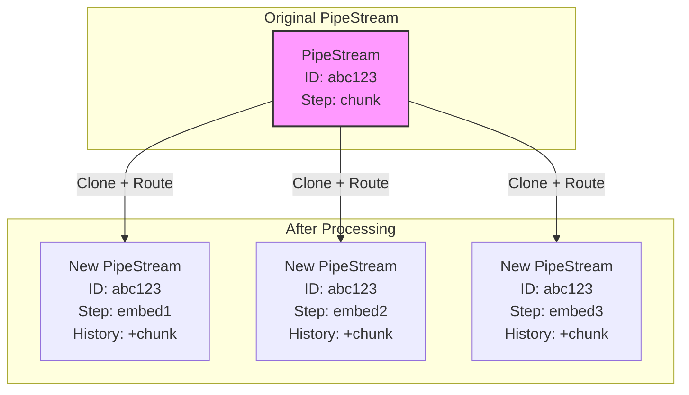
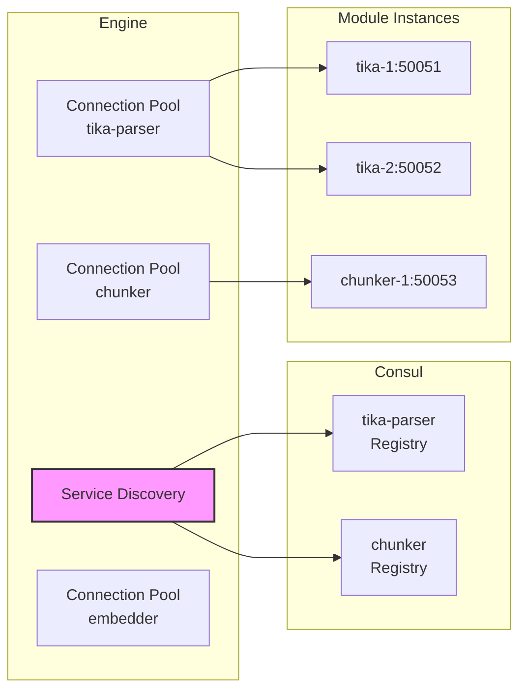
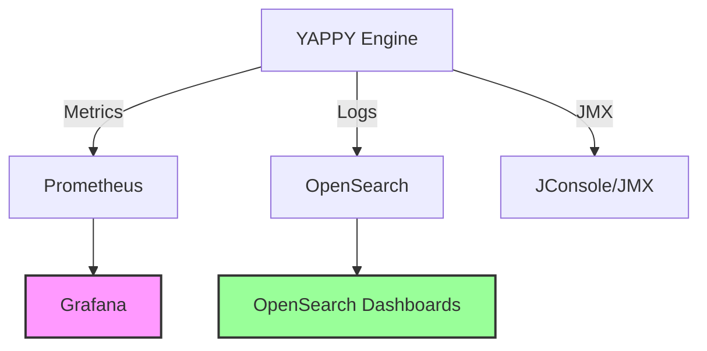
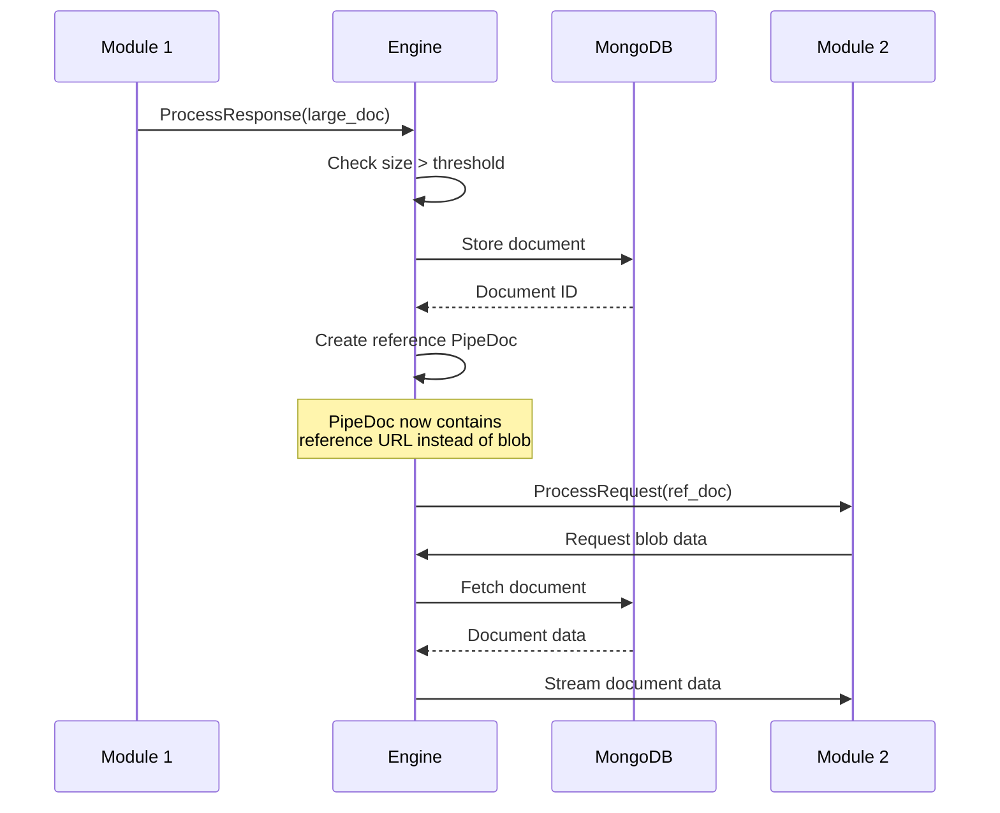

# Engine Internals and Processing Details

This document describes the internal workings of the YAPPY Engine orchestration layer, including metadata tracking, monitoring, connection management, and large document handling.

## PipeStream Processing Model

### Immutable PipeStream Pattern

The engine follows an immutable pattern for PipeStream objects:



**Key Points:**
- Original PipeStream is never modified
- Each output creates a new PipeStream instance
- All clones share the same stream_id
- Each clone has updated history and target_step

### Metadata Tracking

Before and after each step execution, the engine captures comprehensive metadata:

```proto
message StepExecutionRecord {
  int64 hop_number = 1;
  string step_name = 2;
  optional string service_instance_id = 3;  // Which instance processed it
  google.protobuf.Timestamp start_time = 4;
  google.protobuf.Timestamp end_time = 5;
  string status = 6;  // SUCCESS, FAILURE, SKIPPED
  repeated string processor_logs = 7;  // Module's log output
  optional ErrorData error_info = 8;
}
```

**Additional Tracking:**
- Processing duration (end_time - start_time)
- Module instance that handled the request
- Any logs generated by the module
- Error details if processing failed

### Custom Data Storage

Modules can add persistent data to the document:

```java
// In module implementation
PipeDoc doc = request.getDocument();
Struct customData = doc.getCustomData();
customData.putFields("extraction_metadata", 
    Value.newBuilder().setStringValue("extracted by v1.2").build());
```

This data travels with the document through all pipeline steps.

## Connection Management

### Micronaut Service Discovery Integration

The engine leverages Micronaut's built-in service discovery with Consul:

```yaml
micronaut:
  http:
    services:
      # Dynamic service configuration from Consul
      ${service-name}:
        health-check: true
        health-check-interval: 10s
        pool:
          enabled: true
          max-connections: 50
```

### Connection Pool Architecture



**Connection Pool Features:**
- Separate pool per module type (not per instance)
- Automatic failover on unhealthy instances
- Connection reuse for performance
- Configurable pool sizes

### Health-Aware Routing

Consul integration provides:
1. **Automatic Health Checks** - Consul monitors module health
2. **Dynamic Updates** - Service discovery updates as instances change
3. **Failover** - Automatic rerouting to healthy instances
4. **Load Balancing** - Round-robin or least-connections

## Monitoring and Observability

### Micrometer Integration

The engine uses Micrometer for comprehensive metrics:

```java
@Singleton
public class EngineMetrics {
    private final MeterRegistry registry;
    
    // Track processing times
    public void recordProcessingTime(String step, Duration duration) {
        registry.timer("engine.step.duration", 
            "step", step).record(duration);
    }
    
    // Track queue sizes
    public void recordQueueSize(String step, int size) {
        registry.gauge("engine.queue.size", 
            Tags.of("step", step), size);
    }
    
    // Track errors
    public void recordError(String step, String errorType) {
        registry.counter("engine.errors",
            "step", step,
            "type", errorType).increment();
    }
}
```

### Metrics Export

Metrics are exported to multiple systems:

```yaml
micronaut:
  metrics:
    export:
      prometheus:
        enabled: true
        step: PT1M
      jmx:
        enabled: true
      elastic:
        enabled: true
        host: http://opensearch:9200
```

### Monitoring Stack



### Key Metrics

1. **Processing Metrics**
   - `engine.step.duration` - Time per step
   - `engine.pipeline.duration` - End-to-end time
   - `engine.throughput` - Messages/second

2. **Resource Metrics**
   - `engine.queue.size` - Queue depths
   - `engine.connections.active` - Active gRPC connections
   - `jvm.memory.used` - Memory usage

3. **Error Metrics**
   - `engine.errors` - Error counts by type
   - `engine.dlq.size` - Dead letter queue size
   - `engine.retries` - Retry attempts

## Large Document Handling

### Size Thresholds

```java
public class DocumentSizeManager {
    private static final long INLINE_THRESHOLD = 10 * 1024 * 1024; // 10MB
    private static final long KAFKA_LIMIT = 25 * 1024 * 1024; // 25MB compressed
    
    public boolean requiresExternalStorage(PipeDoc doc) {
        return doc.getSerializedSize() > INLINE_THRESHOLD;
    }
}
```

### External Storage Flow



### Storage Strategy

**Phase 1: MongoDB**
- GridFS for large binary storage
- Streaming API support
- TTL for automatic cleanup

**Phase 2: S3 (Future)**
- Lower cost for large files
- Pre-signed URLs for direct access
- Lifecycle policies for retention

### Transparent Handling

Modules don't need to know about external storage:

```java
// Engine handles this transparently
public ProcessResponse processWithLargeDoc(ProcessRequest request) {
    PipeDoc doc = request.getDocument();
    
    if (doc.hasExternalReference()) {
        // Engine fetches and streams data
        Blob blob = documentRepository.stream(doc.getExternalReference());
        doc = doc.toBuilder().setBlob(blob).build();
    }
    
    // Module processes normally
    return module.processData(request.toBuilder().setDocument(doc).build());
}
```

## Processing Optimizations

### Connection Reuse

```java
@Singleton
public class GrpcConnectionManager {
    private final LoadingCache<String, ManagedChannel> channels;
    
    public ManagedChannel getChannel(String serviceName) {
        return channels.get(serviceName, () -> {
            // Discover healthy instances from Consul
            ServiceInstance instance = serviceDiscovery.getHealthyInstance(serviceName);
            
            return ManagedChannelBuilder
                .forAddress(instance.getHost(), instance.getPort())
                .usePlaintext()
                .keepAliveTime(30, TimeUnit.SECONDS)
                .idleTimeout(5, TimeUnit.MINUTES)
                .build();
        });
    }
}
```

### Batch Processing (Future)

While not in the initial version, the architecture supports future batch optimizations:

```proto
// Future enhancement
service PipeStepProcessor {
    rpc ProcessData(ProcessRequest) returns (ProcessResponse);
    rpc ProcessBatch(BatchProcessRequest) returns (BatchProcessResponse);
}
```

## Error Recovery

### Retry Strategy

```java
public class RetryableProcessor {
    @Retryable(
        attempts = "3",
        delay = "1s",
        multiplier = "2",
        includes = {StatusRuntimeException.class}
    )
    public ProcessResponse processWithRetry(ProcessRequest request) {
        return grpcClient.processData(request);
    }
}
```

### Circuit Breaker

```java
@CircuitBreaker(
    failureRateThreshold = 50,
    requestVolumeThreshold = 10,
    delay = "30s",
    reset = "120s"
)
public ProcessResponse processWithCircuitBreaker(ProcessRequest request) {
    return processWithRetry(request);
}
```

## Security Considerations (Future)

While not in the initial development version, the architecture is designed to support:

1. **mTLS between Engine and Modules**
   ```yaml
   grpc:
     ssl:
       enabled: true
       cert-chain: /certs/engine.crt
       private-key: /certs/engine.key
       trust-cert: /certs/ca.crt
   ```

2. **Module Authentication**
   - JWT tokens for module identity
   - API key validation
   - Role-based access control

3. **Data Encryption**
   - Encryption at rest in MongoDB/S3
   - TLS for all network communication
   - Field-level encryption for sensitive data