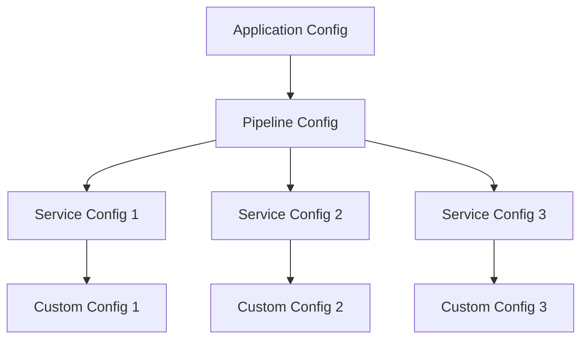
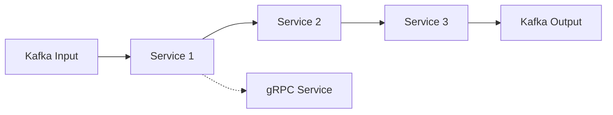

# Configuration Guide for Consul Config Service

## Overview

This guide explains the different types of configurations in the Consul Config Service and how they relate to each other. It also provides examples of how to create custom configurations.

## Configuration Types

### Pipeline Configuration

A **Pipeline Configuration** represents the overall configuration for a data processing pipeline. It contains:

- A name for the pipeline
- A collection of service configurations
- Version information for optimistic locking
- Timestamp information for when the pipeline was last updated

Pipelines are the top-level configuration entity that organizes multiple services into a coherent data processing flow.

### Service Configuration

A **Service Configuration** represents the configuration for a specific service within a pipeline. It contains:

- A name for the service instance
- The service implementation class
- Input sources (Kafka topics it listens to)
- Output destinations (Kafka topics it publishes to and gRPC services it forwards to)
- Custom configuration parameters
- JSON configuration options

Services are the building blocks of a pipeline, each performing a specific data processing task.

### Custom Configuration

A **Custom Configuration** is a JSON-based configuration specific to a service implementation. It contains:

- A JSON configuration string that follows a predefined schema
- A JSON schema string that defines the structure and validation rules for the configuration

Custom configurations allow for flexible, schema-validated configuration of services with complex requirements.

### Application Configuration

An **Application Configuration** represents the overall configuration for the application. It contains:

- The application name
- Flags indicating whether the configuration has been initialized

Application configuration is separate from pipeline and service configurations and focuses on application-level settings.

## Relationships Between Configuration Types



- An application can have multiple pipeline configurations
- Each pipeline configuration can have multiple service configurations
- Each service configuration can have its own custom configuration

## Creating a Custom Configuration

To create a custom configuration for a service:

1. **Register a Schema**: First, register a JSON schema for the service implementation:

```bash
curl -X PUT http://localhost:8080/api/schemas/com.example.MyCustomService \
  -H "Content-Type: application/json" \
  -d '{
    "type": "object",
    "properties": {
      "host": {
        "type": "string",
        "description": "Hostname for the custom service"
      },
      "port": {
        "type": "integer",
        "minimum": 1,
        "maximum": 65535
      },
      "retries": {
        "type": "integer",
        "default": 3
      }
    },
    "required": ["host", "port"]
  }'
```

2. **Create a Pipeline**: Create a new pipeline or use an existing one:

```bash
curl -X POST http://localhost:8080/api/pipelines \
  -H "Content-Type: application/json" \
  -d '{"name": "my-pipeline"}'
```

3. **Add a Service with Custom Configuration**: Add a service to the pipeline with custom configuration:

```bash
# First, get the current pipeline configuration
curl -X GET http://localhost:8080/api/pipelines/my-pipeline > pipeline.json

# Edit the pipeline.json file to add the service with custom configuration
# Then, update the pipeline
curl -X PUT http://localhost:8080/api/pipelines/my-pipeline \
  -H "Content-Type: application/json" \
  -d @pipeline.json
```

Here's an example of what the service configuration in `pipeline.json` might look like:

```json
{
  "name": "my-pipeline",
  "services": {
    "myCustomServiceInstance": {
      "name": "myCustomServiceInstance",
      "serviceImplementation": "com.example.MyCustomService",
      "kafkaListenTopics": ["input-topic"],
      "kafkaPublishTopics": ["output-topic"],
      "jsonConfig": {
        "jsonConfig": "{\"host\": \"service.example.com\", \"port\": 9090}",
        "jsonSchema": "{\"type\": \"object\", \"properties\": {\"host\": {\"type\": \"string\"}, \"port\": {\"type\": \"integer\", \"minimum\": 1, \"maximum\": 65535}}, \"required\": [\"host\", \"port\"]}"
      }
    }
  },
  "pipelineVersion": 1,
  "pipelineLastUpdated": "2023-01-01T00:00:00"
}
```

## Pipeline Data Flow



- Services can receive data from Kafka topics or gRPC calls
- Services can send data to Kafka topics or forward to other services via gRPC
- The pipeline configuration defines how data flows between services

## Configuration Storage

All configurations are stored in Consul's Key-Value store with the following structure:

```
config/pipeline/pipeline.configs/<pipeline-name>/version
config/pipeline/pipeline.configs/<pipeline-name>/lastUpdated
config/pipeline/pipeline.configs/<pipeline-name>/services/<service-name>/name
config/pipeline/pipeline.configs/<pipeline-name>/services/<service-name>/serviceImplementation
config/pipeline/pipeline.configs/<pipeline-name>/services/<service-name>/kafkaListenTopics
config/pipeline/pipeline.configs/<pipeline-name>/services/<service-name>/kafkaPublishTopics
config/pipeline/pipeline.configs/<pipeline-name>/services/<service-name>/grpcForwardTo
config/pipeline/pipeline.configs/<pipeline-name>/services/<service-name>/configParams/<param-name>
config/pipeline/pipeline.configs/<pipeline-name>/services/<service-name>/jsonConfig/jsonConfig
config/pipeline/pipeline.configs/<pipeline-name>/services/<service-name>/jsonConfig/jsonSchema
config/pipeline/schemas/<service-implementation>
```

## Conclusion

The Consul Config Service provides a flexible and powerful configuration system for data processing pipelines. By understanding the different configuration types and their relationships, you can create complex, customized pipelines that meet your specific requirements.