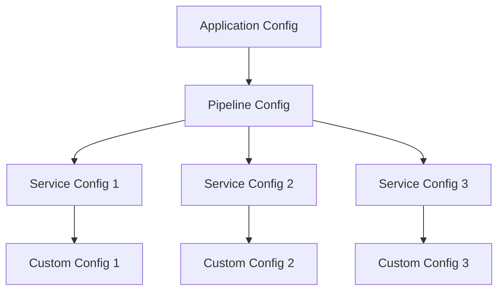
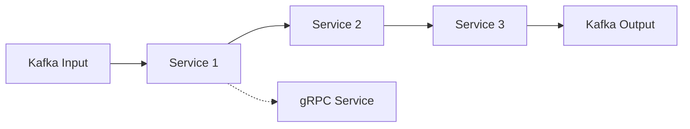

# Configuration Guide for Consul Config Service

## Overview

This guide explains the different types of configurations in the Consul Config Service and how they relate to each other. It also provides examples of how to create custom configurations and register new services to the cloud.

## Configuration Types

### Pipeline Configuration

A **Pipeline Configuration** represents the overall configuration for a data processing pipeline. It contains:

- A name for the pipeline
- A collection of service configurations
- Version information for optimistic locking
- Timestamp information for when the pipeline was last updated

Pipelines are the top-level configuration entity that organizes multiple services into a coherent data processing flow.

### Service Configuration

A **Service Configuration** represents the configuration for a specific service within a pipeline. It contains:

- A name for the service instance
- The service implementation class
- Input sources (Kafka topics it listens to)
- Output destinations (Kafka topics it publishes to and gRPC services it forwards to)
- Custom configuration parameters
- JSON configuration options

Services are the building blocks of a pipeline, each performing a specific data processing task.

### Custom Configuration

A **Custom Configuration** is a JSON-based configuration specific to a service implementation. It contains:

- A JSON configuration string that follows a predefined schema
- A JSON schema string that defines the structure and validation rules for the configuration

Custom configurations allow for flexible, schema-validated configuration of services with complex requirements.

### Application Configuration

An **Application Configuration** represents the overall configuration for the application. It contains:

- The application name
- Flags indicating whether the configuration has been initialized

Application configuration is separate from pipeline and service configurations and focuses on application-level settings.

## Relationships Between Configuration Types



- An application can have multiple pipeline configurations
- Each pipeline configuration can have multiple service configurations
- Each service configuration can have its own custom configuration

## Service Types in a Pipeline

In a pipeline architecture, services can be categorized into several types based on their role:

### Crawler Services
Crawlers help "seed" the application by discovering data sources and passing them to connectors. Examples include:
- Wikipedia crawler: Downloads dump files for processing
- S3 crawler: Lists content from S3 buckets
- JDBC crawler: Queries databases for data or IDs

### Connector Services
Connectors retrieve the actual data from sources identified by crawlers. They:
- Connect to data sources (JDBC, S3, etc.)
- Retrieve raw data without parsing
- Pass data to parser services with metadata

### Parser Services
Parsers transform raw data into structured PipeDoc objects:
- Wikipedia article parser: Converts wiki markup to structured text
- Tika parser: Extracts text and metadata from various file formats
- Custom parsers for specific data formats

### Processor Services
Processors perform operations on parsed data:
- NER (Named Entity Recognition)
- Chunking: Breaking text into manageable pieces
- Embedding: Converting text to vector representations
- Classification: Categorizing content

### Sink Services
Sinks store processed data in destination systems:
- Solr/Elasticsearch indexer
- Database writer
- S3 storage service

## Creating a Custom Configuration

To create a custom configuration for a service:

1. **Register a Schema**: First, register a JSON schema for the service implementation:

```bash
curl -X PUT http://localhost:8080/api/schemas/com.example.MyCustomService \
  -H "Content-Type: application/json" \
  -d '{
    "type": "object",
    "properties": {
      "host": {
        "type": "string",
        "description": "Hostname for the custom service"
      },
      "port": {
        "type": "integer",
        "minimum": 1,
        "maximum": 65535
      },
      "retries": {
        "type": "integer",
        "default": 3
      }
    },
    "required": ["host", "port"]
  }'
```

2. **Create a Pipeline**: Create a new pipeline or use an existing one:

```bash
curl -X POST http://localhost:8080/api/pipelines \
  -H "Content-Type: application/json" \
  -d '{"name": "my-pipeline"}'
```

3. **Add a Service with Custom Configuration**: Add a service to the pipeline with custom configuration:

```bash
# First, get the current pipeline configuration
curl -X GET http://localhost:8080/api/pipelines/my-pipeline > pipeline.json

# Edit the pipeline.json file to add the service with custom configuration
# Then, update the pipeline
curl -X PUT http://localhost:8080/api/pipelines/my-pipeline \
  -H "Content-Type: application/json" \
  -d @pipeline.json
```

Here's an example of what the service configuration in `pipeline.json` might look like:

```json
{
  "name": "my-pipeline",
  "services": {
    "myCustomServiceInstance": {
      "name": "myCustomServiceInstance",
      "serviceImplementation": "com.example.MyCustomService",
      "kafkaListenTopics": ["input-topic"],
      "kafkaPublishTopics": ["output-topic"],
      "jsonConfig": {
        "jsonConfig": "{\"host\": \"service.example.com\", \"port\": 9090}",
        "jsonSchema": "{\"type\": \"object\", \"properties\": {\"host\": {\"type\": \"string\"}, \"port\": {\"type\": \"integer\", \"minimum\": 1, \"maximum\": 65535}}, \"required\": [\"host\", \"port\"]}"
      }
    }
  },
  "pipelineVersion": 1,
  "pipelineLastUpdated": "2023-01-01T00:00:00"
}
```

## Pipeline Data Flow



- Services can receive data from Kafka topics or gRPC calls
- Services can send data to Kafka topics or forward to other services via gRPC
- The pipeline configuration defines how data flows between services

## Configuration Storage

All configurations are stored in Consul's Key-Value store with the following structure:

```
config/pipeline/pipeline.configs/<pipeline-name>/version
config/pipeline/pipeline.configs/<pipeline-name>/lastUpdated
config/pipeline/pipeline.configs/<pipeline-name>/services/<service-name>/name
config/pipeline/pipeline.configs/<pipeline-name>/services/<service-name>/serviceImplementation
config/pipeline/pipeline.configs/<pipeline-name>/services/<service-name>/kafkaListenTopics
config/pipeline/pipeline.configs/<pipeline-name>/services/<service-name>/kafkaPublishTopics
config/pipeline/pipeline.configs/<pipeline-name>/services/<service-name>/grpcForwardTo
config/pipeline/pipeline.configs/<pipeline-name>/services/<service-name>/configParams/<param-name>
config/pipeline/pipeline.configs/<pipeline-name>/services/<service-name>/jsonConfig/jsonConfig
config/pipeline/pipeline.configs/<pipeline-name>/services/<service-name>/jsonConfig/jsonSchema
config/pipeline/schemas/<service-implementation>
```

## Registering a New Service to the Cloud

Once you've implemented a new pipeline service by extending the `PipelineServiceProcessor` interface, you need to register it to make it available in the cloud. This section guides you through the process.

### Prerequisites

Before registering a new service, ensure you have:

1. Implemented a service that extends `PipelineServiceProcessor`
2. Built and packaged your service as a deployable artifact
3. Access to the Consul server where configurations are stored

### Registration Process

#### 1. Define Your Service Configuration

Create a JSON file that defines your service configuration:

```json
{
  "name": "my-custom-processor",
  "serviceImplementation": "com.example.MyCustomProcessor",
  "kafkaListenTopics": ["input-topic-1", "input-topic-2"],
  "kafkaPublishTopics": ["output-topic"],
  "grpcForwardTo": ["next-service-name"],
  "configParams": {
    "param1": "value1",
    "param2": "value2"
  }
}
```

#### 2. Register the Service to a Pipeline

Use the API to add your service to an existing pipeline:

```bash
# First, check if the pipeline exists
curl -X GET http://localhost:8080/api/pipelines

# Add your service to the pipeline
curl -X PUT http://localhost:8080/api/pipeline/config/my-pipeline/service \
  -H "Content-Type: application/json" \
  -d @my-service-config.json
```

#### 3. Verify the Registration

Confirm that your service has been registered correctly:

```bash
# Check the pipeline configuration
curl -X GET http://localhost:8080/api/pipeline/config
```

#### 4. Deploy Your Service

Deploy your service to the cloud environment:

1. Package your service as a container image
2. Deploy the container to your cloud environment
3. Configure the service to connect to Kafka and Consul
4. Start the service

### Service Configuration Properties

When registering a service, you need to specify the following properties:

| Property | Description | Required |
|----------|-------------|----------|
| `name` | Unique name for the service instance | Yes |
| `serviceImplementation` | Fully qualified class name of your implementation | Yes |
| `kafkaListenTopics` | List of Kafka topics to consume messages from | No |
| `kafkaPublishTopics` | List of Kafka topics to publish messages to | No |
| `grpcForwardTo` | List of service names to forward messages to via gRPC | No |
| `configParams` | Map of configuration parameters specific to your service | No |

## Creating a New Cluster

A cluster in the context of this system refers to a complete pipeline configuration that can process data independently. This section explains how to create a new cluster from scratch.

### Prerequisites

Before creating a new cluster, ensure you have:

1. Access to the Consul server
2. Knowledge of the services you want to include in your pipeline
3. Understanding of the data flow between services

### Cluster Creation Process

#### 1. Plan Your Pipeline

Before creating a cluster, plan your pipeline architecture:

1. Identify the data sources (crawlers/connectors)
2. Determine the parsing and processing steps
3. Define the output destinations (sinks)
4. Map the data flow between services

#### 2. Create a New Pipeline

Use the API to create a new pipeline:

```bash
curl -X POST http://localhost:8080/api/pipelines \
  -H "Content-Type: application/json" \
  -d '{"name": "my-new-pipeline"}'
```

#### 3. Add Services to the Pipeline

For each service in your planned pipeline, create a service configuration and add it to the pipeline:

```bash
# Add a crawler service
curl -X PUT http://localhost:8080/api/pipeline/config/my-new-pipeline/service \
  -H "Content-Type: application/json" \
  -d '{
    "name": "s3-crawler",
    "serviceImplementation": "com.example.S3CrawlerService",
    "kafkaPublishTopics": ["s3-file-list"]
  }'

# Add a connector service
curl -X PUT http://localhost:8080/api/pipeline/config/my-new-pipeline/service \
  -H "Content-Type: application/json" \
  -d '{
    "name": "s3-connector",
    "serviceImplementation": "com.example.S3ConnectorService",
    "kafkaListenTopics": ["s3-file-list"],
    "kafkaPublishTopics": ["raw-documents"]
  }'

# Continue adding services for your complete pipeline
```

#### 4. Verify the Pipeline Configuration

Check that your pipeline is configured correctly:

```bash
curl -X GET http://localhost:8080/api/pipelines/my-new-pipeline
```

#### 5. Deploy the Services

Deploy all the services that are part of your pipeline:

1. Package each service as a container image
2. Deploy the containers to your cloud environment
3. Configure each service to connect to Kafka and Consul
4. Start the services

#### 6. Test the Pipeline

Send test data through your pipeline to verify that it works correctly:

1. Inject test data into the first service's input topic
2. Monitor the message flow through the pipeline
3. Verify that the data is processed correctly and reaches the sink

## Configuring a Pipeline After Coding

After you've implemented and deployed your pipeline services, you may need to adjust their configuration. This section explains how to configure a pipeline after it's been coded and deployed.

### Configuration Options

There are several ways to configure a pipeline after coding:

1. **Update Service Configuration**: Modify the configuration of individual services
2. **Add/Remove Services**: Add new services or remove existing ones from the pipeline
3. **Change Data Flow**: Modify the Kafka topics or gRPC forwarding to change the data flow
4. **Update Custom Configuration**: Modify the JSON configuration for services with custom requirements

### Updating Service Configuration

To update the configuration of an existing service:

```bash
curl -X PUT http://localhost:8080/api/pipeline/config/my-pipeline/service \
  -H "Content-Type: application/json" \
  -d '{
    "name": "existing-service",
    "serviceImplementation": "com.example.ExistingService",
    "kafkaListenTopics": ["new-input-topic"],
    "kafkaPublishTopics": ["new-output-topic"],
    "configParams": {
      "batchSize": "100",
      "timeout": "5000"
    }
  }'
```

### Adding a New Service

To add a new service to an existing pipeline:

```bash
curl -X PUT http://localhost:8080/api/pipeline/config/my-pipeline/service \
  -H "Content-Type: application/json" \
  -d '{
    "name": "new-service",
    "serviceImplementation": "com.example.NewService",
    "kafkaListenTopics": ["input-topic"],
    "kafkaPublishTopics": ["output-topic"]
  }'
```

### Removing a Service

To remove a service from a pipeline:

```bash
curl -X DELETE http://localhost:8080/api/pipeline/config/my-pipeline/service/service-to-remove
```

### Changing the Active Pipeline

If you have multiple pipelines configured, you can change which one is active:

```bash
curl -X POST http://localhost:8080/api/pipelines/active \
  -H "Content-Type: application/json" \
  -d '{"name": "my-other-pipeline"}'
```

## Implementation Gaps and Future Enhancements

While the current system provides a solid foundation for configuring and managing pipelines, there are some areas that could be enhanced:

### Dynamic Service Discovery

**Current State**: Services need to be manually registered and configured.

**Enhancement**: Implement automatic service discovery where new services can register themselves with the system.

### Pipeline Visualization

**Current State**: Pipeline configuration is stored as text-based configuration.

**Enhancement**: Develop a visual interface for designing and monitoring pipelines.

### Configuration Validation

**Current State**: Basic validation of configuration properties.

**Enhancement**: Implement comprehensive validation that checks for circular references, missing dependencies, and other potential issues.

### Versioned Configurations

**Current State**: Limited versioning support.

**Enhancement**: Implement full versioning of pipeline configurations with rollback capabilities.

### A/B Testing Support

**Current State**: Multiple pipelines can be configured, but switching between them is manual.

**Enhancement**: Add support for automatic A/B testing of different pipeline configurations.

## Conclusion

The Consul Config Service provides a flexible and powerful configuration system for data processing pipelines. By understanding the different configuration types and their relationships, you can create complex, customized pipelines that meet your specific requirements.

With the ability to register new services, create new clusters, and configure pipelines after coding, you have the tools to build and maintain sophisticated data processing systems. As the system evolves, the identified gaps will be addressed to provide an even more robust and user-friendly experience.
