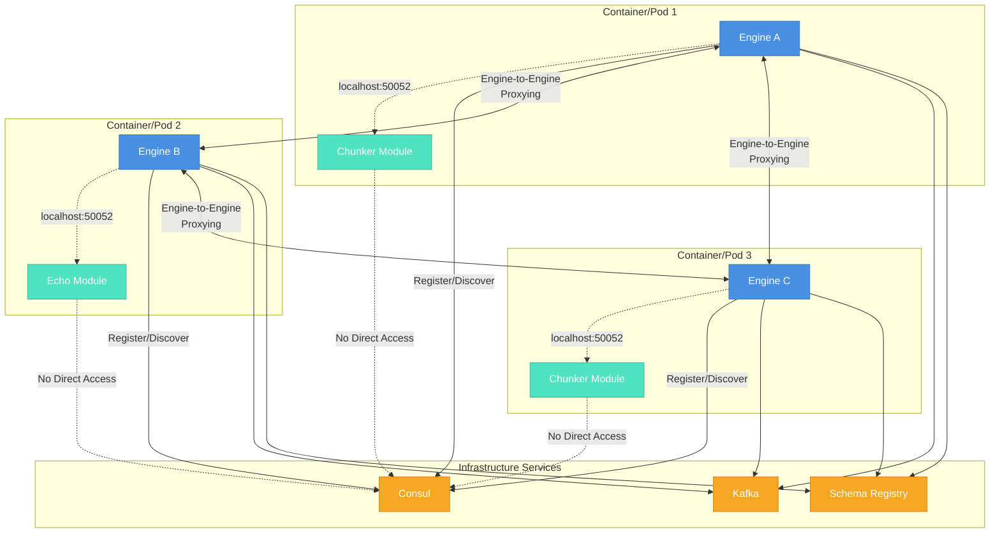
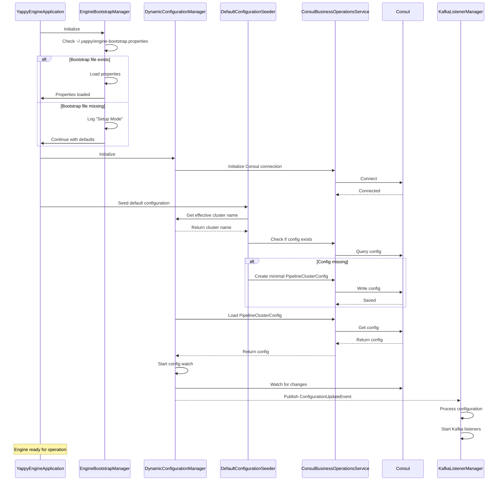
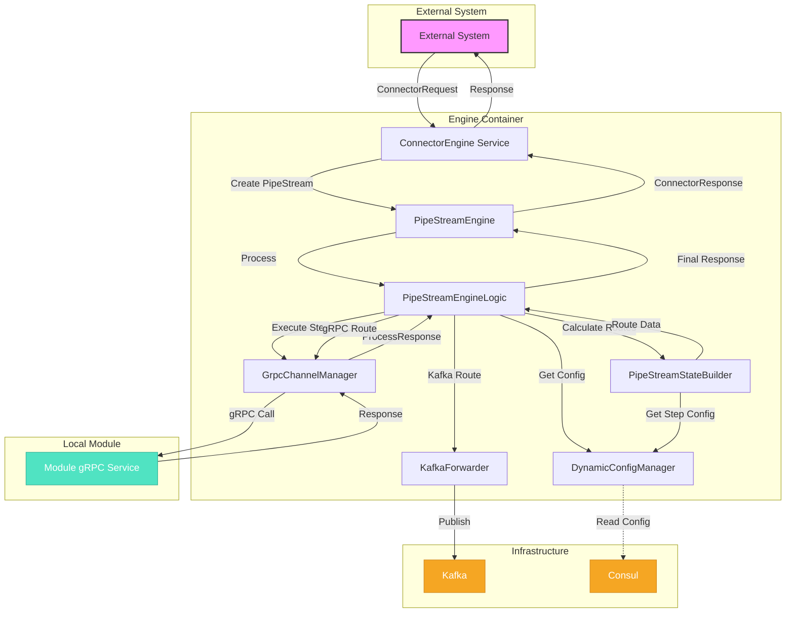
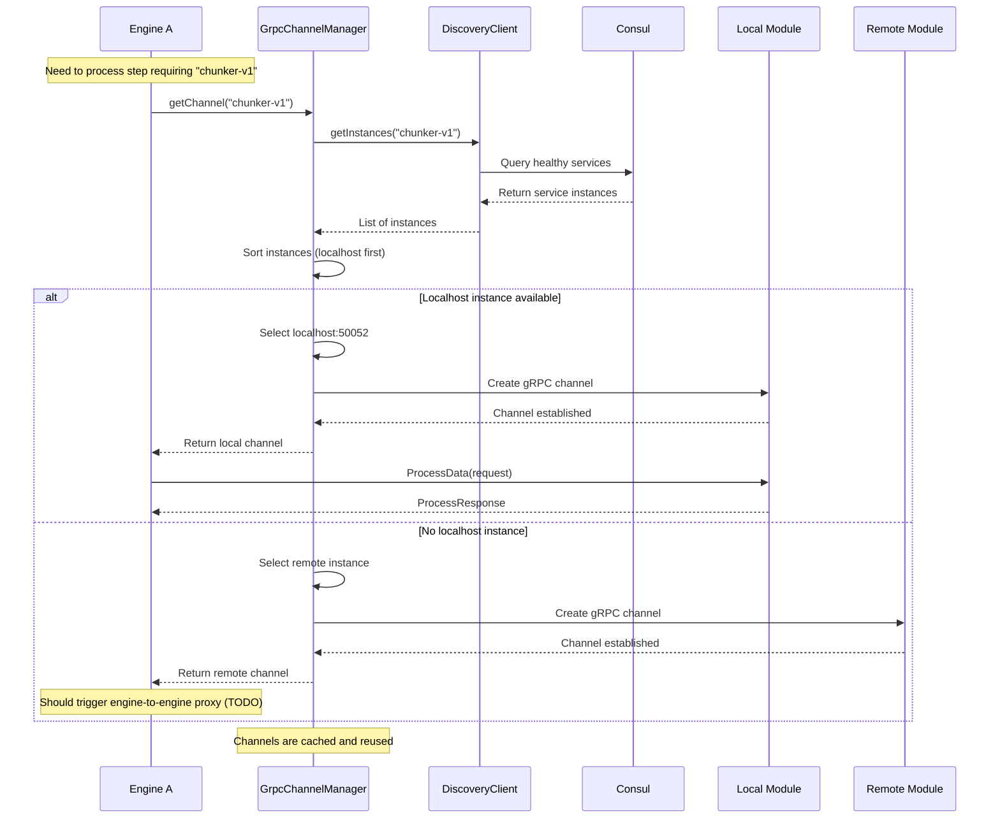
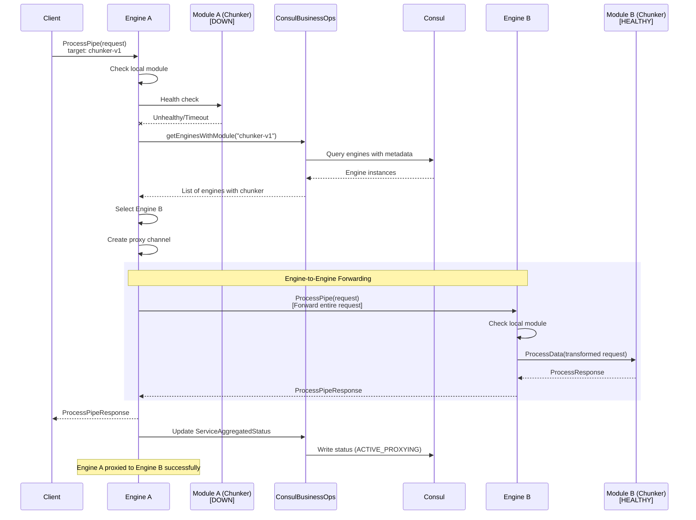

# YAPPY Engine: Comprehensive Development and Integration Plan

## I. Foundational Principle: User-Centric Design & Operational Excellence

This plan aims to create a YAPPY Engine that is not only powerful and flexible but also easy to set up, configure, monitor, and manage. We prioritize a smooth initial bootstrapping experience which then enables more advanced operational capabilities like detailed status reporting, robust service lifecycle management, and comprehensive health checking.

**Architectural Note:** The Yappy Engine operates as a distributed system where each deployment unit consists of an Engine instance co-located with a Module instance (e.g., same container/pod). This creates a mesh of engine+module pairs across the cluster. Key principles:
* **Deployment Pattern:** Each container/pod runs ONE Engine instance + ONE Module instance together
* **Module Simplicity:** Modules are vanilla gRPC services with NO awareness of Consul, engines, or orchestration
* **Engine Responsibilities:** ONLY engines interact with Consul - they handle all service discovery, registration, and configuration management
* **Engine-to-Engine Mesh:** When an engine's local module is unavailable, it forwards requests to another engine (not directly to modules)
* **Typical Deployment:** Multiple engine+module containers are deployed, each potentially with different module types (e.g., Container 1: Engine A + Chunker Module, Container 2: Engine B + Echo Module, etc.)

### Deployment Architecture Diagram

The following diagram illustrates how Engine+Module pairs are deployed across a cluster:



This diagram shows:
- Each container/pod contains one Engine and one Module
- Engines communicate with infrastructure services (Consul, Kafka, Schema Registry)
- Modules have no direct access to infrastructure services
- Engines can proxy requests to other engines when needed

## II. Part A: Initial Engine Bootstrapping & Cluster Association

This part focuses on getting a YAPPY Engine instance minimally operational and connected to its coordination layer (Consul) and an active YAPPY cluster configuration.

**Status Update:** This phase is largely successful and stable. 

The engine:
* Reliably connects to Consul 
  * using standard Micronaut configuration: `application.yml`, environment variables) 
  * `DynamicConfigurationManagerImpl` loads its active cluster configuration.
* The "Setup Mode" triggered by the absence of `~/.yappy/engine-bootstrap.properties` (handled by `EngineBootstrapManager`) primarily pertains to setting explicit Consul connection parameters if they are not available through standard means, and for interactively managing cluster definitions/selection via the `BootstrapConfigService` gRPC interface.

### Phase A.1: Consul Connection Bootstrap

1.  **Engine Startup: Check**
    * This is when the java application first starts, it checks for configuration - mainly that it can connect to consul, kafka, a 
      schema registry.  If it's not configured, it attempts to configure a vanilla instance.
    * **Status:** Implemented. The engine relies on standard Micronaut configuration for Consul details. `ConsulClientFactory`, `ConsulBusinessOperationsService`, and `ConsulConfigFetcher` initialize based on these.
    * **If Configured:** Proceeds to Phase A.2.
    * **If NOT Configured (fundamental host/port missing):** Micronaut's own Consul client initialization will fail, preventing full startup. The `EngineBootstrapManager` also logs if its specific bootstrap file is missing, offering a path to set these via the gRPC API.

2.  **"Setup Mode": Getting Consul Details (for `engine-bootstrap.properties`)**
    * **Status:** `BootstrapConfigServiceImpl` gRPC service exists for this.
    * **API-Driven (Primary):** `BootstrapConfigService.SetConsulConfiguration(ConsulConfigDetails) returns (ConsulConnectionStatus)`.
    * **(Optional) UI for Dev/Testing:** (Future)

3.  **Making the Connection & Remembering It (via `engine-bootstrap.properties`)**
    * **Status:** `BootstrapConfigServiceImpl` implements saving to `engine-bootstrap.properties`.
    * A restart is generally recommended if these bootstrap properties are changed to ensure all Micronaut components pick up new fundamental Consul connection settings.

### Phase A.2: Yappy Cluster Initialization & Configuration Loading

*(This phase executes once the engine has successfully connected to Consul)*

**Note on Cluster Names & Configuration:**
* The primary active cluster for an engine instance is determined by the `app.config.cluster-name` property (from `application.yml` or other Micronaut configuration sources).
* `DefaultConfigurationSeeder` runs at startup to ensure that this default/active cluster has at least a minimal valid `PipelineClusterConfig` present in Consul if one doesn't already exist.
* The `BootstrapConfigService` gRPC interface allows for listing other clusters present in Consul, selecting a different cluster (by updating `engine-bootstrap.properties`, which would then influence `app.config.cluster-name` on next effective load), and creating new clusters (which seeds a minimal config via `ConsulBusinessOperationsService`).

### Bootstrap Flow Diagram

The following diagram shows the engine startup and configuration loading process:



This diagram illustrates:
- The bootstrap process checking for existing configuration
- Default configuration seeding if needed
- Configuration loading from Consul
- Event-driven initialization of components like KafkaListenerManager

1.  **Cluster Choice Time & Management: API**
    * **Status:** `BootstrapConfigService` (gRPC) provides:
        * `ListAvailableClusters`
        * `SelectExistingCluster`
        * `CreateNewCluster`
    * These primarily interact with Consul (via `ConsulBusinessOperationsService`) and the `engine-bootstrap.properties` file.

2.  **Planting the Seed for a New Cluster (via `CreateNewCluster` or `DefaultConfigurationSeeder`)**
    * **Status:** Implemented. Both `DefaultConfigurationSeeder` (for the default active cluster) and `BootstrapConfigServiceImpl.createNewCluster()` (for interactively creating new ones) use `ConsulBusinessOperationsService` to write a default, minimal, valid `PipelineClusterConfig` to Consul (e.g., under `yappy/pipeline-configs/clusters/<cluster-name>`).
    * **Seed Configuration Details:** Minimal (empty graphs/maps, default names, empty allowed lists).


### Phase A.3: Showtime! – Transition to Normal Operation

**Status Update:** This phase is now stable and working as expected.
1.  **Full Steam Ahead**
    * The engine performs its full startup.
    * `DynamicConfigurationManagerImpl` (DCM) loads the `PipelineClusterConfig` for its `effectiveClusterName` from Consul. Its initial event publication is deferred until after its `@PostConstruct` completes, preventing DI loops.
    * TODO: The Engine instance itself registers with Consul via `ConsulBusinessOperationsService`. 
    * *(This needs to be implemented/verified 
      if it's not already automatic via Micronaut's `consul.client.registration.enabled=true` for the engine app itself).*
    * `KafkaListenerManager` receives the configuration event (asynchronously) and will attempt to start listeners if defined in the loaded `PipelineClusterConfig`.
    * Other operational components are initialized.
    * The "Setup Mode" (from `EngineBootstrapManager`) is secondary to the primary configuration loading path if `application.yml` provides sufficient details.

## III. Part B: Enhanced Engine Operations within a Cluster

*(This part assumes the engine has successfully completed Part A and is operating with a loaded Yappy cluster configuration)*

### Request Processing Flow Diagram

The following diagram shows the normal flow when everything is healthy:



This diagram illustrates:
- External systems use ConnectorEngine as entry point
- PipeStreamEngine orchestrates the processing
- Configuration is loaded from Consul via DynamicConfigManager
- Local modules are called via GrpcChannelManager
- Results can be routed via Kafka or gRPC based on configuration
- The entire flow is asynchronous and event-driven

### Phase B.1: Define Core Status Models & Schema

1.  **`ServiceOperationalStatus.java` (Enum):**
    *   Implement the enum with states: `UNKNOWN`, `DEFINED`, `INITIALIZING`, `AWAITING_HEALTHY_REGISTRATION`, `ACTIVE_HEALTHY`, `ACTIVE_PROXYING`, `DEGRADED_OPERATIONAL`, `CONFIGURATION_ERROR` (covering `BAD_SCHEMA`, `BAD_CONFIG`), `UNAVAILABLE`, `UPGRADING`, `STOPPED`.
2.  **`ServiceAggregatedStatus.java` (Java Record):**
    *   Implement the record with fields: `serviceName`, `operationalStatus`, `statusDetail`, `lastCheckedByEngineMillis`, `totalInstancesConsul`, `healthyInstancesConsul`, `isLocalInstanceActive`, `activeLocalInstanceId`, `isProxying`, `proxyTargetInstanceId`, `isUsingStaleClusterConfig`, `activeClusterConfigVersion`, `reportedModuleConfigDigest`, `errorMessages`, `additionalAttributes`.
    *   This record will be serialized to JSON for storage in Consul KV.
3.  **Schema for `ServiceAggregatedStatus`:**
    *   Generate and document the JSON schema for `ServiceAggregatedStatus` for API consumers.

### Phase B.2: Implement Engine Logic for Status Management

1.  **Develop Engine Component for Status Aggregation:**
    *   This component will:
        *   Monitor Consul service health and registrations (via `ConsulBusinessOperationsService`).
        *   Observe the state of any locally managed modules.
        *   Track the active `PipelineClusterConfig` version (from `DynamicConfigurationManager`).
        *   Detect `BAD_SCHEMA` (e.g., schema registry issues, unparsable schemas from Consul) and `BAD_CONFIG` (module config failing validation against its schema, potentially reported by the module's own health check).
        *   Calculate `ServiceOperationalStatus` and populate `ServiceAggregatedStatus` for each logical service in `PipelineClusterConfig.pipelineModuleMap`.
2.  **Consul KV Updates for Status:**
    *   The engine will periodically (or event-driven on relevant changes) update the `ServiceAggregatedStatus` JSON object in Consul KV at a path like `yappy/status/services/{logicalServiceName}` using `ConsulBusinessOperationsService.putValue()`.

### Phase B.3: Enhance Engine Logic for Service Registration & Lifecycle

1.  **Implement "Bootstrap Cluster" Refinement (Engine Self-Healing for Empty Config):**
    * **Status:** This is effectively handled by `DefaultConfigurationSeeder`.

2.  **Module Discovery Pattern:**
    * **Clarified Architecture:** Modules are discovered by Engines through Consul service discovery, NOT through self-registration.
    * **Module Behavior:** Modules are simple gRPC services that:
        * Register themselves with Consul using standard Consul mechanisms (agent, API, or Kubernetes integration)
        * Expose their gRPC service endpoints
        * Provide health check endpoints
        * Have no knowledge of the Yappy Engine or its registration patterns
    * **Engine Discovery Process:**
        * The Engine uses `GrpcChannelManager` to discover available module instances from Consul
        * Discovery is based on service names that match module `implementationId` values
        * The Engine prioritizes localhost instances when available (localhost-first logic)
        * **Status:** Localhost-first logic is COMPLETED in `GrpcChannelManager`

### Module Discovery Flow Diagram

The following diagram shows how engines discover modules through Consul:



This diagram shows:
- Engines query Consul for module instances
- Localhost instances are prioritized
- Direct connections to modules (engine-to-engine proxying not shown here)
- Channel caching for performance

3.  **Implement Engine-to-Engine Proxying Logic:**
    * **TODO - High Priority:** When an Engine cannot find a local module instance for a request:
        * The Engine should forward the entire request to another Engine instance that has the required module available
        * This is ENGINE-TO-ENGINE forwarding, not module-to-module
        * The receiving Engine processes the request with its local module and returns the response
        * Update the service's `ServiceAggregatedStatus` in KV to `ACTIVE_PROXYING`
    * **Implementation Notes:**
        * Engines discover each other through Consul (they register themselves)
        * The proxying Engine acts as a transparent proxy, forwarding the complete gRPC request
        * This allows for resilient processing even when modules are not evenly distributed

### Engine-to-Engine Proxying Flow Diagram

The following diagram illustrates what happens when a local module is down:



This diagram shows:
- Engine A's local module is down
- Engine A discovers other engines with the same module type
- Engine A forwards the entire request to Engine B
- Engine B processes with its healthy local module
- Status is updated to reflect proxying state

### Phase B.4: Implement Health Check Integration

1.  **Engine Health Indicator:**
    *   Create a Micronaut `HealthIndicator` for the YAPPY Engine.
    *   Its health check will verify:
        *   Consul client connectivity and availability.
        *   `DynamicConfigurationManager` status (e.g., current `PipelineClusterConfig` is loaded, valid, and not unexpectedly stale).
        *   Aggregated health of critical services required by *active* pipelines (by reading from `yappy/status/services/*` KV).
2.  **Module Health Endpoint Mandate & Consumption:**
    *   Formalize the requirement that all YAPPY modules (gRPC services) expose a standard health check endpoint (HTTP or gRPC Health Checking Protocol).
    *   This module health check *must* include the status of its own configuration (i.e., is its `customConfigJson` valid against its declared schema?). If the module's config is bad, it must report itself as unhealthy.
    *   The engine's status aggregation component (Phase B.2) will use this information when determining `ServiceOperationalStatus`.

### Phase B.5: Expose Status and Configuration via API (Initial Focus on JSON/HTTP for UI)

**Status Update (May 28, 2025):** Implementation of several admin REST API endpoints is substantially complete, with controllers and DTOs developed. Corresponding tests (unit and integration-style) have also been created, though some are currently failing and require environment stabilization and debugging (see 'Current Focus'). These APIs leverage existing backend services like `EngineBootstrapManager`, `KafkaListenerManager`, `DynamicConfigurationManager`, and `ConsulBusinessOperationsService`.
    
1.  **Create REST Controllers in the Engine:**
    * `GET /api/status/engine`
      * **Status:** Implemented in `AdminStatusController.java`. (Tests in `AdminStatusControllerTest.java` have `initializationError` - needs investigation).
    * `GET /api/status/services` & `GET /api/status/services/{serviceName}`
      * **Status:** `GET /api/status/services` implemented in `AdminStatusController.java`. Individual service status endpoint (`/{serviceName}`) status needs to be confirmed.
    * `GET /api/config/cluster` (calls DCM)
      * **Status:** Appears to be covered by `AdminSetupController.java` (`GET /api/setup/clusters` and potentially `GET /api/setup/cluster/{clusterName}/config` if added). Review specific DCM calls.
    * `PUT /api/config/cluster` (calls DCM/ConsulBusinessOps to save, then relies on watch)
      * **Status:** Likely related to `AdminSetupController.java` `POST /api/setup/clusters` (for creation) and potentially needs a 
      dedicated PUT for updates. Requires confirmation of DCM/ConsulBusinessOps integration for full update and watch cycle.

   * **Kafka Consumer Management APIs** (Pause/Resume/Reset Offsets, List Statuses - calling `KafkaListenerManager`)
       * **Status:**
           * List Statuses: Implemented in `AdminKafkaController.java` (`GET /api/kafka/consumers/status`).
           * Pause/Resume: Implemented in `AdminKafkaController.java` (`POST /api/kafka/consumers/pause`, `POST /api/kafka/consumers/resume`).
           * (Reset Offsets: Status needs confirmation).
       * (Tests in `AdminKafkaControllerTest.java` and `AdminKafkaControllerFirstTest.java` - `initializationError` noted in the latter).
     * **Module Management APIs** (List configured, Get Status, Trigger Register/Deregister - calling DCM and `ConsulBusinessOperationsService` via a new `ModuleLifecycleManagerService`)
       * **Status:** This is the area detailed in Section VII. The gRPC service `YappyModuleRegistrationServiceImpl.java` allows modules to register. The admin REST APIs for *operator-triggered* registration/deregistration from Section VII still need their implementation status confirmed against the provided controller code. (Are these covered by `AdminSetupController` or another controller I haven't seen yet, or are they still pending?)

### Phase B.6: Testing for Enhanced Operations

1.  **Unit Tests:**
    * **Status:** `DynamicConfigurationManagerImplTest` is passing. `DefaultPipeStreamEngineLogicImplTest` needs completion. Tests for `KafkaListenerManager`'s synchronization logic are needed.
2.  **Integration Tests:**
    * **`KafkaListenerManagerIntegrationTest`:** **PASSING!** Confirms Apicurio properties are correctly processed in the test environment.
    * **Next Integration Test:** Focus on end-to-end Kafka listener functionality in the running application (verifying Apicurio settings from `application-dev.yml` and message consumption). (See Section VII Task 1)
    * Then, integration tests for Engine-Managed Module Registration. (See Section VII Task 2)

## IV. Future Integration Testing & Advanced Features (Beyond Initial Setup & Core Operations)

This section covers the broader testing and feature development outlined in the original "Next Steps for YAPPY Project Integration Testing" and "Future Steps" sections of `current_instructions.md`. These will build upon the stable foundation established by Parts A and B.

1.  **Integration Tests with Actual Modules (Echo & Chunker):**
    *   Adapt existing integration tests or create new ones in `yappy-engine` to use the *actual* Echo and Chunker module implementations from the `yappy-modules` directory, rather than mocks. This will involve managing multiple service contexts within a single test, likely using Testcontainers for shared infrastructure (Consul, Kafka, Schema Registry).
    *   **Test Configuration Management:** Explore using dedicated test YAML files per service context (e.g., `application-test-echo.yml`) for clarity.
2.  **Test Kafka Serialization of `PipeStream` Objects:**
    *   Implement the Kafka serialization/deserialization test for `PipeStream` as outlined.
3.  **Test End-to-End gRPC Flow (Engine Orchestrating Modules):**
    *   Create tests where the YAPPY Engine receives a request (e.g., via `processPipe` or `processConnectorDoc`) and orchestrates calls to actual Echo and Chunker modules discovered via Consul.
4.  **Test Combined Kafka and gRPC Flow:**
    *   Implement the test for a pipeline that involves both Kafka message passing and gRPC calls between steps, using actual modules.
5.  **Schema Registry Integration & Testing:**
    *   Ensure schemas are pre-registered or registered during test setup.
    *   Test Kafka flows that require schema validation (Apicurio/Glue), ensuring all service contexts point to the same Testcontainer-managed schema registry.
6.  **Admin API Usage in Tests:**
    *   As Admin APIs for managing `PipelineClusterConfig`, `PipelineConfig`, module registration, etc., are developed (from "Admin Features Left to Implement"), incorporate their use into integration tests for setup and configuration, rather than always seeding Consul directly.
7.  **Advanced Feature Implementation & Testing (from original document):**
    *   **Admin Features:** Module validation service, module registration API, containerization strategies, live config updates for modules, module health monitoring.
    *   **Observability:** Metrics, distributed tracing, logging, alerting, dashboards.
    *   **Search Features:** Search API, analytics, white-labeling.
    *   **Pipeline Editor & Dashboard.**
    *   **Connectors & Sinks:** Python examples, Wikipedia/Common Crawl connectors, OpenSearch/Docstore sinks.
    *   **Error Handling, Idempotency, Retries, Security.**

This unified plan should provide a clear roadmap, allowing for parallel work where appropriate and ensuring that foundational pieces are in place before building more complex features on top.

---
## V. Current Focus & Next Development Tasks for Yappy Engine

This section should reflect the failing tests and the environment hardening.
* **New/Updated Task: Stabilize Test Environments and Resolve Failing Admin API Tests:**
    * **Status:** Critical. Numerous tests for the newly implemented Admin REST APIs are failing.
        * `AdminSetupControllerTest`: `testGetCurrentConsulConfiguration_ErrorReadingFile`
        * `AdminSetupControllerFirstTest`: Multiple failures related to Consul/cluster operations (file handling, Consul interactions).
        * `AdminKafkaControllerFirstTest`: `initializationError`.
        * `AdminStatusControllerTest`: `initializationError`.
    * **Action:**
        * Investigate and resolve the root causes of these test failures. This likely involves "getting environments under control" by ensuring proper mock setups, Testcontainer configurations, bootstrap property handling in tests, and bean initializations for the test context.
        * Verify interactions with `EngineBootstrapManager.java`, `ConsulBusinessOperationsService.java`, and `KafkaListenerManager`.
    * **Goal:** Achieve green tests for all existing admin API controller tests to ensure reliability.

1.  **Verify Apicurio Property in Running `KafkaListenerManager`:**
    * **Status:** Pending final verification in main application run.
    * **Action:** Add diagnostic logging to `KafkaListenerManager` constructor (inject `Environment`, log active profiles, log `@Value` field vs. manual `applicationContext.getProperty("kafka.schema.registry.type", String.class)`). Run the main application. If `@Value` is still problematic, set the field using `applicationContext.getProperty()`.
    * **Goal:** Ensure `KafkaListenerManager` logs `schema registry type: 'apicurio'` in the running application.

2.  **Integration Test: End-to-End Dynamic Kafka Listener Functionality:**
    * **Status:** Next new test to be developed.
    * **Action:** Create an integration test (`DynamicKafkaListenerE2ETest.java`).
        * Setup: `@MicronautTest`, use Testcontainers for Consul/Kafka/Apicurio. Seed `PipelineClusterConfig` with a Kafka input step into test Consul.
        * Test: Start Yappy Engine. Verify `KafkaListenerManager` creates a listener with correct Apicurio properties. Produce a Protobuf message. Verify consumption and processing by `DefaultPipeStreamEngineLogicImpl`.
    * **Goal:** Confirm dynamic Kafka listeners work end-to-end with Apicurio deserialization in the main application context.

3.  **Complete Engine-to-Engine Proxying Implementation**
    * **Status:** TODO - This is the next major feature after localhost-first (which is completed)
    * **Requirements:**
        * Implement request forwarding logic in the Engine's gRPC service handlers
        * Add Engine discovery logic to find other Engine instances via Consul
        * Implement transparent proxying that preserves the original request/response
        * Update status tracking to reflect when an Engine is proxying requests
    * See updated **Section VII** below for implementation details.

4.  **Unit Test `DefaultPipeStreamEngineLogicImpl`:**
    * **Status:** Pending/In Progress.
    * **Action:** Complete the unit tests for `DefaultPipeStreamEngineLogicImpl`, covering its core processing logic, retries, error handling, and routing calculations.

## Future Steps

### 1. Test Kafka Serialization of PipeStream Objects

Create a test that demonstrates serializing and deserializing PipeStream objects through Kafka:

```java
@Test
void testKafkaSerialization() {
    // Create a PipeStream object with test data
    PipeStream pipeStream = PipeStream.newBuilder()
        .setStreamId("test-stream-" + System.currentTimeMillis())
        .setCurrentPipelineName("test-pipeline")
        .setTargetStepName("echo-step")
        .setDocument(createTestDocument())
        .build();

    // Produce to Kafka
    ProducerRecord<String, PipeStream> record = 
        new ProducerRecord<>("test-pipeline-input", pipeStream.getStreamId(), pipeStream);
    kafkaProducer.send(record).get();

    // Consume from Kafka
    kafkaConsumer.subscribe(Collections.singletonList("test-pipeline-input"));
    ConsumerRecords<String, PipeStream> records = kafkaConsumer.poll(Duration.ofSeconds(10));

    // Verify
    assertFalse(records.isEmpty(), "Should have received records");
    PipeStream receivedPipeStream = records.iterator().next().value();
    assertEquals(pipeStream.getStreamId(), receivedPipeStream.getStreamId());
    assertEquals(pipeStream.getCurrentPipelineName(), receivedPipeStream.getCurrentPipelineName());
    assertEquals(pipeStream.getTargetStepName(), receivedPipeStream.getTargetStepName());
    assertEquals(pipeStream.getDocument().getId(), receivedPipeStream.getDocument().getId());
}
```

### 2. Test End-to-End gRPC Flow

Create a test that demonstrates the full pipeline flow using gRPC:

```java
@Test
void testEndToEndGrpcFlow() {
    // Create a client for the Echo service
    ManagedChannel echoChannel = ManagedChannelBuilder
        .forAddress("localhost", echoServer.getPort())
        .usePlaintext()
        .build();
    PipeStepProcessorGrpc.PipeStepProcessorBlockingStub echoClient = 
        PipeStepProcessorGrpc.newBlockingStub(echoChannel);

    // Create a client for the Chunker service
    ManagedChannel chunkerChannel = ManagedChannelBuilder
        .forAddress("localhost", chunkerServer.getPort())
        .usePlaintext()
        .build();
    PipeStepProcessorGrpc.PipeStepProcessorBlockingStub chunkerClient = 
        PipeStepProcessorGrpc.newBlockingStub(chunkerChannel);

    // Create a test document
    PipeDoc testDoc = createTestDocument();

    // Create a request for the Echo service
    ProcessRequest echoRequest = createProcessRequest("echo-step", testDoc);

    // Call the Echo service
    ProcessResponse echoResponse = echoClient.processData(echoRequest);
    assertTrue(echoResponse.getSuccess());

    // Call the Chunker service with the Echo response
    ProcessRequest chunkerRequest = createProcessRequest("chunker-step", echoResponse.getOutputDoc());
    ProcessResponse chunkerResponse = chunkerClient.processData(chunkerRequest);
    assertTrue(chunkerResponse.getSuccess());

    // Verify the Chunker response contains semantic results
    assertTrue(chunkerResponse.getOutputDoc().getSemanticResultsCount() > 0);
}
```

### 3. Test Combined Kafka and gRPC Flow

Create a test that demonstrates both Kafka and gRPC working together:

```java
@Test
void testKafkaAndGrpcFlow() {
    // Create a PipeStream object
    PipeStream pipeStream = createTestPipeStream();

    // Send to Kafka
    kafkaProducer.send(new ProducerRecord<>("test-pipeline-input", pipeStream.getStreamId(), pipeStream)).get();

    // Set up a consumer for the output topic
    kafkaConsumer.subscribe(Collections.singletonList("test-pipeline-output"));

    // Process should happen asynchronously through the pipeline

    // Verify the result in the output topic
    ConsumerRecords<String, PipeStream> records = kafkaConsumer.poll(Duration.ofSeconds(30));
    assertFalse(records.isEmpty(), "Should have received records");

    // Verify the final document has been processed by both Echo and Chunker
    PipeStream result = records.iterator().next().value();
    assertTrue(result.getDocument().getSemanticResultsCount() > 0, "Document should have semantic results from Chunker");
}
```

---
## VII. Implement Engine-to-Engine Proxying for Resilient Processing

**Background:**
With the localhost-first logic now completed in `GrpcChannelManager`, the next priority is implementing engine-to-engine proxying. This feature enables an Engine instance to forward requests to other Engine instances when its co-located module is unavailable.

**Architecture Clarification:**
* Each deployment unit consists of an Engine + Module running together (same container/pod)
* Modules are vanilla gRPC services with NO Consul awareness - they never register themselves
* Engines handle ALL Consul interactions - they register both themselves AND their co-located module
* When an Engine's local module is down, it forwards the ENTIRE request to another Engine (which has its own module)
* This creates a mesh of engine+module pairs that provide resilience through engine-to-engine forwarding

**Objective:**
Implement engine-to-engine proxying to enable resilient request processing across the cluster, allowing any Engine to handle any request by forwarding to the appropriate Engine instance when necessary.

**Prerequisites (Completed Components):**
* `GrpcChannelManager`: Already implements localhost-first logic and module discovery from Consul
* `ConsulBusinessOperationsService`: Provides service discovery capabilities
* `DynamicConfigurationManager`: Provides pipeline and module configuration
* Engine self-registration: Engines register themselves with Consul

**Implementation Tasks:**

1.  **Engine Discovery Enhancement:**
    * **Task:** Extend `ConsulBusinessOperationsService` to discover other Engine instances that have specific module types
    * **Implementation:**
        ```java
        public List<ServiceHealth> getHealthyEngineInstances() {
            // Query Consul for all healthy instances of the engine service
            // Each engine registers with metadata indicating its co-located module type
            return consulClient.getHealthServices("yappy-engine", true, QueryOptions.BLANK).getResponse();
        }
        
        public List<ServiceHealth> getEnginesWithModule(String moduleType) {
            // Get all healthy engines and filter by those with the required module type
            List<ServiceHealth> engines = getHealthyEngineInstances();
            return engines.stream()
                .filter(health -> moduleType.equals(health.getService().getMeta().get("module-type")))
                .collect(Collectors.toList());
        }
        ```
    * **Purpose:** Enable engines to discover other engine+module pairs for proxying requests

2.  **Implement Proxying Logic in gRPC Service Handlers:**
    * **Task:** Modify `PipeStreamEngineImpl` and other gRPC service implementations
    * **Implementation Pattern:**
        ```java
        @Override
        public void processPipe(ProcessPipeRequest request, StreamObserver<ProcessPipeResponse> responseObserver) {
            String requiredModule = extractRequiredModule(request);
            
            // Try local processing first
            if (canProcessLocally(requiredModule)) {
                // Existing processing logic
                processLocally(request, responseObserver);
            } else {
                // Find another engine+module pair of the same type
                Optional<ServiceHealth> targetEngine = findHealthyEngineWithSameModuleType();
                if (targetEngine.isPresent()) {
                    // Forward the entire request to the target engine
                    forwardToEngine(request, targetEngine.get(), responseObserver);
                } else {
                    // No engine available with the required module
                    responseObserver.onError(new StatusException(Status.UNAVAILABLE
                        .withDescription("No engine available with module: " + requiredModule)));
                }
            }
        }
        ```

3.  **Create Engine-to-Engine gRPC Client:**
    * **Task:** Implement forwarding mechanism
    * **Implementation:**
        ```java
        private void forwardToEngine(ProcessPipeRequest request, ServiceHealth targetEngine, 
                                   StreamObserver<ProcessPipeResponse> responseObserver) {
            // Create gRPC channel to target engine (not to its module)
            // The target engine will process with its co-located module
            ManagedChannel channel = ManagedChannelBuilder
                .forAddress(targetEngine.getService().getAddress(), targetEngine.getService().getPort())
                .usePlaintext() // Or use TLS in production
                .build();
            
            try {
                // Create stub for target engine
                PipeStreamEngineGrpc.PipeStreamEngineStub stub = PipeStreamEngineGrpc.newStub(channel);
                
                // Forward the request and relay the response
                stub.processPipe(request, new StreamObserver<ProcessPipeResponse>() {
                    @Override
                    public void onNext(ProcessPipeResponse response) {
                        responseObserver.onNext(response);
                    }
                    
                    @Override
                    public void onError(Throwable t) {
                        responseObserver.onError(t);
                    }
                    
                    @Override
                    public void onCompleted() {
                        responseObserver.onCompleted();
                        channel.shutdown();
                    }
                });
            } catch (Exception e) {
                responseObserver.onError(new StatusException(Status.INTERNAL
                    .withDescription("Failed to forward request: " + e.getMessage())
                    .withCause(e)));
                channel.shutdown();
            }
        }
        ```

4.  **Update Status Tracking:**
    * **Task:** Track when an engine is proxying requests
    * **Implementation:**
        * Update `ServiceAggregatedStatus` when proxying
        * Add metrics for proxied requests
        * Log proxying events for debugging

**Testing the Proxying Implementation:**
* Write integration tests that:
    * Start multiple engine+module containers (e.g., Engine A + Chunker A, Engine B + Chunker B)
    * Simulate module failure (e.g., kill Chunker A while keeping Engine A running)
    * Send requests to Engine A and verify it forwards to Engine B
    * Verify Engine B processes with its local Chunker B and returns the response
    * Verify the response is correctly returned through Engine A
* Test failure scenarios:
    * All modules of a specific type are down (no engine can process)
    * Target engine+module pair becomes unavailable during proxying
    * Network failures between engines
* Test deployment patterns:
    * Mixed module types (e.g., Container 1: Engine+Chunker, Container 2: Engine+Echo)
    * Multiple instances of same module type for load balancing

**Performance Considerations:**
* Implement connection pooling for engine-to-engine connections
* Add caching for engine discovery results (with TTL)
* Monitor latency impact of proxying
* Consider implementing circuit breakers for failing engines

This implementation provides resilient request processing, ensuring that any engine can handle any request by forwarding to the appropriate engine when necessary.

## VIII. Detailed Design Specifications, Workflows, and Future Considerations (Incorporated from Additional Notes)

This section incorporates further detailed design notes, implementation plans for core components, and considerations for various features, updated to align with the current architectural direction.

### A. Core Component Implementation Details

This section outlines the design for key components involved in pipeline step execution and state management.

**1. `PipeStepExecutor` Interface and `GrpcPipeStepExecutor` Implementation**
* **Purpose:** Provides an abstraction for executing individual pipeline steps.
* **Interface (`com.krickert.search.pipeline.step.PipeStepExecutor`):**
     ```java
     public interface PipeStepExecutor {
         PipeStream execute(PipeStream pipeStream) throws PipeStepExecutionException;
         String getStepName();
         StepType getStepType();
     }
     ```
* **`GrpcPipeStepExecutor` Implementation (for steps processed by external gRPC modules):**
    * Injects `PipelineStepGrpcProcessor`, `stepName`, `stepType`.
    * The `execute` method calls `grpcProcessor.processStep()`, then transforms the `ProcessResponse` back into a `PipeStream`.
    * **Note:** The `grpcProcessor` will be responsible for using `GrpcChannelManager` to discover and call the appropriate gRPC module service.

**2. `PipeStepExecutorFactory` Interface and `PipeStepExecutorFactoryImpl` Implementation**
* **Purpose:** Creates the correct `PipeStepExecutor` for a given pipeline step based on its configuration.
* **Interface (`com.krickert.search.pipeline.step.PipeStepExecutorFactory`):**
     ```java
     public interface PipeStepExecutorFactory {
         PipeStepExecutor getExecutor(String pipelineName, String stepName) throws PipeStepExecutorNotFoundException;
     }
     ```
* **`PipeStepExecutorFactoryImpl` Implementation:**
    * Injects `DynamicConfigurationManager` (to get `PipelineStepConfig`) and `PipelineStepGrpcProcessor` (to pass to `GrpcPipeStepExecutor`).
    * `getExecutor()` logic:
        1.  Fetches `PipelineConfig` using `configManager`.
        2.  Gets `PipelineStepConfig` for the given `stepName`.
        3.  If `stepConfig.processorInfo().grpcServiceName()` is present, it instantiates and returns a `GrpcPipeStepExecutor`.
        4.  If `stepConfig.processorInfo().internalProcessorBeanName()` is present, it will (in the future) retrieve this internal bean (which should implement `PipeStepExecutor` or a compatible interface) from the `ApplicationContext`. (Currently throws "Internal processors not yet implemented").
        5.  Throws `PipeStepExecutorNotFoundException` if no valid processor is configured.

**3. `PipelineStepGrpcProcessor` Interface and `PipelineStepGrpcProcessorImpl` Implementation**
* **Purpose:** Handles the specifics of making gRPC calls to external module processors.
* **Interface (`com.krickert.search.pipeline.step.grpc.PipelineStepGrpcProcessor`):**
     ```java
     public interface PipelineStepGrpcProcessor {
         ProcessResponse processStep(PipeStream pipeStream, String stepName /* or PipelineStepConfig */) throws PipeStepProcessingException;
     }
     ```
* **`PipelineStepGrpcProcessorImpl` Implementation:**
    * Injects `GrpcChannelManager` (renamed from `DiscoveryClient` in your snippet for clarity of purpose here, as `GrpcChannelManager` itself uses `DiscoveryClient`) and `DynamicConfigurationManager`.
    * `processStep()` logic:
        1.  Uses `configManager` to get the `PipelineStepConfig` for the current pipeline and `stepName` (passed from `PipeStream` or as an argument).
        2.  Extracts `grpcServiceName` from `stepConfig.processorInfo()`.
        3.  Uses `grpcChannelManager.getChannel(grpcServiceName)` to get a `ManagedChannel`.
        4.  Creates a `PipeStepProcessorGrpc.PipeStepProcessorBlockingStub` using the channel.
        5.  Constructs the `ProcessRequest` from the `PipeStream` and `PipelineStepConfig`.
        6.  Calls `stub.processData(request)` and returns the `ProcessResponse`.

**4. `RouteData` Record (Common Definition)**
* **Purpose:** To represent routing information for forwarding `PipeStream` objects to subsequent steps, regardless of transport.
* **Location:** `com.krickert.search.pipeline.engine.common.RouteData` (Ensure one canonical definition).
* **Definition:**
     ```java
     // In com.krickert.search.pipeline.engine.common.RouteData.java
     import com.krickert.search.config.pipeline.model.TransportType;
     import lombok.Builder; // Or Micronaut @Introspected for builder if not using Lombok

     @Builder
     public record RouteData(
             String targetPipeline,
             String nextTargetStep,
             String destination, // For gRPC: service name; For Kafka: topic name
             String streamId,
             TransportType transportType
             // boolean usePlainText removed as channel creation handles this
     ) {}
     ```
* **Usage:** `PipeStreamStateBuilder.calculateNextRoutes()` will produce `List<RouteData>`. `DefaultPipeStreamEngineLogicImpl` will use this list to call `KafkaForwarder` or `PipeStreamGrpcForwarder`.

**5. `PipeStreamStateBuilder` Interface and `PipeStreamStateBuilderImpl` Implementation**
* **Purpose:** Manages the state of a `PipeStream` as it's processed by a step and calculates routing for the next hop.
* **Interface (`com.krickert.search.pipeline.engine.state.PipeStreamStateBuilder`):** (As you defined)
* **`PipeStreamStateBuilderImpl` Implementation:**
    * Injects `DynamicConfigurationManager`.
    * `calculateNextRoutes()` logic:
        1.  Gets current `PipelineStepConfig` using `configManager`.
        2.  Iterates through `stepConfig.outputs()`.
        3.  For each `OutputTarget`, creates a `RouteData` object:
            * `destination` will be `target.grpcTransport().serviceName()` for gRPC or `target.kafkaTransport().topic()` for Kafka.
            * `nextTargetStep` is `target.targetStepName()`.
            * `targetPipeline` is usually the current pipeline unless the output explicitly targets a step in another pipeline (e.g., if `targetStepName` is "otherPipeline.stepX"). Logic for cross-pipeline `targetPipeline` determination based on `targetStepName` format needs to be robust.
### B. Service Discovery & Module Integration

This section reflects the correct architecture where engines manage all Consul interactions for their co-located modules.

**1. Module Discovery and Invocation by the Engine:**
* **Configuration-Driven:** The Engine knows which modules *could* be part of a pipeline via `PipelineClusterConfig.pipelineModuleMap` (managed by `DynamicConfigurationManager`).
* **Identifying Processor:** `PipelineStepConfig.processorInfo.grpcServiceName` (which should align with a module's `implementationId` in the `PipelineModuleMap`) is the key for the Engine to know *which type* of module to use for a step.
* **Engine-Managed Registration Pattern:**
    * Engines handle ALL Consul registration for their co-located modules:
        * Engine knows its module's configuration (type, port, health endpoint)
        * Engine registers the module service in Consul with appropriate metadata
        * Engine monitors module health and updates Consul accordingly
        * Engine deregisters the module on shutdown
    * Modules remain completely unaware of Consul or any orchestration
    * This keeps modules simple and focused on their core functionality
* **Service Discovery by Engine for Invocation:**
    * When `PipelineStepGrpcProcessorImpl` needs to call a module (e.g., "echo-v1"), it uses the Micronaut `DiscoveryClient` (via `GrpcChannelManager`) to find healthy instances in Consul.
    * The "Localhost-First" logic in `GrpcChannelManager` (COMPLETED) prioritizes the engine's own co-located module.
    * If the local module is unavailable, the engine will:
        * Forward the request to another engine that has a healthy module of the same type (TODO - proxying feature)
* **gRPC Invocation:** Standard gRPC call to either the local module or through another engine.

**2. Module Registration Workflow (Engine-Driven):**
* **Engine-Managed Registration:**
    1.  **Container Starts:** Both Engine and Module start within the same container/pod
    2.  **Module Initializes:** Module becomes ready to serve requests on its configured port
    3.  **Engine Registers Services:** Engine registers BOTH itself AND its co-located module with Consul
    4.  **Engine Monitors Health:** Engine periodically checks its module's health endpoint
    5.  **Engine Updates Consul:** Engine updates the module's health status in Consul based on health checks
    6.  **Module Serves Requests:** Module responds to gRPC calls (unaware of Consul)
    7.  **Engine Deregisters:** On shutdown, Engine deregisters both itself and its module from Consul

**3. Engine-to-Engine Proxying (TODO - High Priority):**
* **Proxying Workflow:**
    1.  **Engine Receives Request:** Engine A receives a request requiring its co-located module
    2.  **Local Module Check:** Engine A checks if its co-located module is healthy and available
    3.  **Find Another Engine:** If local module is down, Engine A queries Consul for other engine+module pairs of the same type
    4.  **Forward to Engine:** Engine A forwards the complete request to Engine B (not directly to Engine B's module)
    5.  **Process Locally:** Engine B processes the request with its healthy co-located module
    6.  **Return Response:** Engine B returns the response through Engine A to the original caller
    7.  **Update Status:** Engine A updates its status to indicate it's proxying
* **Example Scenario:**
    * Container 1: Engine A + Chunker Module A (Module A is DOWN)
    * Container 2: Engine B + Chunker Module B (Module B is HEALTHY)
    * When Engine A receives a chunking request, it forwards to Engine B
    * Engine B processes with its local Chunker Module B and returns the result
* **Benefits:**
    * Resilient processing - if a module instance fails, its engine can forward to another engine+module pair
    * Simplified module development - modules remain vanilla gRPC services
    * Clear separation of concerns - engines handle all orchestration complexity
* **Implementation Considerations:**
    * Connection pooling between engines
    * Circuit breakers for failing engine+module pairs
    * Latency monitoring for proxied requests
    * Load balancing when multiple engine+module pairs are available

## Using the ConnectorEngine Service for Document Ingestion

... (* ensuring references to `PipelineStepConfig` lookup use `DynamicConfigurationManager` *) ...

*(Ensure `ConnectorEngineImpl` correctly looks up the `source_identifier` as a step name in a pipeline defined in the configuration loaded by `DynamicConfigurationManager`.)*

The ConnectorEngine service provides a clean, dedicated interface for external systems to ingest documents into the YAPPY pipeline system. This service is intentionally separated from the core PipeStreamEngine to provide a clear boundary between external connectors and the internal pipeline processing.

### Understanding the Connector Interface

The ConnectorEngine service is defined in `connector_service.proto` and implemented in `ConnectorEngineImpl.java`. It provides a single RPC method:

```protobuf
service ConnectorEngine {
  // Ingests new data (as a PipeDoc identified by a source_identifier) into the system
  // to start a pipeline asynchronously. The engine will:
  // 1. Use source_identifier to look up the configured target pipeline and initial step.
  // 2. Create the PipeStream, generate a stream_id.
  // 3. Initiate the pipeline.
  rpc processConnectorDoc(ConnectorRequest) returns (ConnectorResponse);
}
```

The key components of this interface are:

1. **ConnectorRequest**: Contains the document to be processed, a source identifier, and optional context parameters.
   ```protobuf
   message ConnectorRequest {
     // REQUIRED. An identifier for the connector or data source submitting this data.
     // The engine will use this ID to look up the pre-configured target pipeline and initial step.
     // Example: "s3-landing-bucket-connector", "customer-api-ingest-v1".
     string source_identifier = 1;

     // REQUIRED. The initial document data to be processed.
     com.krickert.search.model.PipeDoc document = 2;

     // Optional. Key-value parameters to be included in the PipeStream's context_params.
     // Useful for passing global run context like tenant_id, user_id, correlation_id from the connector.
     map<string, string> initial_context_params = 3;

     // Optional. If the connector wants to suggest a stream_id.
     // If empty, the engine MUST generate a unique one.
     // If provided, the engine MAY use it or generate its own if there's a conflict or policy.
     optional string suggested_stream_id = 4;
   }
   ```

2. **ConnectorResponse**: Provides feedback about the ingestion request.
   ```protobuf
   message ConnectorResponse {
     // The unique stream_id assigned by the engine to this ingestion flow.
     // This allows the connector to correlate this ingestion with the pipeline execution.
     string stream_id = 1;

     // Indicates if the ingestion request was successfully accepted and queued by the engine.
     // This does not guarantee the pipeline itself will succeed, only that ingestion was accepted.
     bool accepted = 2;

     // Optional message, e.g., "Ingestion accepted for stream ID [stream_id], targeting configured pipeline."
     string message = 3;
   }
   ```

### Proper Use of processConnectorDoc

The `processConnectorDoc` method is designed to be the entry point for external systems to submit documents to the YAPPY pipeline system. Here's how to use it correctly:

1. **Source Identifier**: The `source_identifier` in the ConnectorRequest must match the name of a PipelineStepConfig in one of the pipelines in the cluster. This step will be the entry point for the document.

2. **Document Creation**: Create a PipeDoc with the necessary fields (id, content, metadata) that your pipeline expects.

3. **Context Parameters**: Use the `initial_context_params` to provide any contextual information that should be available throughout the pipeline processing.

4. **Asynchronous Processing**: The method returns quickly with a ConnectorResponse, but the actual document processing happens asynchronously. The response only indicates that the request was accepted, not that processing was successful.

5. **Stream ID Tracking**: Use the returned `stream_id` to track the document's progress through the pipeline if needed.

### Example Usage

Here's an example of how to use the ConnectorEngine service from a client:

```java
// Create a gRPC client for the ConnectorEngine service
ManagedChannel channel = ManagedChannelBuilder.forAddress("localhost", 50051)
    .usePlaintext()
    .build();
ConnectorEngineGrpc.ConnectorEngineBlockingStub client = ConnectorEngineGrpc.newBlockingStub(channel);

// Create a PipeDoc with the document data
PipeDoc document = PipeDoc.newBuilder()
    .setId("doc-123")
    .setTitle("Sample Document")
    .setBody("This is a sample document for processing.")
    .build();

// Create a ConnectorRequest
ConnectorRequest request = ConnectorRequest.newBuilder()
    .setSourceIdentifier("s3-connector") // Must match a step name in the pipeline configuration
    .setDocument(document)
    .putInitialContextParams("tenant_id", "tenant-456")
    .putInitialContextParams("source", "api-upload")
    .build();

// Call the processConnectorDoc method
ConnectorResponse response = client.processConnectorDoc(request);

// Check the response
if (response.getAccepted()) {
    System.out.println("Document accepted with stream ID: " + response.getStreamId());
    System.out.println("Message: " + response.getMessage());
} else {
    System.err.println("Document rejected: " + response.getMessage());
}
```

### Relationship with PipeStreamEngine

The ConnectorEngine and PipeStreamEngine services are separate interfaces with different responsibilities:

1. **ConnectorEngine**: Provides an entry point for external systems to submit documents to the pipeline system. It's focused on document ingestion and initial routing.

2. **PipeStreamEngine**: Handles the internal pipeline processing, including step execution, routing between steps, and error handling. It's not intended to be called directly by external systems.

The separation of these interfaces provides several benefits:

1. **Clear Boundaries**: External systems only need to understand the simpler ConnectorEngine interface, not the more complex internal pipeline processing.

2. **Security**: By limiting external access to the ConnectorEngine, you can better control what external systems can do with your pipeline system.

3. **Abstraction**: The ConnectorEngine abstracts away the details of how documents are processed, allowing the internal implementation to change without affecting external systems.

4. **Validation**: The ConnectorEngine can validate incoming requests before they enter the pipeline system, ensuring that only valid documents are processed.

### Implementation Details

The ConnectorEngineImpl implementation:

1. Validates the incoming request, ensuring that the source_identifier is provided.
2. Looks up the pipeline step configuration corresponding to the source_identifier.
3. Creates a PipeStream with the document and sets the target step to the connector's step.
4. Returns a ConnectorResponse immediately, indicating that the request was accepted.
5. Asynchronously processes the document through the pipeline, handling errors and retries as needed.

This implementation ensures that external systems get quick feedback about their requests while allowing the pipeline system to process documents asynchronously.
### D. Using Consul Configuration for Routing


... (ensure `configManager` is `DynamicConfigurationManager`) ...

The implementation uses the DynamicConfigurationManager to access pipeline configurations from Consul. This manager provides access to:

1. **PipelineClusterConfig** - The top-level configuration for a cluster of pipelines
2. **PipelineGraphConfig** - A container for pipeline configurations
3. **PipelineConfig** - Configuration for a single pipeline
4. **PipelineStepConfig** - Configuration for a single step in a pipeline

The routing logic in the PipeStreamStateBuilder uses these configurations to determine where to route the processed data:

1. Get the pipeline configuration using `configManager.getPipelineConfig(pipelineName)`
2. Get the step configuration using `pipelineConfig.pipelineSteps().get(stepName)`
3. Examine the step's outputs to determine the next steps:
   ```java
   for (Map.Entry<String, OutputTarget> entry : stepConfig.outputs().entrySet()) {
       String outputKey = entry.getKey();
       OutputTarget target = entry.getValue();

       if (target.transportType() == TransportType.GRPC) {
           // Create gRPC route
           routes.add(RouteData.builder()
               .targetPipeline(presentState.getCurrentPipelineName())
               .nextTargetStep(target.targetStepName())
               .destination(target.grpcTransport().serviceName())
               .streamId(presentState.getStreamId())
               .build());
       } else if (target.transportType() == TransportType.KAFKA) {
           // Handle Kafka routing
       }
   }
   ```

This approach ensures that routing is driven by configuration, making it flexible and adaptable to changes without code modifications.

It's important to note that both gRPC and Kafka transports are treated similarly in the routing logic. They both take PipeStream requests and both run asynchronously. The only difference is the transport mechanism (gRPC vs Kafka). The KafkaForwarder is, by default, a future task in Micronaut that runs asynchronously, just like the gRPC calls. This consistent treatment simplifies the code and makes it easier to understand and maintain.

A critical aspect of the implementation is ensuring that each destination receives a PipeStream with its specific target step. This is essential for fan-out scenarios where a document might be processed in multiple ways (e.g., chunked in 3 different ways and embedded with 2 different embedders, resulting in 6 new fields). Each service needs to know which specific implementation it should run, which is determined by the target_step_name field in the PipeStream.

For this reason, we create a new PipeStream for each destination with the correct target step before forwarding:
```java
// Create a new PipeStream for each destination with the correct target step
PipeStream.Builder destinationPipeBuilder = response.toBuilder()
    .setTargetStepName(route.nextTargetStep());

// Then forward to the appropriate transport
if (route.transportType() == TransportType.KAFKA) {
    kafkaForwarder.forwardToKafka(destinationPipeBuilder.build(), route.destination());
} else {
    grpcForwarder.forwardToGrpc(destinationPipeBuilder, route);
}
```

This ensures that each service receives a PipeStream with its specific target step, allowing it to execute the correct implementation.

This plan provides a structured approach to implementing the required components while focusing on creating a clean, maintainable architecture that follows the project's design principles.


### E. Using PipelineModuleMap for Module Management

The PipelineModuleMap is a critical component in the system that serves as a catalog of available pipeline modules. It is defined in the PipelineClusterConfig and contains information about all the modules that can be used in the pipeline.

#### Structure of PipelineModuleMap

The PipelineModuleMap contains a map of available modules, where each entry maps a module's implementationId to its definition:

```java
public record PipelineModuleMap(
        @JsonProperty("availableModules") Map<String, PipelineModuleConfiguration> availableModules
) {
    // Canonical constructor making map unmodifiable and handling nulls
    public PipelineModuleMap {
        availableModules = (availableModules == null) ? Collections.emptyMap() : Map.copyOf(availableModules);
    }
}
```

Each PipelineModuleConfiguration contains:
- implementationName: A user-friendly display name (e.g., "Document Ingest Service")
- implementationId: A unique identifier (e.g., "document-ingest-service")
- customConfigSchemaReference: A reference to the schema for the module's configuration

#### How to Utilize PipelineModuleMap

The PipelineModuleMap serves several important purposes in the system:

1. **Module Registration**: It registers all available modules in the system, making them discoverable and usable in pipeline configurations.

2. **Configuration Validation**: When a pipeline step references a module via its processorInfo.grpcServiceName, the system can validate that the module exists in the PipelineModuleMap.

3. **Schema Validation**: The customConfigSchemaReference in each module configuration points to the schema that defines the structure for the module's custom configuration. This allows the system to validate that the custom configuration provided in a pipeline step conforms to the expected schema.

4. **Service Discovery**: The implementationId in the module configuration typically matches the service name used for discovery in Consul, allowing the system to locate and connect to the appropriate service.

Example usage in code:

```java
// Get the module configuration for a step
Optional<PipelineClusterConfig> clusterConfig = configManager.getCurrentPipelineClusterConfig();
if (clusterConfig.isPresent()) {
    PipelineModuleMap moduleMap = clusterConfig.get().pipelineModuleMap();
    String serviceId = stepConfig.processorInfo().grpcServiceName();
    PipelineModuleConfiguration moduleConfig = moduleMap.availableModules().get(serviceId);

    if (moduleConfig != null) {
        // Use the module configuration
        String moduleName = moduleConfig.implementationName();
        SchemaReference schemaRef = moduleConfig.customConfigSchemaReference();

        // Validate custom configuration against schema
        if (schemaRef != null) {
            Optional<String> schemaContent = configManager.getSchemaContent(schemaRef);
            if (schemaContent.isPresent()) {
                // Validate custom configuration against schema
                boolean valid = validateConfig(stepConfig.customConfig(), schemaContent.get());
                if (!valid) {
                    throw new ConfigurationException("Invalid custom configuration for module: " + moduleName);
                }
            }
        }
    }
}
```

### F. Admin Features Left to Implement (Focus on Module Management)

1.  **Module Definition Management (via `PipelineClusterConfig`):**
    * APIs to GET/PUT the `PipelineClusterConfig` (already listed for Pipeline Designer, also an Admin function).
    * Specific APIs to add/update/remove entries in `PipelineClusterConfig.pipelineModuleMap`. This allows admins to define *what types* of modules the system recognizes.
2.  **Module Status Viewing APIs:**
    * `GET /api/admin/modules/definitions` (shows what's in `PipelineModuleMap`).
    * `GET /api/admin/modules/status` (shows defined modules and their current Consul registration status).
    * These APIs help administrators understand which modules are available and their health status
3.  **Engine Status and Proxying APIs:**
    * APIs to view which engines are proxying requests
    * Metrics on proxying performance and frequency
    * APIs to manually control proxying behavior (enable/disable, preferences)
4.  **Schema Registry Integration for Module Config Schemas:**
    * This is still relevant. If modules define their `customConfig` structure with a JSON schema, that schema needs to be stored (Apicurio/Glue or even Consul KV) and referenced in `PipelineModuleConfiguration.customConfigSchemaReference`. The Engine (or an admin tool) would use this for validating `PipelineStepConfig.customConfig`.


### G. Kafka Topic Naming Conventions and Consumer Groups

#### Kafka Topic Permission Validation

The system enforces strict validation of Kafka topic names to ensure security and consistency. Topic validation happens through the `isKafkaTopicPermitted` method in the `WhitelistValidator` class, which checks if a topic is permitted in two ways:

1. **Explicit Whitelist**: Topics can be explicitly allowed by adding them to the `allowedKafkaTopics` list in the `PipelineClusterConfig`. This is useful for topics that don't follow the naming convention or for cross-pipeline communication.

2. **Naming Convention**: If a topic is not explicitly whitelisted, it must follow a specific naming convention pattern:
   ```
   yappy.pipeline.[pipelineName].step.[stepName].(input|output|error|dead-letter)
   ```

   For example: `yappy.pipeline.search-pipeline.step.document-ingest.output`

   > **Note**: In future implementations, the "yappy." prefix will be removed from the naming convention, making it:
   > ```
   > pipeline.[pipelineName].step.[stepName].(input|output|error|dead-letter)
   > ```
   > This change will be implemented in the "next steps" phase of development.

   There is no restriction on non-standard topics as long as they don't begin with "pipeline." and are included in the `allowedKafkaTopics` list in the PipelineClusterConfig. Any Kafka topic name can be used for cross-pipeline communication or other purposes as long as it's properly authorized.

##### Variable Resolution in Topic Names

The system supports variable substitution in topic names, allowing for dynamic topic naming based on the current context. Variables are specified using the `${variableName}` syntax. The following variables are supported:

- `${clusterName}` - Replaced with the current cluster name
- `${pipelineName}` - Replaced with the current pipeline name
- `${stepName}` - Replaced with the current step name

For example, a topic name defined as `yappy.pipeline.${pipelineName}.step.${stepName}.output` would be resolved to `yappy.pipeline.search-pipeline.step.document-ingest.output` when used in the "document-ingest" step of the "search-pipeline" pipeline.

##### Topic Validation Process

When validating a Kafka topic, the system follows these steps:

1. **Variable Resolution**: Replace any variables in the topic name with their actual values
2. **Explicit Whitelist Check**: Check if either the original or resolved topic name is in the explicit whitelist
3. **Naming Convention Check**: If not explicitly whitelisted, check if the resolved topic matches the naming convention
4. **Context Validation**: Ensure that the topic's pipeline and step names match the current context

This validation process ensures that only authorized topics are used in the pipeline, preventing unauthorized data access or routing.

#### Consumer Groups

Consumer groups are organized by pipeline name to ensure that each pipeline instance processes messages independently. The consumer group naming convention follows this pattern:

```
[pipeline-name]-consumer-group
```

For example, if the pipeline name is `search-pipeline`, the consumer group would be `search-pipeline-consumer-group`.

This ensures that if multiple instances of the same pipeline are running, they will all be part of the same consumer group and will not process the same messages multiple times.

#### Cross-Pipeline Communication

Cross-pipeline communication is achieved through Kafka topics. When a step in one pipeline needs to send data to a step in another pipeline, it uses a Kafka topic that has been added to the `allowedKafkaTopics` list in the PipelineClusterConfig.

To enable cross-pipeline communication, the topic must be added to the `allowedKafkaTopics` list in the PipelineClusterConfig. This ensures that only authorized topics can be used for cross-pipeline communication.

The workflow for adding a new cross-pipeline communication channel is as follows:

1. Identify the source pipeline and step that will send the data
2. Identify the target pipeline and step that will receive the data (note that non-application targets like external apps are also supported)
3. Request the admin to create a custom topic
4. Update the source step's outputs to include the new topic
5. Update the target step's inputs to include the new topic

A pipeline step CAN listen to more than one topic. The default topic is always listened to, but additional topics can be added to the step's inputs as needed.

#### Topic Creation Process

When a pipeline step is created, two Kafka topics are automatically created:
1. The main topic for the step
2. The error topic for the step

The topic creation process is as follows:

1. When a new pipeline step is added to the configuration, the system checks if the required topics exist
2. If the topics do not exist, they are automatically created with the default settings
3. If the topics already exist, the system verifies that they have the correct configuration
4. If the configuration is incorrect, the system logs a warning but does not modify the topics

#### Admin Automation for Pausing Consumers

The system includes admin automation for pausing consumers, which is useful during upgrades or emergencies when processing needs to stop. This can be done at two levels:

1. **Consumer Group Level**: Pause all consumers in a specific consumer group
   ```
   POST /api/admin/kafka/consumer-groups/{consumer-group-name}/pause
   ```

2. **Pipeline Level**: Pause all consumers for a specific pipeline
   ```
   POST /api/admin/pipelines/{pipeline-name}/pause
   ```

When consumers are paused, they stop consuming messages from Kafka topics but do not lose their current offsets. This ensures that when they are resumed, they will continue from where they left off.

### H. Pipeline Configuration Validation
*(Ensure these validators are used by `DynamicConfigurationManagerImpl` when processing new configurations from Consul.)*

The system includes several validators that ensure the pipeline configuration is valid and consistent. These validators are run when the configuration is loaded and when it is updated.

#### 1. CustomConfigSchemaValidator

This validator ensures that custom configurations for pipeline steps conform to their defined JSON schemas:

- Validates custom configurations against schemas defined in the step's `customConfigSchemaId`
- Validates custom configurations against schemas defined in the module's `customConfigSchemaReference`
- Reports errors if a schema is missing or if the configuration doesn't conform to the schema
- Handles cases where a step has a custom configuration but no schema is defined

#### 2. InterPipelineLoopValidator

This validator detects loops between different pipelines in the Kafka data flow:

- Builds a directed graph where vertices are pipeline names and edges represent Kafka topic connections
- Detects cycles in the graph using the JohnsonSimpleCycles algorithm
- Reports detailed error messages showing the cycle paths
- Prevents infinite processing loops between pipelines

#### 3. IntraPipelineLoopValidator

This validator detects loops within a single pipeline in the Kafka data flow:

- Builds a directed graph for each pipeline where vertices are step names and edges represent Kafka topic connections
- Detects cycles in the graph using the JohnsonSimpleCycles algorithm
- Reports detailed error messages showing the cycle paths
- Prevents infinite processing loops within a pipeline

#### 4. ReferentialIntegrityValidator

This validator ensures that all references within the pipeline configuration are valid:

- Validates that pipeline names match their keys in the pipelines map
- Validates that step names match their keys in the steps map
- Ensures there are no duplicate pipeline or step names
- Validates that ProcessorInfo references valid modules in the availableModules map
- Ensures custom configuration schemas are properly referenced
- Validates that Kafka input definitions have valid properties
- Ensures output targets have valid properties
- Validates that target step names in outputs refer to existing steps within the same pipeline
- Handles cross-pipeline references by detecting when a targetStepName contains a dot (indicating a "pipelineName.stepName" format)

#### 5. StepTypeValidator

This validator ensures that steps are configured correctly based on their type:

- INITIAL_PIPELINE: Must not have Kafka inputs, should have outputs
- SINK: Should have Kafka inputs or be an internal processor, must not have outputs
- PIPELINE: Logs a warning if it has no Kafka inputs and no outputs (might be orphaned)
- Reports detailed error messages for each validation failure

#### 6. WhitelistValidator

This validator ensures that only authorized Kafka topics and gRPC services are used in the pipeline:

- Validates that Kafka topics used in outputs are either in the explicit whitelist or match the naming convention
- Validates that gRPC services referenced in processorInfo and outputs are in the allowedGrpcServices list
- Handles variable substitution in topic names
- Ensures that topics used in a step's outputs are either in the whitelist or match the naming convention


### I. Future Plans (Observability, Admin UI, Search API etc.)

#### Observability

The system will include comprehensive observability features to monitor the health and performance of the pipeline system:

- **Metrics Collection**: Collect metrics on message throughput, processing time, error rates, etc.
- **Distributed Tracing**: Implement distributed tracing to track the flow of messages through the pipeline
- **Logging**: Centralized logging with structured log formats for easy querying
- **Alerting**: Set up alerts for critical errors, performance degradation, etc.
- **Dashboards**: Create dashboards to visualize the health and performance of the system

#### Admin UI

The admin UI will provide a user-friendly interface for managing the pipeline system:

- **Pipeline Management**: Create, update, and delete pipelines and steps
- **Configuration Management**: Manage configuration for pipelines, steps, and modules
- **Monitoring**: Monitor the health and performance of the system
- **Troubleshooting**: Identify and resolve issues in the pipeline
- **User Management**: Manage users and permissions

#### Search API

The search API will provide a RESTful interface for searching indexed documents:

- **Full-Text Search**: Search for documents using full-text queries
- **Faceted Search**: Filter search results by facets
- **Semantic Search**: Search for documents using semantic queries
- **Hybrid Search**: Combine full-text and semantic search
- **Personalized Search**: Customize search results based on user preferences

#### Search API Analytics

The search API analytics will provide insights into how users are interacting with the search API:

- **Query Analytics**: Analyze the types of queries users are making
- **Result Analytics**: Analyze the results users are clicking on
- **User Analytics**: Analyze user behavior and preferences
- **Performance Analytics**: Analyze the performance of the search API
- **Trend Analytics**: Identify trends in search behavior over time

#### White Label for Search

The white label for search will allow organizations to customize the search experience with their own branding:

- **Custom UI**: Customize the look and feel of the search interface
- **Custom Domain**: Use a custom domain for the search interface
- **Custom Branding**: Add custom logos, colors, and other branding elements
- **Custom Features**: Enable or disable specific search features
- **Custom Analytics**: Customize the analytics dashboard

#### Pipeline Editor

The pipeline editor will provide a visual interface for creating and editing pipelines:

- **Visual Editor**: Drag-and-drop interface for creating pipelines
- **Step Configuration**: Configure pipeline steps with a user-friendly interface
- **Validation**: Validate pipeline configurations before saving
- **Testing**: Test pipelines with sample data
- **Versioning**: Track changes to pipelines over time

#### Dashboard

The dashboard will provide a high-level overview of the pipeline system:

- **System Health**: Monitor the health of the pipeline system
- **Performance Metrics**: Track key performance metrics
- **Error Rates**: Monitor error rates across the system
- **Resource Usage**: Track resource usage (CPU, memory, disk, etc.)
- **Throughput**: Monitor message throughput across the system


## IX. TODO: Remaining Development Tasks

### 1. Develop the "Clear-Out Settings" Utility

**Purpose:** Create a utility that ensures a known starting state for local development and testing by clearing out persisted settings.

**Requirements:**
* Delete `~/.yappy/engine-bootstrap.properties` file
* Clear specific keys or prefixes in local Consul:
  * `yappy/config/clusters/your-dev-cluster`
  * `yappy/services/`
  * `yappy/schemas/`
* Potentially clear relevant Kafka topics (if tests require them to be empty)

**Implementation Options:**
* Separate Java main application
* Shell script
* Set of Gradle tasks

**Technical Details:**
* Use Consul client library (e.g., `kiwiproject/consul-client`) to delete keys
* Use Kafka admin client to delete topics if needed
* Ensure proper error handling and logging

**Usage Scenarios:**
* Before running first-run or "Setup Mode" tests
* Cleaning up after failed test runs
* Resetting development environment
* Preparing for clean integration tests

### Appendix: Additional Considerations for Integration Testing

While the overall plan is comprehensive, here are a few additional points to keep in mind as you progress with integration testing:

1.  **Test Configuration Management**:
* For multi-context tests, you're currently using `Map<String, Object>` for properties. Consider if loading properties from dedicated test YAML files per service context (e.g., `application-test-echo.yml`, `application-test-chunker.yml`) and passing those to `ApplicationContext.builder()` would be cleaner for more complex configurations. Micronaut Test Resources should continue to provide shared infrastructure like Consul and Kafka ports.

2.  **Schema Registry in Multi-Context Tests**:
* When testing Kafka flows that require schema validation (Apicurio/Glue), ensure all relevant service contexts (producer engine, consumer engine) are configured to point to the *same* schema registry instance (again, likely provided by Test Resources).
* Ensure schemas are pre-registered or registered by the test setup before messages are produced.

3.  **Admin API for Test Setup**:
* While seeding Consul directly is faster initially for testing core flows, eventually, using the Admin APIs (once developed) to set up `PipelineClusterConfig`, `PipelineConfig`, etc., in your tests will provide more realistic end-to-end validation of the control plane. This can be a later phase.

4.  **Idempotency and Retries**:
* While "Error Handling" is listed, specifically consider testing idempotency of module processors if they might be retried by the engine (e.g., after a temporary Kafka hiccup or a failed gRPC call).

5.  **Security Considerations (Later Stage)**:
* For now, `usePlainText=true` for gRPC is fine for local testing. Later, you'll want to consider mTLS between services and Kafka ACLs/authentication.

6.  **Clarity of "Engine" Role in Tests**:
* When writing tests, be clear about which "engine" you're interacting with:
    * Are you calling a module's `PipeStepProcessor` gRPC endpoint directly?
    * Are you calling an engine's `PipeStreamEngine` gRPC endpoint (e.g., `processPipe` or `processConnectorDoc`) which then orchestrates calls to modules?
* This distinction will help in designing focused tests.

7.  **`PipeStreamStateBuilderImpl` and Immutability**:
* In `PipeStreamStateBuilderImpl`, the `presentState` is a `PipeStream.Builder`. While this allows modification, ensure that when `execute()` is called on a `PipeStepExecutor`, it receives an immutable `PipeStream` (e.g., `stateBuilder.getPresentState().build()`). The executor then returns a *new* immutable `PipeStream`. The subsequent line `stateBuilder = new PipeStreamStateBuilderImpl(processedStream, configManager);` correctly re-initializes the state builder with the new immutable state, which is good.

8.  **`testPipeStream` Method in `PipeStreamEngineImpl`**:
* You correctly note: "We do NOT forward to next steps in `testPipeStream`". Ensure tests for this method specifically check the `contextParams` for the *intended* routing information, rather than expecting actual forwarding.
