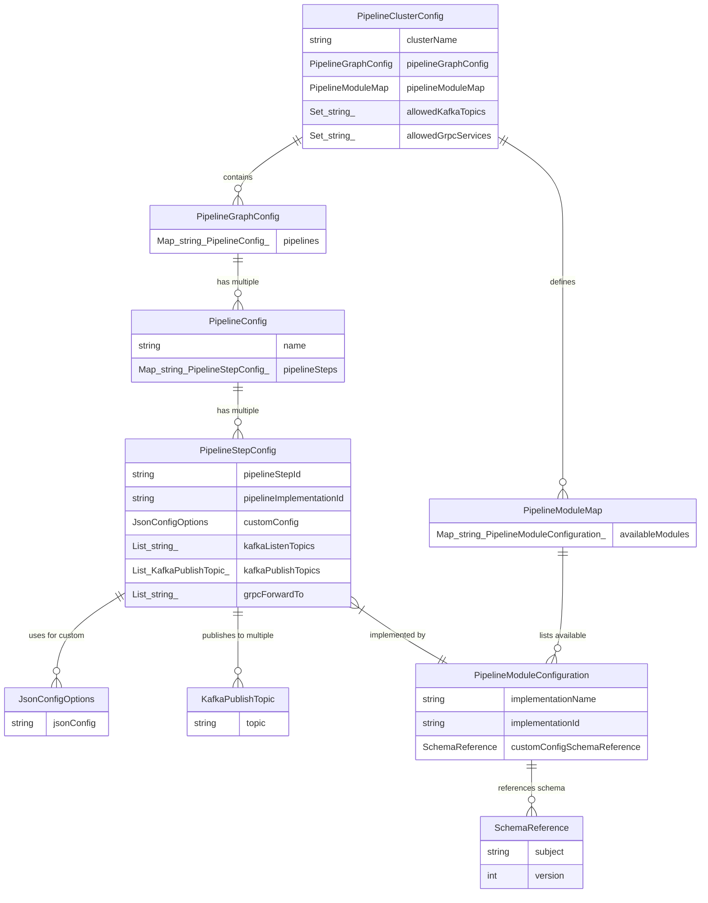
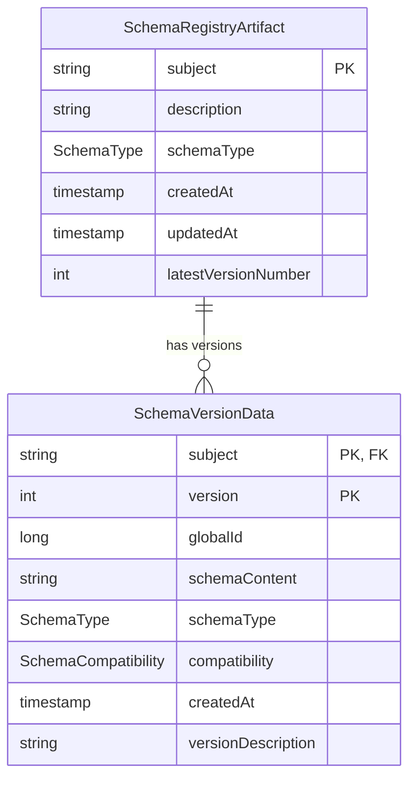

# Configurable Pipeline Architecture: Model Overview
This document outlines the architecture of the configuration models for a highly configurable and extensible data processing pipeline system. The system is designed to be modular, allowing for clear separation of concerns and enabling language-agnostic development of individual processing steps.

## Core Principles
* **Decoupled Configuration**: Pipeline structure, module definitions, and schema definitions are managed as distinct but related data models.
* **Centralized Schema Management**: Custom configuration schemas for pipeline modules are stored and versioned in a dedicated "Schema Registry," promoting reuse and controlled evolution.
* **Modularity**: The system is divided into logical modules:
  * `pipeline-config-models`: Defines the structure of pipelines, steps, and their configurations.
  * `schema-registry-models`: Defines the structure of schema artifacts and their versions.
  * `config-service` (Service): Manages the storage, retrieval, and validation of configurations and schemas.
  * `grpc-pipeline-engine` (Service): Executes pipelines by orchestrating gRPC-based developer modules.
  * `grpc-developer-sdk` (Library): Provides tools and contracts for developers to build pipeline step modules.
  * `developer-pipeline-step-module` (External Service): User-implemented processing logic.
* **Framework Agnostic Models**: The core data models (pipeline-config-models, schema-registry-models) are plain Java objects (POJOs) using Jackson for JSON serialization and Lombok for boilerplate reduction, ensuring portability.
* **Live Configuration**: The system is designed to allow for live updates to configurations (details to be discussed further).
  
## I. System Modules Overview
This diagram illustrates the high-level modules and their primary interaction points.

```mermaid
graph TD
subgraph User/Admin Interaction
AdminUI[Admin UI/Tooling]
end

    subgraph Core Configuration & Services
        ConfigService["config-service (Micronaut)"]
        Consul[Consul KV Store]
        SchemaRegistryService["Schema Registry Logic (within ConfigService or separate)"]
    end

    subgraph Pipeline Execution
        GRPCPipelineEngine["grpc-pipeline-engine (Micronaut)"]
    end

    subgraph Developer Implementation
        DeveloperSDK["grpc-developer-sdk (Java, Python, etc.)"]
        DevModuleA["Developer Module A (gRPC Service)"]
        DevModuleB["Developer Module B (gRPC Service)"]
    end

    subgraph Model Libraries
        PipelineConfigModels["pipeline-config-models (JAR)"]
        SchemaRegistryModels["schema-registry-models (JAR)"]
    end

    AdminUI --> ConfigService
    ConfigService --> Consul
    ConfigService --> PipelineConfigModels
    ConfigService o-- SchemaRegistryService
    SchemaRegistryService --> Consul
    SchemaRegistryService --> SchemaRegistryModels

    GRPCPipelineEngine --> ConfigService
    GRPCPipelineEngine --> SchemaRegistryService
    GRPCPipelineEngine --> DevModuleA
    GRPCPipelineEngine --> DevModuleB

    DevModuleA --> DeveloperSDK
    DevModuleB --> DeveloperSDK

    DeveloperSDK -.-> PipelineConfigModels
    DeveloperSDK -.-> SchemaRegistryModels

    classDef lib fill:#daf,stroke:#333,stroke-width:2px;
    classDef service fill:#adf,stroke:#333,stroke-width:2px;
    classDef extService fill:#fad,stroke:#333,stroke-width:2px;
    classDef storage fill:#faf,stroke:#333,stroke-width:2px;
    classDef ui fill:#ffa,stroke:#333,stroke-width:2px;

    class PipelineConfigModels,SchemaRegistryModels lib;
    class ConfigService,GRPCPipelineEngine,SchemaRegistryService service;
    class DevModuleA,DevModuleB extService;
    class Consul storage;
    class AdminUI ui;
```

## II. Pipeline Configuration Model Relationships
This diagram shows the primary entities within the pipeline-config-models module and their relationships. The PipelineClusterConfig is the root object for a given cluster's pipeline definitions.



### Description of Pipeline Configuration Model Entities:

* `PipelineClusterConfig`:
  * The top-level configuration for a "cluster" of pipelines.
  * Contains the graph of all pipelines (`pipelineGraphConfig`), a map of all available module types and their schema references (`pipelineModuleMap`), and whitelists for Kafka topics and gRPC services allowed within this cluster.
  * **How it's used**: Loaded by the `config-service` and provided to the `grpc-pipeline-engine` to define the entire operational scope of pipelines within a cluster.

* `PipelineGraphConfig`:
  * The graph of all pipelines within a cluster.
  * Holds a collection of named `PipelineConfig` objects, representing all pipelines defined within the cluster.
  * **How it's used**:  Allows the engine to look up specific pipelines by their name/ID.

* `PipelineConfig`:
  * Defines a single named pipeline, comprising a map of its constituent `PipelineStepConfig` objects.
  * **How it's used**: Represents an end-to-end processing flow.

* `PipelineStepConfig`:
  * Configuration for a single processing unit (a "step") within a pipeline.
  * Specifies its unique `pipelineStepId`, the `pipelineImplementationId` (which links to a `PipelineModuleConfiguration` defining the type of gRPC service to call), its custom configuration (`customConfig`), and its Kafka/gRPC I/O settings.
  * **How it's used**: The `grpc-pipeline-engine` uses this to know which gRPC developer module to invoke, what configuration to pass to it, and how it interacts with Kafka/other gRPC services.

* `JsonConfigOptions`:
  * A simple data holder for the `jsonConfig` string, which contains custom parameters for a `PipelineStepConfig`.
  * **How it's used**: The raw JSON string is passed to the `config-service` (or `grpc-pipeline-engine`) which then uses the schema (referenced by `PipelineModuleConfiguration.customConfigSchemaReference`) to validate this JSON before it's used by the developer module. The developer module receives this validated JSON string (or a parsed map representation).

* `KafkaPublishTopic`:
  * Specifies the name of a Kafka topic a step will publish to.

* `PipelineModuleMap`:
  * A catalog (`availableModules`) mapping a module's `implementationId` to its `PipelineModuleConfiguration`.
  * **How it's used**: Allows the system to look up the definition (name, schema reference) of any available pipeline module type.

* `PipelineModuleConfiguration`:
  * Defines a type of pipeline module (which corresponds to a specific gRPC service implementation).
  * Includes its display name, unique `implementationId`, and a `SchemaReference` pointing to the versioned schema for its custom configuration.
  * **How it's used**: Provides the blueprint for a module type. The `grpc-pipeline-engine` uses `pipelineImplementationId` from a `PipelineStepConfig` to find the corresponding `PipelineModuleConfiguration` and thus its schema reference.

* `SchemaReference`:
  * A pointer (subject/name + version) to a specific schema stored in the Schema Registry.
  * **How it's used**: Allows `PipelineModuleConfiguration` to decouple itself from carrying the raw schema string, instead referring to a centrally managed and versioned schema.

## III. Schema Registry Model Relationships
This diagram shows the entities within the `schema-registry-models` module. These models represent how schemas are stored and versioned in the central registry.



## Description of Schema Registry Model Entities:
* `SchemaRegistryArtifact`:
  * Represents a "subject" or an artifact in the schema registry (e.g., "custom-config-for-module-X"). The `subject` is its unique identifier.
  * Contains metadata about the schema artifact itself, like its description, overall schema type, and creation/update times. It may also point to its latest version number.
  * **How it's used**: Acts as the parent container for all versions of a particular schema. The `subject` is typically the `PipelineModuleConfiguration.implementationId`.
* `SchemaVersionData`:
  * Represents a specific, immutable version of a `SchemaRegistryArtifact`.
  * Contains the actual `schemaContent` (the JSON schema string), its version number (unique within its subject), schema type, compatibility information with its predecessor, and creation time.
  * **How it's used**: This is the object retrieved by the config-service (via its schema registry component) when a specific schema version is requested (using subject + version from SchemaReference). The schemaContent is then used for validating JsonConfigOptions.
* `SchemaType` (Enum): Defines the type of schema (e.g., `JSON_SCHEMA`).
* `SchemaCompatibility` (Enum): Defines the compatibility level of a schema version (e.g., `BACKWARD`, `FULL`).

## V. How Models are Used - A Typical Flow
1. **Admin Defines Configuration**:
  * An administrator uses an Admin UI (or direct API calls) to interact with the `config-service`.
  * **Schema Registration**: For a new or updated `PipelineModuleConfiguration`, its `customConfigJsonSchema` (as a string) is registered with the schema registry component of the `config-service`.
    * This creates/updates a `SchemaRegistryArtifact` (identified by the module's `implementationId` as the `subject`).
    * A new `SchemaVersionData` entry is created with the schema string and a new version number.
  * **Pipeline Definition**: The administrator defines/updates `PipelineClusterConfig`, including:
    * Adding/updating `PipelineModuleConfiguration` entries in the `PipelineModuleMap`, ensuring their `customConfigSchemaReference` points to the correct `subject` (module `implementationId`) and `version` in the schema registry.
    * Defining `PipelineGraphConfig`, `PipelineConfig`, and `PipelineStepConfig` objects.
  * The `config-service` validates these configurations (e.g., ensuring `pipelineImplementationIds` exist, schema references are valid) and persists them (e.g., to Consul).
2. **Pipeline Engine Initialization/Execution**:
  * The `grpc-pipeline-engine` starts up or receives a request to run a pipeline.
  * It fetches the relevant `PipelineClusterConfig` from the `config-service`.
  * For each `PipelineStepConfig` to be executed:
    * It identifies the `pipelineImplementationId`.
    * It uses this ID to look up the `PipelineModuleConfiguration` in `PipelineClusterConfig.pipelineModuleMap.availableModules`.
    * From `PipelineModuleConfiguration`, it gets the `customConfigSchemaReference`.
    * It requests the actual schema string (`SchemaVersionData.schemaContent`) from the `config-service`'s schema registry component using the `subject` and `version` from the `SchemaReference`.
    * The engine (or the `config-service` as a utility) uses this schema string to validate the `PipelineStepConfig.customConfig.jsonConfig`.
    * If valid, `the grpc-pipeline-engine` invokes the appropriate gRPC developer module, passing the (potentially parsed from JSON) custom configuration and other necessary context.
    * The engine also uses `allowedKafkaTopics` and `allowedGrpcServices` from `PipelineClusterConfig` to enforce communication policies for the step.
3. **Developer Module Execution**:
  * The gRPC developer module (written in any language using the `grpc-developer-sdk`) receives its invocation.
  * It parses its custom configuration (which it knows is valid according to its advertised schema).
  * It performs its processing logic.
