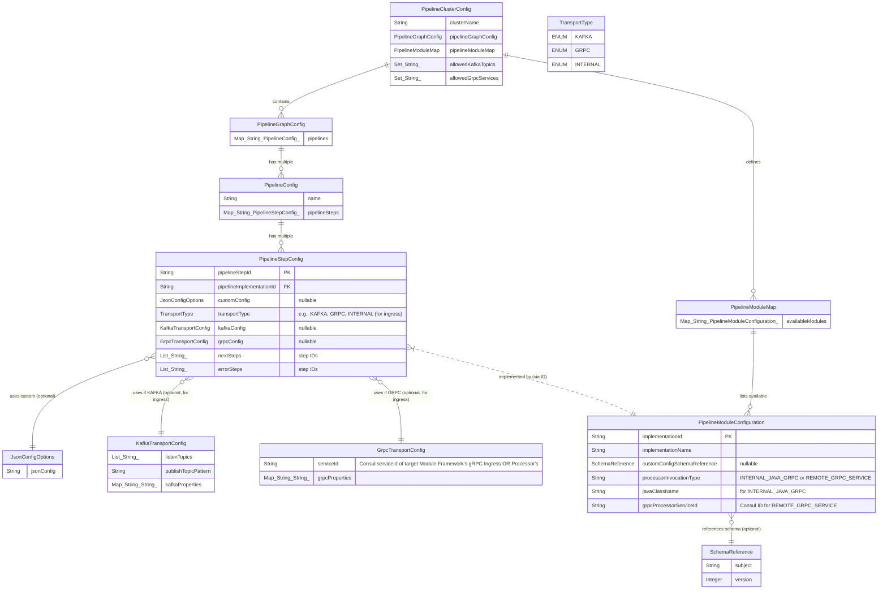

# YAPPY Pipeline Schema Design

**Version:** 1.3
**Last Updated:** 2025-05-15

## 1. Introduction

This document details the schema design and usage within the YAPPY (Yet Another Pipeline Processor) platform, with a primary focus on how
Pipeline Module Processors declare and validate their specific runtime configurations (`custom_json_config`). Effective schema management is
crucial for ensuring configuration integrity, facilitating robust module development, and enabling clear contracts between pipeline
components.

YAPPY utilizes two distinct categories of schemas and registries:

1. **Protobuf Schemas & External Registry (e.g., Apicurio, AWS Glue):**
    * **Purpose:** Govern the structure of core data messages like `PipeStream`, `PipeDoc`, and `Blob` (defined in
      `yappy_core_types.proto`).
    * **Management:** These Protobuf schemas, especially when `PipeStream` messages are transported via Kafka, are typically managed and
      validated by an external, enterprise-grade Schema Registry (like Apicurio or AWS Glue Schema Registry, as per existing setup).
    * **Interaction:** YAPPY Kafka serializers/deserializers (within Module Frameworks, Connector Service) interact with this external
      registry to ensure `PipeStream` data compatibility and handle schema evolution for Kafka transport.
    * **Scope of this Document:** While essential, the detailed management of these Protobuf schemas and the external registry is outside
      the primary scope of this document, which focuses on JSON schemas for module configuration.

2. **JSON Schemas & YAPPY Custom JSON Schema Registry:**
    * **Purpose:** Define the expected structure, data types, and constraints for the `custom_json_config` string. This JSON string is
      provided within a `PipelineStepConfig` to specifically parameterize an instance of a Pipeline Module Processor.
    * **Management:** These JSON schemas are managed by a **dedicated YAPPY gRPC service: the Custom JSON Schema Registry**. This service
      implements the gRPC interface defined in `SchemaRegistryService.proto` (detailed in the YAPPY gRPC API Manual).
    * **This document primarily details the design, registration, validation, and usage of these JSON schemas.**

The YAPPY Custom JSON Schema Registry service is a gRPC service that registers itself with Consul for discovery by YAPPY components like
Module Frameworks (for runtime validation) and administrative tools (for schema management). This allows developers to look up default
configurations (if defined within the schemas) and for future automated registration of new module schemas.

## 2. Core Principles for `custom_json_config` JSON Schema Design

The use of JSON schemas for `custom_json_config` provides:

* **Clear Contracts:** Defines the parameters a Pipeline Module Processor expects.
* **Automated Validation:** Enables Module Frameworks to validate `custom_json_config` before processor invocation.
* **Modularity & Versioning:** Supports versioned schemas for controlled evolution of module configurations.
* **Discoverability & Tooling:** Allows introspection for UI generation and developer guidance.

## 3. System and Data Model Overview for JSON Schema Configuration

### 3.1. System Modules Involved in JSON Schema Management

The following diagram shows the YAPPY system modules and their interactions related to the Custom JSON Schema Registry and the
`custom_json_config` for modules.


### 3.2. Pipeline Configuration Model Relationships (Java Records from `com.krickert.search.config.pipeline.model`)

These Java records define the structure of pipeline configurations, typically stored in Consul. The ER diagram below is based on the
provided Java classes.



* **`PipelineModuleConfiguration.customConfigSchemaReference` (`SchemaReference`):** This is the key link. It indicates that instances of
  this module type should have their `customConfig.jsonConfig` validated against the specified schema (`subject` and `version`).
* **`SchemaReference(String subject, Integer version)`:** Your Java model.
    * **Translation to `schema_id` for `SchemaRegistryService.proto`:** The `SchemaRegistryService` gRPC interface uses a
      `string schema_id`. Client components (Module Framework, Admin API) must translate `SchemaReference(subject, version)` into this
      `schema_id`. The established convention in `ConsulSchemaRegistryDelegate` and `SchemaRegistryServiceImpl` is that the `schema_id` used
      in the gRPC contract is a string like **`<subject>:v<version>`** (e.g., `"com.example.MyModule:v1"`). This `schema_id` is the public
      identifier for the schema version in the gRPC API.
* **`JsonConfigOptions(String jsonConfig)`:** Holds the raw JSON string in `PipelineStepConfig`.

### 3.3. Custom JSON Schema Registry: Internal Models and gRPC Service

The Custom JSON Schema Registry service (implementing `SchemaRegistryService.proto`) uses internal Java models (from
`com.krickert.search.config.schema.registry.model`) for its persistence layer (e.g., via `ConsulSchemaRegistryDelegate`).

* **`SchemaRegistryArtifact(String subject, ...)`**: Represents a schema subject, grouping versions.
* *
  *`SchemaVersionData(String subject, Integer version, String schemaContent, SchemaType schemaType, SchemaCompatibility compatibility, ...)`
  **: Represents a specific schema version with its content. `schemaType` will be `SchemaType.JSON_SCHEMA`.
* The gRPC service (`SchemaRegistryService.proto`) exposes operations like `RegisterSchema`, `GetSchema` using Protobuf messages like
  `SchemaInfo` (which contains `schema_id` and `schema_content`).

<!-- end list -->


## 4. Workflow: JSON Schema Registration, Referencing, and Runtime Validation

1. **Schema Definition & Registration:**

    * A module developer defines a JSON schema for their module's `custom_json_config`.
    * This schema is registered with the **Custom JSON Schema Registry Service** (e.g., by an Admin API calling
      `SchemaRegistryService.RegisterSchema`). The `RegisterSchemaRequest` includes the `schema_id` (e.g., `"com.example.MyModule:v1"`), the
      `schema_content`, description, etc.
    * Internally, `SchemaRegistryServiceImpl` uses `ConsulSchemaRegistryDelegate` to validate the `schema_content` against a meta-schema (
      e.g., JSON Schema Draft-07, from `draft7.json`) and then stores it (e.g., as `SchemaVersionData` in Consul).
    * The `PipelineModuleConfiguration` for this module type is updated in Consul with a `SchemaReference` (e.g.,
      `subject="com.example.MyModule"`, `version=1`).

2. **Pipeline Configuration:**

    * A pipeline designer configures a `PipelineStepConfig`, linking it to the `PipelineModuleConfiguration` (via
      `pipelineImplementationId`) and providing the `customConfig.jsonConfig` string.

3. **Runtime Validation by Module Framework:**

    * When a Module Framework executes a `PipelineStepConfig`:
        1. It fetches `PipelineStepConfig` and its associated `PipelineModuleConfiguration`.
        2. It retrieves `SchemaReference(subject, version)` from `PipelineModuleConfiguration.customConfigSchemaReference`.
        3. If `SchemaReference` is present:
           a. Constructs the `schema_id` string (e.g., `subject + ":v" + version`).
           b. Calls `SchemaRegistryService.GetSchema(GetSchemaRequest{schema_id = ...})` on the Custom JSON Schema Registry service (
           discovered via Consul).
           c. The service returns `SchemaInfo` containing `schema_content`.
           d. The Module Framework validates `PipelineStepConfig.customConfig.jsonConfig` against this `schema_content`.
           e. On failure, error handling occurs. On success, the `jsonConfig` is parsed to `google.protobuf.Struct`.
        4. If no `SchemaReference`, validation may be skipped or a default (e.g., empty Struct) is used.
        5. The `google.protobuf.Struct` is passed to the Pipeline Module Processor in `ProcessRequest.config.custom_json_config`.

## 5. Designing Effective JSON Schemas for `custom_json_config`

To create effective JSON schemas for module configurations:

* **Clarity and Specificity:** Define data types (`string`, `integer`, `number`, `boolean`, `object`, `array`) and formats (e.g.,
  `date-time`, `uri`) clearly.
* **Required Fields:** Use the `required` keyword for mandatory properties.
* **Constraints:** Utilize JSON Schema keywords for constraints (e.g., `minimum`, `maximum`, `pattern`, `enum`, `minLength`, `maxLength`,
  `minItems`, `maxItems`).
* **Nesting & Objects:** Use nested `object` types for complex configurations.
* **Defaults:** Specify `default` values in schemas. These serve as documentation and can guide UI tools. The Pipeline Module Processor is
  typically responsible for applying operational defaults if a parameter is truly optional and omitted from the provided `jsonConfig`.
* **Descriptions:** Include `title` and `description` for the schema and its properties to make it self-documenting.
* **Versioning:** Use the `version` in `SchemaReference`. Schema changes should lead to new versions.
* **Example:**
  ```json
  // Schema for a module with subject "com.example.DataTransformer", version 1
  // Corresponds to schema_id "com.example.DataTransformer:v1"
  {
    "$schema": "[http://json-schema.org/draft-07/schema#](http://json-schema.org/draft-07/schema#)",
    "title": "DataTransformerConfig_v1",
    "description": "Configuration for the Data Transformer Module, version 1.",
    "type": "object",
    "properties": {
      "transformationMode": {
        "description": "The mode of transformation to apply.",
        "type": "string",
        "enum": ["UPPERCASE", "LOWERCASE", "STRIP_HTML"],
        "default": "LOWERCASE"
      },
      "targetField": {
        "description": "The field in PipeDoc.custom_data to apply the transformation to.",
        "type": "string"
      },
      "maxOutputLength": {
          "description": "Optional maximum length for the transformed output string.",
          "type": "integer",
          "minimum": 1
      }
    },
    "required": [
      "transformationMode",
      "targetField"
    ]
  }
  ```

## 6. Interaction with `SchemaRegistryService.proto`

The Custom JSON Schema Registry is a gRPC service defined by `SchemaRegistryService.proto`. Key interactions:

* **Module Frameworks:** Call `GetSchema` to retrieve `schema_content` for validation.
* **Administrative Tools/APIs:** Use `RegisterSchema`, `DeleteSchema`, `ListSchemas`, `ValidateSchemaContent` for schema lifecycle
  management.
* The service implementation (e.g., `SchemaRegistryServiceImpl` backed by `ConsulSchemaRegistryDelegate`) handles persistence and validates
  incoming schema content against a meta-schema (like JSON Schema Draft-07 via `draft7.json`) to ensure the schemas themselves are valid.

*(Refer to the **YAPPY gRPC API Manual** for full RPC details.)*

## 7. Future Considerations

* **Unified Schema Registry:** While distinct now, exploring a single system (like Apicurio) for both Protobuf `PipeStream` schemas and JSON
  `custom_json_config` schemas remains a possibility if functional and operational needs align.
* **UI Integration:** Dynamically generating configuration forms in an Admin/Pipeline Editor UI based on these registered JSON schemas.
* **Advanced Schema Evolution:** Implementing more sophisticated schema compatibility checks (e.g., using the `SchemaCompatibility` model)
  within the `SchemaRegistryService`.
* **Developer Tooling:** Enhanced tools for creating, testing, and versioning module JSON schemas.
* **Programmatic Schema Registration:** CI/CD integration for automated schema registration when new module versions are deployed.

