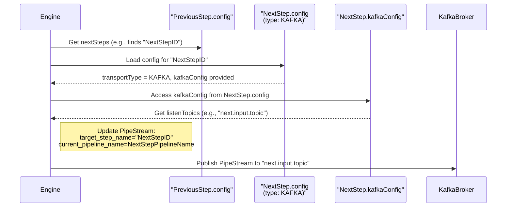
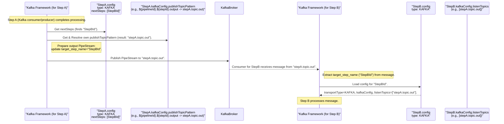

# YAPPY's Refactored Routing and Transport Model

## 1. Introduction: The Need for Clarity

The YAPPY pipeline platform initially employed a routing mechanism for `PipelineStepConfig` that, while functional, presented several areas of complexity and potential confusion. Routing and transport details were intermingled, with fields like `kafkaListenTopics`, `kafkaPublishTopics`, and `grpcForwardTo` coexisting alongside logical flow definitions (`nextSteps`, `errorSteps`) directly within `PipelineStepConfig`.

This led to:

* Unclear relationships between logical flow and physical data movement.
* Ambiguity in how the engine or Kafka consumers determined publish destinations.
* Increased configuration complexity when a step's transport nature changed.

To address these challenges, YAPPY's configuration model for pipeline step routing has been significantly refactored to promote clarity, maintainability, and determinism.

## 2. The New Model: Unified and Decoupled Routing

The cornerstone of the refactoring is the **clear separation of logical pipeline flow from the physical transport mechanisms** used by individual steps.

* **Logical Flow (The "What"):** This is now exclusively defined by the `nextSteps` and `errorSteps` fields within `PipelineStepConfig`. These lists contain `pipelineStepId` strings, unambiguously defining the sequence of operations based on success or failure.
* **Physical Transport (The "How"):** Each `PipelineStepConfig` now includes a `transportType` field. This enum dictates the communication method for the step and determines which specific transport configuration is applicable.

### 2.1. Key Java Configuration Model Changes

The primary refactoring occurred in the Java configuration records within the `com.krickert.search.config.pipeline.model` package (typically managed in the `yappy-models/pipeline-config-models` module).

1.  **`TransportType.java` (Enum):**
    A new enum clearly defines the available transport modes for a step.

    ```java
    public enum TransportType {
        KAFKA,  // Step interacts via Kafka topics
        GRPC,   // Step is a gRPC service called by the engine
        INTERNAL // Step is executed directly within the engine's process
    }
    ```

2.  **`KafkaTransportConfig.java` (Record):**
    This record encapsulates all Kafka-specific transport details.

    ```java
    public record KafkaTransportConfig(
        List<String> listenTopics,      // Topics this step consumes from (if it's a consumer)
        String publishTopicPattern,   // Pattern for the topic this step publishes to (if it's a producer).
                                      // Example: "${pipelineId}.${stepId}.output"
        Map<String, String> kafkaProperties // Custom Kafka consumer/producer properties for this step
    ) { /* ... constructor with validation ... */ }
    ```

    * A step might only listen, only publish, or do both. `listenTopics` can be empty, and `publishTopicPattern` can be null.

3.  **`GrpcTransportConfig.java` (Record):**
    This record holds gRPC-specific transport details.

    ```java
    public record GrpcTransportConfig(
        String serviceId,             // The resolvable ID of the gRPC service (e.g., from Consul)
        Map<String, String> grpcProperties // Custom properties for the gRPC call (e.g., timeouts, retry policies)
    ) { /* ... constructor with validation ... */ }
    ```

4.  **`PipelineStepConfig.java` (Refactored Record):**
    The central configuration for a pipeline step is now significantly cleaner:

    ```java
    public record PipelineStepConfig(
        String pipelineStepId,             // Unique ID of this step within its pipeline
        String pipelineImplementationId,   // ID of the module implementing this step's logic
        JsonConfigOptions customConfig,    // Custom configuration for the step's logic

        // Logical flow definition (UNCHANGED in purpose, still refers to pipelineStepId strings)
        List<String> nextSteps,
        List<String> errorSteps,

        // NEW: Unified Physical transport configuration
        TransportType transportType,         // Defines how this step communicates or is invoked
        KafkaTransportConfig kafkaConfig,    // Present and used only if transportType is KAFKA
        GrpcTransportConfig grpcConfig       // Present and used only if transportType is GRPC
    ) { /* ... constructor with comprehensive validation ... */ }
    ```

    * **Removed Fields:** The previous direct fields `kafkaListenTopics: List<String>`, `kafkaPublishTopics: List<KafkaPublishTopic>`, and `grpcForwardTo: List<String>` have been removed from `PipelineStepConfig`.

### 2.2. Visualizing the Model Change

The following diagram illustrates the structural shift in `PipelineStepConfig`:

```mermaid
graph TD
    subgraph Old Model Fields (in PipelineStepConfig)
        direction LR
        Old_NextSteps["nextSteps (List<String>)"]
        Old_ErrorSteps["errorSteps (List<String>)"]
        Old_KafkaListen["kafkaListenTopics (List<String>)"]
        Old_KafkaPublish["kafkaPublishTopics (List<KafkaPublishTopic>)"]
        Old_GrpcForward["grpcForwardTo (List<String>)"]
    end

    subgraph New Model Fields (in PipelineStepConfig)
        direction LR
        New_NextSteps["nextSteps (List<String>)"]
        New_ErrorSteps["errorSteps (List<String>)"]
        New_TransportType["transportType (Enum)"] --- New_KafkaConfig["kafkaConfig (KafkaTransportConfig)"]
        New_TransportType --- New_GrpcConfig["grpcConfig (GrpcTransportConfig)"]
        New_TransportType --- New_Internal["(No extra config for INTERNAL)"]
        New_KafkaConfig --> K_Listen["listenTopics (List<String>)"]
        New_KafkaConfig --> K_PublishPattern["publishTopicPattern (String)"]
        New_GrpcConfig --> G_ServiceId["serviceId (String)"]
    end

    Old_Model_Title["<b>Old PipelineStepConfig Structure</b>"] --> PSC_Old((PipelineStepConfig))
    PSC_Old --> Old_NextSteps
    PSC_Old --> Old_ErrorSteps
    PSC_Old --> Old_KafkaListen
    PSC_Old --> Old_KafkaPublish
    PSC_Old --> Old_GrpcForward

    New_Model_Title["<b>New PipelineStepConfig Structure</b>"] --> PSC_New((PipelineStepConfig))
    PSC_New --> New_NextSteps
    PSC_New --> New_ErrorSteps
    PSC_New --> New_TransportType

    style Old_Model_Title fill:#ffe0e0,stroke:#333,stroke-width:2px
    style New_Model_Title fill:#e0efff,stroke:#333,stroke-width:2px
```

### 2.3. Protobuf `PipeStream`

The core `PipeStream` Protobuf message, which carries data through the pipeline, was largely unaffected by these Java configuration model changes. It already contained the necessary `current_pipeline_name` and `target_step_name` fields crucial for routing, especially in decoupled scenarios like Kafka.

A related cleanup was the consolidation of the `Blob` message. Previously, `PipeStream` had an optional `blob` field, and `PipeDoc` also had one. The `blob` is now primarily and authoritatively located within `PipeDoc` (`PipeDoc.blob`), simplifying the top-level `PipeStream` structure.

## 3. Runtime Routing and Dispatch Logic

The YAPPY engine (for gRPC and INTERNAL steps, and for dispatching to the first step of a pipeline or between different transport types) and the "Engine Framework for Kafka" (for Kafka consumer steps) use this new model as follows:

**Phase 1: Determine Logical Next Step**

* After `CurrentStep` finishes, its `PipelineStepConfig`'s `nextSteps` (on success) or `errorSteps` (on failure) list is consulted.
* This provides the `pipelineStepId` of the `NextStep`.

**Phase 2: Dispatch to `NextStep` based on its Transport Configuration**
The engine/framework loads the `PipelineStepConfig` for `NextStep`.

1.  **If `NextStep.transportType()` is `KAFKA`:**

    * The entity responsible for sending the `PipeStream` (engine or `CurrentStep`'s Kafka framework) looks at `NextStep.kafkaConfig().listenTopics()`.
    * The `PipeStream` (with `target_step_name` updated to `NextStep.pipelineStepId()`) is published to one of these `listenTopics`.
    * When `NextStep` itself (acting as a Kafka producer for its *own* output) completes its processing, it will use *its own* `kafkaConfig().publishTopicPattern()` to determine the output topic name. This pattern is resolved using context like its own `pipelineStepId` and `pipelineId` (e.g., `"${pipelineId}.${stepId}.output"`).

2.  **If `NextStep.transportType()` is `GRPC`:**

    * The engine retrieves `NextStep.grpcConfig().serviceId()`.
    * It uses this `serviceId` for service discovery (e.g., via Consul) and makes a gRPC call to the identified module.
    * The `ProcessRequest` for the gRPC call is constructed using the `PipeStream`'s data and `NextStep.customConfig()` along with `ServiceMetadata`.

3.  **If `NextStep.transportType()` is `INTERNAL`:**

    * The engine directly invokes the Java class/method corresponding to `NextStep.pipelineImplementationId()` within its own process, passing the necessary data from the `PipeStream` and `customConfig`.

### 3.1. Sequence Diagram: Engine Dispatching to a Kafka Step



### 3.2. Sequence Diagram: Kafka Step A publishing to Kafka Step B (Intra-Pipeline)



## 4. Benefits of the Refactored Model

1.  **Clarity and Simplicity:** The most significant benefit. The configuration is now intuitive, with a clear distinction between logical flow and transport mechanics.
2.  **Reduced Redundancy:** No more separate lists for Kafka listen, Kafka publish, and gRPC targets at the top level of `PipelineStepConfig`.
3.  **Improved Maintainability:** Changing a step's communication method (e.g., from an `INTERNAL` process to a `KAFKA` topic) is more straightforward—primarily by changing `transportType` and its associated config block.
4.  **Deterministic Kafka Topic Naming:** The `publishTopicPattern` in `KafkaTransportConfig` promotes consistent and predictable output topic names, aiding in debugging, monitoring, and inter-pipeline connections.
5.  **Enhanced Validation:**
    * Configuration validators can now enforce stricter rules, e.g., ensuring `kafkaConfig` is present if and only if `transportType` is `KAFKA`.
    * Referential integrity for `nextSteps` and `errorSteps` is distinct from transport validation.
6.  **Better Extensibility:** Introducing new transport types (e.g., HTTP, RabbitMQ) in the future would involve adding a new `TransportType` enum value and a corresponding transport configuration record, fitting cleanly into the established pattern.

## 5. Impact on YAPPY Ecosystem Components

* **Configuration Models (`yappy-models/pipeline-config-models`):** This was the primary area of change, with refactored Java records as detailed above.
* **Configuration Validators (`yappy-consul-config/src/main/java/.../validator`):**
    * `ReferentialIntegrityValidator`: Updated to check `nextSteps`/`errorSteps` against existing step IDs in the pipeline. Its checks for transport-specific field validity (like nulls in Kafka topic lists) are now largely delegated to the record constructors of `KafkaTransportConfig` and `GrpcTransportConfig`. It still verifies module references and ID/name uniqueness.
    * `WhitelistValidator`: Updated to get Kafka topics and gRPC service IDs from the new `kafkaConfig.listenTopics`, resolved `kafkaConfig.publishTopicPattern`, and `grpcConfig.serviceId` by first checking `step.transportType()`.
    * `IntraPipelineLoopValidator` & `InterPipelineLoopValidator`: Updated to derive Kafka publish/listen topics from `step.kafkaConfig()` after checking `step.transportType()`. The logic for resolving `publishTopicPattern` to concrete names for graph building is crucial here.
* **Pipeline Engine (`grpc-pipeline-engine`):** The engine's core routing and dispatch logic needed to be updated to read `transportType` and use the nested `kafkaConfig` or `grpcConfig` to interact with Kafka or invoke gRPC services.
* **Engine Framework for Kafka (Kafka Consumers):** When a Kafka consumer step processes a `PipeStream` and needs to determine where to send its output, its framework now consults its own `PipelineStepConfig` (fetched via `target_step_name` from the incoming `PipeStream`), checks its `transportType` (which will be `KAFKA`), and uses its `kafkaConfig.publishTopicPattern()` to determine the output topic.
* **`DynamicConfigurationManagerImpl`:** This component, responsible for loading and caching `PipelineClusterConfig`, required minimal changes. Its primary role is to handle the `PipelineClusterConfig` object as a whole. The detailed validation is delegated to the `ConfigurationValidator` and its rules, which *were* updated. The only minor adjustment needed was ensuring it could correctly instantiate an "empty" `PipelineClusterConfig` if its main constructor signature changed.
* **API Documentation (`docs/`):**
    * `architecture_overview.md`: Needs updates to Section 4.2 (PipelineStepConfig), Section 3.2 (Engine Orchestration), and relevant workflow diagrams in Section 5 to reflect the new `transportType` model.
    * `api_documentation_grpc.md`: The `ProcessRequest` (specifically `ProcessConfiguration`) passed to gRPC modules is populated by the engine based on the *new* `PipelineStepConfig`. The gRPC service interface itself doesn't change, but the source of its configuration context within the engine does.
    * `consul_key_dictionary.md`: The structure of the JSON stored in Consul for `pipeline-cluster-config.json` (and thus `PipelineStepConfig` within it) has changed, and this dictionary should reflect the new fields like `transportType`, `kafkaConfig`, and `grpcConfig`.

## 6. Conclusion

The refactoring of YAPPY's pipeline configuration model, centered around the `transportType` and dedicated transport configuration records, provides a much cleaner, more robust, and easier-to-understand system for defining and managing complex data pipelines. This change enhances developer experience, reduces the likelihood of configuration errors, and positions YAPPY for easier future extensions.

-----

This write-up should provide a solid overview. You can further enhance it with more specific code snippets from the engine or consumer framework if you wish to detail their internal logic changes.