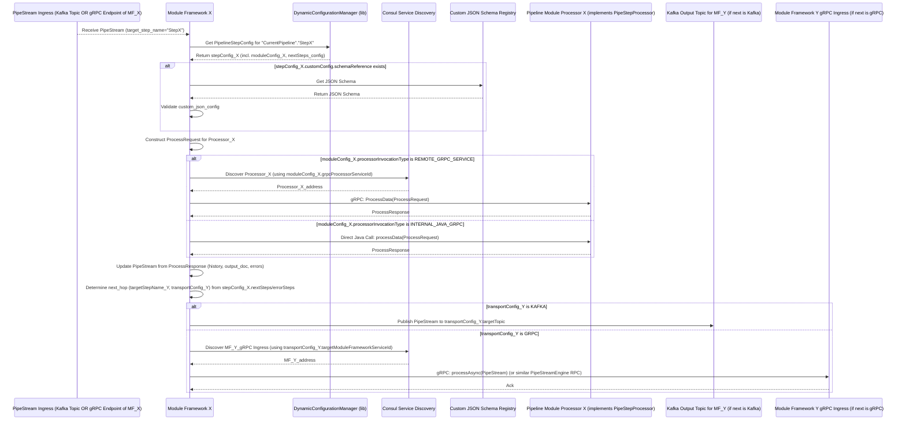

# YAPPY Architecture Overview

*(Last Updated: 2025-05-15 incorporating refined module definitions, dual inter-step transport, precise Consul roles, and clarification of gRPC service interfaces)*

## 1. Introduction

YAPPY (Yet Another Pipeline Processor) is a dynamic, decentralized, and streaming data processing platform. It is designed to build flexible data pipelines primarily focused on document indexing, A/B testing of pipeline configurations, and versatile data processing tasks.

The core technologies underpinning YAPPY are:
* **Micronaut:** Leveraged for building efficient, lightweight microservices. This typically includes the services that embody the **"Module Framework / Embedded Engine"** logic. For Pipeline Module Processors implemented in Java and designed for optimal in-JVM execution, Micronaut can also manage their lifecycle as part of the Module Framework service. The Module Framework benefits from Micronaut's capabilities for streamlined integration with Kafka and Consul, standardized observability (metrics, tracing, logging), simplified service lifecycle management, and establishing foundational security measures.
* **Apache Kafka:** Provides an **asynchronous**, resilient data transport mechanism for `PipeStream` objects when this mode is chosen for communication between logical pipeline steps (i.e., from one Module Framework to the next). This enables highly decoupled and scalable pipeline flows.
* **gRPC:**
    1.  Defines the **universal service interface contract (`PipeStepProcessor.ProcessData` in `pipe_step_processor.proto`) for all Pipeline Module Processors** (the business logic units), regardless of their implementation language or deployment strategy.
    2.  Provides a **synchronous**, resilient data transport mechanism for `PipeStream` objects when this mode is chosen for communication between logical pipeline steps (Module Framework to Module Framework). This involves one Module Framework making a gRPC call to another Module Framework's designated `PipeStream` ingress endpoint (e.g., an RPC defined in `PipeStreamEngine.proto`).
* **Consul:**
    1.  Acts as the dynamic and authoritative configuration store for all pipeline definitions (`PipelineClusterConfig`), dictating pipeline structure, individual step configurations, and routing logic (including inter-step transport choices).
    2.  Provides service discovery for YAPPY's gRPC services, including:
        * The **Connector Service** (Initial Ingest Service).
        * **Module Framework instances** that expose gRPC endpoints to receive `PipeStream`s directly from other Module Frameworks.
        * Separately deployed, remote **gRPC-based Pipeline Module Processors** (e.g., written in Python, Rust, or as distinct Java services).
        * The **Custom JSON Schema Registry service**.
    3.  All active, long-running YAPPY service instances mentioned above are expected to register with Consul for health checking and operational visibility.
* **Schema Registries (Two Distinct Types):**
    * **Protobuf Schema Registry (e.g., Apicurio, Amazon Glue, Confluent Registry):** For managing and validating the Protobuf schemas of the `PipeStream` message itself and its constituent Protobuf messages (like `PipeDoc`). This is crucial for ensuring data compatibility when `PipeStream`s are serialized, particularly for transport over Kafka.
    * **Custom JSON Schema Registry (`SchemaRegistryService.proto` implementation):** A dedicated YAPPY gRPC service that stores and validates JSON Schemas for the `custom_json_config` parameters specific to each Pipeline Module Processor. This allows the Module Framework to perform strict validation of module-specific configurations and can facilitate UI generation for pipeline design. This service registers itself with Consul. *(Future: The potential use of a unified system like Apicurio for both Protobuf and JSON schema validation may be explored.)*

## 2. Architectural Principles

YAPPY's design is guided by the following principles:

* **Standardized Module Interface (gRPC - `PipeStepProcessor.proto`):** All Pipeline Module Processors (business logic units) implement the common `PipeStepProcessor.ProcessData` gRPC service interface. This defines how a Module Framework invokes the processor and receives results, promoting consistency and enabling polyglot module development.
* **Flexible Pipeline Module Processor Invocation by Module Framework:** The Module Framework invokes its configured processor based on `PipelineModuleConfiguration`:
    * **Internal Java/gRPC Modules (Optimized Same-JVM Execution):** A Java-based Pipeline Module Processor (which implements the standard `PipeStepProcessor` gRPC interface) can run within the same JVM as its Java-based Module Framework. The Module Framework invokes this processor via a **direct, in-process Java method call to the gRPC service implementation object.** This strategy maintains strict adherence to the gRPC interface contract while bypassing network overhead for optimal performance, suitable for trusted, high-performance Java modules. These internal modules are part of the Module Framework's service instance and thus do not register *separately* in Consul (their Module Framework host does, for its own health and visibility).
    * **Localhost/Remote gRPC Modules (Separate Processes - Polyglot Support):** Pipeline Module Processors (implemented in Java, Python, Rust, or any other gRPC-supported language) run as separate gRPC services. The Module Framework makes a standard network gRPC call (to `localhost` or a remote host, typically discovered via Consul using a `serviceId`) to interact with these processors. These separate gRPC services register themselves with Consul.
* **Dynamic Module Configuration:** Each Pipeline Module Processor can define its runtime parameters via a JSON schema registered in the **Custom JSON Schema Registry**. The Module Framework uses this schema to validate the `custom_json_config` from `PipelineStepConfig`. If no schema is registered for a module, its `custom_json_config` handling follows a default behavior.
* **Dynamic Pipeline Configuration:** The overall pipeline definition (`PipelineClusterConfig` in Consul) specifies the sequence of steps, the **choice of inter-step `PipeStream` transport (Kafka or gRPC)** between Module Frameworks, module processor assignments, and `custom_json_config`. This is dynamically accessed by Module Frameworks.
* **Schema-Driven Design (Dual Registries):** `PipeStream` (Protobuf) integrity benefits from a Protobuf Schema Registry. `custom_json_config` (JSON) integrity is ensured by the Custom JSON Schema Registry.
* **Decentralized Orchestration with Configurable `PipeStream` Transport:**
    * The flow of `PipeStream`s between logical pipeline steps (Module Framework to Module Framework) is specified in the `PipelineStepConfig`.
    * A **"Module Framework / Embedded Engine"** is the lightweight engine responsible for each step.
    * The Module Framework:
        1.  **Receives `PipeStream`:** Via Kafka consumption OR a direct gRPC call from an upstream Module Framework (if the current Module Framework exposes a registered gRPC ingress endpoint for `PipeStream`s, e.g., implementing an RPC from the `PipeStreamEngine` service like `process` or `processAsync`, and this transport was chosen).
        2.  Fetches its `PipelineStepConfig` from Consul.
        3.  Validates `custom_json_config` against the Custom JSON Schema Registry.
        4.  Invokes its configured Pipeline Module Processor.
        5.  Based on the result and `nextSteps`/`errorSteps` (which specify `target_step_name` and **transport details** to the *next Module Framework*), updates and sends the `PipeStream`.
* **Developer Enablement (Leveraging Platform Capabilities):**
    * Developers of Pipeline Module Processors primarily focus on implementing the `PipeStepProcessor.ProcessData` gRPC interface.
    * The Module Framework handles platform integration: Kafka/gRPC I/O for `PipeStream` transport, dynamic configuration, JSON schema validation, observability, and security foundations.
* **Resilience:** Service instance resilience is primarily managed by the container orchestration platform. *(Future: Advanced application-level resilience patterns may be considered.)*

## 3. Core Components & Responsibilities

### 3.1. Configuration Subsystem (`DynamicConfigurationManager` & Consul)
* **Responsibilities:**
    * **Consul:** Stores `PipelineClusterConfig`.
    * **`DynamicConfigurationManager`:** Library used by Module Frameworks and the Connector Service to load, cache, and access pipeline configurations from Consul.
* **Key Interaction:** Consul is the source of truth for pipeline definitions. `DynamicConfigurationManager` provides runtime access.

### 3.2. Connector Service (Initial Ingest Service - Implements `PipeStreamEngine.IngestDataAsync`)
* **Responsibilities:**
    * Provides the primary entry point for external systems ("connectors") to submit data and initiate pipeline executions using the `IngestDataRequest` message and `IngestDataAsync` RPC defined in `engine_service.proto`.
    * Uses `IngestDataRequest.source_identifier` to determine the initial pipeline and first step from `PipelineClusterConfig`.
    * Creates the initial `PipeStream`.
    * **Initiates Pipeline Flow:** Routes the initial `PipeStream` to the first Module Framework either by publishing to a Kafka topic or, if configured, by making a gRPC call to the first Module Framework's `PipeStream` ingress endpoint (e.g., its implementation of an RPC from `PipeStreamEngine.proto`, discovered via Consul).
    * Registers itself with Consul for health checking and operational visibility.
* **Key Interaction:** Receives `IngestDataRequest`; interacts with `DynamicConfigurationManager`; initiates `PipeStream` flow via Kafka or gRPC.

### 3.3. Module Framework / Embedded Engine
* **Responsibilities:**
    * Lightweight engine executing a single pipeline step.
    * **`PipeStream` Ingress/Egress (Configurable Transport):**
        * **Receiving `PipeStream`:**
            * Consumes from a configured input Kafka topic.
            * OR, implements a gRPC service endpoint (e.g., an RPC from `PipeStreamEngine.proto` like `process` or `processAsync`) to accept `PipeStream`s from an upstream Module Framework. This gRPC service is registered in Consul if this Module Framework instance is a target for gRPC-based inter-step communication.
        * **Sending `PipeStream`:** Based on `PipelineStepConfig.nextSteps`/`errorSteps` (defining target step and `TransportConfig`):
            * Publishes to the designated Kafka topic.
            * OR, makes a gRPC call to the next Module Framework's `PipeStream` ingress gRPC endpoint (discovered via Consul using `targetModuleFrameworkServiceId` from `GrpcTransportConfig`).
    * **Configuration & Validation:** Fetches `PipelineStepConfig`; validates `custom_json_config` against Custom JSON Schema Registry.
    * **Pipeline Module Processor Invocation (of the `PipeStepProcessor` gRPC interface):**
        * Prepares `ProcessRequest`.
        * Based on `PipelineModuleConfiguration`:
            * **Internal Java/gRPC Module:** Direct, in-process Java method call to the co-deployed Java object implementing `PipeStepProcessor`.
            * **Localhost/Remote gRPC Module Processor:** Network gRPC call (discovered via Consul if remote) to `ProcessData`.
    * **State Update & Routing:** Updates `PipeStream`; determines next hop; routes.
    * **Consul Registration:** Each Module Framework instance registers with Consul for health, visibility, and discovery (if offering gRPC `PipeStream` ingress).
* **Key Interaction:** Kafka, gRPC (for `PipeStream` I/O & Processor calls), Consul, Custom JSON Schema Registry, Pipeline Module Processor.

### 3.4. Pipeline Module Processor (Business Logic)
* **Responsibilities:**
    * Contains business logic, **always implementing the `PipeStepProcessor.proto` gRPC interface.**
    * **Deployment & Invocation Variants:**
        * **Internal Java/gRPC Module:** Java class implementing `PipeStepProcessor`, co-deployed in Module Framework's JVM, invoked via direct Java method call. Not separately Consul-registered (Module Framework is).
        * **Localhost/Remote gRPC Service (Polyglot):** Standalone gRPC service implementing `PipeStepProcessor`. Deployed separately, registers with Consul via its own `serviceId`.
    * Receives `ProcessRequest`, returns `ProcessResponse`.
* **Key Interaction:** Invoked by Module Framework. Remote gRPC services register with Consul.

### 3.5. `grpc-developer-sdk`
* **Responsibilities:**
    * Provides Protobuf definitions (including `PipeStepProcessor.proto`, `PipeStream.proto`, `SchemaRegistryService.proto`, `EngineService.proto`) and generated gRPC stubs.
* **Key Interaction:** Used by developers of Module Processors, Module Frameworks, Connector Service.

### 3.6. Schema Registries (Two Distinct Types)
* **Responsibilities (Protobuf Schema Registry - e.g., Apicurio):** Manages `PipeStream` Protobuf schemas, for Kafka transport.
* **Responsibilities (Custom JSON Schema Registry - `SchemaRegistryService.proto` based):** Manages JSON Schemas for `custom_json_config`. This is a gRPC service that registers itself with Consul.
* **Key Interaction:** As previously described.

### 3.7. Consul (Expanded Role Summary)
* **Responsibilities:**
    1.  **Pipeline Configuration Store.**
    2.  **Service Discovery For:**
        * Connector Service (Initial Ingest).
        * Remote gRPC Pipeline Module Processors.
        * Module Framework instances (for their own gRPC `PipeStream` ingress endpoints and for general visibility).
        * Custom JSON Schema Registry service.
    3.  **Service Registration & Health Checking:** All YAPPY services register.
* **Key Interaction:** Central for configuration and discovering various gRPC endpoints.

## 4. Key Data Structures

### 4.1. Protobuf Messages
*(The `PipeStreamEngine` service in `engine_service.proto` defines `IngestDataAsync` for the Connector Service. The `process` and `processAsync` RPCs within this same `PipeStreamEngine` service can serve as the standardized gRPC contract for Module Frameworks to receive `PipeStream`s directly from other Module Frameworks or from the Connector Service. A Module Framework configured for gRPC ingress would implement these methods.)*

*(Definitions of `PipeStream`, `PipeDoc`, `Blob`, `ProcessRequest`, `ProcessResponse`, `ErrorData`, `StepExecutionRecord` remain consistent.)*

### 4.2. Configuration Models (Java Records, stored as JSON/YAML in Consul)

* **`PipelineStepConfig`**: Contains `nextSteps`/`errorSteps` as a list of `StepTransition` objects.
* **`StepTransition` (Model in `pipeline-config-models`):**
    * `targetStepName`: `String`
    * `transportConfig`: An instance of either:
        * `KafkaTransportConfig`: Specifies `targetTopic`.
        * `GrpcTransportConfig`: Specifies `targetModuleFrameworkServiceId` (Consul `serviceId` of the *next Module Framework's* gRPC ingress endpoint, which implements part of the `PipeStreamEngine` service like `processAsync`) and `rpcMethodName` (e.g., "processAsync").
* **`PipelineModuleConfiguration`**:
    * `processorInvocationType`: "INTERNAL\_JAVA\_GRPC", "REMOTE\_GRPC\_SERVICE".
    * `grpcProcessorServiceId` (if "REMOTE\_GRPC\_SERVICE"): Consul `serviceId` of the Pipeline Module Processor.
    * `javaClassName` (if "INTERNAL\_JAVA\_GRPC"): Class implementing `PipeStepProcessor`.
    * `grpcIngressServiceIdPattern` (Optional): If Module Framework instances of this type expose a gRPC endpoint (e.g., by implementing `PipeStreamEngine` methods) to receive `PipeStream`s, this helps derive their Consul `serviceId`.
    * `listensOnKafkaTopics` (Optional): Kafka topics this Module Framework type might consume `PipeStream`s from.

## 5. Core Workflows & Data Flows

Mermaid diagrams illustrating the primary interaction patterns, including the choice of inter-framework transport.

### 5.1. Pipeline Definition & Configuration Access
*(Admin defines `PipelineClusterConfig` in Consul. Each Module Framework dynamically fetches its relevant `PipelineStepConfig` and `PipelineModuleConfiguration` at runtime when it receives a `PipeStream` for a step it handles. It also fetches JSON schemas for `custom_json_config` from the Custom JSON Schema Registry.)*
```mermaid
sequenceDiagram
    participant Admin
    participant AdminAPI_UI as Admin UI/API
    participant Consul_KV as Consul KV Store
    participant CustomJsonSR as Custom JSON Schema Registry
    participant ModuleStepX_Framework as Module Framework (for Step X)
    participant DCM as DynamicConfigurationManager (lib)

    Admin->>AdminAPI_UI: Define/Update PipelineClusterConfig & Module JSON Schemas
    AdminAPI_UI->>Consul_KV: Store PipelineClusterConfig
    AdminAPI_UI->>CustomJsonSR: Register/Update Module JSON Schemas

    Note over ModuleStepX_Framework: Receives PipeStream for target_step_name = "StepX"
    ModuleStepX_Framework->>DCM: Get PipelineStepConfig ("PipelineA"."StepX")
    DCM->>Consul_KV: Load config for "PipelineA"."StepX"
    DCM-->>ModuleStepX_Framework: Return stepConfig_X
    
    alt stepConfig_X has custom_json_config with schemaReference
        ModuleStepX_Framework->>CustomJsonSR: Get JSON Schema (using schemaReference from stepConfig_X)
        CustomJsonSR-->>ModuleStepX_Framework: Return JSON Schema
        ModuleStepX_Framework->>ModuleStepX_Framework: Validate custom_json_config
    end
    Note over ModuleStepX_Framework: Proceeds to invoke its Pipeline Module Processor.
````

### 5.2. Pipeline Initiation (Connector Service to First Module Framework)

A new pipeline run is triggered. The Connector Service can use Kafka or gRPC to send the initial `PipeStream` to the first Module Framework.

```mermaid
sequenceDiagram
    participant ExtConnector as External Connector
    participant ConnectorService as Connector Service (IngestDataAsync)
    participant DCM_CS as DynamicConfigurationManager (lib)
    participant Consul_SD as Consul Service Discovery
    participant Kafka
    participant MF_Step1 as Module Framework (Step 1)

    ExtConnector->>ConnectorService: IngestDataRequest (source_identifier="src_A", ...)
    ConnectorService->>DCM_CS: Get first step ("S1") & transport for "Pipeline_P1" (from src_A)
    DCM_CS-->>ConnectorService: Return firstStepName="S1", pipelineName="P1", transportConfig_S1
    ConnectorService->>ConnectorService: Create PipeStream (target_step_name="S1")

    alt transportConfig_S1 is KAFKA
        ConnectorService->>Kafka: Publish PipeStream to topic "P1_S1_In"
    else transportConfig_S1 is GRPC
        ConnectorService->>Consul_SD: Discover MF_Step1 gRPC Ingress (using transportConfig_S1.targetModuleFrameworkServiceId)
        Consul_SD-->>ConnectorService: MF_Step1_address
        ConnectorService->>MF_Step1: gRPC: processAsync(PipeStream)
        MF_Step1-->>ConnectorService: Ack
    end
```

### 5.3. Generic Step Execution & Routing (Module Framework to Module Framework)

Illustrates a Module Framework processing a `PipeStream` and routing it to the next Module Framework via either Kafka or gRPC.



## 6\. Developer Workflow: Creating a New Pipeline Module Processor

1.  **Define `custom_json_config` Schema (JSON Schema):** If needed for module parameters. Register this schema with the Custom JSON Schema Registry service.
2.  **Implement `PipeStepProcessor` gRPC Interface:** This is the universal contract for the module's business logic.
    * **For Internal Java/gRPC Module:** Create a Java class that implements the `com.krickert.search.sdk.PipeStepProcessor` gRPC interface. This class will be instantiated within its hosting Module Framework's JVM and invoked via direct Java method calls.
    * **For Localhost/Remote gRPC Service (Polyglot):** Create a standard gRPC service in the chosen language (Java, Python, Rust, etc.) that implements `PipeStepProcessor.proto`. This service will be deployed as a separate process and must register itself with Consul using a unique `serviceId`.
3.  **Define `PipelineModuleConfiguration` (Admin Task via Admin API/Consul):**
    * Create an entry keyed by a unique `pipelineImplementationId`.
    * Specify `processorInvocationType` ("INTERNAL\_JAVA\_GRPC" or "REMOTE\_GRPC\_SERVICE").
    * If "REMOTE\_GRPC\_SERVICE", provide the `grpcProcessorServiceId` (Consul `serviceId` of the gRPC Processor created in step 2).
    * If "INTERNAL\_JAVA\_GRPC", provide the fully qualified `javaClassName` of the class implementing `PipeStepProcessor`.
4.  **Usage in `PipelineStepConfig` (Pipeline Designer Task via Admin API/Consul):**
    * In a `PipelineConfig`, create or update a `PipelineStepConfig`.
    * Set its `pipelineImplementationId` to the one defined in step 3.
    * Provide the `customConfig.jsonConfig` string (if any) and the corresponding `schemaReference` (pointing to the schema in the Custom JSON Schema Registry).
    * Define `nextSteps` and `errorSteps` as lists of `StepTransition` objects, each specifying the `targetStepName` of the next step and the `TransportConfig` (either `KafkaTransportConfig` with a topic, or `GrpcTransportConfig` with the `targetModuleFrameworkServiceId` of the next Module Framework's `PipeStreamEngine` gRPC ingress and the RPC method like "processAsync").

## 7\. Glossary of Key Terms

*(Ensure these definitions are precise based on the final model)*

* **Module Framework / Embedded Engine:** The runtime component/service executing a single `PipelineStepConfig`. It receives a `PipeStream` (via Kafka consumer or its own gRPC `PipeStreamEngine` ingress endpoint), fetches its configuration from Consul, validates module parameters against the Custom JSON Schema Registry, invokes its configured Pipeline Module Processor (via in-process Java call or network gRPC), updates the `PipeStream`, and then sends the `PipeStream` to the next step's Module Framework (via Kafka publish or a gRPC call to the next Module Framework's `PipeStreamEngine` ingress, discovered via Consul). Each instance of a Module Framework service registers with Consul.
* **Pipeline Module Processor:** The business logic unit that **implements the `PipeStepProcessor.proto` gRPC interface.** Invoked by a Module Framework. Can be an "Internal Java/gRPC Module" (called in-process) or a "Localhost/Remote gRPC Service" (called via network, registers with Consul).
* **Connector Service (Initial Ingest Service):** The service implementing `PipeStreamEngine.IngestDataAsync` RPC. It's the designated entry point for creating the initial `PipeStream` and dispatching it to the first Module Framework of a pipeline. Registers with Consul.
* **Pipestream Engine (Distributed gRPC Service Interface):** This refers to the gRPC service contract(s) for handling `PipeStream`s:
    * The `PipeStreamEngine` service defined in `engine_service.proto` provides the `IngestDataAsync` RPC for the Connector Service.
    * The same `PipeStreamEngine` service (specifically methods like `process` or `processAsync`) can also be implemented by Module Frameworks to serve as their gRPC ingress endpoint for receiving `PipeStream`s directly from other Module Frameworks or the Connector Service when gRPC is chosen as the inter-step transport.
* **Custom JSON Schema Registry:** The YAPPY gRPC service (implementing `SchemaRegistryService.proto`) for managing JSON Schemas used to validate `custom_json_config` for Pipeline Module Processors. Registers with Consul.

## 8\. Security Considerations (High Level)

* The Module Framework, by leveraging platforms like Micronaut, can more easily incorporate security best practices such as mTLS configuration for its outgoing gRPC calls (to remote Pipeline Module Processors *or* to other Module Frameworks' `PipeStreamEngine` ingress endpoints).
* Standard container orchestration platform features are relied upon for instance-level security and resilience.
* Access to Consul, Kafka, and Schema Registries should be secured with appropriate ACLs and authentication/authorization mechanisms.

## 9\. Future Considerations / Advanced Topics

* **Unified Schema Management:** Evaluate using a single system like Apicurio for both Protobuf (`PipeStream`) and JSON (`custom_json_config`) schema validation if its capabilities for JSON Schema are robust and suitable.
* **Application-Level Resilience:** Post-V1, explore adding more sophisticated resilience patterns within the Module Framework, such as configurable retry strategies with backoff for invoking processors or routing `PipeStream`s, or potentially dynamic failover to alternative processor instances if primary ones are unavailable (though primarily this is the role of the orchestrator).

*(Other points like Polyglot Module Frameworks, DLQ per Step, Distributed Tracing, Dynamic Scaling, Admin Enhancements remain relevant).*

```