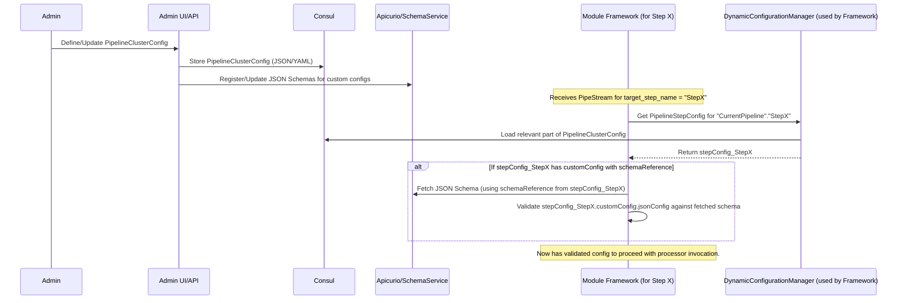
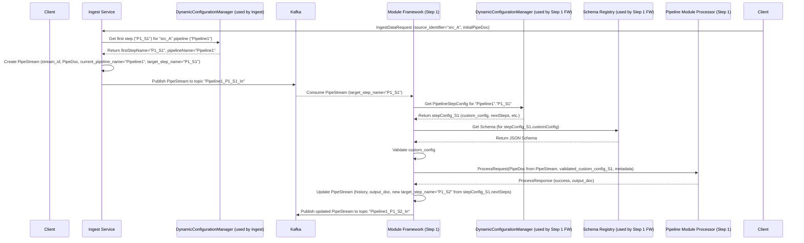
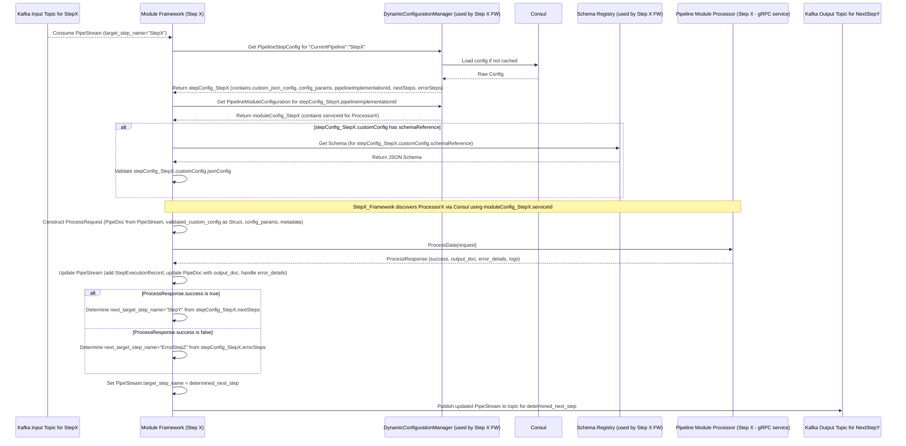

# YAPPY Architecture Overview

*(Last Updated: 2025-05-14 based on architectural evolution to decentralized step execution)*

## 1. Introduction

YAPPY (Yet Another Pipeline Processor) is a dynamic, decentralized, and streaming data processing platform. It is designed to build flexible data pipelines primarily focused on document indexing, A/B testing of pipeline configurations, and versatile data processing tasks.

The core technologies underpinning YAPPY are:
* **Micronaut:** For building efficient, lightweight microservices, including pluggable gRPC processing modules and the services that host the "Module Framework/Embedded Engine" logic.
* **Apache Kafka:** As the primary asynchronous, resilient data flow mechanism between pipeline steps, enabling decoupling, scalability, and the decentralized orchestration model.
* **gRPC:** For efficient, cross-language inter-service communication, primarily for the interaction between a step's "Module Framework/Embedded Engine" and its dedicated processing logic (Pipeline Module Processor), especially if the processor is a distinct gRPC service.
* **Consul:** As a dynamic configuration store for all pipeline definitions (`PipelineClusterConfig`) and for service discovery of gRPC-based Pipeline Module Processors.
* **Schema Registry (e.g., Apicurio Registry or `SchemaRegistryService.proto` implementation):** For managing JSON Schemas that define the structure of custom configurations (`custom_json_config`) for pipeline steps, ensuring configuration integrity.

## 2. Architectural Principles

YAPPY's design is guided by the following principles:

* **Dynamic Configuration:** All aspects of pipeline structure (`PipelineConfig`), step definitions (`PipelineStepConfig`), module mappings (`PipelineModuleConfiguration`), and custom parameters are stored externally in Consul. This configuration is fetched dynamically by each step's "Module Framework/Embedded Engine" at runtime. Updates in Consul can lead to changes in pipeline behavior for new `PipeStream`s without service redeployments.
* **Schema-Driven Design:**
    * Data in transit (`PipeStream`, `PipeDoc`, `Blob`) is defined using Protocol Buffers (Protobuf) for strong typing and efficiency.
    * Custom configurations for pipeline steps (`custom_json_config` within `PipelineStepConfig`) are validated by the "Module Framework/Embedded Engine" against their declared JSON Schemas (fetched from the Schema Registry) before being passed to the Pipeline Module Processor.
* **Decentralized Orchestration and Execution Model:**
    * Pipeline flow is primarily managed through Kafka topics. Each step in a pipeline is typically associated with an input Kafka topic.
    * A **"Module Framework/Embedded Engine"** is responsible for each step's execution. This framework:
        1. Consumes a `PipeStream` from its designated input Kafka topic.
        2. Extracts routing information (`current_pipeline_name`, `target_step_name`) from the `PipeStream`.
        3. Dynamically fetches its specific `PipelineStepConfig` and associated `PipelineModuleConfiguration` from Consul using the `DynamicConfigurationManager`.
        4. Validates the `custom_json_config` from the fetched `PipelineStepConfig` against the relevant schema from the Schema Registry.
        5. Invokes the actual business logic (the **Pipeline Module Processor**) with the `PipeStream` data and the validated configuration.
        6. Based on the processor's result and the `nextSteps` or `errorSteps` defined in its `PipelineStepConfig`, it updates the `PipeStream` (e.g., `target_step_name` for the next hop, adds to history) and publishes it to the appropriate Kafka topic for the subsequent step.
    * An **Initial Engine Logic / Ingest Service** is responsible for creating the initial `PipeStream` from an `IngestDataRequest` and publishing it to the Kafka topic of the first step in a pipeline.
* **Extensibility:** The system is designed for developers to easily create and integrate new processing logic as Pipeline Module Processors (often gRPC services, or direct Java/.NET/Python logic callable by the framework). The "Module Framework/Embedded Engine" handles the boilerplate of Kafka consumption, configuration fetching, and routing.
* **Clear Separation of Concerns:** Pipeline definition (Consul), schema management (Schema Registry), data transport (Kafka), actual processing logic (Pipeline Module Processors), and step orchestration logic (Module Framework/Embedded Engine) are distinct concerns.

## 3. Core Components & Responsibilities

### 3.1. Configuration Subsystem (`DynamicConfigurationManager` & Consul)
* **Responsibilities:**
    * **Consul:** Stores the entire `PipelineClusterConfig` (and its constituent parts like `PipelineConfig`, `PipelineStepConfig`, `PipelineModuleConfiguration`) as JSON or YAML. Acts as the central source of truth for pipeline definitions.
    * **`DynamicConfigurationManager`:** A library/component used by each "Module Framework/Embedded Engine" and the "Initial Engine Logic / Ingest Service".
        * Loads the `PipelineClusterConfig` (or relevant parts of it) from Consul.
        * Performs comprehensive validation on the loaded configuration *if responsible for pre-flight checks or admin operations*. Runtime validation of a step's specific config is typically handled by the Module Framework.
        * Caches configuration for fast access.
        * Can listen for changes in Consul to facilitate dynamic updates (though how live updates affect in-flight `PipeStream`s needs careful consideration, typically applying to new streams).
* **Key Interaction:** Consul is the definitive source of truth for pipeline definitions. The `DynamicConfigurationManager` provides access to this configuration for all runtime components that need it.

### 3.2. Initial Engine Logic / Ingest Service
* **Responsibilities:**
    * Implements an entry point for starting pipeline executions, typically by handling an `IngestDataRequest` (as defined in `engine_service.proto`).
    * Uses the `source_identifier` from the request to look up the configured target pipeline name and the name of its first step from the `PipelineClusterConfig` (via `DynamicConfigurationManager`).
    * Creates the initial `PipeStream` object, populating it with a unique `stream_id`, the provided `PipeDoc`, `source_identifier`, `initial_context_params`, `current_pipeline_name`, and `target_step_name` (pointing to the first step).
    * Publishes this initial `PipeStream` to the Kafka topic designated for the first step of the pipeline.
* **Key Interaction:** Receives external requests; interacts with `DynamicConfigurationManager` to get initial pipeline information; produces the first `PipeStream` message to Kafka.

### 3.3. Module Framework / Embedded Engine
* **Responsibilities:**
    * This is the runtime environment or framework hosting/managing the execution of individual pipeline steps. It can be part of a dedicated microservice per module type or a shared framework.
    * **Kafka Consumption:** Consumes `PipeStream` messages from a Kafka topic specific to the step it manages.
    * **Configuration Fetching & Validation:**
        1. Extracts `current_pipeline_name` and `target_step_name` from the incoming `PipeStream`.
        2. Uses these identifiers to query the `DynamicConfigurationManager` to fetch its specific `PipelineStepConfig` and the associated `PipelineModuleConfiguration`.
        3. Retrieves the `custom_json_config` (string) and `config_params` from the `PipelineStepConfig`.
        4. Fetches the relevant JSON Schema (using `SchemaReference` in `JsonConfigOptions`) from the Pipeline Schema Registry.
        5. Validates the `custom_json_config` string against this schema.
    * **Processor Invocation:**
        1. Constructs the `ProcessRequest` (as defined in `pipe_step_processor.proto`). This includes:
            * `document`: The `PipeDoc` from the `PipeStream`.
            * `config.custom_json_config`: The validated and parsed `custom_json_config` (as `google.protobuf.Struct`).
            * `config.config_params`: The `config_params` map.
            * `metadata`: Contextual information like `pipeline_name`, `pipe_step_name` (which is `target_step_name` from the stream), `stream_id`, etc.
        2. Invokes the **Pipeline Module Processor** (see 3.4) associated with this step (e.g., by making a gRPC call to the processor service discovered via Consul, or by directly calling local code if the processor is embedded).
    * **Response Handling & Routing:**
        1. Receives the `ProcessResponse` from the Pipeline Module Processor.
        2. Updates the `PipeStream`:
            * Modifies `PipeDoc` with `output_doc` from the response.
            * Adds a `StepExecutionRecord` to the `history`, detailing execution time, status (SUCCESS/FAILURE), logs from `processor_logs`, and `error_info` if applicable (from `ProcessResponse.error_details`).
        3. Determines the next step(s) by consulting the `nextSteps` (on success) or `errorSteps` (on failure) lists in its `PipelineStepConfig`. These lists contain the `stepName`(s) of the subsequent step(s).
        4. For each next step, updates `PipeStream.target_step_name` to the determined next step's name.
        5. Publishes the updated `PipeStream` to the Kafka topic designated for that *next* `target_step_name`. (Topic naming conventions like `<pipelineName>_<targetStepName>_In` could be used).
    * **State Management & Logging:** Manages Kafka consumer offsets, logs its activities, and handles errors during its own processing (e.g., failure to fetch config, schema validation failure).
* **Key Interaction:** Consumes from its input Kafka topic; interacts with `DynamicConfigurationManager` and Schema Registry; invokes a Pipeline Module Processor; produces to output Kafka topic(s) for the next step(s).

### 3.4. Pipeline Module Processor (Business Logic Implementations)
* **Responsibilities:**
    * These are the components containing the actual business logic for a pipeline step (e.g., "Echo", "TextExtractor", "Chunker", "EmbeddingGenerator").
    * Typically implemented as standalone, deployable gRPC services (e.g., Micronaut applications) that implement the `com.krickert.search.sdk.PipeStepProcessor` gRPC interface (defined in `pipe_step_processor.proto`). Alternatively, for simpler modules or different deployment strategies, the logic might be directly embedded or called by the Module Framework.
    * Each gRPC service implementation is responsible for one or more `pipelineImplementationId`s (a logical type of processing, e.g., "com.example.AdvancedOcr", "com.example.TextSummarizer").
    * It receives a `ProcessRequest` from its "Module Framework/Embedded Engine".
    * Its primary job is to perform its configured processing task on the `ProcessRequest.document` using `ProcessRequest.config.custom_json_config` and `ProcessRequest.config.config_params`.
    * It returns a `ProcessResponse` indicating `success` or failure, and providing any `output_doc`, `error_details` (as `google.protobuf.Struct`), and `processor_logs`.
    * **Crucially, these processors are "simple" data-in, data-out components. They do not handle routing logic, do not decide which step is next, and do not directly interact with Kafka or Consul for pipeline flow.** Their "Module Framework/Embedded Engine" manages these concerns.
* **Key Interaction:** Called by its "Module Framework/Embedded Engine"; uses the `grpc-developer-sdk` for Protobuf definitions and potentially helper utilities. Its gRPC endpoint is discoverable via Consul if it's a separate service.

### 3.5. `grpc-developer-sdk`
* **Responsibilities:**
    * Provides the necessary tools and libraries for developers creating new **Pipeline Module Processors**, especially those implemented as gRPC services.
    * Includes:
        * The official Protobuf definitions for all shared messages (`PipeStream`, `PipeDoc`, `Blob`, `ProcessRequest`, `ProcessResponse`, `ErrorData`, `StepExecutionRecord`, `ServiceMetadata`, `ProcessConfiguration` etc. from `yappy_core_types.proto` and `pipe_step_processor.proto`).
        * Generated gRPC service stubs and base classes in supported languages (e.g., Java).
        * Language-specific helper utilities, for example, to easily parse the `google.protobuf.Struct custom_json_config` received in `ProcessRequest.config` into native data structures (like Java Maps or POJOs).
* **Key Interaction:** Used by developers of new Pipeline Module Processor logic.

### 3.6. Schema Registry (e.g., Apicurio Registry or `SchemaRegistryService.proto` Implementation)
* **Responsibilities:**
    * Stores and versions JSON Schemas.
    * Each `PipelineStepConfig` that uses a `customConfig` (via `JsonConfigOptions`) references a schema in this registry (via `SchemaReference`).
    * The "Module Framework/Embedded Engine" for each step uses these schemas to validate the `jsonConfig` strings at runtime before invoking the Pipeline Module Processor.
    * The Admin UI/API can also use it for pre-flight validation when pipeline configurations are being defined.
    * The `schema_registry.proto` defines a gRPC service for managing these schemas (register, get, list, delete, validate content).
* **Key Interaction:** Queried by "Module Framework/Embedded Engines" and potentially by Admin tooling. Pipeline administrators/developers manage schemas here.

### 3.7. Consul
* **Responsibilities:**
    * **Configuration Store:** Persists the entire `PipelineClusterConfig` (and its sub-components) as JSON or YAML. This is the source from which `DynamicConfigurationManager` (used by Module Frameworks) loads step configurations.
    * **Service Discovery:** gRPC-based Pipeline Module Processors register themselves with Consul. The "Module Framework/Embedded Engine" for a step queries Consul to discover active instances of the gRPC processor it needs to invoke (based on `serviceId` from `PipelineModuleConfiguration`).
* **Key Interaction:** Read by `DynamicConfigurationManager` (within Module Frameworks) for configuration and service discovery. Written to by an Admin API/UI for configuration changes and by gRPC processor services for registration.

## 4. Key Data Structures

### 4.1. Protobuf Messages (Core Data in Motion via Kafka and gRPC)

These define the structure of data passed between components.

#### 4.1.1. `PipeStream` (`yappy_core_types.proto`)
The central message carrying data and state through a pipeline execution flow, primarily over Kafka between steps.
```protobuf
message PipeStream {
  string stream_id = 1;                       // REQUIRED. Unique ID for this execution flow instance.
  PipeDoc document = 2;                       // REQUIRED (can be an empty message initially). The primary document being processed.
  string current_pipeline_name = 3;           // REQUIRED. Name of the PipelineConfig being executed.

  // REQUIRED by the sender (Module Framework/Embedded Engine or Initial Engine Logic).
  // The 'stepName' (key from PipelineConfig.steps map) of the PipelineStepConfig
  // that is the intended next recipient/processor of this PipeStream.
  string target_step_name = 4;

  int64 current_hop_number = 5;               // For logging/tracing; incremented by the Module Framework/Embedded Engine *before* dispatching.
  repeated StepExecutionRecord history = 6;     // History of executed steps in this stream.
  optional ErrorData stream_error_data = 7;     // Holds the first critical error that puts the *entire stream* into a general error state.
  map<string, string> context_params = 8;     // Optional. Key-value parameters for the entire run's context.
}
````

**Note:** `PipeStream` acts as a data carrier with *routing pointers* (`current_pipeline_name`, `target_step_name`). It does **not** carry the full operational configuration for the `target_step_name`; that configuration is fetched dynamically by the "Module Framework/Embedded Engine" of the target step.

#### 4.1.2. `PipeDoc` & `Blob` (`yappy_core_types.proto`)

* **`PipeDoc`**: The primary structured document, containing fields for `id`, `title`, `body`, `keywords`, timestamps, `custom_data` (Struct), `semantic_results` (for chunking/embedding outputs), `named_embeddings`, and an optional `Blob`.
* **`Blob`**: Represents binary data (e.g., original file), with `mime_type`, `filename`, etc.

#### 4.1.3. `ProcessRequest` (`pipe_step_processor.proto`)

Used by a "Module Framework/Embedded Engine" to invoke its associated Pipeline Module Processor (typically via gRPC).

```protobuf
message ProcessRequest {
  PipeDoc document = 1;             // The primary document data (from PipeStream).
  ProcessConfiguration config = 2;    // Configuration for this specific processing step.
  ServiceMetadata metadata = 3;       // Engine-provided metadata for context and observability.
}

message ProcessConfiguration {
  google.protobuf.Struct custom_json_config = 1; // Validated and parsed custom config from PipelineStepConfig.
  map<string, string> config_params = 2;        // 'configParams' map from PipelineStepConfig.
}

message ServiceMetadata {
  string pipeline_name = 1;        // Current pipeline's name.
  string pipe_step_name = 2;        // 'stepName' of the PipelineStepConfig being executed.
  string stream_id = 3;              // PipeStream.stream_id.
  int64 current_hop_number = 4;    // PipeStream.current_hop_number.
  repeated StepExecutionRecord history = 5; // PipeStream.history.
  optional ErrorData stream_error_data = 6; // PipeStream.stream_error_data.
  map<string, string> context_params = 7; // PipeStream.context_params.
}
```

#### 4.1.4. `ProcessResponse` (`pipe_step_processor.proto`)

Returned by a Pipeline Module Processor to its "Module Framework/Embedded Engine".

```protobuf
message ProcessResponse {
  bool success = 1;                     // True if processing was successful, false otherwise.
  optional PipeDoc output_doc = 2;      // Optional: The modified or newly created PipeDoc.
  optional google.protobuf.Struct error_details = 3; // Optional: Structured error information if success is false.
  repeated string processor_logs = 4;   // Optional: Any specific logs generated by this processor step.
}
```

#### 4.1.5. `ErrorData` & `StepExecutionRecord` (`yappy_core_types.proto`)

* **`ErrorData`**: (Part of `PipeStream` and `StepExecutionRecord`) Holds details about an error (message, code, technical details, originating step).
* **`StepExecutionRecord`**: (Part of `PipeStream.history`) Records information about each step that has processed the `PipeStream` (hop number, step name, start/end time, status, logs, error info).

### 4.2. Configuration Models (Java Records, stored as JSON/YAML in Consul)

These define the structure of the pipeline configurations stored in Consul. (Refer to `yappy-models/pipeline-config-models` for detailed Java record definitions).

* **`PipelineClusterConfig`**: The root configuration. Contains a map of `PipelineConfig`s and a `PipelineModuleMap`.
* **`PipelineConfig`**: Defines a single pipeline (e.g., `pipelineName`, `version`, map of `PipelineStepConfig`s).
* **`PipelineStepConfig`**: Defines a specific configured instance of a processing unit.
    * `pipelineName`, `stepName` (unique within pipeline).
    * `pipelineImplementationId`: Links to a `PipelineModuleConfiguration`.
    * `customConfig` (`JsonConfigOptions`): Holds `jsonConfig` string and `schemaReference`.
    * `configParams`: `Map<String, String>` for simple parameters.
    * `nextSteps`: List of `String` (target `stepName`s) or `KafkaPublishTopic` objects for success routing.
    * `errorSteps`: Similar, for failure routing.
    * `kafkaConsumeTopic` (or derived by convention): The Kafka topic its Module Framework listens to.
* **`PipelineModuleConfiguration`**: Defines an "Implementation Type."
    * Keyed by `pipelineImplementationId`.
    * `implementationType`: e.g., "GRPC", "KAFKA_EMBEDDED_JAVA_LOGIC".
    * `serviceId` (if "GRPC"): Consul `serviceId` for discovering the gRPC Pipeline Module Processor.
    * (Other fields defining how the Module Framework should run/interact with this type of processor).
* **`JsonConfigOptions`**: Contains `String jsonConfig` and `SchemaReference`.
* **`SchemaReference`**: Points to a schema in the Schema Registry.
* **`PipelineModuleMap`**: Map of `pipelineImplementationId` to `PipelineModuleConfiguration`.

## 5. Core Workflows & Data Flows

Mermaid diagrams illustrating the primary interaction patterns in the decentralized model.

### 5.1. Pipeline Definition & Configuration Access

Administrators define configurations in Consul. Each Module Framework/Embedded Engine fetches its relevant `PipelineStepConfig` at runtime.



### 5.2. Pipeline Initiation & First Step Execution

A new pipeline run is triggered, and the first step processes the `PipeStream`.



### 5.3. Generic Step Execution (Module Framework invoking its Processor)

This flow details how any given step's framework operates.



## 6. Developer Workflow: Creating a New Pipeline Module Processor

This outlines the process for a developer to add new, reusable processing logic to YAPPY.

1.  **Define Configuration Schema (JSON Schema):**

    * Determine parameters needed for the new processing logic.
    * Create a JSON Schema for these parameters (this will guide the `custom_json_config`).
    * Example: For a "SentimentAnalyzer", schema might define `model_id` (string), `confidence_threshold` (number).

2.  **Register Schema in Schema Registry:**

    * Upload the JSON Schema to the configured Schema Registry (e.g., Apicurio, or a service implementing `SchemaRegistryService.proto`).
    * The schema gets a unique identifier (`schema_id` or group/artifact/version).

3.  **Implement `PipeStepProcessor` gRPC Service (using `grpc-developer-sdk`):**

    * Create a new gRPC service project (e.g., using Micronaut).
    * Use the YAPPY `grpc-developer-sdk` for Protobuf definitions (`ProcessRequest`, `ProcessResponse`, `PipeDoc`, etc.) and generated gRPC stubs.
    * Implement the `ProcessData(ProcessRequest request)` method:
        * Access `request.document` (`PipeDoc`).
        * Access `request.config.custom_json_config` (a `google.protobuf.Struct`). Use SDK helpers or standard Protobuf utilities to convert this `Struct` into a usable format (e.g., Jackson `JsonNode`, Map, or a specific POJO if you deserialize it).
        * Access `request.config.config_params`.
        * Access contextual metadata from `request.metadata`.
        * Perform the core business logic.
        * Construct and return a `ProcessResponse` with `output_doc` (if `PipeDoc` is modified), `success` status, `error_details`, and `processor_logs`.
    * The gRPC service should register with Consul for discovery using a defined `serviceId`.

4.  **Define `PipelineModuleConfiguration` (Admin Task in Consul):**

    * An administrator defines a new `PipelineModuleConfiguration` entry in Consul.
    * This entry is keyed by a new, unique `pipelineImplementationId` (e.g., "com.mycompany.SentimentAnalyzer-v1").
    * It specifies:
        * `implementationType: "GRPC"` (or a similar identifier indicating it's a gRPC-based processor).
        * `serviceId`: The Consul `serviceId` under which the newly developed gRPC service (from step 3) registers (e.g., "sentiment-analyzer-service"). This `serviceId` is used by the "Module Framework/Embedded Engine" to discover and call the processor.
        * (Optionally, other metadata about this module type).

5.  **Usage in `PipelineStepConfig` (Pipeline Designer Task in Consul):**

    * Pipeline designers can now create `PipelineStepConfig` entries in their `PipelineConfig` definitions.
    * These entries will use `pipelineImplementationId: "com.mycompany.SentimentAnalyzer-v1"`.
    * They will provide a specific `customConfig.jsonConfig` (a JSON string) that conforms to the schema defined in Step 1. The `customConfig.schemaReference` will point to the schema in the Schema Registry.
    * They will define `nextSteps` and `errorSteps` to indicate the `stepName`(s) of subsequent steps (which implies the Kafka topics the Module Framework should publish to).
    * Example `PipelineStepConfig`:
      ```json
      {
        "stepName": "analyzeProductReviewSentiment",
        "pipelineImplementationId": "com.mycompany.SentimentAnalyzer-v1",
        "customConfig": {
          "jsonConfig": "{"model_id": "BERT-large-sentiment", "confidence_threshold": 0.75}",
          "schemaReference": { "schemaId": "com.mycompany.sentimentconfig.v1" } // Or other schema identifier
        },
        "configParams": { "timeout_ms": "5000" },
        "nextSteps": ["storeSentimentResults"], // stepName of the next step
        "errorSteps": ["logSentimentError"]   // stepName for error routing
      }
      ```

6.  **Module Framework/Embedded Engine Role:**

    * When a `PipeStream` targets `analyzeProductReviewSentiment`, its Module Framework:
        1.  Consumes the `PipeStream`.
        2.  Fetches the above `PipelineStepConfig` and the `PipelineModuleConfiguration` for "com.mycompany.SentimentAnalyzer-v1".
        3.  Validates `customConfig.jsonConfig` against the schema from `schemaReference`.
        4.  Discovers the "sentiment-analyzer-service" via Consul using the `serviceId`.
        5.  Calls the `ProcessData` RPC on the discovered service.
        6.  Based on the response, updates the `PipeStream`'s `target_step_name` to "storeSentimentResults" (or "logSentimentError") and publishes it to the corresponding Kafka topic.

## 7. Glossary of Key Terms

* **Pipeline (`PipelineConfig`):** A defined sequence or graph of processing steps, identified by a `pipelineName`.
* **Pipeline Step (`PipelineStepConfig`):** A specific, configured instance of a processing unit within a `PipelineConfig`. Uniquely identified by `pipelineName + stepName`. It defines its business logic via `pipelineImplementationId`, its parameters via `customConfig` & `configParams`, and its onward routing via `nextSteps`/`errorSteps`.
* **Pipeline Implementation ID (`pipelineImplementationId`):** A logical identifier for a reusable type of processing logic (e.g., "com.example.OcrProcessor"). It links a `PipelineStepConfig` to a `PipelineModuleConfiguration`.
* **Pipeline Module Processor:** The actual code (e.g., a gRPC service implementing `PipeStepProcessor.proto`) that performs the business logic for a `pipelineImplementationId`.
* **Module Framework / Embedded Engine:** The runtime component responsible for orchestrating a single `PipelineStepConfig`. It consumes `PipeStream`s (usually from Kafka), fetches its configuration, validates it, invokes its associated Pipeline Module Processor, and routes the `PipeStream` to the next step(s) via Kafka.
* **Initial Engine Logic / Ingest Service:** The entry point that creates the first `PipeStream` from an external request and starts the pipeline flow by publishing to the first step's Kafka topic.
* **SDK (`grpc-developer-sdk`):** Libraries and tools (primarily Protobuf definitions and generated code) for developers creating new Pipeline Module Processors.
* **`PipeStream`:** The core Protobuf message carrying data (`PipeDoc`), state (`history`, `error_data`), and routing pointers (`current_pipeline_name`, `target_step_name`) through the pipeline, primarily via Kafka between Module Frameworks.
* **`PipeDoc`:** The Protobuf message for structured document data, including text, metadata, blobs, and semantic processing results like chunks and embeddings.
* **`custom_json_config`:** A JSON string within `PipelineStepConfig.customConfig` providing specific parameters for that configured step instance. Its structure is defined by a JSON Schema and validated by the Module Framework. Passed to the processor as `google.protobuf.Struct`.

## 8. Security Considerations (High Level)

*(This section remains largely the same as the previous centralized engine model, but applies to interactions between Module Frameworks, Processors, and other services.)*

Security is a critical aspect of YAPPY. The following are foundational considerations:

* **mTLS (Mutual TLS):** Should be enforced for all gRPC communication (e.g., between a Module Framework and its gRPC Pipeline Module Processor if they are separate services), as well as between any YAPPY platform components that communicate via gRPC (like Schema Registry service calls).
* **Kafka Security:**
    * **Encryption in Transit:** TLS should be enabled for Kafka brokers.
    * **Authentication:** SASL or mTLS should be used for client (Module Frameworks, Initial Engine Logic) authentication to Kafka.
    * **Authorization:** Kafka ACLs should be configured to restrict produce/consume permissions on topics to only authorized Module Frameworks/services.
* **Consul Security:**
    * **ACLs:** Consul's Access Control List system should be enabled to protect the K/V store (where `PipelineClusterConfig` is stored) and service registration/discovery endpoints.
    * **Encryption:** RPC and Serf gossip encryption should be enabled for Consul.
* **Schema Registry Security:** Access to the Schema Registry service should be controlled via authentication and authorization mechanisms.
* **Secrets Management:** For sensitive configuration values needed by Pipeline Module Processors (e.g., API keys, passwords), integration with a secrets manager (like HashiCorp Vault) is recommended. `PipelineStepConfig.configParams` or `custom_json_config` might store references to secrets rather than the secrets themselves, to be resolved by the Module Framework or Processor at runtime.

## 9. Future Considerations / Advanced Topics

*(Largely similar, but with a decentralized execution context)*

* **Polyglot Module Frameworks:** While initial frameworks might be Java-based (e.g., using Micronaut for Kafka consumption and gRPC client/server capabilities), developing lightweight framework libraries or sidecar patterns for other languages (Python, Go, .NET) would broaden module development.
* **Dead Letter Queue (DLQ) per Step:** Each Module Framework should implement robust error handling, including routing unrecoverable `PipeStream` messages (after retries for its processor) to a DLQ specific to that step or pipeline.
* **Distributed Tracing & Monitoring:** Essential for visibility in a decentralized system. OpenTelemetry should be integrated into Module Frameworks and Processors to trace `PipeStream`s across Kafka topics and gRPC calls. Metrics on processing times, queue depths, and error rates per step are vital.
* **Dynamic Scaling of Module Framework Instances:** Based on Kafka topic queue depths or processing load for a particular `pipelineImplementationId`.
* **Admin API/UI Enhancements:** Tools for visualizing pipeline flow across Kafka topics, monitoring individual step framework instances, and managing configurations in the decentralized model.

<!-- end list -->

```