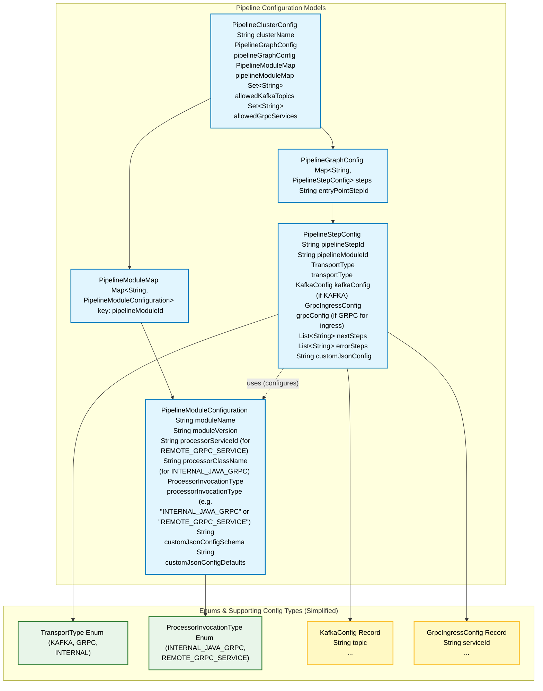
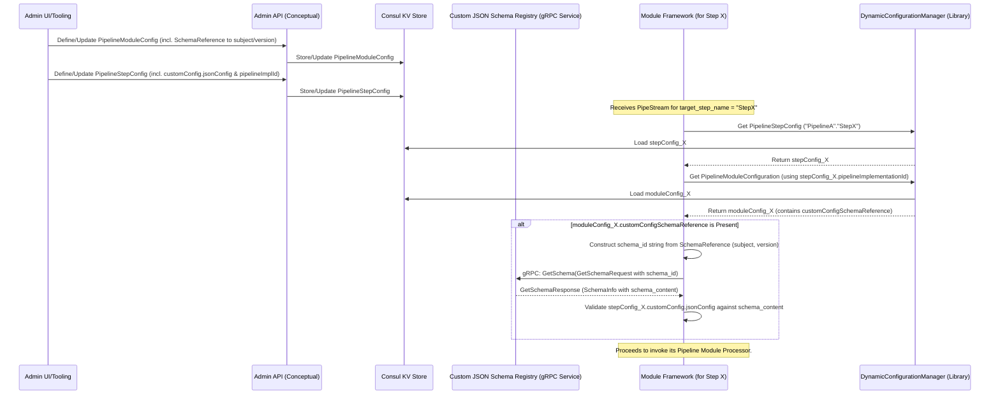
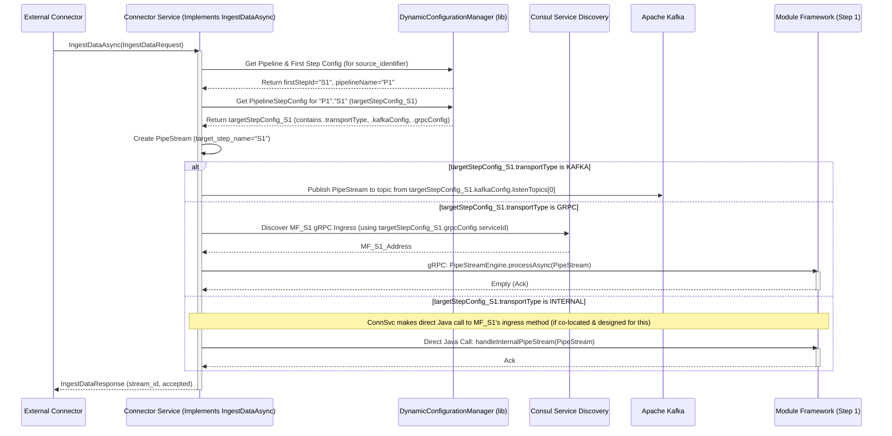
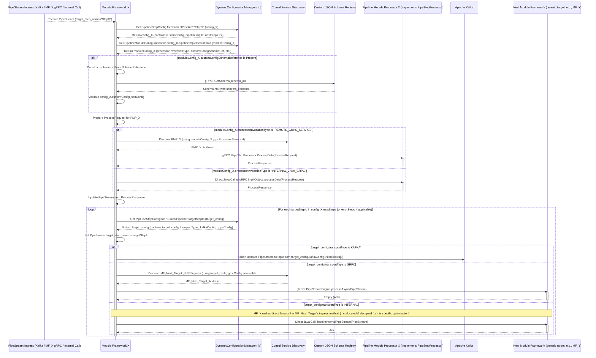

# YAPPY Architecture Overview

*(Last Updated: 2025-05-15 reflecting refined definitions for Module Frameworks, Pipeline Module Processors, inter-step PipeStream
transport, and Consul roles.)*

## 1. Introduction

YAPPY (Yet Another Pipeline Processor) is a dynamic, decentralized, and streaming data processing platform. It is designed to build flexible
data pipelines primarily focused on document indexing, A/B testing of pipeline configurations, and versatile data processing tasks.

The core technologies underpinning YAPPY are:

* **Micronaut:** Leveraged for building efficient, lightweight microservices. This typically includes the services that embody the **"Module
  Framework"** logic (the engine for each pipeline step). For Pipeline Module Processors implemented in Java and designed for optimal in-JVM
  execution, Micronaut can also manage their lifecycle as part of the Module Framework service. The Module Framework capitalizes on
  Micronaut's capabilities for streamlined integration with Kafka and Consul, standardized observability (metrics, tracing, logging),
  simplified service lifecycle management, and establishing foundational security measures.
* **Apache Kafka:** Provides an **asynchronous**, resilient data transport mechanism for `PipeStream` objects when this mode is chosen for
  communication between logical pipeline steps (i.e., from one Module Framework to the next). This enables highly decoupled and scalable
  pipeline flows.
* **gRPC:**
    1. Defines the **universal service interface contract (`PipeStepProcessor.ProcessData` in `pipe_step_processor.proto`) for all Pipeline
       Module Processors.** All business logic units, irrespective of implementation language or how they are invoked (in-process direct
       Java call to the gRPC service object, or network gRPC call), **must** adhere to this gRPC contract.
    2. Provides a **synchronous**, resilient data transport mechanism for `PipeStream` objects when this mode is chosen for communication
       between logical pipeline steps (Module Framework to Module Framework). This involves one Module Framework making a gRPC call to
       another Module Framework's designated `PipeStream` ingress endpoint (e.g., an RPC from `PipeStreamEngine.proto` like `processAsync`).
* **Consul:**
    1. Acts as the dynamic and authoritative configuration store for all pipeline definitions (`PipelineClusterConfig`), dictating pipeline
       structure, individual step configurations, and routing logic (including inter-step transport choices).
    2. Provides service discovery for YAPPY's gRPC services, including:
        * The **Connector Service** (Initial Ingest Service, implementing `PipeStreamEngine.IngestDataAsync`).
        * **Module Framework instances** that expose gRPC endpoints to receive `PipeStream`s directly from other Module Frameworks (e.g.,
          when implementing `PipeStreamEngine.processAsync`).
        * Separately deployed, remote **gRPC-based Pipeline Module Processors** (e.g., written in Python, Rust, or as distinct Java
          services, all implementing `PipeStepProcessor.ProcessData`).
        * The **Custom JSON Schema Registry service** (implementing `SchemaRegistryService.proto`).
        * The **Admin API Service** (future).
    3. All active, long-running YAPPY service instances mentioned above are expected to register with Consul for health checking and
       operational visibility.
* **Schema Registries (Two Distinct Types):**
    * **Protobuf Schema Registry (e.g., Apicurio, Amazon Glue, Confluent Registry):** For managing and validating the Protobuf schemas of
      the `PipeStream` message itself and its constituent Protobuf messages (like `PipeDoc`). This is crucial for ensuring data
      compatibility when `PipeStream`s are serialized, particularly for transport over Kafka. YAPPY components that produce/consume
      `PipeStream`s to/from Kafka will interact with this registry as needed.
    * **Custom JSON Schema Registry (`SchemaRegistryService.proto` implementation):** A dedicated YAPPY gRPC service that stores and
      validates JSON Schemas for the `custom_json_config` parameters specific to each Pipeline Module Processor. This allows the Module
      Framework to perform strict validation of module-specific configurations. This service registers itself with Consul.

## 2. Architectural Principles

YAPPY's design is guided by the following principles:

* **Standardized Module Processor Interface (gRPC - `PipeStepProcessor.proto`):** All **Pipeline Module Processors** (containing the actual
  business logic for a step) **must** implement the common `PipeStepProcessor.ProcessData` gRPC service interface. This standardizes how a
  Module Framework invokes processor logic and receives results, promoting consistency and enabling polyglot module development.
* **Flexible Pipeline Module Processor Invocation by Module Framework:** The Module Framework invokes its configured Pipeline Module
  Processor based on `PipelineModuleConfiguration.processorInvocationType`:
    * **`INTERNAL_JAVA_GRPC` (Optimized Same-JVM Execution):** A Java-based Pipeline Module Processor (a Java class that *is* an
      implementation of the `PipeStepProcessor` gRPC interface) runs within the same JVM as its Java-based Module Framework. The Module
      Framework invokes this processor via a **direct, in-process Java method call on the gRPC service implementation object itself,**
      bypassing network overhead while maintaining strict interface conformity.
    * **`REMOTE_GRPC_SERVICE` (Localhost/Remote Network Call - Polyglot Support):** Pipeline Module Processors (implemented in Java, Python,
      Rust, or any other gRPC-supported language) run as separate gRPC services. The Module Framework makes a standard network gRPC call (to
      `localhost` with a configured port, or a remote host discovered via Consul using `PipelineModuleConfiguration.grpcProcessorServiceId`)
      to interact with these processors.
* **Dynamic Module Configuration:** Each Pipeline Module Processor can define its runtime parameters via a JSON schema registered in the *
  *Custom JSON Schema Registry**. The Module Framework uses this schema to validate the `custom_json_config` from `PipelineStepConfig`.
* **Dynamic Pipeline Configuration:** The overall pipeline definition (`PipelineClusterConfig` in Consul) specifies the sequence of steps,
  the **choice of inter-step `PipeStream` transport (Kafka or gRPC)** between Module Frameworks, module processor assignments, and
  `custom_json_config`. This is dynamically accessed by Module Frameworks.
* **Schema-Driven Design (Dual Registries):** `PipeStream` (Protobuf) integrity during Kafka transport is managed via an external Protobuf
  Schema Registry. `custom_json_config` (JSON) integrity is ensured via the YAPPY Custom JSON Schema Registry.
* **Decentralized Orchestration with Configurable `PipeStream` Transport:**
    * A **"Module Framework"** is the lightweight engine responsible for each step's execution.
    * **`PipeStream` Reception by Module Framework:** A Module Framework receives an input `PipeStream` according to its own
      `PipelineStepConfig.transportType` (which can be `KAFKA` or `GRPC`).
        * `KAFKA`: Consumes from Kafka topic(s) defined in its `PipelineStepConfig.kafkaConfig`.
        * `GRPC`: Implements a gRPC service endpoint (e.g., `PipeStreamEngine.processAsync`), registered in Consul via its
          `PipelineStepConfig.grpcConfig.serviceId`, to receive `PipeStream`s from an upstream component.
        * (`INTERNAL` `transportType` for Module Framework ingress is reserved for specialized same-JVM YAPPY framework internal invocations
          and is not for general pipeline step definition by users.)
    * **Processing Logic:** The Module Framework fetches its `PipelineStepConfig`, validates `custom_json_config` (if applicable), and
      invokes its configured Pipeline Module Processor. The **Pipeline Module Processor solely executes its business logic and returns a
      result to its Module Framework; it has no awareness of Kafka, pipeline structure, or routing.**
    * **`PipeStream` Egress & Routing (Handled by Module Framework, Supports Fan-Out):** After its Pipeline Module Processor completes, the
      Module Framework consults its `PipelineStepConfig.nextSteps` or `errorSteps` (which are lists of target `pipelineStepId`s). For **each
      ** target step ID in the list:
        1. It looks up that *target step's* `PipelineStepConfig` (via `DynamicConfigurationManager`).
        2. It determines the *target step's ingress* `transportType` (KAFKA or GRPC) and associated `kafkaConfig` (for target Kafka topic)
           or `grpcConfig` (for target Module Framework's gRPC ingress `serviceId`).
        3. The sending Module Framework then dispatches the `PipeStream` to that next step using the determined transport mechanism (
           publishes to Kafka or makes a gRPC call to the next Module Framework's `PipeStreamEngine` ingress endpoint). The Module Framework
           must be capable of both Kafka publish and gRPC client calls for this egress if fan-out involves mixed transport types.
* **Developer Enablement (Leveraging Platform Capabilities):**
    * Developers of Pipeline Module Processors focus on implementing the `PipeStepProcessor.ProcessData` gRPC interface.
    * The Module Framework (especially if Micronaut-based) handles platform integration: Kafka/gRPC I/O for inter-framework `PipeStream`
      transport, dynamic configuration from Consul, JSON schema validation, observability hooks, and security foundations for remote
      communications.
* **Resilience:** Service instance resilience (Initial Ingest, Module Frameworks, remote gRPC Processors) is primarily managed by the
  container orchestration platform. *(Future: Application-level resilience, like Module Frameworks attempting failover for processor
  invocation, may be considered.)*

## II. System Modules Overview

*(Diagram based on user's version, updated for clarity and current terminology)*

```mermaid
graph TD
subgraph "User/Admin Interaction"
AdminUI[Admin UI/Tooling]
end

    subgraph "YAPPY Services & Configuration Store"
        ConnectorService["Connector Service (Initial Ingest)<br/>(Implements PipeStreamEngine.IngestDataAsync)"]
        ModuleFramework["Module Framework Instance(s)<br/>(Step Engine; Invokes PMPs;<br/>Routes PipeStreams via Kafka/gRPC;<br/>May Implement PipeStreamEngine.process/processAsync for gRPC ingress)"]
        CustomJsonSR["Custom JSON Schema Registry Service<br/>(Implements SchemaRegistryService.proto)"]
        Consul[("Consul<br/>(KV Store for PipelineClusterConfig, Custom JSON Schemas)<br/>(Service Discovery & Health)")]
        ExternalProtobufSR[("External Protobuf Schema Registry<br/>(e.g., Apicurio - for PipeStream on Kafka)")]
    end

    subgraph "Pipeline Module Processors (Business Logic - Universal gRPC Interface via PipeStepProcessor.proto)"
        InternalPMP["Internal Java/gRPC PMP<br/>(Java class implementing PipeStepProcessor,<br/>runs in ModuleFramework JVM,<br/>called via direct Java method to gRPC service object)"]
        RemotePMP["Remote gRPC PMP<br/>(Service implementing PipeStepProcessor,<br/>e.g., Python, Java,<br/>called via network gRPC)"]
    end

    subgraph "Model Libraries & SDK"
        PipelineConfigModels["pipeline-config-models (Java Records)"]
        SchemaRegistryInternalModels["schema-registry-models (Java Records for CustomJsonSR)"]
        GRPCSDK["grpc-developer-sdk (Protobufs & Stubs)"]
    end

    AdminUI -->|"Manages Configs & Schemas via Admin API (future)"| AdminAPIService["Admin API Service (Future)"]
    AdminAPIService --> CustomJsonSR
    AdminAPIService -->|Writes/Reads| Consul

    ConnectorService -->|Reads Config, Registers| Consul
    ConnectorService -->|Sends PipeStream via Kafka/gRPC to| ModuleFramework
    ConnectorService -->|Uses Models| PipelineConfigModels
    ConnectorService -->|Uses Contracts| GRPCSDK

    ModuleFramework -->|Reads Config, Registers, Discovers| Consul
    ModuleFramework -->|Gets JSON Schemas| CustomJsonSR
    ModuleFramework -->|"Invokes (In-Process Java Call to gRPC object)"| InternalPMP
    ModuleFramework -->|"Invokes (Network gRPC Call)"| RemotePMP
    ModuleFramework -->|Uses Models| PipelineConfigModels
    ModuleFramework -->|Uses Contracts| GRPCSDK
    ModuleFramework -->|"Uses Kafka for PipeStream I/O"| KafkaTransport["Apache Kafka (PipeStream Transport)"]
    ModuleFramework -->|"Uses Protobuf SR for Kafka"| ExternalProtobufSR
    ModuleFramework -.->|"Sends PipeStream via Kafka/gRPC to"| ModuleFramework

    RemotePMP -->|Registers| Consul
    RemotePMP -.->|Uses Contract| GRPCSDK
    InternalPMP -.->|Implements Contract| GRPCSDK 

    CustomJsonSR -->|"Stores/Reads Schemas in"| Consul
    CustomJsonSR -->|"Uses Models"| SchemaRegistryInternalModels
    CustomJsonSR -.->|Registers| Consul
    AdminAPIService -.->|"Registers (if separate)"| Consul


    classDef lib fill:#daf,stroke:#333,stroke-width:2px;
    classDef service fill:#adf,stroke:#333,stroke-width:2px;
    classDef extService fill:#fad,stroke:#333,stroke-width:2px;
    classDef storage fill:#faf,stroke:#333,stroke-width:2px;
    classDef ui fill:#ffa,stroke:#333,stroke-width:2px;
    classDef transport fill:#D3D3D3,stroke:#333,stroke-width:2px;

    class PipelineConfigModels,SchemaRegistryInternalModels,GRPCSDK lib;
    class ConnectorService,ModuleFramework,CustomJsonSR,AdminAPIService service;
    class RemotePMP,InternalPMP extService;
    class Consul,ExternalProtobufSR storage;
    class AdminUI ui;
    class KafkaTransport transport;
```

## III. Pipeline Configuration Model Relationships

*(This ER diagram is based on your provided Java classes, ensuring field names and types match. It illustrates the structure of
configurations stored in Consul.)*

### Description of Key Pipeline Configuration Model Entities:

* **`PipelineClusterConfig`**: Top-level configuration for all pipelines and module definitions.
* **`PipelineGraphConfig`**: Container for all `PipelineConfig` objects.
* **`PipelineConfig`**: Defines a single, named pipeline composed of multiple `PipelineStepConfig`s.
* **`PipelineStepConfig`**: Configuration for an individual step within a pipeline.
    * `pipelineImplementationId`: Links to a `PipelineModuleConfiguration` to determine the business logic (Pipeline Module Processor) for
      this step.
    * `customConfig` (`JsonConfigOptions`): Optional. Holds the JSON string parameters specific to this step's Pipeline Module Processor
      instance. Validated by the Module Framework against a schema if defined in `PipelineModuleConfiguration`.
    * `transportType` (`TransportType` enum: `KAFKA`, `GRPC`, `INTERNAL`): Specifies how **this step's Module Framework receives its
      input `PipeStream`**.
        * `KAFKA`: The Module Framework consumes from Kafka topic(s) defined in `kafkaConfig.listenTopics`.
        * `GRPC`: The Module Framework exposes a gRPC endpoint (e.g., an implementation of `PipeStreamEngine.processAsync`). Its Consul
          `serviceId` for this gRPC ingress is specified in `grpcConfig.serviceId`. Upstream components (Connector Service or other Module
          Frameworks) call this endpoint.
        * `INTERNAL`: (Advanced, YAPPY framework-internal use) The Module Framework is activated via a direct Java method call by a
          co-located YAPPY component, not via network Kafka/gRPC.
    * `kafkaConfig` (`KafkaTransportConfig`): Kafka-specific settings (like `listenTopics`) if `transportType` is `KAFKA`.
    * `grpcConfig` (`GrpcTransportConfig`): gRPC-specific settings (like its own Consul `serviceId` for ingress) if `transportType` is
      `GRPC`.
    * `nextSteps`, `errorSteps` (`List<String>`): Lists of `pipelineStepId`s for the subsequent hop(s). The Module Framework executing
      *this* step is responsible for routing the outgoing `PipeStream`. For each ID in these lists, it will look up the *target*
      `PipelineStepConfig` to determine the target's `transportType` (and associated Kafka topic or gRPC ingress `serviceId`) and then
      dispatch the `PipeStream` accordingly.
* **`JsonConfigOptions`**: Wrapper for the `jsonConfig` string.
* **`PipelineModuleMap`**: A catalog mapping `implementationId` to `PipelineModuleConfiguration`.
* **`PipelineModuleConfiguration`**: Defines a *type* of Pipeline Module Processor.
    * `implementationId`: Unique identifier for the processor type (e.g., `"com.example.MyProcessor"`).
    * `customConfigSchemaReference` (`SchemaReference`): Optional. Points to the JSON schema (using `subject` and `version`) in the Custom
      JSON Schema Registry that validates the `customConfig` for this module type.
    * `processorInvocationType` (String): Specifies how the Module Framework invokes the Pipeline Module Processor logic (which always
      implements `PipeStepProcessor.proto`):
        * `"INTERNAL_JAVA_GRPC"`: The processor is a Java class (implementing `PipeStepProcessor`) within the same JVM as the Module
          Framework. Invoked via a direct Java method call to the gRPC service object.
        * `"REMOTE_GRPC_SERVICE"`: The processor is a separate gRPC service (any language). The Module Framework uses
          `grpcProcessorServiceId` to discover it via Consul and makes a network gRPC call.
    * `javaClassName` (String): Fully qualified class name of the Java processor if `processorInvocationType` is `"INTERNAL_JAVA_GRPC"`.
    * `grpcProcessorServiceId` (String): Consul `serviceId` of the separate gRPC Pipeline Module Processor service if
      `processorInvocationType` is `"REMOTE_GRPC_SERVICE"`.
* **`SchemaReference`**: Contains `subject` and `version` to identify a JSON schema in the Custom JSON Schema Registry.
* **`TransportType`**, **`KafkaTransportConfig`**, **`GrpcTransportConfig`**: Define transport parameters for `PipelineStepConfig` ingress.

## 3. Core Components & Responsibilities (Continued)

*(These subsections will be updated to reflect the precise roles and interactions based on the model above)*

### 3.1. Configuration Subsystem (`DynamicConfigurationManager` & Consul)

* **Responsibilities:** Consul stores `PipelineClusterConfig`. `DynamicConfigurationManager` (a library used within YAPPY services) loads,
  caches, and provides access to this configuration.
* **Key Interaction:** Consul is the source of truth for all pipeline and module definitions.

### 3.2. Connector Service (Initial Ingest Service)

* **Responsibilities:**
    * Implements `PipeStreamEngine.IngestDataAsync` RPC (from `engine_service.proto`) as the primary entry point for external systems.
    * Uses `IngestDataRequest.source_identifier` to determine the initial pipeline and the `pipelineStepId` of its first step from
      `PipelineClusterConfig`.
    * Creates the initial `PipeStream`.
    * **Initiates Pipeline Flow:** Dispatches the initial `PipeStream` to the first Module Framework. To do this, it looks up the *first
      target step's* `PipelineStepConfig` to determine *its* `transportType` and routes accordingly (publishes to target's Kafka
      `listenTopics` or makes a gRPC call to target's `grpcConfig.serviceId` endpoint).
    * Registers itself with Consul.
* **Key Interaction:** Receives external `IngestDataRequest`, uses `DynamicConfigurationManager`, initiates `PipeStream` flow to the first
  Module Framework.

### 3.3. Module Framework

* **Responsibilities:**
    * The engine for a single pipeline step.
    * **`PipeStream` Ingress (Receiving):** Based on its *own* `PipelineStepConfig.transportType`:
        * `KAFKA`: Consumes from Kafka topic(s) in its `kafkaConfig.listenTopics`.
        * `GRPC`: Implements a gRPC service endpoint (e.g., `PipeStreamEngine.processAsync`), registered in Consul via its
          `grpcConfig.serviceId`.
        * `INTERNAL`: (Framework internal optimization) Activated via direct Java call by a co-located YAPPY component.
    * **Configuration & Validation:** Fetches `PipelineStepConfig` and associated `PipelineModuleConfiguration`; validates
      `custom_json_config` against the Custom JSON Schema Registry if `customConfigSchemaReference` is present in
      `PipelineModuleConfiguration`.
    * **Pipeline Module Processor (PMP) Invocation:**
        * Prepares `ProcessRequest`.
        * Based on `PipelineModuleConfiguration.processorInvocationType`:
            * `INTERNAL_JAVA_GRPC`: Makes a direct, in-process Java method call to the co-deployed Java object that implements the
              `PipeStepProcessor` gRPC interface.
            * `REMOTE_GRPC_SERVICE`: Acts as a gRPC client. Uses Consul to discover the target PMP (via
              `PipelineModuleConfiguration.grpcProcessorServiceId`) and makes a network gRPC call to `ProcessData`.
    * **State Update & Routing (Egress & Fan-Out):** Updates `PipeStream` from `ProcessResponse`. For each `targetStepId` in its
      `PipelineStepConfig.nextSteps` (or `errorSteps`):
        1. Looks up the *target step's* `PipelineStepConfig`.
        2. Determines the target step's ingress `transportType` and associated details (Kafka topic from its `kafkaConfig` or gRPC
           `serviceId` from its `grpcConfig`).
        3. Sends the `PipeStream` to the target Module Framework via that determined method.
    * **Consul Registration:** Each Module Framework instance registers itself with Consul for health, visibility, and discovery of its gRPC
      `PipeStream` ingress endpoint (if offered).
* **Key Interaction:** Kafka, gRPC, Consul, Custom JSON Schema Registry, its Pipeline Module Processor.

### 3.4. Pipeline Module Processor (PMP - Business Logic)

* **Responsibilities:**
    * Contains the actual business logic for a step, **always implementing the `PipeStepProcessor.proto` gRPC interface.** It is unaware of
      pipelines, Kafka, or routing; it only processes the data given in `ProcessRequest`.
    * **Invocation Variants (configured in `PipelineModuleConfiguration`):**
        * **`INTERNAL_JAVA_GRPC`:** A Java class implementing `PipeStepProcessor`, invoked in-process by its Module Framework. Not
          separately Consul-registered.
        * **`REMOTE_GRPC_SERVICE` (Polyglot):** A separate gRPC service implementing `PipeStepProcessor`, invoked via network gRPC.
          The Module Framework registers this service with Consul on its behalf.
    * Receives `ProcessRequest`, returns `ProcessResponse`.
* **Key Interaction:** Invoked by its Module Framework. Module Frameworks register remote gRPC PMP services with Consul on their behalf.

### 3.5. `grpc-developer-sdk`

* **Responsibilities:** Provides Protobuf definitions (`PipeStepProcessor.proto`, `PipeStreamEngine.proto`, `SchemaRegistryService.proto`,
  `yappy_core_types.proto`) and generated gRPC stubs for various languages.
* **Key Interaction:** Used by developers of all YAPPY services and modules.

### 3.6. Schema Registries (Two Distinct Types)

* **Protobuf Schema Registry (External, e.g., Apicurio):** Manages Protobuf schemas for `PipeStream` messages, primarily ensuring
  compatibility for Kafka transport.
* **Custom JSON Schema Registry (YAPPY gRPC Service - `SchemaRegistryService.proto` based):** Manages JSON Schemas for `custom_json_config`
  of Pipeline Module Processors. Registers with Consul.
* **Key Interaction:** Protobuf SR with Kafka producers/consumers; Custom JSON SR with Module Frameworks and Admin tooling.

### 3.7. Consul (Expanded Role Summary)

* **Responsibilities:**
    1. **Pipeline Configuration Store:** For `PipelineClusterConfig`.
    2. **Service Discovery For:**
        * Connector Service.
        * Remote gRPC Pipeline Module Processors.
        * Module Framework instances (for their gRPC `PipeStream` ingress endpoints if `transportType=GRPC` for that step).
        * Custom JSON Schema Registry service.
        * Admin API Service (future).
    3. **Service Registration & Health Checking:** Connector Service, Module Frameworks, Custom JSON Schema Registry, and Admin API register themselves with Consul. Module Frameworks also register remote gRPC PMPs with Consul on their behalf.
* **Key Interaction:** Central for runtime configuration and discovering gRPC endpoints.

## 4. Key Data Structures

### 4.1. Protobuf Messages

*(Details of `PipeStream`, `PipeDoc`, `ProcessRequest`, `ProcessResponse`, etc., as defined in the `.proto` files and documented in the
YAPPY gRPC API Manual. The `PipeStreamEngine` service's `IngestDataAsync` is used by the Connector Service. The `process`/`processAsync`
RPCs in `PipeStreamEngine` can be implemented by Module Frameworks for their gRPC ingress.)*

### 4.2. Configuration Models (Java Records)

*(Covered in detail with the ER diagram in Section III and described previously.)*

## 5. Core Workflows & Data Flows

These diagrams illustrate key operational sequences, reflecting the clarified roles and transport mechanisms.

### 5.1. Pipeline Definition & JSON Schema Configuration Access

*(Admin defines `PipelineClusterConfig` including `PipelineModuleConfiguration` with `SchemaReference`. Module Frameworks fetch
their `PipelineStepConfig` and the associated `PipelineModuleConfiguration`, then use `SchemaReference` to get the JSON schema from the
Custom JSON Schema Registry for `custom_json_config` validation.)*

### 5.2. Pipeline Initiation (Connector Service to First Module Framework)

The Connector Service initiates a pipeline by sending the first `PipeStream`.

### 5.3. Generic Step Execution & Routing (Module Framework X to Next Step(s) - Handles Fan-Out)

Illustrates MF_X processing a `PipeStream`, invoking its PMP, and then routing to one or more next steps.

## 6. Developer Workflow: Creating a New Pipeline Module Processor

1. **Define `custom_json_config` Schema (JSON Schema):** If your module requires specific configuration parameters.
    * Create a JSON schema document.
    * Register this schema with the YAPPY Custom JSON Schema Registry Service, specifying a `subject` (typically matching your module's
      `implementationId`) and `version`. The derived `schema_id` (e.g., `"your.module.subject:v1"`) will be used by the system.
2. **Implement `PipeStepProcessor` gRPC Interface:** This is the **universal contract** for all module business logic.
    * **For "Internal Java/gRPC Module" (Same JVM as Module Framework):**
        * Create a Java class that implements the `com.krickert.search.sdk.PipeStepProcessor` gRPC interface (generated from
          `pipe_step_processor.proto`).
        * This class will be instantiated by its hosting Java-based Module Framework and its `ProcessData` method invoked via a direct Java
          method call (on the gRPC service *object*).
    * **For "Remote/Localhost gRPC Service" (Separate Process - Polyglot):**
        * Create a standard gRPC service project in your chosen language (Java, Python, Rust, Go, etc.).
        * Use `pipe_step_processor.proto` to implement the `PipeStepProcessor` service, focusing on the `ProcessData` method.
        * This service must be deployed as a separate process and register itself with Consul using a unique `serviceId`.
3. **Define `PipelineModuleConfiguration` (Admin Task - stored in Consul):**
    * Create a `PipelineModuleConfiguration` entry.
    * `implementationId`: A unique ID for your module type (e.g., `"com.example.MyCustomProcessor"`). This should match the `subject` used
      in `SchemaReference`.
    * `customConfigSchemaReference`: If you defined a JSON schema in step 1, set this to a `SchemaReference` record with the correct
      `subject` and `version`.
    * `processorInvocationType`: Set to `"INTERNAL_JAVA_GRPC"` or `"REMOTE_GRPC_SERVICE"`.
    * If `"INTERNAL_JAVA_GRPC"`, provide `javaClassName` (fully qualified name of your Java class from step 2).
    * If `"REMOTE_GRPC_SERVICE"`, provide `grpcProcessorServiceId` (the Consul `serviceId` your remote gRPC processor from step 2 uses).
4. **Usage in `PipelineStepConfig` (Pipeline Designer Task - stored in Consul):**
    * In a `PipelineConfig`, create or update a `PipelineStepConfig`.
    * Set its `pipelineImplementationId` to the ID defined in step 3.
    * Provide the `customConfig.jsonConfig` string if your module expects it (this will be validated against the schema referenced in
      `PipelineModuleConfiguration`).
    * Set this step's own `transportType` (KAFKA or GRPC) and associated `kafkaConfig` or `grpcConfig` to define how it *receives*
      `PipeStream`s. (`INTERNAL` transportType is generally reserved for framework-internal steps).
    * Define `nextSteps` and `errorSteps` (lists of target `pipelineStepId`s). The Module Framework for this step will use these IDs to look
      up each target step's configuration to determine how to route the outgoing `PipeStream` to them.

## 7. Glossary of Key Terms

* **Module Framework:** The runtime component/service (often called the "engine" for a step) responsible for executing a single
  `PipelineStepConfig`. It:
    * Receives an input `PipeStream` based on its own configured `transportType` (via Kafka consumer, its own gRPC `PipeStreamEngine`
      ingress endpoint, or an internal Java call for `INTERNAL` type).
    * Fetches its configuration from Consul.
    * Validates module parameters (`custom_json_config`) against the Custom JSON Schema Registry.
    * Invokes its configured Pipeline Module Processor (which *always* implements `PipeStepProcessor.proto`) using the method specified by
      `processorInvocationType` (`INTERNAL_JAVA_GRPC` for direct Java call to the gRPC service object, `REMOTE_GRPC_SERVICE` for network
      gRPC call).
    * Updates the `PipeStream`.
    * Sends the `PipeStream` to the next step(s) by looking up each target step's configured ingress `transportType` and using either Kafka
      publish or a gRPC call to the target Module Framework's `PipeStreamEngine` ingress.
    * Each instance of a Module Framework service registers with Consul.
* **Pipeline Module Processor (PMP):** The business logic unit that **implements the `PipeStepProcessor.proto` gRPC interface.** It is
  invoked by a Module Framework and is completely unaware of pipeline structure, Kafka, or routing.
    * **Internal Java/gRPC Module:** A Java class implementing `PipeStepProcessor`, invoked in-process by its Module Framework. Not
      separately Consul-registered.
    * **Remote/Localhost gRPC Service:** A separate gRPC service (any language) implementing `PipeStepProcessor`, invoked via network gRPC
      by its Module Framework. Registers itself with Consul.
* **Connector Service (Initial Ingest Service):** The service implementing `PipeStreamEngine.IngestDataAsync` RPC from
  `engine_service.proto`. It's the designated entry point for creating the initial `PipeStream` and dispatching it (via Kafka or gRPC) to
  the first Module Framework of a pipeline. Registers with Consul.
* **Pipestream Engine (`PipeStreamEngine.proto` gRPC Service):** This gRPC service definition is used by:
    * The **Connector Service** (implements `IngestDataAsync`).
    * **Module Frameworks** (can implement `process`/`processAsync`) to serve as their gRPC ingress endpoint for receiving `PipeStream`s
      directly from other Module Frameworks or the Connector Service, when gRPC inter-step transport is configured.
* **Custom JSON Schema Registry:** The YAPPY gRPC service (implementing `SchemaRegistryService.proto`) for managing JSON Schemas used to
  validate `custom_json_config` for Pipeline Module Processors. Registers with Consul.

## 8. Security Considerations (High Level)

* The Module Framework, by leveraging platforms like Micronaut, can aid in implementing security best practices such as mTLS configuration
  for its outgoing gRPC calls (to remote Pipeline Module Processors *or* to other Module Frameworks' `PipeStreamEngine` ingress endpoints
  when gRPC inter-step transport is used).
* Resilience and security of individual service instances are primarily managed by the underlying container orchestration platform (e.g.,
  Kubernetes providing network policies, secret management, and self-healing).
* Access to Consul, Kafka, and both Schema Registries (Protobuf and Custom JSON) must be secured with appropriate ACLs and
  authentication/authorization.

## 9. Future Considerations / Advanced Topics

* **Unified Schema Management:** While distinct for V1 (Protobuf `PipeStream` schemas in an external registry like Apicurio/Glue; JSON
  `custom_json_config` schemas in YAPPY's Custom JSON Schema Registry), future evaluation could explore consolidating JSON schema management
  into systems like Apicurio if its capabilities are a good fit and offer advantages over the custom YAPPY service.
* **Application-Level Resilience for Processor Invocation:** Post-V1, explore more sophisticated resilience patterns within the Module
  Framework, such as configurable retry or fallback logic when invoking Pipeline Module Processors (e.g., trying a backup
  `grpcProcessorServiceId` if a primary `localhost` or remote processor invocation fails).
* **Advanced Routing in `PipelineStepConfig`**: Consider evolving `nextSteps`/`errorSteps` from `List<String>` (step IDs) to a list of
  `StepTransition` objects directly within `PipelineStepConfig` (as per earlier discussions on `pipeline-config-models`) if more explicit
  per-hop transport configuration directly in the sending step's config is desired for greater flexibility (rather than only looking up the
  target's ingress preference).

*(Other points like Polyglot Module Frameworks, DLQ per Step, Distributed Tracing, Dynamic Scaling, Admin Enhancements remain relevant).*
