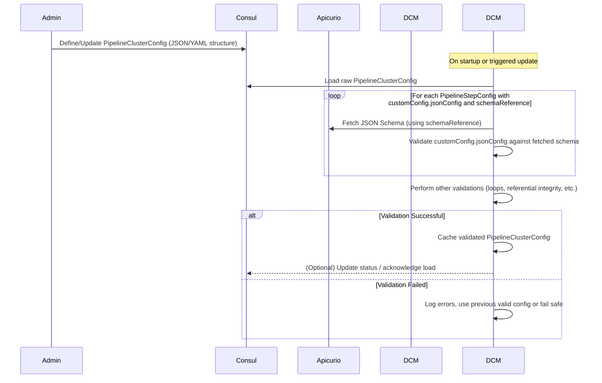
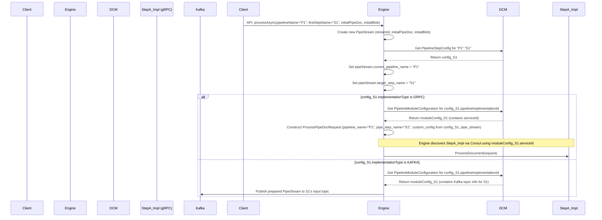
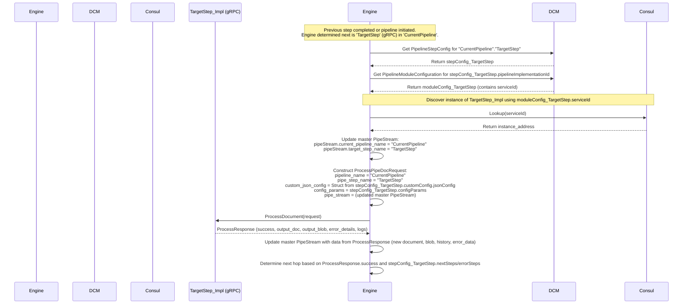
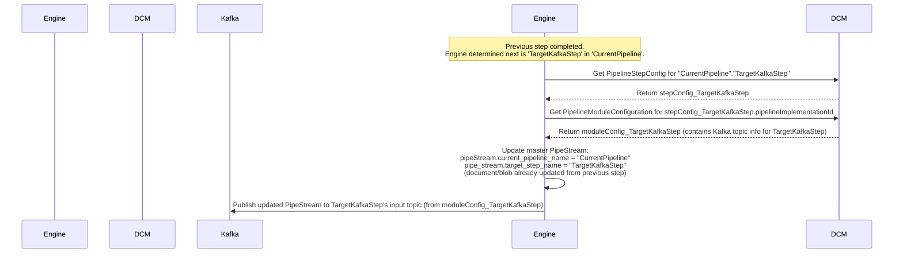
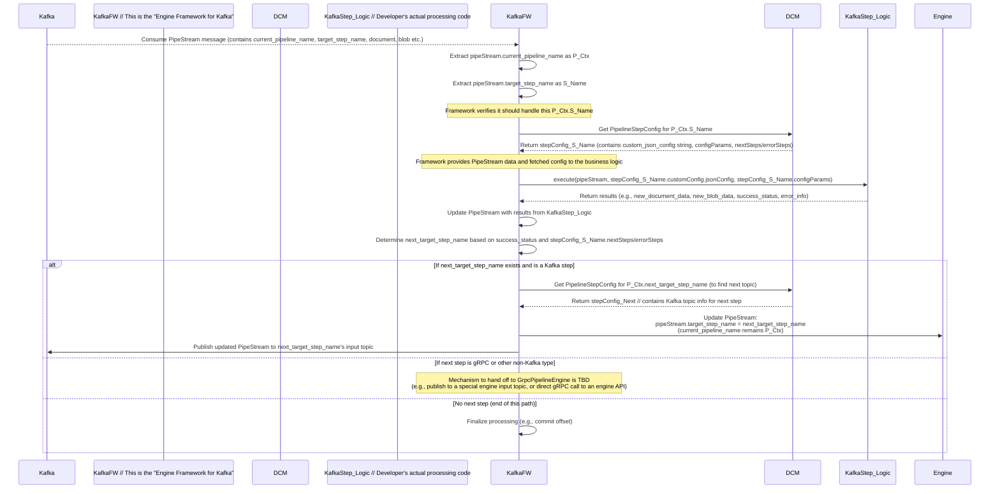

# YAPPY Architecture Overview

*(Last Updated: 2025-05-12 based on collaborative design discussions)*

## 1. Introduction

YAPPY (Yet Another Pipeline Processor) is a dynamic, decentralized, and streaming data processing platform. It is designed to build flexible data pipelines primarily focused on document indexing, with strong support for A/B testing of pipeline configurations and versatile data processing tasks.

The core technologies underpinning YAPPY are:
* **Micronaut:** For building efficient, lightweight microservices, including the central pipeline engine and pluggable gRPC processing modules.
* **Apache Kafka:** For asynchronous, resilient data flow between pipeline steps, enabling decoupling and scalability.
* **gRPC:** For efficient, cross-language inter-service communication, primarily between the pipeline engine and processing modules.
* **Consul:** As a dynamic configuration store for all pipeline definitions and operational parameters, and for service discovery of gRPC modules.
* **Apicurio Registry (or similar):** For managing JSON Schemas that define the structure of custom configurations for pipeline steps.

## 2. Architectural Principles

YAPPY's design is guided by the following principles:

* **Dynamic Configuration:** All aspects of pipeline structure, step definitions, module mappings, and custom parameters are stored externally in Consul. This configuration can be updated live, allowing for dynamic pipeline behavior without service redeployments. The `DynamicConfigurationManager` is responsible for providing this configuration reliably to the system.
* **Schema-Driven Design:**
    * Data in transit (`PipeStream`, `PipeDoc`, `Blob`) is defined using Protocol Buffers (Protobuf) for strong typing and efficiency.
    * Custom configurations for pipeline steps (`custom_json_config`) are validated against JSON Schemas stored in a Schema Registry, ensuring structural correctness.
* **Orchestration and Execution Model:**
    * The `grpc-pipeline-engine` provides centralized orchestration for initiating pipelines and invoking gRPC-based pipeline steps.
    * Kafka-based pipeline steps operate in a more decentralized manner: the engine (or a preceding Kafka step's framework) publishes a `PipeStream` to a topic, and the consuming Kafka step (via the "Engine Framework for Kafka") fetches its own configuration dynamically based on pointers within the `PipeStream`.
* **Extensibility:** The system is designed for developers to easily create and integrate new processing logic as either gRPC services or by providing business logic for Kafka-consuming steps.
* **Clear Separation of Concerns:** The pipeline engine, configuration management, data transport, and actual processing logic are distinct components with well-defined responsibilities.

## 3. Core Components & Responsibilities

### 3.1. Configuration Subsystem (`yappy-consul-config` & `DynamicConfigurationManager`)
* **Responsibilities:**
    * Loads the entire `PipelineClusterConfig` (and its constituent parts like `PipelineConfig`, `PipelineStepConfig`, `PipelineModuleConfiguration`) from Consul.
    * Performs comprehensive validation on the loaded configuration, including:
        * Referential integrity (e.g., ensuring `pipelineImplementationId`s exist).
        * Detection of cyclical dependencies (intra-pipeline and inter-pipeline loops).
        * Validation of `PipelineStepConfig.customConfig.jsonConfig` strings against their declared JSON Schemas (fetched from the Schema Registry based on `SchemaReference`).
    * Caches the validated `PipelineClusterConfig` for fast access by other components (primarily the `grpc-pipeline-engine` and the "Engine Framework for Kafka").
    * Listens for changes in Consul and reloads/re-validates the configuration dynamically, notifying interested components.
* **Key Interaction:** Acts as the definitive source of truth for all pipeline definitions and operational parameters for the runtime components.

### 3.2. `grpc-pipeline-engine` (The Pipeline Engine)
* **Responsibilities:**
    * Serves as the central orchestrator for initiating and managing the execution flow of pipelines.
    * **Pipeline Initiation:** Handles requests (e.g., via an API) to start a new pipeline run, creating the initial `PipeStream` object.
    * **gRPC Step Orchestration:**
        * When a gRPC-based step is to be executed, the engine:
            1.  Uses the `DynamicConfigurationManager` to retrieve the specific `PipelineStepConfig` for the current step (identified by `pipelineName` and `stepName`).
            2.  From this config, it gets the `pipelineImplementationId` and then, via `PipelineModuleConfiguration`, the gRPC `serviceId`.
            3.  Uses Consul for service discovery to find an available instance of the gRPC service.
            4.  Constructs the `ProcessPipeDocRequest`, populating:
                * `pipeline_name`: The current pipeline's name.
                * `pipe_step_name`: The unique name of the `PipelineStepConfig` being executed.
                * `custom_json_config` (as a `google.protobuf.Struct`): Converted from the validated `jsonConfig` string in `PipelineStepConfig.customConfig`.
                * `config_params`: From `PipelineStepConfig.configParams`.
                * `pipe_stream`: The current `PipeStream` object for this execution flow, with its `current_pipeline_name` and `target_step_name` fields updated to reflect the gRPC step being called.
            5.  Invokes the `ProcessDocument` RPC on the discovered gRPC service.
            6.  Receives the `ProcessResponse`.
            7.  Updates its master copy of the `PipeStream` with the `output_doc` and `output_blob` from the response, and records history/errors.
            8.  Determines the next step(s) based on the `success` status of the response and the `nextSteps` or `errorSteps` defined in the completed step's `PipelineStepConfig`.
    * **Kafka Hop Orchestration:**
        * When the next step in a pipeline (after a gRPC step, or at pipeline initiation if the first step is Kafka-based) is to be processed via Kafka:
            1.  The engine prepares the current `PipeStream`.
            2.  It sets `pipe_stream.current_pipeline_name` to the current pipeline's name.
            3.  It sets `pipe_stream.target_step_name` to the name of the specific `PipelineStepConfig` that is the intended Kafka consumer.
            4.  It publishes this prepared `PipeStream` to the Kafka topic designated for the target step (the topic name is usually derived from the target step's `PipelineStepConfig` or its associated `PipelineModuleConfiguration`).
* **Key Interaction:** Coordinates with `DynamicConfigurationManager`, Consul (for discovery), gRPC Service Implementations, and Kafka.

### 3.3. gRPC Service Implementations (Pipeline Step Processors / "Module Implementations")
* **Responsibilities:**
    * These are standalone, deployable gRPC services (typically Micronaut applications) that implement the `com.krickert.yappy.model.PipeStepProcessor` gRPC interface.
    * Each service provides the business logic for one or more `pipelineImplementationId`s (a logical type of processing, e.g., "com.example.AdvancedOcr", "com.example.TextSummarizer").
    * It receives a `ProcessPipeDocRequest` from the `grpc-pipeline-engine`. This request contains:
        * Its own operational context (`pipeline_name`, `pipe_step_name`).
        * Its specific, validated `custom_json_config` (as a `Struct`) and `config_params` for *this particular configured step instance*.
        * The `PipeStream` data payload (including `document` and `blob`).
    * Its primary job is to perform its configured processing task on the `PipeStream`'s data.
    * It returns a `ProcessResponse` to the engine, indicating `success` or failure, and providing any `output_doc`, `output_blob`, error details, and logs.
    * **Crucially, these services are "simple" data-in, data-out processors. They do not handle routing logic, do not decide which step is next, and do not directly publish to Kafka or call other gRPC pipeline services.** The engine manages all onward flow.
* **Key Interaction:** Called by the `grpc-pipeline-engine`; uses the `grpc-developer-sdk`.

### 3.4. Kafka Consumer Steps (& "Engine Framework for Kafka")
* **Responsibilities:**
    * These are pipeline steps whose `PipelineModuleConfiguration.implementationType` is "KAFKA".
    * Their logic is executed within an "Engine Framework for Kafka." This framework can be part of the main `grpc-pipeline-engine`'s deployment or manifest as separate Kafka-consuming microservices built with a dedicated YAPPY platform SDK for Kafka steps.
    * This framework:
        1.  Consumes `PipeStream` messages from designated Kafka topics.
        2.  For each message, it extracts `pipe_stream.current_pipeline_name` and `pipe_stream.target_step_name`.
        3.  It uses these two identifiers to query the `DynamicConfigurationManager` to fetch the complete `PipelineStepConfig` for the consuming step. This provides the step's validated `custom_json_config` string and `config_params`.
        4.  It then invokes the actual business logic defined for that Kafka step, passing it the `PipeStream` data and its fetched, specific configuration.
        5.  After the business logic completes and returns its results (e.g., modified `PipeDoc`/`Blob`, success/error status), the framework consults the current Kafka step's `PipelineStepConfig.nextSteps/errorSteps`.
        6.  It then prepares the `PipeStream` for the *next* hop (updates data, sets new `target_step_name` and `current_pipeline_name`) and publishes it to the appropriate Kafka topic if the next step is also Kafka-based. (If the next step were gRPC, this framework would need a mechanism to hand off to the `grpc-pipeline-engine`).
* **Key Interaction:** Consumes from Kafka, interacts with `DynamicConfigurationManager`, executes specific step logic, publishes to Kafka.

### 3.5. `grpc-developer-sdk`
* **Responsibilities:**
    * Provides the necessary tools and libraries for developers creating new **gRPC Service Implementations** (see 3.3).
    * Includes:
        * The official Protobuf definitions for all shared messages (`PipeStream`, `PipeDoc`, `Blob`, `ProcessPipeDocRequest`, `ProcessResponse`, `ErrorData`, etc.).
        * Generated gRPC service stubs and base classes in supported languages (e.g., Java).
        * Language-specific helper utilities, for example, to easily parse the `google.protobuf.Struct custom_json_config` received in `ProcessPipeDocRequest` into native data structures (like Java Maps or POJOs).
    * **Does not include:** Kafka client libraries or logic for Kafka interaction; that's handled by the "Engine Framework for Kafka."
* **Key Interaction:** Used by developers of new gRPC-based pipeline step logic.

### 3.6. Schema Registry (Apicurio Registry or similar)
* **Responsibilities:**
    * Stores and versions JSON Schemas.
    * Each `PipelineStepConfig` that uses a `customConfig` can (and should) reference a schema in this registry via its `JsonConfigOptions.schemaReference`.
    * The `DynamicConfigurationManager` uses these schemas to validate the `jsonConfig` strings during the loading and validation of the `PipelineClusterConfig`.
* **Key Interaction:** Queried by `DynamicConfigurationManager`. Pipeline administrators/developers manage schemas here.

### 3.7. Consul
* **Responsibilities:**
    * **Configuration Store:** Persists the entire `PipelineClusterConfig` (and its sub-components) as JSON or YAML under a well-defined key structure. This is the source from which `DynamicConfigurationManager` loads its data.
    * **Service Discovery:** gRPC Service Implementations register themselves with Consul. The `grpc-pipeline-engine` queries Consul to discover active instances of these services when it needs to make an RPC call.
* **Key Interaction:** Read by `DynamicConfigurationManager` and `grpc-pipeline-engine` (for discovery). Written to by an Admin API/UI for configuration changes and by gRPC services for registration.

## 4. Key Data Structures

### 4.1. Protobuf Messages (Core Data in Motion)

These define the structure of data passed between components, especially via gRPC and Kafka.

#### 4.1.1. `PipeStream`
The central message carrying data and state through a pipeline execution flow.
```protobuf
message PipeStream {
  string stream_id = 1;             // Unique identifier for this specific execution flow
  PipeDoc document = 2;              // The primary structured data being processed
  Blob blob = 3;                    // Associated binary data, if any
  string current_pipeline_name = 4; // The name of the PipelineConfig this stream currently belongs to/is being processed by
  string target_step_name = 5;      // The 'stepName' of the PipelineStepConfig that is the INTENDED NEXT RECIPIENT of this PipeStream
  repeated StepExecutionRecord history = 6; // Record of steps executed, their status, and timing
  ErrorData error_data = 7;          // Holds error information if the stream is in an error state
  map<string, string> context_params = 8; // General key-value parameters for this stream's context
}
```
**Note:** `PipeStream` acts as a data carrier with *routing pointers* (`current_pipeline_name`, `target_step_name`). It does **not** carry the full operational configuration for the `target_step_name`; that configuration is fetched dynamically by Kafka consumers or supplied directly by the engine to gRPC services.

#### 4.1.2. `PipeDoc` & `Blob`
* **`PipeDoc`**: The primary structured document, containing fields for ID, metadata (key-value map), content chunks, embeddings, etc. Its exact fields are defined in `pipedoc.proto`.
* **`Blob`**: Represents binary data associated with a `PipeDoc`, like the original file. Defined in `blob.proto`.

#### 4.1.3. `ProcessPipeDocRequest`
Used by the `grpc-pipeline-engine` to invoke a gRPC Service Implementation.
```protobuf
message ProcessPipeDocRequest {
  string pipeline_name = 1;        // The 'pipelineName' from PipelineConfig providing context for this call.
  string pipe_step_name = 2;        // The 'stepName' from PipelineStepConfig that this gRPC service instance is currently executing as.
  google.protobuf.Struct custom_json_config = 3; // The specific, validated custom configuration for THIS pipe_step_name, parsed by the engine from the PipelineStepConfig's jsonConfig string and converted to a Struct.
  map<string, string> config_params = 4;        // The 'configParams' map from PipelineStepConfig for THIS pipe_step_name.
  PipeStream pipe_stream = 5;       // The data payload. The engine ensures pipe_stream.current_pipeline_name == pipeline_name and pipe_stream.target_step_name == pipe_step_name when sending this request.
}
```

#### 4.1.4. `ProcessResponse`
Returned by a gRPC Service Implementation to the `grpc-pipeline-engine`.

```protobuf
    message ProcessResponse {
      bool success = 1;                     // True if processing was successful, false otherwise.
      PipeDoc output_doc = 2;              // Optional: The modified or newly created PipeDoc.
      Blob output_blob = 3;               // Optional: The modified or newly created Blob.
      google.protobuf.Struct error_details = 4; // Optional: Structured error information if success is false.
      string processor_logs = 5;          // Optional: Any specific logs generated by this processor step.
  }
```

#### 4.1.5. `ErrorData` & `StepExecutionRecord`
* **`ErrorData`**: (Part of `PipeStream`) Holds details about an error that occurred during processing (error code, message, stack trace, originating step).
* **`StepExecutionRecord`**: (Part of `PipeStream.history`) Records information about each step that has processed the `PipeStream` (step name, start/end time, status, logs).

### 4.2. Configuration Models (Java Records, stored as JSON/YAML in Consul)

These define the structure of the pipeline configurations stored in Consul. (See `yappy-models/pipeline-config-models` for detailed Java record definitions).

* **`PipelineClusterConfig`**: The root configuration object. Contains a map of `PipelineConfig`s and a `PipelineModuleMap`.
* **`PipelineConfig`**: Defines a single pipeline. Contains metadata (like `pipelineName`, `version`) and a map of `PipelineStepConfig`s (keyed by `stepName`).
* **`PipelineStepConfig` (Defines a "Configured Step Instance" / "Module" at your "pipestep id level"):**
    * `pipelineName`: Name of the pipeline this step belongs to.
    * `stepName`: Unique name of this step within the pipeline (e.g., "myPdfExtractor", "chunker-412-tokens").
    * `pipelineImplementationId`: A string identifying the type of processing logic to use (e.g., "com.example.PdfExtractor", "com.company.GenericChunker"). This ID links to a `PipelineModuleConfiguration`.
    * `customConfig`: An instance of `JsonConfigOptions`, holding the actual `jsonConfig` (string) specific to this step instance, and a `schemaReference`.
    * `configParams`: A `Map<String, String>` for simple key-value parameters.
    * `nextSteps`: A list of `String` (target `stepName`s) or `KafkaPublishTopic` objects defining where to route the `PipeStream` on successful completion.
    * `errorSteps`: Similar to `nextSteps`, but for routing on failure.
    * `kafkaConsumeTopics`: List of topics this step might consume from if it's a Kafka step.
* **`PipelineModuleConfiguration` (Defines an "Implementation Type"):**
    * Keyed by `pipelineImplementationId`.
    * `implementationType`: Enum/String, e.g., "GRPC", "KAFKA".
    * `serviceId` (if "GRPC"): The Consul `serviceId` used by the engine to discover the gRPC service instances that implement this logic.
    * `kafkaTopics` (if "KAFKA"): Defines input/output topics or conventions for Kafka-based steps.
    * `schemaReference`: A `SchemaReference` pointing to the JSON Schema (in the Schema Registry) for validating the `customConfig.jsonConfig` of any `PipelineStepConfig` that uses this `pipelineImplementationId`.
* **`JsonConfigOptions`**: Contains the `String jsonConfig` and an optional `SchemaReference`.
* **`SchemaReference`**: Contains information to locate a schema in the Schema Registry (e.g., `groupId`, `artifactId`, `version`).
* **`PipelineModuleMap`**: Part of `PipelineClusterConfig`, a map of `pipelineImplementationId` to `PipelineModuleConfiguration`.

## 5. Core Workflows & Data Flows

Mermaid diagrams illustrating the primary interaction patterns.

### 5.1. Pipeline Definition & Configuration Loading
Administrators define pipeline configurations (as YAML/JSON adhering to the models above) in Consul. The `DynamicConfigurationManager` in YAPPY services (especially the Engine and Kafka Consumer Framework) loads, validates, and caches this.



### 5.2. Pipeline Initiation (e.g., by API Call to Engine)
A new pipeline run is typically triggered by an external request to the `grpc-pipeline-engine`.



### 5.3. Engine Orchestrating a gRPC Step
This flow occurs when the engine determines a gRPC step needs to be executed.



### 5.4. Engine Routing to a Kafka Step
After a gRPC step (or at pipeline initiation), if the next step is Kafka-based.



### 5.5. Kafka Consumer Step Execution ("Engine Framework for Kafka")
How a step defined with `implementationType = KAFKA` processes a message.



## 6. Developer Workflow: Creating a New gRPC Step Implementation

This outlines the process for a developer to add new, reusable processing logic to YAPPY as a gRPC service.

1.  **Define Configuration Schema (JSON Schema):**
    * The developer determines what parameters their new processing logic will need.
    * They create a JSON Schema that defines the structure, types, and constraints for these parameters (this will become the `custom_json_config` for their step).
    * Example: For a "SentimentAnalyzer", the schema might define fields like `model_name` (string, enum), `confidence_threshold` (number).

2.  **Register Schema in Schema Registry:**
    * The developer (or an admin) uploads this JSON Schema to the Apicurio Schema Registry (or configured equivalent).
    * The schema receives a unique identifier (e.g., `groupId`, `artifactId`, `version`).

3.  **Implement `PipeStepProcessor` gRPC Service (using `grpc-developer-sdk`):**
    * The developer creates a new gRPC service project (e.g., using Micronaut for Java).
    * They use the YAPPY `grpc-developer-sdk` which provides:
        * The `.proto` files for `PipeStepProcessor` and related messages (`PipeStream`, `PipeDoc`, etc.).
        * Generated gRPC stubs and service base classes for their chosen language.
        * Helper utilities (e.g., in Java, `ProtobufUtils.structToJsonNode(Struct)` or similar to convert the incoming `custom_json_config` (Struct) into a usable format like Jackson `JsonNode` or a Map).
    * They implement the `ProcessDocument(ProcessPipeDocRequest request)` method:
        * Parse `request.custom_json_config` using SDK helpers.
        * Access `request.pipe_stream.document` and `request.pipe_stream.blob`.
        * Perform the core business logic of their new processor.
        * Construct and return a `ProcessResponse` with `output_doc`, `output_blob`, `success` status, and any `error_details` or `processor_logs`.

4.  **Platform Configuration (Admin Task: `PipelineModuleConfiguration`):**
    * An administrator or lead developer defines a new `PipelineModuleConfiguration` entry in Consul. This entry is keyed by a new, unique `pipelineImplementationId` (e.g., "com.mycompany.SentimentAnalyzer-v1").
    * This configuration specifies:
        * `implementationType: "GRPC"`
        * `serviceId`: The Consul service name under which the newly developed gRPC service will be deployed and registered (e.g., "sentiment-analyzer-service").
        * `schemaReference`: Points to the JSON Schema registered in Step 2 (using its `groupId`, `artifactId`, `version`).

5.  **Usage (Pipeline Designer: `PipelineStepConfig`):**
    * Once the above is set up, pipeline designers can now create `PipelineStepConfig` entries (the "configured step instances" or "modules") in their `PipelineConfig` definitions.
    * These `PipelineStepConfig` entries will use `pipelineImplementationId: "com.mycompany.SentimentAnalyzer-v1"`.
    * They will provide a specific `customConfig.jsonConfig` (a JSON string) that conforms to the schema defined in Step 1 and validated by the `DynamicConfigurationManager`.
    * Example `PipelineStepConfig`:
        ```json
        {
          "stepName": "analyzeProductReviewSentiment",
          "pipelineImplementationId": "com.mycompany.SentimentAnalyzer-v1",
          "customConfig": {
            "jsonConfig": "{\"model_name\": \"BERT-large-sentiment\", \"confidence_threshold\": 0.75}",
            "schemaReference": { "groupId": "com.mycompany", "artifactId": "SentimentAnalyzerConfig", "version": "1.0.0" }
          },
          "nextSteps": ["storeSentimentResults"]
        }
        ```

## 7. Glossary of Key Terms

* **Pipeline:** A defined sequence or graph of processing steps. (Defined by `PipelineConfig`).
* **Pipeline Step (`PipelineStepConfig`):** A specific, configured instance of a processing unit within a `PipelineConfig`. This is also referred to as a "configured step instance" or, in your project's parlance, a "module at the pipestep id level." Uniquely identified by `pipelineName + stepName`.
* **Pipeline Implementation ID (`pipelineImplementationId`):** A logical identifier for a reusable type of processing logic (e.g., "com.example.OcrProcessor"). It links a `PipelineStepConfig` to a `PipelineModuleConfiguration`.
* **gRPC Service Implementation:** The actual gRPC service code (e.g., a Micronaut application) that provides the logic for one or more `pipelineImplementationId`s. Discovered via Consul using a `serviceId`.
* **Engine (`grpc-pipeline-engine`):** The central component that orchestrates pipeline execution, calls gRPC services, and routes `PipeStream`s to Kafka.
* **SDK (`grpc-developer-sdk`):** Libraries and tools for developers creating new gRPC Service Implementations.
* **Engine Framework (for Kafka):** The runtime components and libraries that handle the execution of Kafka-based pipeline steps, including message consumption, dynamic configuration lookup, business logic invocation, and onward routing.
* **`PipeStream`:** The core Protobuf message carrying data (`PipeDoc`, `Blob`), state (`history`, `error_data`), and routing pointers (`current_pipeline_name`, `target_step_name`) through the pipeline.
* **`PipeDoc`:** The Protobuf message for structured document data.
* **`custom_json_config`:** A JSON string within `PipelineStepConfig.customConfig` providing specific parameters for that configured step instance. Its structure is defined by a JSON Schema. In `ProcessPipeDocRequest`, it's passed as a `google.protobuf.Struct`.

## 8. Security Considerations (High Level)

Security is a critical aspect of YAPPY. The following are foundational considerations, with detailed implementation strategies to be elaborated in specific security design documents:

* **mTLS (Mutual TLS):** Should be enforced for all gRPC communication between the `grpc-pipeline-engine` and gRPC Service Implementations, as well as between any YAPPY platform components that communicate via gRPC.
* **Kafka Security:**
    * **Encryption in Transit:** TLS should be enabled for Kafka brokers.
    * **Authentication:** SASL or mTLS should be used for client authentication to Kafka.
    * **Authorization:** Kafka ACLs should be configured to restrict produce/consume permissions on topics to only authorized services/principals.
* **Consul Security:**
    * **ACLs:** Consul's Access Control List system should be enabled to protect an_kv_store (where `PipelineClusterConfig` is stored) and service registration/discovery endpoints.
    * **Encryption:** RPC and Serf gossip encryption should be enabled for Consul.
* **Schema Registry Security:** Access to the Schema Registry should be controlled, typically via authentication and authorization mechanisms provided by the registry itself.
* **Secrets Management:** For sensitive configuration values (e.g., API keys, passwords) needed by pipeline steps, integration with a dedicated secrets manager (like HashiCorp Vault) should be considered. Configurations in Consul would store references to secrets rather than the secrets themselves.

## 9. Future Considerations / Advanced Topics
*(These are topics for potential future evolution or deeper dives, not necessarily part of the immediate core implementation unless specified in `README-TODO.md`)*

* **Polyglot Kafka Consumer Step Logic:** While the "Engine Framework for Kafka" will provide the main mechanism, defining clear interfaces for plugging in user-defined business logic for Kafka steps in various languages might be needed if the framework isn't deployed as part of the same application stack as the user's logic.
* **Direct Module-to-Module Communication:** The current model funnels most control flow through the engine or via Kafka topics managed by the engine/framework. Highly advanced scenarios might explore direct, authenticated gRPC calls between processing modules if extreme low-latency is needed and the overhead of engine orchestration is to be bypassed for specific paths (this would add complexity).
* **Advanced Error Handling:** Beyond routing to `errorSteps`, implementing more sophisticated Dead Letter Queue (DLQ) patterns, retry mechanisms with backoff at the Kafka consumer level, and centralized error reporting/aggregation.
* **Monitoring & Metrics:** Integration with monitoring systems (e.g., Prometheus, Grafana) for visibility into pipeline throughput, step execution times, error rates, and system health. OpenTelemetry integration is a strong candidate.
* **Admin API/UI Enhancements:** More sophisticated tools for pipeline definition, visualization of running pipelines, monitoring, and manual intervention.
* **Scalability & Resilience Details:** Further documentation on scaling strategies for the engine, gRPC modules, and Kafka consumers, including Kafka partitioning strategies and consumer group management.
