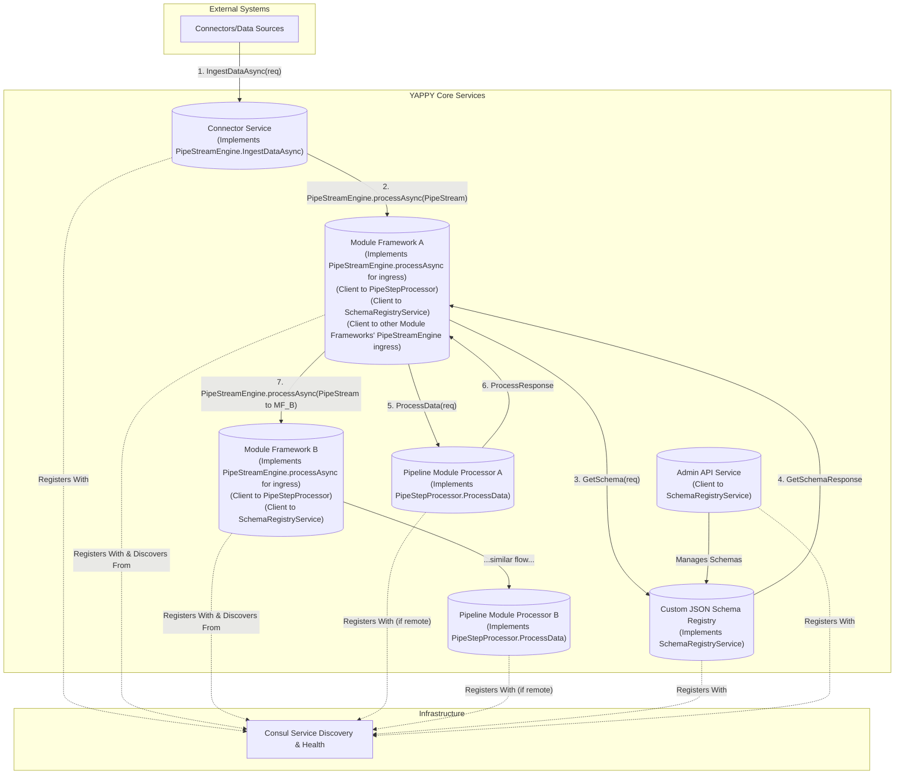
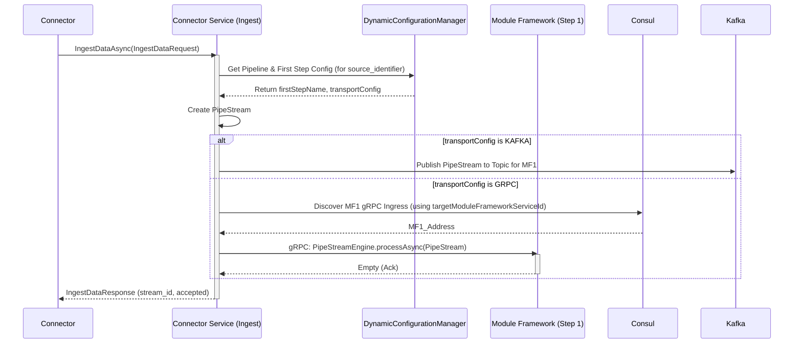
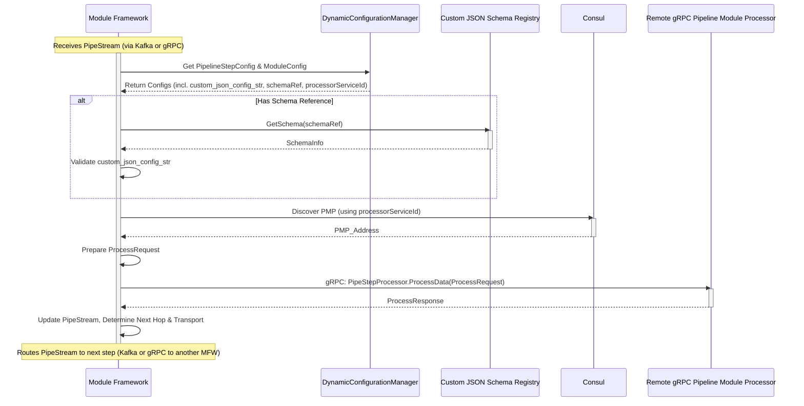
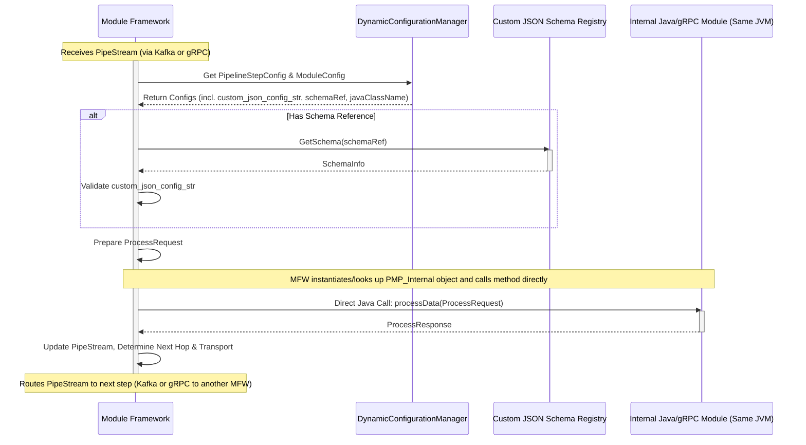

# YAPPY gRPC API Manual

**Version:** 1.0
**Last Updated:** 2025-05-15

## 1. Introduction

This document is the definitive reference for the gRPC services and messages that constitute the Application Programming Interfaces (APIs) of the YAPPY (Yet Another Pipeline Processor) platform. YAPPY employs gRPC to facilitate robust, cross-language communication between its distributed components.

The primary gRPC services in YAPPY are:

1.  **`PipeStreamEngine`**: Defines how pipelines are initiated and how `PipeStream` data can be transported synchronously between pipeline steps (Module Frameworks).
2.  **`PipeStepProcessor`**: The universal contract for all business logic units (Pipeline Module Processors), standardizing how they are invoked and managed by their hosting Module Framework.
3.  **`SchemaRegistryService`**: Manages JSON Schemas used to validate the `custom_json_config` for Pipeline Module Processors.

This manual details each service, its RPC methods, and the associated message structures. All YAPPY gRPC services, when deployed as network-accessible components, are expected to register with Consul for discovery and health monitoring. Core data types like `PipeStream` and `PipeDoc` are defined in `yappy_core_types.proto` and are imported by these service definitions.

## 2. Core Data Types (`yappy_core_types.proto`)

The foundation of data exchange in YAPPY relies on a set of shared Protobuf messages defined in `yappy_core_types.proto`. These messages are consistently used across different gRPC services and Kafka topics.

**Key Core Messages:**

| Message Name                 | Description                                                                                                                               | .proto Source             |
| :--------------------------- | :---------------------------------------------------------------------------------------------------------------------------------------- | :------------------------ |
| `PipeStream`                 | The central message carrying execution state, routing information (`target_step_name`), the `PipeDoc` being processed, and history.           | `yappy_core_types.proto`  |
| `PipeDoc`                    | Represents the structured document undergoing processing, including metadata, textual content, semantic results, and an optional `Blob`.    | `yappy_core_types.proto`  |
| `Blob`                       | Contains raw binary data (e.g., original file content) associated with a `PipeDoc`.                                                       | `yappy_core_types.proto`  |
| `Embedding`                  | Represents a named vector embedding.                                                                                                      | `yappy_core_types.proto`  |
| `ChunkEmbedding`             | Text content and vector embedding for a single document chunk.                                                                            | `yappy_core_types.proto`  |
| `SemanticChunk`              | A semantic chunk of text with its embedding and metadata.                                                                                 | `yappy_core_types.proto`  |
| `SemanticProcessingResult`   | The outcome of a specific chunking and/or embedding process applied to a field of a `PipeDoc`.                                            | `yappy_core_types.proto`  |
| `ErrorData`                  | Standard structure for reporting errors that occur during pipeline step execution or stream processing.                                   | `yappy_core_types.proto`  |
| `StepExecutionRecord`        | Records details of a single pipeline step's execution, including status, timing, and logs. Part of `PipeStream.history`.                  | `yappy_core_types.proto`  |
| `FailedStepInputState`       | Captures the input state to a step that failed, for debugging and reproducibility.                                                        | `yappy_core_types.proto`  |
| `google.protobuf.Struct`     | Standard Protobuf message used for flexible, schemaless JSON-like structures, notably for `PipeDoc.custom_data` and `ProcessRequest.config.custom_json_config`. | `google/protobuf/struct.proto` |
| `google.protobuf.Timestamp`  | Standard Protobuf message for representing timestamps.                                                                                    | `google/protobuf/timestamp.proto` |
| `google.protobuf.Empty`      | Standard Protobuf message for empty request/response, often used as an acknowledgment.                                                    | `google/protobuf/empty.proto`   |

*(For detailed field descriptions of these messages, please refer directly to the `yappy_core_types.proto` file provided in the project.)*

---

## 3. `PipeStreamEngine` Service

This service primarily defines how pipelines are initiated and provides RPCs that can be used for synchronous, gRPC-based transport of `PipeStream`s between Module Frameworks if a pipeline is configured for such an interaction.

* **.proto File:** `engine_service.proto`
* **Package:** `com.krickert.search.engine`
* **Java Outer Classname:** `EngineServiceProto`
* **Primary Implementers:**
    * **Connector Service (Initial Ingest Service):** Implements `IngestDataAsync` to start new pipeline executions.
    * **Module Frameworks:** Can optionally implement `process` or `processAsync` to serve as gRPC ingress points for receiving `PipeStream`s from other Module Frameworks or the Connector Service.
* **Consul Registration:** Instances implementing this service (Connector Service, Module Frameworks offering gRPC ingress) register with Consul for discovery.

**Service Summary Table:**

| RPC Method        | Request Message     | Response Message    | Description                                                                                                                              |
| :---------------- | :------------------ | :------------------ | :--------------------------------------------------------------------------------------------------------------------------------------- |
| `IngestDataAsync` | `IngestDataRequest` | `IngestDataResponse`| **(Connectors)** Initiates a pipeline asynchronously using a `source_identifier` to map to a pipeline configuration.                     |
| `process`         | `model.PipeStream`  | `model.PipeStream`  | **(Module Frameworks)** Synchronously processes an incoming `PipeStream` and returns the (potentially modified) `PipeStream`.              |
| `processAsync`    | `model.PipeStream`  | `protobuf.Empty`    | **(Module Frameworks)** Asynchronously processes an incoming `PipeStream` (fire-and-forget), returning an acknowledgment upon reception. |

### 3.1. RPC: `IngestDataAsync`

This RPC is the standard entry point for external systems ("Connectors") to submit data to YAPPY and initiate a pipeline.

* **Description:** The Connector Service implements this RPC. It uses the `source_identifier` from the request to look up the target pipeline and its first step in the `PipelineClusterConfig`. It then creates a new `PipeStream` and dispatches it to the first Module Framework. The dispatch can occur via Kafka (publishing to the first step's designated topic) or by making a gRPC call to the first Module Framework's `PipeStreamEngine.processAsync` (or `process`) endpoint, based on the pipeline's configuration.
* **Request:** `IngestDataRequest`
* **Response:** `IngestDataResponse`

**`IngestDataRequest` Message:**

| Field                    | Type                                      | Label    | Description                                                                                                                                                             |
| :----------------------- | :---------------------------------------- | :------- | :---------------------------------------------------------------------------------------------------------------------------------------------------------------------- |
| `source_identifier`      | `string`                                  |          | **Required.** Identifier for the data source/connector (e.g., "s3-landing-bucket-connector"). Used to look up the target pipeline and initial step in `PipelineClusterConfig`. |
| `document`               | `com.krickert.search.model.PipeDoc`       |          | **Required.** The initial document data to be processed.                                                                                                                |
| `initial_context_params` | `map<string, string>`                     |          | Optional. Key-value parameters to be included in the `PipeStream.context_params` (e.g., tenant\_id, user\_id).                                                       |
| `suggested_stream_id`    | `string`                                  | optional | Optional. If the connector wants to suggest a `stream_id`. The system may generate its own if empty or if there's a conflict/policy.                                       |

**`IngestDataResponse` Message:**

| Field       | Type     | Label    | Description                                                                                                    |
| :---------- | :------- | :------- | :------------------------------------------------------------------------------------------------------------- |
| `stream_id` | `string` |          | The unique `stream_id` assigned by the system to this ingestion flow.                                          |
| `accepted`  | `bool`   |          | `true` if the ingestion request was successfully accepted and queued/forwarded; `false` otherwise.             |
| `message`   | `string` |          | Optional. A human-readable message, e.g., "Ingestion accepted for stream ID \[stream\_id], targeting pipeline X." |

### 3.2. RPC: `process`

This RPC provides a synchronous mechanism for one YAPPY component (e.g., an upstream Module Framework or the Connector Service) to send a `PipeStream` to another YAPPY component (typically a downstream Module Framework) that implements this server-side logic.

* **Description:** The caller sends a `PipeStream` and blocks until the receiving Module Framework has processed it (which includes invoking its Pipeline Module Processor) and returns the (potentially modified) `PipeStream`. This ensures end-to-end synchronous behavior for that specific hop if desired.
* **Request:** `com.krickert.search.model.PipeStream` (see Section 2 for `PipeStream` details)
* **Response:** `com.krickert.search.model.PipeStream`
* **Usage Note:** Due to its synchronous nature, use with caution if the downstream processing is lengthy. `processAsync` is generally preferred for inter-Module Framework communication to maintain system responsiveness.

### 3.3. RPC: `processAsync`

This RPC provides an asynchronous (from the caller's perspective) mechanism for one YAPPY component to send a `PipeStream` to another (typically a Module Framework).

* **Description:** The caller sends a `PipeStream` and receives an immediate `google.protobuf.Empty` acknowledgment, indicating the `PipeStream` has been accepted for processing. The actual processing by the receiving Module Framework occurs asynchronously. This is the recommended gRPC method for inter-Module Framework `PipeStream` transport if Kafka is not used for a particular hop, as it prevents the calling framework from blocking.
* **Request:** `com.krickert.search.model.PipeStream` (see Section 2 for `PipeStream` details)
* **Response:** `google.protobuf.Empty` (signals acknowledgment of receipt and acceptance for processing)

---

## 4. `PipeStepProcessor` Service

This service defines the **universal contract for all Pipeline Module Processors**. It standardizes how Module Frameworks invoke the business logic units, irrespective of the processor's implementation language or deployment model (internal Java/gRPC, or localhost/remote gRPC service).

* **.proto File:** `pipeprocessor_engine.proto` (Note: filename in user prompt, typically might be `pipe_step_processor.proto` for clarity, but using provided name)
* **Package:** `com.krickert.search.sdk` (based on `java_package` in the .proto)
* **Java Outer Classname:** `PipeStepProcessorServiceProto`
* **Primary Implementers:** All Pipeline Module Processors (business logic units).
* **Consul Registration:** Separately deployed Pipeline Module Processor services (e.g., Python, Rust, or remote Java gRPC services) register themselves with Consul. Internal Java/gRPC modules (same JVM as framework) do not register separately.

**Service Summary Table:**

| RPC Method    | Request Message | Response Message | Description                                                                |
| :------------ | :-------------- | :--------------- | :------------------------------------------------------------------------- |
| `ProcessData` | `ProcessRequest`| `ProcessResponse`| Invoked by a Module Framework to execute the step's business logic.        |

### 4.1. RPC: `ProcessData`

This is the sole RPC method for this service and the heart of module execution.

* **Description:** A Module Framework prepares a `ProcessRequest` (containing the relevant part of the `PipeStream` (`document`), step-specific configuration, and contextual metadata) and invokes this RPC on its configured Pipeline Module Processor. The processor executes its logic and returns a `ProcessResponse`.
* **Request:** `ProcessRequest`
* **Response:** `ProcessResponse`

**`ProcessRequest` Message:**

| Field      | Type                                      | Label    | Description                                                                                                                                                                                                                                                           |
| :--------- | :---------------------------------------- | :------- | :-------------------------------------------------------------------------------------------------------------------------------------------------------------------------------------------------------------------------------------------------------------------- |
| `document` | `com.krickert.search.model.PipeDoc`       |          | **Required.** The document data (from `PipeStream.document`) to be processed by this module.                                                                                                                                                                          |
| `config`   | `ProcessConfiguration`                    |          | **Required.** Configuration specific to this processing step instance.                                                                                                                                                                                                |
| `metadata` | `ServiceMetadata`                         |          | **Required.** Contextual information provided by the invoking Module Framework, derived from the current `PipeStream` and `PipelineStepConfig` (e.g., `pipeline_name`, `pipe_step_name`, `stream_id`, `history`, `context_params`). This enables stateless processors. |

**`ProcessConfiguration` Message (nested within `ProcessRequest`):**

| Field                  | Type                        | Label    | Description                                                                                                                             |
| :--------------------- | :-------------------------- | :------- | :-------------------------------------------------------------------------------------------------------------------------------------- |
| `custom_json_config`   | `google.protobuf.Struct`    |          | The specific, validated custom JSON configuration for this step, parsed by the Module Framework from `PipelineStepConfig.customConfig.jsonConfig`. |
| `config_params`        | `map<string, string>`       |          | The `configParams` map from `PipelineStepConfig` for this step.                                                                           |

**`ServiceMetadata` Message (nested within `ProcessRequest`):**

| Field                 | Type                                                | Label    | Description                                                                                                |
| :-------------------- | :-------------------------------------------------- | :------- | :--------------------------------------------------------------------------------------------------------- |
| `pipeline_name`       | `string`                                            |          | The name of the `PipelineConfig` providing context for this call.                                          |
| `pipe_step_name`      | `string`                                            |          | The `stepName` from `PipelineStepConfig` that this processor instance is currently executing as.            |
| `stream_id`           | `string`                                            |          | Unique ID for the entire execution flow (from `PipeStream.stream_id`).                                     |
| `current_hop_number`  | `int64`                                             |          | The current hop number in the pipeline for this step's execution (from `PipeStream.current_hop_number`).   |
| `history`             | `repeated com.krickert.search.model.StepExecutionRecord` |          | History of previously executed steps in this stream (from `PipeStream.history`). Use judiciously.        |
| `stream_error_data`   | `com.krickert.search.model.ErrorData`               | optional | If the overall `PipeStream` was previously marked with a critical error.                                     |
| `context_params`      | `map<string, string>`                               |          | Key-value parameters for the entire run's context (from `PipeStream.context_params`).                      |

**`ProcessResponse` Message:**

| Field            | Type                                      | Label    | Description                                                                                                                                                                |
| :--------------- | :---------------------------------------- | :------- | :------------------------------------------------------------------------------------------------------------------------------------------------------------------------- |
| `success`        | `bool`                                    |          | **Required.** `true` if this step's processing was successful; `false` otherwise. This dictates routing by the Module Framework (to `nextSteps` or `errorSteps`).           |
| `output_doc`     | `com.krickert.search.model.PipeDoc`       | optional | The modified or newly created `PipeDoc`. If omitted, the Module Framework may assume the input `PipeDoc` was processed in-place or is unchanged. Best practice is to return it if modified. |
| `error_details`  | `google.protobuf.Struct`                  | optional | Structured error information specific to *this processor's execution* if `success` is `false`. Allows for rich, machine-readable error data.                                |
| `processor_logs` | `repeated string`                         |          | Logs or summary information generated by this processor step, intended to be included in the `StepExecutionRecord` for this hop.                                           |

---

## 5. Custom JSON `SchemaRegistryService`

This service manages JSON Schema definitions used by Module Frameworks to validate the `custom_json_config` for Pipeline Module Processors.

* **.proto File:** `schema_registry.proto`
* **Package:** `com.krickert.search.schema.registry`
* **Java Outer Classname:** `SchemaRegistryServiceProto`
* **Primary Implementer:** A dedicated YAPPY microservice.
* **Consul Registration:** This service registers itself with Consul for discovery by Module Frameworks and Admin tools.

**Service Summary Table:**

| RPC Method                | Request Message                  | Response Message                 | Description                                                                       |
| :------------------------ | :------------------------------- | :------------------------------- | :-------------------------------------------------------------------------------- |
| `RegisterSchema`          | `RegisterSchemaRequest`          | `RegisterSchemaResponse`         | Registers a new JSON schema or updates an existing one.                             |
| `GetSchema`               | `GetSchemaRequest`               | `GetSchemaResponse`              | Retrieves a specific JSON schema by its ID.                                       |
| `DeleteSchema`            | `DeleteSchemaRequest`            | `DeleteSchemaResponse`           | Deletes a JSON schema by its ID.                                                  |
| `ListSchemas`             | `ListSchemasRequest`             | `ListSchemasResponse`            | Lists all registered JSON schemas, with optional filtering.                       |
| `ValidateSchemaContent`   | `ValidateSchemaContentRequest`   | `ValidateSchemaContentResponse`  | Validates provided JSON schema content without registering it.                    |

*(Detailed message definitions for `SchemaInfo`, `RegisterSchemaRequest`, `GetSchemaRequest`, etc., are available in the `schema_registry.proto` file and have been documented in previous iterations. They can be included here in table format if desired for full completeness, similar to the `PipeStreamEngine` and `PipeStepProcessor` messages above.)*

### Key Client Interactions:
* **Module Frameworks:** Call `GetSchema` to retrieve JSON schemas for validating `custom_json_config`.
* **Admin API/UI:** Utilizes all RPCs for managing the lifecycle of these JSON schemas.

---

## 6. gRPC Interaction Diagrams (Mermaid)

### 6.1. High-Level gRPC Service Interactions

This diagram shows the key YAPPY services that expose gRPC interfaces and typical callers.

### 6.2. Sequence Diagram: Pipeline Initiation (`IngestDataAsync`)

### 6.3. Sequence Diagram: Module Framework Invoking a Remote gRPC Processor

### 6.4. Sequence Diagram: Module Framework Invoking an Internal Java/gRPC Module

-----

## 7\. Service Registration (Consul - Summary)

For YAPPY to function in a distributed environment, its key services must be discoverable. Consul is used for this purpose. The following services are expected to register themselves with Consul:

1.  **Connector Service (Initial Ingest Service):** Registers its `PipeStreamEngine` gRPC service endpoint.
2.  **Module Framework Instances:** Each running instance of a Module Framework registers itself.
    * This is for its own health monitoring and operational visibility.
    * If it's configured to receive `PipeStream`s via gRPC (i.e., it implements a `PipeStreamEngine` RPC like `processAsync`), that gRPC endpoint is what other Module Frameworks will discover and call.
3.  **Remote gRPC Pipeline Module Processors:** Any Pipeline Module Processor implemented as a separate gRPC service (e.g., in Python, Rust, or a separate Java service) must register its `PipeStepProcessor` service with Consul. The `serviceId` used for registration is then referenced in the `PipelineModuleConfiguration`.
4.  **Custom JSON Schema Registry Service:** Registers its `SchemaRegistryService` gRPC endpoint.
5.  **Admin API Service (Future):** Will register its gRPC or HTTP endpoints.

**Note:** Pipeline Module Processors implemented as "Internal Java/gRPC Modules" (i.e., Java classes implementing `PipeStepProcessor` and invoked via direct method call within the same JVM as their Module Framework) do *not* register separately in Consul. Their lifecycle and visibility are inherently part of their hosting Module Framework's Consul registration.

**(Future TODO: Advanced YAPPY Service Registration/Management API)**
*While services use standard Consul registration, a YAPPY-specific API or convention layer on top of Consul for managing YAPPY service metadata or facilitating more complex registration scenarios might be considered in future versions if needed. For V1, direct Consul registration by each service is the primary mechanism.*
