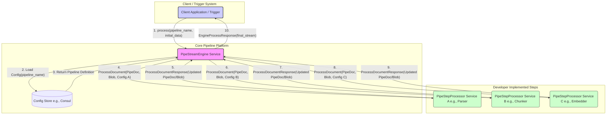
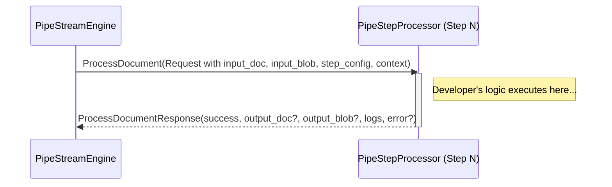
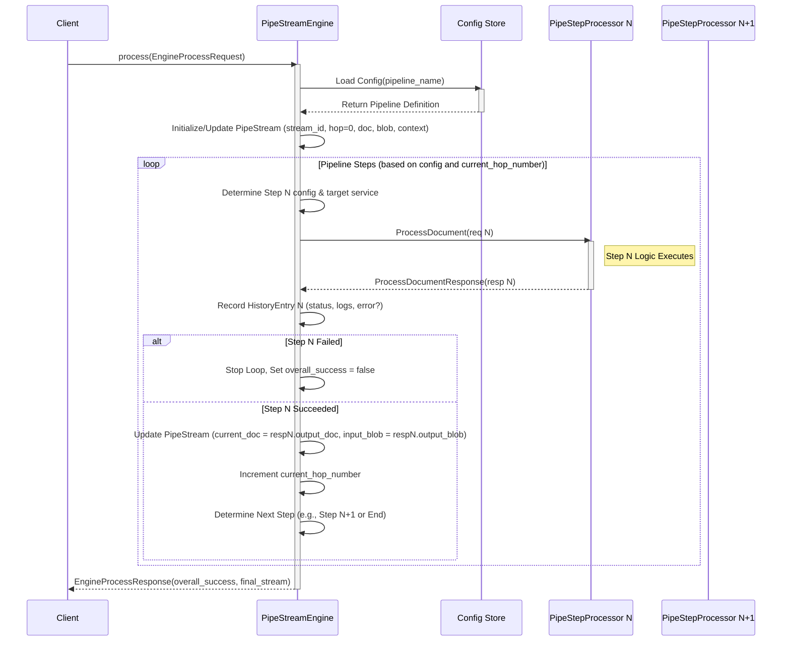

# Pipeline System gRPC API Manual

## Introduction: Powering Complex Data Flows

In modern software systems, processing data often involves multiple, distinct steps: ingestion, parsing, transformation, enrichment, analysis, storage, etc. Orchestrating these steps reliably, efficiently, and maintainably can be challenging. This Pipeline System provides a robust framework for defining, executing, and managing such multi-step data processing workflows.

Built around gRPC for efficient cross-service communication and Protobuf for strongly-typed data contracts, this system offers:

* **Modularity:** Each processing step is implemented as an independent service (`PipeStepProcessor`), promoting code reuse and separation of concerns.
* **Centralized Orchestration:** The `PipeStreamEngine` manages the overall flow, ensuring steps are executed in the correct order based on centrally managed configurations.
* **Configuration-Driven:** Pipelines are defined declaratively in a configuration store (like Consul), allowing administrators to modify workflows without code changes.
* **Observability:** The `PipeStream` object tracks the state and history of each execution run, providing valuable debugging and monitoring information.
* **Language Agnosticism:** Developers can implement pipeline steps (`PipeStepProcessor`) in any language supported by gRPC.

**Example Use Cases:**

1.  **Data Science PDF Processing Lab:**
    * Imagine a scenario where data scientists need to ingest thousands of PDF research papers daily.
    * A pipeline could be defined:
        * **Step 1 (PDF Parser):** Receives a `Blob` containing the PDF, extracts text and metadata using OCR/parsing libraries, populates a `PipeDoc`.
        * **Step 2 (Text Chunker):** Breaks the extracted text into manageable semantic chunks.
        * **Step 3 (Embedder):** Generates vector embeddings for each chunk using a specific ML model.
        * **Step 4 (Metadata Enrichment):** Calls external APIs to fetch citation data or author information based on extracted metadata.
        * **Step 5 (Vector DB Loader):** Stores the chunks and their embeddings in a vector database for similarity search.
    * The `PipeStreamEngine` orchestrates this flow for each PDF submitted, managing state and errors. Data scientists can focus solely on the logic within each step (parser, chunker, etc.).

2.  **Search Engine A/B Testing:**
    * A search platform wants to test two different ranking algorithms (Algorithm A vs. Algorithm B).
    * A pipeline configuration with branching logic could be created:
        * **Step 1 (Query Parser):** Parses the incoming user query.
        * **Step 2 (Feature Fetcher):** Gathers user and item features relevant to the query.
        * **Step 3 (A/B Splitter):** Based on user ID or a random assignment, routes the `PipeStream` to either the 'Ranker A' or 'Ranker B' step. This routing logic is part of the *engine's interpretation* of the pipeline config.
        * **Step 4a (Ranker A):** Implements ranking algorithm A, adds ranked results to `PipeDoc.custom_data`.
        * **Step 4b (Ranker B):** Implements ranking algorithm B, adds ranked results to `PipeDoc.custom_data`.
        * **Step 5 (Result Formatter & Logger):** Takes the results from whichever ranker ran, formats them for display, and logs the query, results, and which algorithm (A or B) was used for analysis.
    * The `PipeStreamEngine` handles the execution flow, including the conditional routing based on the A/B splitter logic defined in the configuration.

These examples illustrate the flexibility of defining complex, multi-step processes where each step is a focused, reusable component managed by a central engine.

---

## 1. Architecture Overview

This document describes the gRPC API contracts for the Pipeline System. The system is composed of three main parts, each defined by its own Protobuf file:

1.  **Core Data Models (`pipeline_models.proto`):** Defines the fundamental data structures passed through the pipeline, including the document (`PipeDoc`), binary data (`Blob`), execution state (`PipeStream`), and history tracking (`HistoryEntry`).
2.  **Pipeline Step Processor Interface (`pipe_step_processor.proto`):** Defines the standard gRPC service (`PipeStepProcessor`) that *developers must implement* for each individual processing step (e.g., parser, chunker, embedder).
3.  **Pipeline Engine Service (`pipestream_engine.proto`):** Defines the central orchestrator (`PipeStreamEngine`) responsible for loading pipeline configurations, executing the sequence of steps by calling the appropriate `PipeStepProcessor` services, and managing the overall state (`PipeStream`).

**Core Concepts:**

* **Pipeline:** A sequence of processing steps defined in a central configuration store (e.g., Consul).
* **PipeStream:** Represents the state of a single execution run through a pipeline. It holds the document being processed, any associated binary data, execution context, and a detailed history of executed steps. Managed by the `PipeStreamEngine`.
* **PipeDoc:** The primary structured data object being modified by the pipeline steps.
* **Blob:** Represents binary data (e.g., raw files, images) associated with the `PipeStream`.
* **PipeStreamEngine:** The central service that orchestrates pipeline execution. It reads configurations and calls individual step processors. System components or triggers interact with this service to start pipeline runs.
* **PipeStepProcessor:** The gRPC service interface implemented by individual, specialized processing components (steps). Developers focus on implementing this interface for their specific logic.
* **Hop Number:** A simple counter (`PipeStream.current_hop_number`, `HistoryEntry.hop_number`) tracking the sequence of step executions, allowing for potential branching or complex flows defined in the configuration.

**High-Level Architecture Diagram:**

## 2. Core Data Models (`pipeline_models.proto`)

This file defines the essential data structures used throughout the system.

*(See `pipeline_models.proto` code artifact for detailed field definitions and comments)*

**Key Messages:**

* **`PipeDoc`**: The main document object. Contains fields like `id`, `title`, `body`, `keywords`, timestamps, `custom_data` (Struct), `chunk_embeddings`, and general `embeddings`. Essential for carrying structured data between steps.
* **`Blob`**: Represents binary data with fields for `blob` (bytes), `mime_type`, `filename`, `encoding`, and `metadata` (map). Allows pipelines to handle non-textual data or raw inputs.
* **`ErrorData`**: Structured error information with `error_message`, `failedRoutes`, `error_request_state` (for debugging), `error_code`, and `technical_details`. Crucial for understanding failures within a step.
* **`HistoryEntry`**: Records the outcome of a single step execution. Includes `hop_number`, `step_name`, timestamps, `status` (e.g., "SUCCESS", "FAILURE", "DROPPED"), `processor_logs`, and optional `error_data`/`error_struct`. Provides traceability and debugging insights.
* **`PipeStream`**: The central state object for a pipeline run. Contains:
    * `stream_id`: Unique ID for the run.
    * `pipeline_name`: Name of the configuration being executed.
    * `current_hop_number`: The *next* hop to be executed (engine uses this to determine the next step).
    * `current_doc`: The `PipeDoc` state *before* the next step runs (input for the next step).
    * `history`: A list of `HistoryEntry` objects for completed steps.
    * `input_blob`: Optional `Blob` data associated with the stream (can be initial input or intermediate binary data).
    * `context_params`: Key-value map for overall run context (e.g., trace ID).

## 3. Pipe Step Processor Interface (`pipe_step_processor.proto`)

This file defines the gRPC contract that individual processing steps must adhere to. **Developers implement this service** for each distinct piece of pipeline logic.

*(See `pipe_step_processor.proto` code artifact for detailed field definitions and comments)*

**Service: `PipeStepProcessor`**

* **RPC: `ProcessDocument(ProcessPipeDocRequest) returns (ProcessPipeDocResponse)`**
    * **Purpose:** Executes the core logic for one specific step in the pipeline (e.g., parse text, generate embeddings, call an external API).
    * **Called By:** `PipeStreamEngine`. The engine determines *which* processor service to call based on the pipeline configuration and the current hop number.
    * **`ProcessPipeDocRequest`**: Contains all necessary input for the step:
        * `input_doc`: The current `PipeDoc` state passed from the engine.
        * `config_params`: Key-value configuration specific to *this* step instance, loaded by the engine from the central configuration.
        * `custom_json_config`: Optional `Struct` configuration for *this* step, providing flexibility for complex parameters.
        * `input_blob`: Optional `Blob` data from the current `PipeStream` state.
        * Context Fields: `pipeline_name`, `pipe_step_name` (name of this step), `current_hop_number`, `stream_id`, `context_params` (overall run context). These help the step understand its place in the workflow.
    * **`ProcessPipeDocResponse`**: Returns the outcome of *this step's* execution back to the engine:
        * `success`: Boolean flag. `true` if the step completed its task successfully, `false` if an error occurred within this step.
        * `output_doc`: Optional modified `PipeDoc`. If the step modifies the document, the new version is returned here. If the step decides to filter/drop the document, this field is omitted (even if `success` is true).
        * `output_blob`: Optional modified or newly generated `Blob`. If the step processes binary data (e.g., image resizing), the result is returned here.
        * `error_details`: Optional `Struct` containing detailed error information if `success` is false. The engine uses this to populate the `HistoryEntry`.
        * `processor_logs`: A list of strings containing logs generated specifically by this step during its execution. The engine captures these for the `HistoryEntry`.

**Engine / Processor Interaction Diagram:**

## 4. Pipe Stream Engine Service (`pipestream_engine.proto`)

This file defines the central orchestrator service. **This service is part of the core platform, not implemented by step developers.** It is responsible for driving the pipeline execution.

*(See `pipestream_engine.proto` code artifact for detailed field definitions and comments)*

**Service: `PipeStreamEngine`**

* **RPC: `process(EngineProcessRequest) returns (EngineProcessResponse)`**
    * **Purpose:** Synchronously initiates, executes, and waits for the completion of an entire pipeline run based on a named configuration.
    * **Called By:** System triggers, administrative tools, tests, or any client needing the final result immediately.
    * **`EngineProcessRequest`**: Specifies how to start the run:
        * `pipeline_name`: REQUIRED. Tells the engine which pipeline definition to load from the configuration store.
        * `input_stream`: OPTIONAL. Allows providing an initial state, potentially including a starting `PipeDoc`, `input_blob`, `context_params`, or even resuming from a specific `current_hop_number`. If omitted, the engine creates a fresh `PipeStream`.
        * `initial_context_params`: OPTIONAL. Provides overall run context (like a trace ID) that gets merged into the `PipeStream`.
    * **`EngineProcessResponse`**: Returns the final result after the pipeline finishes or fails:
        * `overall_success`: Boolean indicating if *all* executed steps in the pipeline succeeded.
        * `final_stream`: The complete `PipeStream` object reflecting the state at the end of execution (includes the final `PipeDoc` state, final `input_blob`, and the full execution `history`).
        * `error_details`: Optional `Struct` summarizing the error from the failing step if `overall_success` is false.
        * `engine_logs`: Logs generated by the engine orchestrator itself (e.g., "Loaded config X", "Calling step Y").

* **RPC: `processAsync(EngineProcessRequest) returns (google.protobuf.Empty)`**
    * **Purpose:** Asynchronously initiates a pipeline run (fire-and-forget). The engine starts the pipeline execution in the background, and the RPC returns immediately.
    * **Called By:** Systems that don't need immediate results (e.g., batch ingestion triggers, event listeners).
    * **`EngineProcessRequest`**: Same input as for `process`.
    * **`google.protobuf.Empty`**: Returns immediately upon successful *initiation* by the engine. Note: This does *not* guarantee the pipeline itself will succeed later. Errors during initiation (e.g., config not found) are still reported via gRPC status codes. The outcome of the background pipeline execution must be monitored through other means (e.g., checking logs, observing side effects like data appearing in a database, dedicated monitoring events).

## 5. Workflow Summary (Engine `process` RPC)

The following diagram illustrates the typical flow when `PipeStreamEngine.process` is called:

**Detailed Steps:**

1.  A client calls `PipeStreamEngine.process` or `PipeStreamEngine.processAsync`, providing a `pipeline_name` and optional initial `PipeStream` data.
2.  The `PipeStreamEngine` loads the specified pipeline configuration from the central store (e.g., Consul). Handles config-not-found errors.
3.  It initializes a new `PipeStream` state object or updates the provided one (setting/generating `stream_id`, setting `pipeline_name`, initializing `current_hop_number`, merging `context_params`, preparing initial `current_doc` and `input_blob`).
4.  The engine enters an execution loop driven by the pipeline configuration and the `PipeStream.current_hop_number`:
    a.  It determines the configuration for the step corresponding to the `current_hop_number` (including step name, parameters
