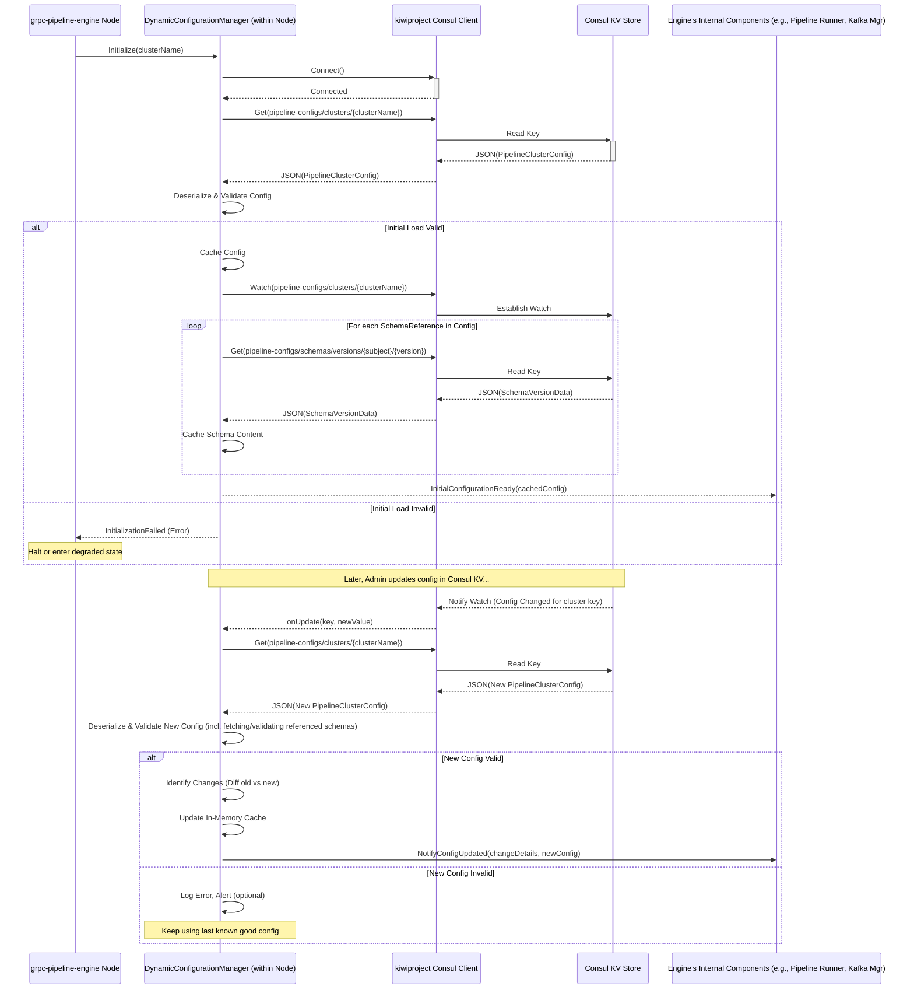

# Dynamic Configuration Management Service/Component

This document details the architecture and behavior of the dynamic configuration management component responsible for loading, watching,
validating, and providing live updates of pipeline and schema configurations stored in Consul. This component is intended to be embedded
within each `grpc-pipeline-engine` node.

## I. Overview and Goals

The primary goal of this component is to provide the `grpc-pipeline-engine` with a consistent, validated, and near real-time view of its
operational configuration, including:

* The `PipelineClusterConfig` for its assigned cluster.
* The content of any JSON schemas referenced by the pipeline modules.

This is achieved by directly interacting with Consul's Key/Value (KV) store using a robust client library (e.g., kiwiproject Consul client)
that supports watches, bypassing Micronaut's default polling-based configuration client for these specific dynamic configurations. Standard
application properties (`application.yml`) will still be managed by Micronaut's built-in configuration handling.

## II. Core Responsibilities

The `DynamicConfigurationManager` (or a similarly named set of classes) will be responsible for:

1. **Initialization:**
    * Connecting to the Consul agent.
    * Identifying its assigned `clusterName` (e.g., via environment variable or startup property).
    * Performing an initial load of the `PipelineClusterConfig` and referenced schemas.
2. **Live Monitoring:**
    * Establishing and maintaining long-polling "watches" on relevant keys/prefixes in Consul.
    * Reacting to change notifications from these watches.
3. **Deserialization & Validation:**
    * Deserializing JSON data fetched from Consul into the Jackson/Lombok POJO models (`PipelineClusterConfig`, `SchemaVersionData`).
    * Performing comprehensive validation of the loaded configuration data (structural, referential integrity, schema adherence for
      `JsonConfigOptions`).
4. **Caching:**
    * Maintaining an in-memory cache of the latest successfully validated `PipelineClusterConfig` and actively used schema contents.
5. **Update Propagation:**
    * If a valid configuration update is received, updating the in-memory cache.
    * Notifying relevant internal components of the `grpc-pipeline-engine` about specific, meaningful changes so they can adapt their
      behavior (e.g., start/stop Kafka consumers, reconfigure gRPC clients, update pipeline logic).
6. **Resilience:**
    * Continuing to operate with the last known good configuration if an invalid configuration update is pushed to Consul.
    * Logging errors and potentially raising alerts for invalid configurations.

## III. Consul KV Structure (Assumed)

The component will expect configuration data to be organized in Consul KV as follows:

* **Cluster Configurations:**
    * Key: `pipeline-configs/clusters/{clusterName}`
    * Value: JSON string of the `PipelineClusterConfig` object for that cluster.
* **Schema Artifacts Metadata (Optional for direct engine use, but good for registry):**
    * Key: `pipeline-configs/schemas/artifacts/{subject}`
    * Value: JSON string of the `SchemaRegistryArtifact` object.
* **Schema Version Content:**
    * Key: `pipeline-configs/schemas/versions/{subject}/{version}`
    * Value: JSON string of the `SchemaVersionData` object (which includes the `schemaContent` string).

## IV. Key Operations and Workflow

**Detailed Steps in Workflow:**

1. **Initialization:**
    * The `DynamicConfigurationManager` is instantiated with the `clusterName` specific to the engine node.
    * It uses the kiwiproject Consul client to fetch the initial `PipelineClusterConfig` JSON from
      `pipeline-configs/clusters/{clusterName}`.
    * **Schema Fetching:** Upon loading the `PipelineClusterConfig`, it iterates through all `SchemaReference` objects found within
      `PipelineModuleConfiguration` entries. For each unique `(subject, version)`:
        * It fetches the corresponding `SchemaVersionData` JSON from `pipeline-configs/schemas/versions/{subject}/{version}`.
        * The `schemaContent` string is extracted and cached locally (e.g., in a `Map<SchemaReference, String>`).
    * **Validation (Critical):**
        * The entire `PipelineClusterConfig` object is validated.
        * All `JsonConfigOptions.jsonConfig` strings within each `PipelineStepConfig` are validated against their resolved schema strings (
          fetched above).
        * Referential integrity is checked (e.g., `pipelineImplementationId` exists in `PipelineModuleMap`, whitelists are adhered to).
    * If initial validation fails, the engine node may not be able to start safely.
    * If successful, the validated configuration and schemas are cached in memory.
    * A watch is established on `pipeline-configs/clusters/{clusterName}`.

2. **Handling Configuration Changes (via Watch):**
    * The Consul client's watch listener (e.g., on `KVCache`) is invoked when the content of `pipeline-configs/clusters/{clusterName}`
      changes.
    * The `DynamicConfigurationManager` fetches the new `PipelineClusterConfig` JSON.
    * The new configuration undergoes the same rigorous deserialization and validation process as the initial load, including re-fetching
      and validating against any newly referenced or potentially changed (if supported) schema versions.
    * **If Validation Fails:** The update is rejected, an error is logged (and potentially alerted), and the engine continues operating with
      its last known good configuration. The watch remains active.
    * **If Validation Succeeds:**
        * The `DynamicConfigurationManager` determines the delta between the old and new `PipelineClusterConfig`.
        * The in-memory cache is updated with the new validated configuration and any newly fetched/updated schema contents.
        * Internal "Configuration Update Events" are dispatched to subscribed components within the `grpc-pipeline-engine`. These events
          might carry the full new config, the old and new config for diffing, or more granular change details.

3. **Schema Content Management:**
    * Schema content (`SchemaVersionData.schemaContent`) is primarily fetched when a `PipelineClusterConfig` is loaded or updated, based on
      the `SchemaReference`s it contains.
    * Active schema strings are cached.
    * **No direct watches on individual schema version keys are planned initially.** It's assumed that if schema content changes, it results
      in a *new version*, and the `PipelineClusterConfig` will be updated to reference this new version, thereby triggering the primary
      watch. This simplifies the watch mechanism. If in-place updates to schema content (for the same subject/version) become a
      requirement (not recommended), then targeted watches on active schema keys would need to be added.

4. **Internal API & Eventing:**
    * The `DynamicConfigurationManager` provides synchronous methods for other engine components to get the current, validated
      `PipelineClusterConfig` and specific schema content:
        * `getCurrentClusterConfig(): PipelineClusterConfig`
        * `getSchemaContent(SchemaReference ref): Optional<String>`
    * It also implements a publisher/subscriber mechanism for internal components to react asynchronously to configuration changes:
        * `ClusterConfigurationUpdatedEvent(PipelineClusterConfig oldConfig, PipelineClusterConfig newConfig)` could be a primary event.
        * Specialized listeners within the engine (e.g., `PipelineLifecycleManager`, `KafkaConsumerManager`, `GrpcClientManager`) subscribe
          to these events and perform actions relevant to their domain (e.g., start/stop/reconfigure pipeline instances, Kafka
          consumers/producers, or gRPC client connections).

## V. Error Handling and Resilience

* **Invalid Configuration from Consul:** If a fetched configuration is syntactically invalid (bad JSON) or fails semantic validation (e.g.,
  broken references, schema violations for `JsonConfigOptions`), the `DynamicConfigurationManager` will:
    * Log detailed errors.
    * Discard the invalid configuration.
    * Continue operating with the last known good cached configuration.
    * Potentially trigger alerts to an operations team.
* **Consul Unavailability:** The kiwiproject client handles retries and reconnections. During prolonged unavailability:
    * On startup, the engine might fail to initialize if it cannot fetch an initial configuration.
    * If already running, it will continue with its cached configuration. Watches will attempt to re-establish when Consul becomes
      available.

## VI. Key Considerations for Implementation

* **Thread Safety:** The in-memory cache of configurations and schemas must be accessed and updated in a thread-safe manner, as watch
  callbacks may occur on different threads than regular read access. Concurrent collections and appropriate synchronization will be needed.
* **Validation Logic:** The validation logic will be comprehensive and crucial. This includes JSON schema validation for `JsonConfigOptions`
  using a library like `com.networknt:json-schema-validator`.
* **Diffing Configuration:** Implementing an efficient and accurate way to "diff" an old `PipelineClusterConfig` against a new one to
  identify precise changes can be complex but is key to minimizing disruptive updates within the engine. For some changes (e.g., a change to
  `customConfig` for an active step), the engine might need to signal the running gRPC module to reload its specific config.
* **Event Granularity for Internal Updates:** Deciding on the granularity of internal events (one big "config changed" event vs. many
  specific change events) will impact the complexity of the `DynamicConfigurationManager` versus its internal subscribers.
* **Testing:** Thoroughly testing the watch handling, validation, update propagation, and error resilience will be critical.

This approach provides a robust foundation for managing dynamic configurations in a reactive way, leveraging the strengths of Consul and a
direct client while keeping the `grpc-pipeline-engine` adaptable and resilient.
